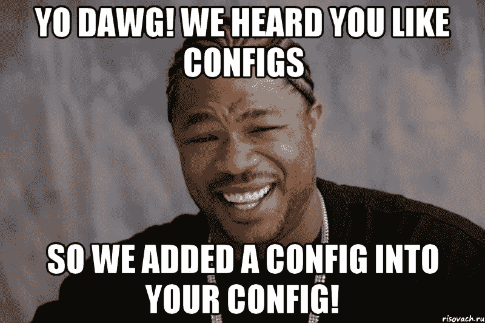

# Kubernetes 中的 Node.js 配置

> 原文：<https://medium.com/geekculture/node-js-configuration-in-kubernetes-adbb032e9db7?source=collection_archive---------2----------------------->

你好。今天我们将讨论每个项目中一个非常常见但非常重要的部分:配置。当然，它的实现依赖于编程语言、框架和基础设施，但是配置机制的原则和要求在任何地方都是相同的。我不会谈论什么是配置，本文的主要重点是通过一些部署在 Kubernetes 中的 Node.js 后端服务的例子来展示如何正确设置配置机制。

**第一步。开始使用配置**

明显的一步。但是，即使您已经将 config 添加到项目中，也要重新审视一下您的代码。我敢打赌，有大量的常数或“神奇”的数字和字符串。实际上它们都可以存储在配置中，你现在可能看不到它的任何好处，但是谁知道你的服务将来会有什么需求。将常量存储在 config 中使您的服务更加灵活，并且可以避免不必要的代码更改。例如:我们有一些模块，每天上午 9 点更新一次货币报价

然后，您的经理要求您增加报价更新的频率，每 3 小时更新一次:

您已经更改了代码，构建并部署了它。然后您的项目经理要求您在周末禁用货币更新，以减少 api 的使用。

这是另一个提交、构建和部署周期。通过将 cron 字符串存储在 config:

**第二步。将配置传递给服务**

好的，我们有一个可配置的服务，我们知道我们想要传递给它什么配置。但是怎么做呢？

最流行的方法之一是通过环境变量传递配置。这是一个非常简单的方法，可以通过`process.env`访问环境变量，并通过在部署规范[https://Kubernetes . io/docs/tasks/inject-data-application/define-environment-variable-container/](https://kubernetes.io/docs/tasks/inject-data-application/define-environment-variable-container/)中定义`env`属性将其传递给 Kubernetes 中的 Pods。但是这种方法有一个巨大的缺点:环境变量是键值结构。默认情况下，不支持数组、贴图和内部对象。此外，随着项目的增长，增加了键的数量，这个列表变成了一个+100500 行的总混乱。甚至给一个新变量起个名字都开始变得困难。配置不应呈现为扁平结构，这是一个死胡同。

JSON 和 YAML 是存储配置数据的完美选择。好吧，不太完美，合并这些格式的文件总是一件令人头痛的事情，但是它们仍然可以让你轻松地分组配置数据，存储数组和映射。JSON 或 YAML 完全是你的选择，我更喜欢 YAML，因为它更紧凑。

但是 Node.js 进程将如何从`.json`或`.yaml`文件中访问数据呢？当然，您可以编写一些读取文件的代码，但是最好使用 ready solution 来实现这个目的。我最喜欢的是[https://www.npmjs.com/package/config](https://www.npmjs.com/package/config)，非常好记:)如果你和我一样喜欢 yaml，别忘了在你的项目中加入`js-yaml`。默认情况下，该库试图从`./config/${NODE_ENV}.json`或`./config/${NODE_ENV}.yaml`读取配置，默认情况下`NODE_ENV`为`development`。它还支持默认配置，以避免配置值重复。`config`有很多有用的特性，完整文档在这里[https://lorenwest.github.io/node-config/](https://lorenwest.github.io/node-config/)

好了，我们的服务能够读取配置文件，现在我们需要以某种方式将这些文件传递给准备和生产 Kubernetes 集群中的服务。甚至不要考虑将配置文件添加到 docker 映像中！配置必须单独存储。在大公司中，由于安全原因，开发人员不会管理生产配置。为了解决这个问题，Kubernetes 提供了将配置文件挂载到 pod 的能力[https://Kubernetes . io/docs/tasks/configure-pod-container/configure-pod-config map/# add-config map-data-to-a-volume](https://kubernetes.io/docs/tasks/configure-pod-container/configure-pod-configmap/#add-configmap-data-to-a-volume)。所有配置必须存储为 Kubernetes 配置映射，在 Pod 上创建 Kubernetes 会将配置文件添加到所需的目录中，服务会启动必要的配置。

还有一点。有些库，比如 TypeORM，建议你将它们的配置保存在单独的文件中，比如`ormconfig.json`。您可以挂载两个或更多的配置文件，但是维护一个文件比维护两个文件要容易得多。只需查看库的文档，一定有一种方法可以在不添加额外文件或环境变量的情况下传递它的配置。

**步骤三。验证**

启动服务之前，必须确保其配置有效。我所说的有效配置是指所有必需的字段都存在，并且值具有正确的类型。记录配置验证失败的详细错误消息也非常重要，因为部署不仅可以由您执行。

`config`语言和常识`./config/test.yaml`

作为人类的标志，语言已经被深入研究，但仍然困扰着机器。当今的自然语言处理(NLP)技术:

能从清楚陈述的事实中提取简单的信息，但不能从文本中构建复杂的知识结构；他们也不能回答需要从多个来源的信息进行大量推理的问题。

作为与人类交流的基本手段，NLP 对于构建服务于我们的超级智能至关重要。

`NODE_ENV=test`自举、递归和反思`config`

这是计算机科学中最强大的范例之一。基本思想是，我们可以构造一个引用自身的数据，或者一个在执行过程中调用自身的函数。这种递归关系不是微不足道的，值得敬畏，因为我们现在正在构建的实体有能力建立在它现有的自我之上。出于同样的原因，我们希望我们的人工智能系统能够收集一些知识，处理这些知识，并使用它们来构建和理解更高层次的概念。这很像在没有比 C 语言更具表达能力的语言的情况下编写 C 编程语言编译器:人们会编写一些汇编代码来简化一些任务或例程，并迭代地使用它们来进一步开发和扩展这个编译器，直到构造出一个成熟的编译器。这是典型的自举过程。

`./config/${NODE_ENV}.yaml`概念和理论的累积学习`config`

牛顿的名言“如果我比别人看得更远，那是因为我站在巨人的肩膀上”就是一个范例。知识，无论多么微小或宏大，都可以传给下一代。不幸的是，人工智能系统仍然无法积累知识。就像自举一样，智能机器必须在各个领域积累一代又一代的新概念，就像孩子们在学校可能会学到的那样。

[发现动作](https://www.npmjs.com/package/class-validator)

只需去谷歌搜索任何关键词。数十亿网页的结果将被返回。就在几十年前，这还是不可想象的。考虑计算机网络层次结构(见上图)。每次你在浏览器中输入 google.com，大量的协议和操作，可能涉及几十台机器，只是为了把网站提供给你。作为用户，我们需要知道的只是如何键入这些按键，机器将运行数十年来开发的众多网络算法。对人类来说，这是一个方便的抽象概念。我们希望人工智能能够自己学习这种抽象，这样它就可以像人类一样建立抽象层。如何做到这一点仍然是个谜。

人工智能有局限性吗？

Kubernetes 又一次找到了治疗头痛的方法。如果 Secret 或 ConfigMap 安装到 Pod，它会在数据更改时在 Pod 中自动更新[https://kubernetes . io/docs/concepts/configuration/Secret/# mounted-secrets-is-updated-automatically](https://kubernetes.io/docs/concepts/configuration/secret/#mounted-secrets-are-updated-automatically)。我们需要做的就是在 Node.js 服务内存中重新加载配置数据。不幸的是，`config` lib 被设计成单例的，它不支持开箱即用。但是有一种方法: