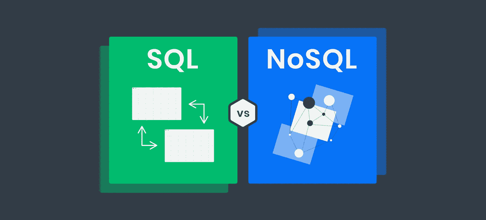

# NoSQL、MongoDB、HiveQL

> 原文：<https://medium.com/geekculture/nosql-mongodb-hiveql-b52c80ddc90a?source=collection_archive---------14----------------------->

传统的基于 SQL 的 RDBMS 的问题之一是**数据爆炸—** 可用数据集的大小和数量迅速增长。RDBMS 在处理和分析大数据方面有困难。大数据的处理和分析可能需要“运行在数十、数百甚至数千台服务器上的大规模并行软件”。何为“大数据”取决于分析者的能力及其工具。此外，不断扩展的功能使大数据成为移动的目标。“对于一些组织来说，第一次面对数百 GB 的数据可能需要重新考虑数据管理选项。对于其他人来说，在数据大小成为重要考虑因素之前，可能需要几十或几百 TB。”

传统 RDBMS 难以处理大数据。在 2010 年代，甲骨文等主要供应商处理大数据的唯一解决方案是从他们那里购买和管理 **DB-cluster** 。支持它们非常昂贵，很快您为此解决方案付出的成本就没有回报了。

2010 年代中风的另一个问题是**非结构化数据**。您可以考虑现在想要存储在 DB 中的日志。它没有固定的结构。的确，对于给定的应用程序/web 服务，经过一些研究之后，您可以定义正确的 DB 模式。然而，通常情况下，您会有不止一个应用程序，同样，您花费在实现正确的数据库模式定义上的时间是不值得的。更好的方法是，通过一些非常粗略的预处理来存储数据(例如，您可以假设日志上有时间戳)，然后在查询数据时定义模式。当您将编写查询来获取数据时，这需要更多的努力，但是如果您不定期地这样做(这通常是日志的情况——只有当您有一些问题要调查时才定义 *ad hoc* select ),这应该是更好的解决方案。当然，没有什么可以阻止将应用程序日志存储为行数据，并为每个应用程序提供专门的 ETL 过程来将其拆分，并放入具有正确定义的模式的指定 DB 表中。同样，通常，这只是浪费时间。

对于非结构化数据和 RDBMS 来说，它们非常不适合处理。通常，你有 BLOB(二进制大对象)和 CLOB(字符大对象)来存储它。但是之后你可以很容易地操纵它来提取它的相关部分。此外，从存储的角度来看，如果您有大量非结构化数据，它们的效率会很低。

于是， **NoSQL 出现了**。

我将解释 NoSQL 的意思，并提供两个具体的例子——MongoDB 和 Apache Hive。

NoSQL(最初指“非 SQL”或“非关系”)数据库提供了一种存储和检索数据的机制，这种机制以不同于关系数据库中使用的表格关系的方式建模。“NoSQL”这个名字是在 21 世纪初创造的。NoSQL 数据库越来越多地用于大数据和实时网络应用。NoSQL 系统有时也被称为“不仅仅是 SQL ”,以强调它们可能支持类似 SQL 的查询语言，或者在多语言持久性架构中与 SQL 数据库并存。

这种方法的动机包括设计的简单性，更简单的“水平”扩展到机器集群(这是关系数据库的一个问题，参见上面的 DB-cluster 描述)，*对可用性的更精细控制*和**限制对象-关系阻抗不匹配。**

NoSQL 数据库使用的数据结构(例如，*键-值对*、*宽列、图形*或*文档*)不同于关系数据库默认使用的数据结构，这使得一些操作在 NoSQL 更快。给定 NoSQL 数据库的特定适用性取决于它必须解决的问题。有时，NoSQL 数据库使用的数据结构也被认为比关系数据库表“更灵活”。

许多 NoSQL 存储**在**可用性、分区容差和速度方面牺牲了一致性**(在 CAP 定理的意义上)。**更广泛采用 NoSQL 商店的障碍包括使用**低级查询语言**(例如，代替 SQL)**缺乏跨表执行 ***特别连接*** 的能力**，缺乏标准化接口，以及之前在现有关系数据库上的巨额投资。大多数 NoSQL 商店缺乏真正的 ACID 交易，尽管一些数据库将它们作为设计的核心。

相反，大多数 NoSQL 数据库提供了“*最终一致性*的概念，其中数据库更改“最终”传播到所有节点(通常在几毫秒内，但理论上这是不受限制的)，因此对数据的查询可能不会立即返回更新的数据，或者可能导致读取不准确的数据，这种问题称为过时读取。此外，一些 NoSQL 系统可能会出现写入丢失和其他形式的数据丢失。

如上所述，有不同类型的 NoSQL 数据库:*键值存储、文档存储、图形*等。我将重点介绍*文档的*类型。

**面向文档的数据库**本质上是键值存储的子类，键值存储是另一个 NoSQL 数据库概念。区别在于处理数据的方式；在键值存储中，数据对于数据库来说本质上是不透明的，而面向文档的系统依赖于文档的内部结构，以便提取数据库引擎用于进一步优化的元数据。尽管由于系统中的工具，这种差异通常可以忽略不计，但从概念上讲，文档存储的设计是为了提供更丰富的现代编程技术体验。

文档数据库与传统的关系数据库(RDBMS)形成了鲜明的对比。关系数据库通常将数据存储在由程序员定义的单独的表中，单个对象可能分布在几个表中。*文档数据库将给定对象的所有信息存储在数据库的单个实例中，并且每个存储的对象可以彼此不同。* **这消除了将数据加载到数据库时对对象关系映射的需要。**

面向文档的数据库的中心概念是文档的概念。所有面向文档的数据库都假定文档以某种标准格式或编码来封装和编码数据(或信息)。正在使用的编码包括 XML、YAML、 **JSON** ，以及像 BSON 这样的二进制形式。我将重点介绍 JSON。

文档存储中的文档大致相当于对象的编程概念。它们不需要遵循标准的模式，也不会有完全相同的部分、槽、部件或键。通常，使用对象的程序有许多不同类型的对象，这些对象通常有许多可选字段。每一个物体，即使是同一类的物体，看起来也可能大不相同。文档存储的相似之处在于，它们允许在单个存储中存储不同类型的文档，允许其中的字段是可选的。例如，下面是一个用 JSON 编码的文档:

`{
“FirstName”: “Bob”,
“Address”: “5 Oak St.”,
“Hobby”: “sailing”
}`

与关系数据库不同，在关系数据库中，每个记录包含相同的字段，不使用的字段为空；在上面的例子中，文档(记录)中没有空的“字段”。这种方法允许将新信息添加到一些记录中，而不要求数据库中的所有其他记录都共享相同的结构。

文档数据库通常提供与文档内容相关联并与其一起存储的附加元数据。该元数据可以与数据存储提供的用于组织文档、提供安全性或其他实现特定特征的设施相关。

文档通过代表该文档的唯一的**键**在数据库中被寻址。这个键是一个简单的标识符(或 ID)，通常是一个字符串、一个 URI 或一个路径。该密钥可用于从数据库中检索文档。通常，数据库会在关键字上保留一个索引，以加快文档检索速度，在某些情况下，创建文档或将文档插入数据库时需要关键字。

面向文档的数据库的另一个定义特征是，除了可以用来**检索**文档的简单的键到文档的查找之外，数据库还提供了一个 API 或查询语言，允许用户基于内容(或元数据)检索文档。例如，您可能需要一个查询来检索某个字段设置为某个值的所有文档。一组可用的查询 API 或查询语言特性，以及查询的预期性能，在不同的实现之间有很大的不同。同样，可用的索引选项和配置的特定集合也因实现的不同而有很大差异。

正是在这一点上，文档存储与键值存储有最大的不同。理论上，键值存储中的值对于存储来说是不透明的，它们本质上是黑盒。他们可能会提供类似于文档库的搜索系统，但可能对内容的组织不太了解。文档存储使用文档中的元数据对内容进行分类，例如，允许它们理解一系列数字是电话号码，另一系列是邮政编码。这允许他们搜索这些类型的数据，例如，所有包含 555 的电话号码，这将忽略邮政编码 55555。

文档数据库通常提供一些更新或**编辑**文档内容(或元数据)的机制，或者允许替换整个文档，或者替换文档的单个结构部分。

文档数据库实现提供了多种组织文档的方式，包括

*   集合:文档组，根据实现的不同，一个文档可能被强制放在一个集合中，也可能被允许放在多个集合中
*   标签和不可见的元数据:文档内容之外的附加数据
*   目录层次结构:以树状结构组织的文档组，通常基于路径或 URI

有时，这些组织概念在逻辑和物理(例如，在磁盘或内存中)表示上有所不同。

在**关系数据库**中，数据首先被分类成许多预定义的类型，并且创建表格来保存每种类型的单个条目或记录。这些表定义了每个记录的字段中的数据，这意味着表中的每个记录都具有相同的整体形式。管理员还定义表之间的关系，选择他们认为最常用于搜索的某些字段，并在这些字段上定义索引。关系设计中的一个关键概念是，任何可能重复的数据通常都放在自己的表中，如果这些实例彼此相关，则选择一个列将它们组合在一起，即外键。这种设计被称为数据库规范化。

例如，地址簿应用程序通常需要存储联系人姓名、可选图像、一个或多个电话号码、一个或多个邮寄地址以及一个或多个电子邮件地址。在规范的关系数据库中，将为这些行中的每一行创建表，表中为每位数据都有预定义的字段:CONTACT 表可能包括 FIRST_NAME、LAST_NAME 和 IMAGE 列，而 PHONE_NUMBER 表可能包括 COUNTRY_CODE、AREA_CODE、PHONE_NUMBER 和 TYPE(家庭、工作等)。).PHONE_NUMBER 表还包含一个外键列“CONTACT_ID”，它保存创建联系人时分配给联系人的唯一 ID 号。为了重新创建原始联系人，数据库引擎使用外键在一组表中查找相关项，并重建原始数据。

相比之下，在一个**面向文档的数据库**中，可能没有直接映射到表的概念的内部结构，并且字段和关系通常不作为预定义的概念存在。相反，对象的所有数据都放在单个文档中，并作为单个条目存储在数据库中。在地址簿示例中，文档将包含联系人的姓名、图像和任何联系信息，所有这些都在一条记录中。该条目通过它的键来访问，这允许数据库检索文档并将其返回给应用程序。检索相关数据不需要额外的工作；所有这些都在单个对象中返回。

面向文档模型和关系模型之间的一个关键区别是，在文档情况下，数据格式不是预定义的。在大多数情况下，任何种类的文档都可以存储在任何数据库中，并且这些文档的类型和形式可以随时改变。如果希望为联系人添加 COUNTRY_FLAG，可以在插入新文档时将该字段添加到新文档中，这不会影响数据库或已存储的现有文档。为了帮助从数据库中检索信息，面向文档的系统通常允许管理员向数据库提供提示，以查找某些类型的信息。在关系情况下，它们的工作方式类似于索引。大多数还提供在文档内容之外添加额外元数据的能力，例如，将条目标记为地址簿的一部分，这允许程序员检索相关类型的信息，如“所有地址簿条目”。这提供了类似于表的功能，但是将概念(数据类别)与其物理实现(表)分开。

在经典的规范化关系模型中，数据库中的对象被表示为单独的数据行，除了检索时提供给它们的结构之外，没有其他固有结构。这导致在试图将编程对象转换为相关数据库行或从相关数据库行转换时出现问题，这个问题称为对象关系阻抗不匹配。文档存储更紧密地，或者在某些情况下直接地，将编程对象映射到存储中。这些产品通常被称为 NoSQL。

**面向文档的数据库是一个专门的键值存储**，它本身是另一个 NoSQL 数据库类别。在简单的键值存储中，文档内容是不透明的。面向文档的数据库提供了 API 或查询/更新语言，可以根据文档的内部结构进行查询或更新。对于不需要通常由文档数据库提供的更丰富的查询、检索或编辑 API 的用户来说，这种差异可能很小。现代的键值存储通常包括处理元数据的特性，模糊了文档存储之间的界限。

一些搜索引擎(又名信息检索)系统，如 Elasticsearch，提供了足够多的文档核心操作，以符合面向文档的数据库的定义。

与关系数据库相比，**集合类似于表格，文档类似于记录**。但是它们是不同的:**一个表中的每条记录都有相同的字段序列，而一个集合中的文档可能有完全不同的字段。**

由于大多数 NoSQL 数据库缺乏查询连接的能力，数据库模式通常需要不同的设计。在 NoSQL 数据库中处理关系数据有三种主要的技术。(请参阅支持连接的 NoSQL 数据库的表连接和 ACID 支持。)

通常不是用一个查询检索所有数据，而是用几个查询来获得所需的数据。NoSQL 查询通常比传统的 SQL 查询更快，因此额外查询的成本可能是可以接受的。如果需要过多的查询，那么另外两种方法中的一种更合适。

除了存储外键之外，通常还会存储实际的外键值和模型数据。例如，每个博客评论可能除了用户 id 之外还包括用户名，从而提供对用户名的方便访问，而不需要另一次查找。然而，当用户名改变时，数据库中的许多地方都需要改变。因此，当读比写更常见时，这种方法更有效。

对于像 MongoDB 这样的文档数据库，通常会将更多的数据放在更少的集合中。例如，在博客应用程序中，可以选择将评论存储在博客文章文档中，这样只需一次检索就可以获得所有评论。因此，在这种方法中，一个单独的文档包含了特定任务所需的所有数据。

# MongoDB

MongoDB 是一个源代码可用的跨平台面向文档的数据库程序。作为一个 NoSQL 数据库程序，MongoDB 使用带有可选模式的类似 JSON 的文档。

# 即席查询

MongoDB 支持字段、范围查询和正则表达式搜索。查询可以返回文档的特定字段，还包括用户定义的 JavaScript 函数。也可以将查询配置为返回给定大小的随机结果样本。

# 索引

MongoDB 文档中的字段可以用主索引和次索引或索引进行索引。

# 分身术

MongoDB 通过副本集提供高可用性。副本集由两个或多个数据副本组成。每个副本集成员可以在任何时候充当主要或辅助副本的角色。默认情况下，所有写入和读取都在主复制副本上完成。辅助副本使用内置复制来维护主副本的数据拷贝。当主副本失败时，副本集自动进行选举过程，以确定哪个辅助副本应该成为主副本。辅助节点可以选择提供读取操作，但默认情况下，数据最终是一致的。

如果复制的 MongoDB 部署只有一个辅助成员，则必须向该集合中添加一个称为仲裁器的独立守护进程。它只有一个责任，那就是解决新的初选。因此，理想的分布式 MongoDB 部署至少需要三台独立的服务器，即使只有一台主服务器和一台辅助服务器。

# 负载平衡

MongoDB 使用分片进行水平扩展。用户选择一个 shard 键，它决定集合中的数据将如何分布。数据被分成不同的范围(基于分片键)并分布在多个分片上。(碎片是具有一个或多个副本的母版。)或者，碎片键可以被散列以映射到一个碎片——实现均匀的数据分布。

MongoDB 可以在多个服务器上运行，平衡负载或复制数据以在硬件故障时保持系统正常运行。
文件存储

MongoDB 可以用作一个文件系统，称为 GridFS，具有跨多台机器存储文件的负载平衡和数据复制功能。

这个函数称为网格文件系统，包含在 MongoDB 驱动程序中。MongoDB 向开发人员公开了文件操作和内容的函数。GridFS 可以使用 mongofiles 实用程序或 Nginx]和 lighttpd 的插件来访问。GridFS 将一个文件分成几个部分，或称块，并将每个块存储为一个单独的文档。

# 聚合

MongoDB 提供了三种执行聚合的方法:聚合管道、map-reduce 函数和单一用途的聚合方法。

Map-reduce 可用于批量处理数据和聚合操作。但是根据 MongoDB 的文档，聚合管道为大多数聚合操作提供了更好的性能。

聚合框架使用户能够获得使用 SQL GROUP BY 子句的结果类型。聚合操作符可以串在一起形成一个管道，类似于 Unix 管道。聚合框架包括$lookup 操作符，它可以连接来自多个集合的文档，还包括统计操作符，比如标准差。

# 服务器端 JavaScript 执行

JavaScript 可用于查询、聚合函数(如 MapReduce)，并直接发送到数据库执行。
封顶系列

MongoDB 支持固定大小的集合，称为 capped 集合。这种类型的集合保持插入顺序，一旦达到指定的大小，其行为就像一个循环队列。

# 处理

MongoDB 声称自 2018 年 6 月 4.0 版本开始支持多文档 ACID 事务。这种说法被发现是不正确的，因为 MongoDB 违反了快照隔离。

# 技术批评

在版本 3.3.11 之前，MongoDB 不能进行基于排序规则的排序，只能通过 memcmp 进行字节比较，当使用 Unicode 编码时，memcmp 不能为许多非英语语言提供正确的排序。该问题已于 2016 年 8 月 23 日修复。

在 MongoDB 4.0 之前，对索引的查询不是原子的。查询运行时正在更新的文档可能会丢失。MongoDB 4.0 中快照读取问题的引入消除了这种现象。

尽管 MongoDB 在一篇题为“MongoDB 和 Jepsen”的未注明日期的文章中声称，他们的数据库通过了分布式系统安全研究公司 Jepsen 的测试，该公司称之为“业界最严格的数据安全性、正确性和一致性测试”，但 Jepsen 在 2020 年 5 月发表了一篇文章，指出 MongoDB 3.6.4 实际上没有通过他们的测试，并且较新的 MongoDB 4.2.6 有更多的问题，包括“追溯因果事务”，其中事务颠倒顺序，以便读取可以看到未来写入的结果。Jepsen 在他们的报告中指出，MongoDB 在 MongoDB 的“MongoDB 和 Jepsen”页面上省略了对这些发现的任何提及。

# HiveQL

虽然基于 SQL，但 HiveQL 并不严格遵循完整的 SQL-92 标准。HiveQL 提供了 SQL 中没有的扩展，包括多表插入和 create table as select。HiveQL 缺乏对事务和物化视图的支持，并且只有有限的子查询支持。从 0.14 版开始，可以使用完整的 ACID 功能支持插入、更新和删除。

在内部，编译器将 HiveQL 语句翻译成 MapReduce、Tez 或 Spark 作业的有向非循环图，提交给 Hadoop 执行。

# 与传统数据库的比较

Hive 的存储和查询操作与传统数据库非常相似。虽然 Hive 是一种 SQL 方言，但与关系数据库相比，它在结构和工作方式上有很多不同。差异主要是因为 Hive 构建在 Hadoop 生态系统之上，并且必须遵守 Hadoop 和 MapReduce 的限制。

模式应用于传统数据库中的表。在这样的传统数据库中，当数据加载到表中时，表通常会强制执行模式。这使得数据库能够确保输入的数据遵循表定义所指定的表的表示。这种设计被称为写模式。相比之下，Hive 在写入时不根据表模式验证数据。相反，它随后会在读取数据时进行运行时检查。这个模型被称为读取模式。这两种方法各有优缺点。在加载期间根据表模式检查数据会增加额外的开销，这就是传统数据库需要更长时间来加载数据的原因。在加载时对数据进行质量检查，以确保数据没有损坏。损坏数据的早期检测确保了早期异常处理。因为在数据加载之后/期间，表被强制匹配模式，所以它具有更好的查询时间性能。另一方面，Hive 可以在没有任何模式检查的情况下动态加载数据，确保快速的初始加载，但缺点是查询时性能相对较慢。当模式在加载时不可用，而是稍后动态生成时，Hive 确实有优势。

事务是传统数据库中的关键操作。与任何典型的 RDBMS 一样，Hive 支持事务(ACID)的所有四个属性:原子性、一致性、隔离性和持久性。Hive 中的事务是在 Hive 0.13 中引入的，但仅限于分区级别。[26]最新版本的 Hive 0.14 完全增加了这些功能，以支持完整的 ACID 属性。Hive 0.14 及更高版本提供了不同的行级事务，如插入、删除和更新。启用插入、更新、删除事务需要为配置属性设置适当的值，如 hive.support.concurrency、hive.enforce.bucketing 和 hive . exec . dynamic . partition . mode