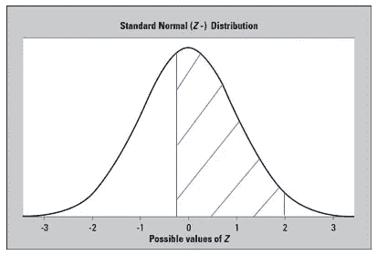

# 数据科学与分析中正态概率分布的数值计算—统计

> 原文：<https://medium.com/geekculture/numerical-computation-of-normal-probability-distribution-in-data-science-analytics-stats-367b729eaa7c?source=collection_archive---------29----------------------->

Probability Distribution — Rishav Das (Lead Data Scientist)

让我们从适用性的角度来理解概率分布的定义。[概率分布](https://en.wikipedia.org/wiki/Probability_distribution)是给定范围内所有可能的[随机变量](https://en.wikipedia.org/wiki/Random_variable)的分布。举个例子:我们以一辆行驶中的汽车为例，速度和时间是两个关键参数。现在，在给定的时间戳中，移动汽车的最大和最小速度是速度范围的下限和上限。范围内或范围外的任何值都称为随机变量/值。

使用不同的分布，我们定义了基于不同数据集的概率结果以及处理范围值。我们将在接下来的上下文中看到这一点。基于以下因素，分布与数据集保持一致:

*   ***统计因子(标准差、方差、均值、E(X))***
*   ***基于数据集及其跨页***
*   ***基于分配的客观性(待解决的问题)***

**理想情况下有 18 种概率分布**，根据上述 3 组因素使用。这种分布也是根据随机变量的类别来区分的。随机变量有两个部分:

1.  ***连续随机变量***
2.  ***离散随机变量***

***连续随机变量*** :连续随机变量是数据可以取无穷多个值的随机变量。例如，一个衡量做某事所用时间的随机变量是连续的，因为有无限多的可能时间可以被使用。对于**任何**概率密度函数为 f(x)的连续随机变量，我们有:

Probability Density Functions

最重要的是，PDF 有助于确定任何连续随机变量的概率结果。变量不需要在范围内。

***离散随机变量:*** 可以取有限个或至多可数个无穷个离散值集合的随机变量(例如，整数)。它们的概率分布由概率质量函数给出，该函数将随机变量的每个值直接映射到一个概率。例如，x1 的值采用概率 p1，x2 的值采用概率 p2，等等。概率 pi 必须满足两个要求:每个概率 pi 都是 0 到 1 之间的数字，并且所有概率的总和是 1。(p1+p2+⋯+pk=1).对于 f 离散随机变量，我们通常计算概率质量函数(PMF):

Probability Mass Function

对于上述两种类型的随机变量，我们有 18 种不同的分布类型。基于离散和连续随机变量，分布被进一步分类。以下是所有分发类型的详细信息:

Types of Probability Distribution — Rishav Das (LDS)

好了，现在我们将详细阐述 ***正态概率分布*** 及其在数据科学&分析的实时世界中的应用。

***概率密度分布—连续***

# **正态分布:**

正态分布是[统计](https://statisticsbyjim.com/glossary/statistics/)中最重要的概率分布，因为它符合许多自然现象。比如身高、血压、测量误差、智商得分都遵循正态分布。它也被称为高斯分布和钟形曲线。

Bell shape curve — Rishav Das (LDS)

如此处所示，标准正态分布的均值为 0，方差为 1。数据平均分布在两个平均值上。对于给定数据集中 X 的每个值，我们需要计算正态标准方差，它将进一步植入正态分布。

**正态标准差/标准分**表示为**“Z”。**它可以通过给定的公式计算:

一旦我们把 X(随机变量)的每个值转换成 Z(标准正态变量)。现在如果我们用 Z 计算均值和方差，我们会得到 M **ean( )** **为 0** 和**方差(σ)为 1。**

我们也可以直接应用已知随机变量的密度函数。

Density function of Normal Distribution

当数据集服从高斯分布时，我们使用正态分布来预测随机变量的范围。

# **数值例子:**

下面是正态分布效用的例子:

> 例如:我们有无限范围的数字，但是除此之外，我们需要找出范围(26 和 40)之间的 X 的概率。
> 
> 解决方案:

通过上面的例子，我们现在可以得出结论，对于任何给定的无限数据范围，我们可以计算任何范围的概率，假设数据集遵循高斯分布。

**偏斜度:**偏斜度的系数为 0，它定义了一个概率分布的对称性。正态分布总是对称的，负值表示数据左偏，同样正值反映左偏分布。

**峰度:**峰度系数为 3。它也称为 ***中层顶分布*** ，因为它等于 3。意味着稀有值/极值都是向着 0 的。

# 应用程序

1.  传播/收集数据集:假设我们有选举数据集，其中总投票份额为 80%。现在，为了分析数据集，我们应该平均分布数据集，然后尝试定义数据集的样本，以确定获胜的政党。
2.  把股市研究成碎片。有时，我们看到股票看涨或看跌，这随着多种因素而不断变化。如果回报是正态分布的，则超过 99%的回报将落在平均值的偏差范围内。它帮助分析师衡量股票的风险和预期收益。
3.  分析疫苗效力。正态分布可用于研究接种疫苗后感染的再发生。对于 SARS-COVID，我们可以应用相同的假设，即重现数据遵循高斯分布。ND 也可用于研究波浪的有效性和影响。
4.  基于连续的数据集研究，例如:汽车速度、时间研究，任何具有连续流量的数据集都可以从正态分布中导出。

在 https://www.linkedin.com/in/rishavstats/[与我一起进行更多的讨论。](https://www.linkedin.com/in/rishavstats/)