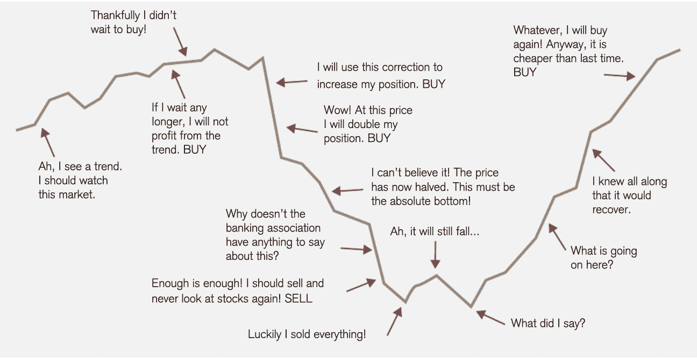

# 痴迷于交易股票/期权？你可能上瘾了

> 原文：<https://medium.com/geekculture/obsessed-with-trading-stocks-options-you-may-have-addiction-9ee3c70a6bb5?source=collection_archive---------8----------------------->

根据[金融市场中的强迫性赌博](https://www.sciencedirect.com/science/article/abs/pii/S0378426619302808?via%3Dihub)研究(2019 年)，大约 8%的投资者符合赌博的标准，其中一半以上患有赌瘾。

曾帮助华尔街交易员实现巅峰表现的精神病学家阿里·基辅(Ari 基辅)在他的著作《[风险心理学](https://www.amazon.com/Psychology-Risk-Mastering-Market-Uncertainty/dp/0471403873)》中将上瘾的交易员描述为，“不断寻求权力和控制感；好胜，不安分，容易无聊。”

有赌博成瘾症状的交易者“倾向于遵循更积极和投机的交易风格，表现为更频繁的股票交易、日间交易以及对衍生品和杠杆产品的投资。”

# **病态交易——拟定标准**

在不伤害健康和日常生活的情况下，交易是有趣的。容易上瘾的交易者有一种赌徒的心态。具体来说，如果下列情况之一属实，您可能会上瘾:

1.  交易成为你日常生活的主要焦点。
2.  你在工作中交易，这不是你的工作。
3.  你在追亏损。
4.  你不能停止交易。
5.  你有挫败感、攻击性或试图压抑其他个人问题的感觉。
6.  赔钱让你抑郁。
7.  你一直在检查最新的值。
8.  你隐藏了参与交易的程度。
9.  你依赖社交媒体“专家”提供投资建议。
10.  你借钱对房屋净值线或个人贷款进行投资。
11.  没有自制力或者能力远离你的交易 app。
12.  你的情绪状态与股市的结果直接相关。

避免与[病态交易(与赌博](https://www.ncbi.nlm.nih.gov/pmc/articles/PMC5422017/#b3-AHJ-08-207)有相似之处)相关的伤害的策略如下:不要花费超过你能负担的。坚持预算。不追亏损。

# 有出路吗？

影响日内交易的最大心理因素之一是害怕错过(FOMO)。这就是为什么日内交易者经常遭受临时行动，因为他们不能预测突然的市场变化。因此，据说大多数散户投资者的回报率并没有高于市场，许多人亏损。美国消费者新闻与商业频道引用了至少四项研究得出了相似的结论:90%的交易者没有赚钱。

避免破坏性情绪的最简单方法是让机器为你交易。多年来，algo 交易以前只发生在银行和对冲基金中，现在每个交易者都可以使用这些工具。

自动化交易工具有助于:

*   解决没有时间的问题:许多交易者白天有工作，有家庭，等等。，而不能整天坐在屏幕前。
*   对机会做出更快的反应:算法比人快得多。
*   去除情绪:算法没有情绪。
*   低代码允许交易者更快地试验。

[Breaking Equity](http://breakingequity.com/) 是一个自动化交易平台和市场，供散户投资者构建、购买和出售策略。它让算法变得更加实惠和包容，以确保散户投资者利用对冲基金的技术和数据，从而创造公平的竞争环境。