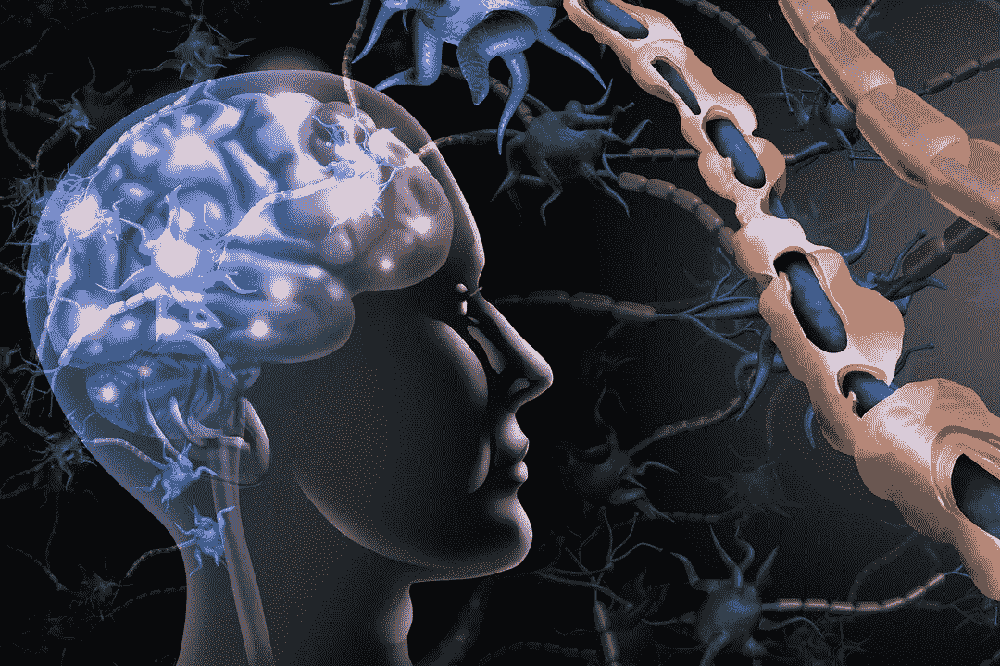
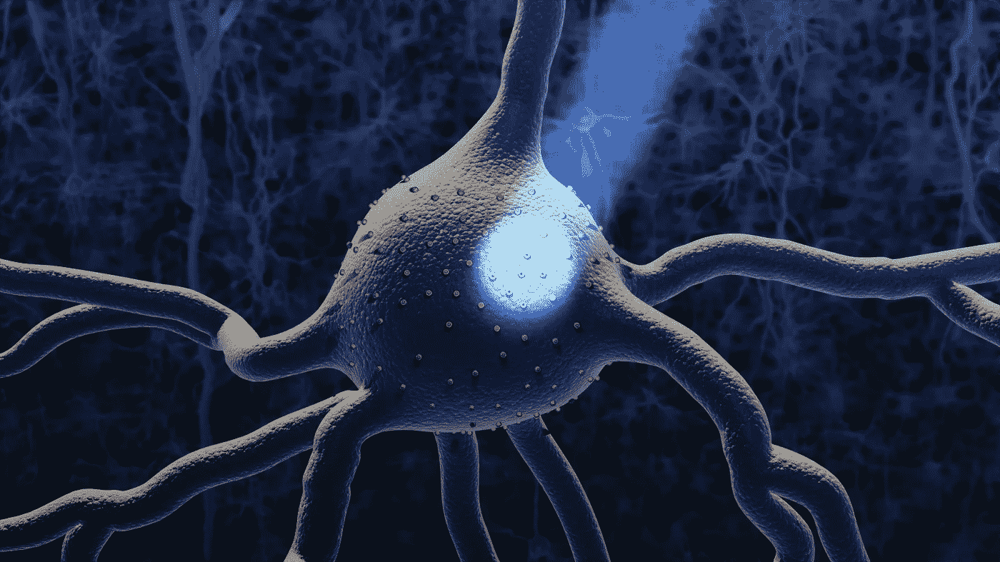
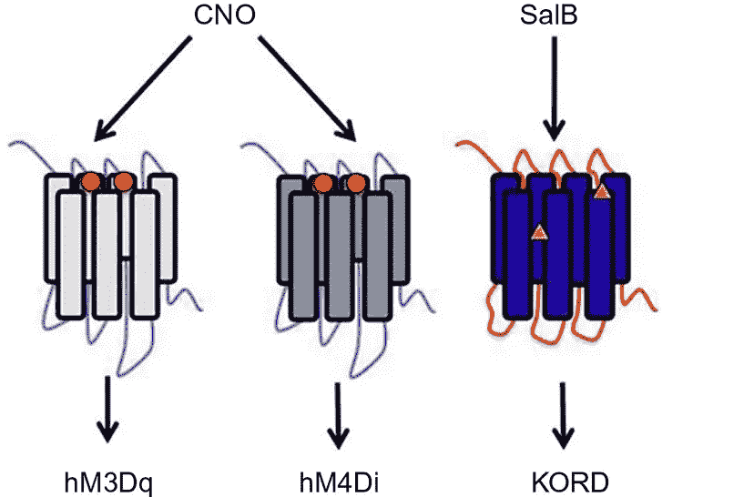
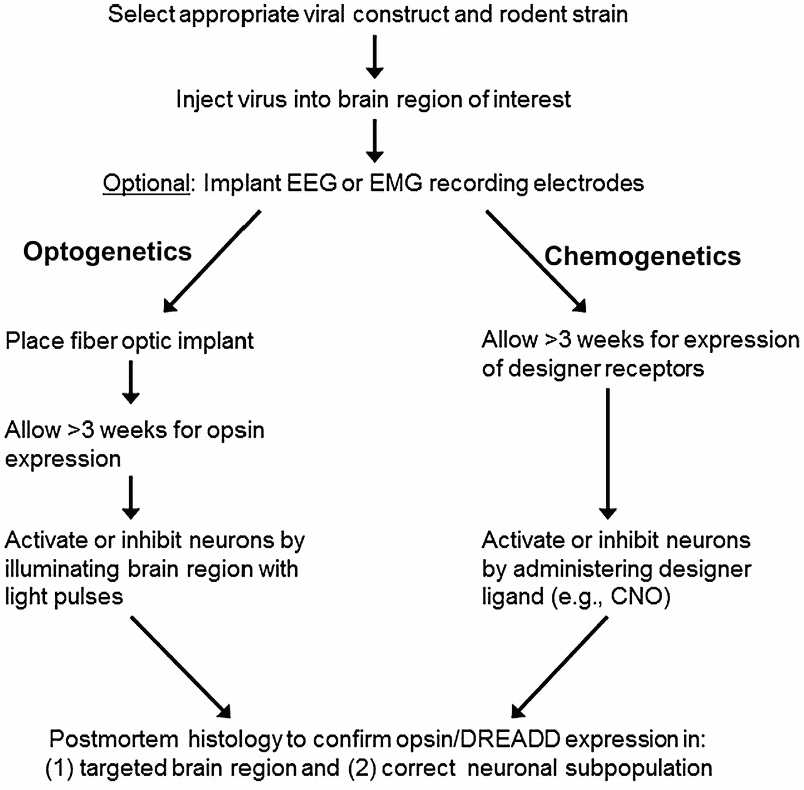
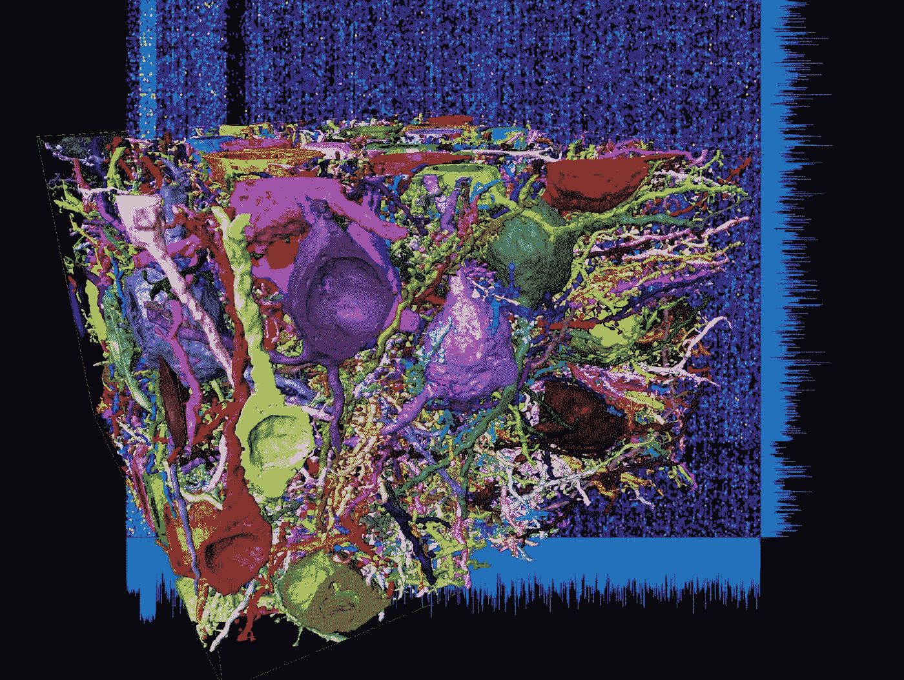
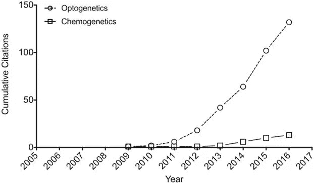

# 光遗传学 VS 化学遗传学

> 原文：<https://medium.com/geekculture/optogenetics-vs-chemogenetics-c0e7675efd22?source=collection_archive---------12----------------------->

## 神经科学技术评论

大约 15 年前，一项革命性的神经科学技术被发现。这是由单细胞藻类中发现的一种叫做通道视紫红质的蛋白质实现的，这种蛋白质在植物进行光合作用的能力中起着关键作用。当它检测到阳光时，通道视紫红质向植物的其余部分发出信号，指示它应该吸收阳光并开始光合过程。

一旦确定了这一点，科学家们意识到他们可以在人脑中利用这一点。如果他们编辑特定的神经元来表达通道视紫红质，并将光应用于编辑的神经元，他们可以控制这些神经元的激活水平，而不会无意中刺激附近的群体。这是在该领域内广为传播的知识。仅仅几年后，这种技术的“弟弟妹妹”被开发出来，在这一领域取得了新的成就。然而，它很少被讨论，很大程度上落在最初发明的阴影之下。虽然它们有相似之处，但该技术的每个版本都有自己的优势和使用案例。在本文中，我们将深入研究每种技术，然后将它们放在一起。

1.  什么是光遗传学？
2.  什么是化学遗传学？
3.  化学遗传学的类型
4.  他们如何比较？
5.  它们的应用有哪些？
6.  结论
7.  关键要点

## 什么是光遗传学？

光遗传学是前面提到的技术的第一个版本。它利用光和基因工程，在通道视紫红质或不同类型的视蛋白的帮助下，控制大脑中的神经元。

视蛋白在进行光遗传学时操纵的自然发生的过程是动作电位的过程。在每个神经元中，都有分离钠离子和钾离子的通道离子受体。当激活时，受体将打开，两种类型的离子可以混合。如果它们混在一起，就会产生动作电位，神经元就会放电。在光遗传学中，视蛋白被注射到神经元中，并附着在受体上。当已经被编辑以表达视蛋白的神经元受到光照时，它们将操纵受体打开更多并使离子去极化(增加神经元活性并通常被称为神经元的兴奋)，或者在受体自然超极化时阻止受体打开(降低神经元活性并通常被称为神经元的抑制)。

When ion channels open, the ions can depolarize to form an action potential and the neuron will fire.

与脑深部刺激(DBS)或经颅磁刺激(TMS)等其他脑刺激方法相比，光遗传学更受欢迎的原因是，只有经过编辑以表达视蛋白的神经元才会在光照时产生反应，因此人们可以针对特定的神经元或神经元群，而不会无意中刺激任何附近的神经元。这对于进行关于神经元连接的研究和治疗基于大脑的疾病都非常有帮助，这是光遗传应用的两个主要领域。

此外，自从最初使用通道视紫红质发现光遗传学以来，已经发现了许多不同类型的视蛋白，不仅每种类型都有其自身的能力，而且它们都对不同颜色的光起反应(即通道视紫红质对蓝光敏感)。因此，一个人可以在大脑中同时拥有多种视蛋白，并使用其中一种功能，而不会对其他功能产生任何影响。

Genetically modified neurons are manipulated with light during the process of optogenetics.

光遗传学在神经系统疾病中有许多令人难以置信的应用，我们稍后会讲到。然而化学遗传学也是如此，所以现在我们要放大讲讲它是关于什么的。

## 什么是化学遗传学？

化学遗传学是另一种用于调节神经元的神经科学技术，但它不是使用光和基因工程，而是以不同的方式使用基因工程，并与化学药物反应相结合，而不是光。

虽然光遗传学最初是由天然存在的蛋白质通道视紫红质发现和启发的，但化学遗传学最初是由天然存在的称为 G 蛋白偶联受体(GPCRs)的跨膜蛋白发现和启发的，G 蛋白偶联受体用于与炎症和神经传递相关的生物过程。

化学遗传学不是使用光来操纵神经元，而是使用配体和受体(每个都是特别设计的)之间基于药物的反应。最受欢迎的方法被称为 DREADD，代表由设计药物专门激活的设计受体。离子通道受体不是被遗传修饰来表达通道视紫红质，而是被遗传修饰来包含设计者受体。这些受体被设计成对特定类型的设计药物(类型不同，但总是与相应类型的受体配对)起反应。这些药物通常被称为配体，这是它们的生物学名称。配体被定义为不可逆地与受体结合的任何分子，并且它们必须是惰性的(不与其他结构反应)并且在它们打算递送的蛋白质中是有效的。

当试图控制一个神经元时，配体被释放，用设计受体修饰过的神经元会有反应。然而，与光遗传学不同的是，仅仅一次激活就会在使用后持续几个小时。

一种流行的恐惧是人类毒蕈碱恐惧，它对 CNO 有反应。关于这些的酷的事情是，一种类型的配体(CNO)可以是兴奋性的或抑制性的，这取决于所用的受体是 hM3Dq(兴奋性)还是 hM4Di(抑制性)。另一种类型是 KOR(基于κ阿片受体)DREADDs，其编辑神经元以表达 KORD 受体，并被 Salvinorin B 配体(SalB)激活。

The different types of popular DREADDs

KOR DREADDs 也具有抑制作用，但与在这种情况下仅使用 hM4Di 和 hM3Dq 受体相比，它具有特殊的优势，即使用这些受体可以同时在大脑中执行多种功能，而不会激活大脑中进行化学遗传学的其他区域。由于 hM4Di 和 hM3Dq 由相同的配体(CNO)激活，它们不能在大脑中单独使用，因为部署这些药物会激活两种功能。然而，在一个位点使用 KORs，在另一个位点使用 CNO 激活受体，可以使患者在大脑中进行多种类型的化学遗传应用，而不会相互干扰。

现在我们已经了解了每种方法是如何工作的，让我们来探索它们的异同，以便更接近最终的大问题…哪种方法更优越？

## 他们如何比较？

从一开始，就有一些明显的相似之处:他们都使用基因工程来操纵神经元，他们都使用腺相关病毒(AAVs)进行插入，并花 3 周时间来表达他们遗传修饰神经元的材料，他们都通过增加或减少离子通道的开放来操纵动作电位的过程，遗憾的是，他们都还处于开发的小鼠试验阶段。

The processes of administering optogenetics and chemogenetics are very similar.

一个半相似之处是，至少在某些情况下，它们都支持多路复用(一次在大脑中使用一种以上的技术)。然而，它们在这方面都有其局限性，因为在化学遗传学中，你不可能有任何两对 hM DREADDs，而在光遗传学中，你不可能有一对被相同光激活的视蛋白，而每次都没有激活。

一个关键的区别是，虽然持续向大脑施加可见光通常不会造成伤害或损害，但接受化学遗传学治疗的患者随着时间的推移经历了药物的脱靶效应以及恐惧激活的附带投射。

两者之间的另一个巨大差异是光遗传学令人难以置信的时间分辨率，而化学遗传学则具有长期激活特性。虽然有人只需点击一个按钮，就可以在几秒钟内开始和停止在大脑中进行光遗传学，但一种化学遗传治疗一旦采用，就可以持续几个小时，而患者无法控制其强度或持续时间。

尽管在任何时候都具有精确的时间控制非常有帮助，但是当试图治疗诸如癫痫发作之类的疾病时，化学遗传学的长期特性有时是有帮助的，癫痫发作可能持续很长时间，并且需要在整个时间内进行积极的治疗。在这种情况下，必须保持光的持续应用，并且(基于当前的技术状态)在延长的时间段内被束缚到能量源以维持光源，这明显不太方便。

然而，癫痫只是这些技术的众多应用之一。在基于大脑的紊乱领域，甚至在研究中，还有很多。

## 它们的应用有哪些？

这两种方法有相似的应用，因为它们只是以不同的方式完成相同的任务。光遗传学和化学遗传学的应用分为两大类:脑基础疾病的治疗和突触联系的研究。

第一个是对基于大脑的疾病的治疗，包括各种神经发育、神经退行性和精神疾病。这个桶在神经元的激活和神经元的抑制的使用之间被分开。

兴奋对于许多神经退行性疾病是有用的。这些疾病包括帕金森氏症和阿尔茨海默氏症，其中特定区域的神经元随着时间的推移能力退化，导致患者执行特定任务的能力减弱。通过对这些区域的神经元进行激发，光遗传学或化学遗传学可以迫使神经元更经常地保持活跃，这使得患者的神经元能够继续良好地工作，或者提高已经退化的神经元对抗这些条件的不利影响的能力。

抑制神经元更常用于精神疾病，如焦虑。在这种情况下，某些神经元群相互之间有太多的相互作用，导致了过多的担心，以至于不健康。通过适当抑制这些神经元，科学家能够将这些区域的神经元活动量限制在标准量，并减少这些条件对患者日常生活的影响。

在研究中，神经元的兴奋被用来理解神经通路。大脑中有数十亿个神经元，它们都通过称为突触的路径连接到各种其他神经元。基于如此小的区域内密集堆积的大量神经元和突触，科学家们还远远没有了解人脑中所有的突触连接。这个过程已经完全执行的最大动物是果蝇，因为这样做的标准过程(你可以在我的[连接组学文章](https://studentsxstudents.com/mapping-the-human-connectome-an-introduction-to-connectomics-3b74078c35a6):)中了解更多)非常乏味。

Neurons are packed incredibly densely within small spaces in the brain, and each have many synaptic connections to one another. This is a microscopic piece of the brain, but there are tons of neurons in it.

然而，有了光遗传学/化学遗传学，我们可以用不同的方式研究突触联系。由于这些技术使我们能够激活特定的神经元而不激活附近的其他神经元，因此实现这一点的典型方法是激活一个特定的神经元，并观察该神经元的放电如何传播到其他神经元，以确定每个级别的突触连接。这不仅有助于研究，而且了解这些联系也可以更精确地了解大脑的状况，从而为他们提供更好的治疗方法。

这两种应用都有可能在科学和医学领域产生巨大的影响。但是使用哪种技术可以更好地执行应用程序呢？

## 结论

虽然这两种技术都非常有用，而且各有千秋，但总的来说，光遗传学暂时是这项比较的赢家。其令人难以置信的时间分辨率，以及缺乏有害的副作用，其控制水平和受欢迎程度的提高，使其区别于其兄弟技术。我和其他人一样喜欢一个好的失败者的故事，但是基于这项研究，光遗传学似乎更普遍是有原因的。

Optogenetics has been much more popular by far over the years (this graph is specific to applications for epilepsy but it generalizes pretty well)

这两种技术仍处于非常早期的发展阶段，但它们的不断发展和进步表明它们的潜力是巨大的。DREADDs 最近利用一种反吸烟药物来控制细胞，就在今年，光遗传学被用来帮助一个盲人重见光明。这些独特的技术和目前的现状不一样，它们的很多应用也不一样。

光遗传学和化学遗传学为技术、科学和医疗保健领域带来了真正令人兴奋的未来。他们的旅程才刚刚开始，但很明显他们可以让世界变得更好。

## 关键要点

1.  光遗传学是一种神经科学技术，它利用光和遗传工程来控制大脑中的神经元。
2.  当神经元被修饰以表达称为视蛋白的细胞时，它就会这样做，然后光从侵入性 BCI 施加到这些神经元，激活光并控制离子通道以产生动作电位。
3.  化学遗传学是一种类似的技术，它使用设计的配体和受体来产生用于控制神经元的化学药物反应。
4.  执行化学遗传学最流行的技术是 DREADD:由设计药物(药物=配体)专门激活的设计受体。神经元被修饰以表达特殊的离子受体，与光相反，药物/配体激活它们。
5.  它们有许多共同之处，例如它们都服务于相同的目的，可以是兴奋性的或抑制性的，并且仍处于发展的早期阶段。然而，它们也有关键的区别，如光遗传学的强时间分辨率与化学遗传学的持续多小时激活。
6.  它们分别用于各种基于大脑的疾病以及关于大脑中突触连接的研究。
7.  目前，光遗传学是一种优越的方法，因为它具有更好的时间分辨率，更容易控制，并且更安全，因为它没有有害的副作用。
8.  这两种方法都有令人难以置信的潜力和各种重要的未来应用！

非常感谢你阅读我的文章，我希望你喜欢它！我叫刘冰·博恩施泰因，今年 15 岁，我热衷于神经科学、神经病学和生物技术。我很乐意在 LinkedIn 或 Twitter 上联系你，或者你可以在 rainabornstein@gmail.com 联系我，与我交谈或合作。我等不及收到你的来信了！