# 推荐系统及其实现概述

> 原文：<https://medium.com/geekculture/overview-of-recommender-systems-and-implementations-cae13088369?source=collection_archive---------23----------------------->

# **1-简介**

推荐系统:一种信息过滤系统，通过缩小可能选项的范围并在特定环境中优先考虑其元素，在给定的决策情况下支持用户。优先化可以基于用户明确或隐含表达的偏好，也可以基于具有类似偏好的用户的先前行为。

# **推荐系统的历史**

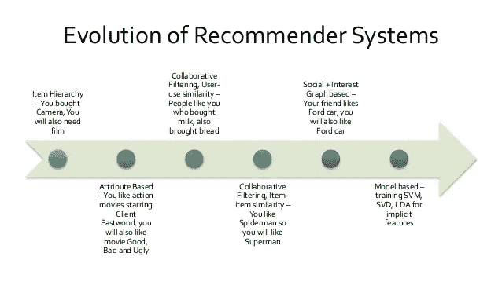

1990 年，哥伦比亚大学的尤西·高本汉在一份技术报告中首次提到了推荐系统，称之为“数字书架”,从 1994 年起，尤西·高本汉在技术报告和出版物中大规模实施了推荐系统，然后是 SICS，以及由麻省理工学院的帕蒂·梅斯、贝尔科尔的威尔·希尔和保罗·雷斯尼克领导的研究小组，他们与 GroupLens 的合作获得了 2010 年 ACM 软件系统奖。

Montaner 首次从智能代理的角度概述了推荐系统。Adomavicius 提供了一个新的、替代的推荐系统概述。Herlocker 提供了推荐系统评估技术的附加概述，Beel 等人讨论了离线评估的问题。Beel 等人还提供了关于可用的研究论文推荐系统和现有挑战的文献调查。

# **Netflix 大奖**

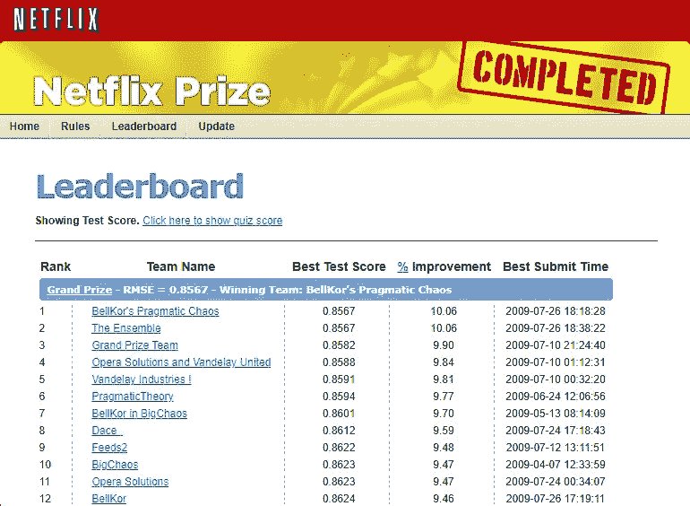

Netflix 奖是一项公开竞赛，旨在评选最佳协作过滤算法来预测电影的用户评级，该算法基于之前的评级，而没有关于用户或电影的任何其他信息，即除了为竞赛分配的号码之外，用户或电影无法被识别。

该比赛由在线 DVD 租赁和视频流媒体服务公司网飞举办，任何与网飞没有关系的人(现任和前任员工、代理商、网飞员工的近亲等)都可以参加。)也不是某些被封锁国家(如古巴或朝鲜)的居民。2009 年 9 月 21 日，100 万美元的大奖被授予贝尔科尔的务实混沌团队，该团队以 10.06%的优势击败了网飞自己的预测收视率的算法。

网飞提供了 480，189 个用户给 17，770 部电影的 100，480，507 个评级的训练数据集。每个培训等级都是一个四联表<user movie="" date="" of="" grade="">。用户和电影字段是整数 id，而等级是从 1 到 5(整数)星。</user>

合格数据集包含超过 2，817，131 个形式为<user movie="" date="" of="" grade="">的三元组，分数只有陪审团知道。参与团队的算法必须预测整个资格集的分数，但他们只被告知一半数据的分数，即 1，408，342 个评级的测验集。另一半是 1，408，789 个测试集，在这上面的表现由评审团用来确定潜在的获奖者。只有评委知道哪些评级在测验集中，哪些在测试集中—这种安排旨在使在测试集中爬山变得困难。根据均方根误差(RMSE)对提交的预测与真实等级进行评分，目标是尽可能减少这种误差。请注意，虽然实际分数是 1 到 5 之间的整数，但提交的预测不必如此。网飞还在训练数据集中识别了 1，408，395 个评级的探针子集。探针、测验和测试数据集被选择为具有相似的统计属性。</user>

总而言之，Netflix 奖项中使用的数据如下:

*   *训练集*(不包括探针集的 99072112 个评分，包括探针集的 100480507 个评分)
*   *探针组*(1408395 个等级)

合格组(2，817，131 个等级)包括:

*   *测试集*(1408789 个评分)，用于确定获胜者
*   *测验集* (1，408，342 个评分)，用于计算排行榜分数

对于每部电影，标题和发行年份都在单独的数据集中提供。没有提供任何关于用户的信息。为了保护客户的隐私，“训练和资格集中的一些客户的一些评级数据已经以下列一种或多种方式被故意扰乱:删除评级；插入备选评级和日期；和修改评级日期”。

训练集是这样的，平均用户评价超过 200 部电影，并且平均电影被超过 5000 个用户评价。但是数据差异很大——训练集中的一些电影只有 3 个评级，[4]而一个用户对超过 17，000 部电影进行了评级。

对于选择 RMSE 作为定义标准存在一些争议。RMSE 降低 10%真的会让用户受益吗？有人声称，即使是 1%的 RMSE 这样小的改进，也会导致用户最推荐的“前 10 名”电影的排名出现显著差异。

联合团队“BellKor 的务实混乱”由来自 Commendo Research & Consulting GmbH 的两名奥地利研究人员 Andreas Tö scher 和 Michael Jahrer(原团队 BigChaos)、来自美国电话电报公司实验室的两名研究人员 Robert Bell 和来自 Yahoo！(最初是 BellKor 团队)和两位来自语用学理论的研究者 Martin Piotte 和 Martin Chabbert。按照要求，他们发表了他们算法的描述。

# **项目间的相似性/距离**

***基于相似性的度量:***

*   皮尔逊相关
*   斯皮尔曼相关
*   肯德尔氏τ
*   余弦相似性
*   雅克卡相似性

***基于距离的度量:***

*   欧几里得距离
*   曼哈顿距离
*   余弦相似性

**余弦相似度**

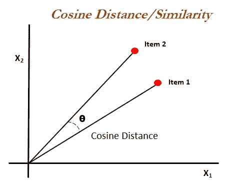

[https://www.oreilly.com/library/view/statistics-for-machine/9781788295758/eb9cd609-e44a-40a2-9c3a-f16fc4f5289a.xhtml](https://www.oreilly.com/library/view/statistics-for-machine/9781788295758/eb9cd609-e44a-40a2-9c3a-f16fc4f5289a.xhtml)

余弦相似性度量内积空间的两个向量之间的相似性。它通过两个向量之间的夹角余弦来测量，并确定两个向量是否大致指向同一方向。

公式:

**欧几里德距离**

[https://en.wikipedia.org/wiki/Euclidean_distance](https://en.wikipedia.org/wiki/Euclidean_distance)

平面或三维空间中两点之间的欧几里德距离测量连接两点的线段的长度。这是表示两点间距离的最明显的方式。

公式(二维) :

**皮尔森相关性**

[https://en.wikipedia.org/wiki/Pearson_correlation_coefficient](https://en.wikipedia.org/wiki/Pearson_correlation_coefficient)

类似于修改的欧几里德距离，皮尔逊相关系数 1 表示数据对象完全相关，但是在这种情况下，分数-1 意味着数据对象不相关。换句话说，皮尔逊相关分数量化了两个数据对象符合一条线的程度。

公式:

[https://towardsdatascience.com/calculate-similarity-the-most-relevant-metrics-in-a-nutshell-9a43564f533e](https://towardsdatascience.com/calculate-similarity-the-most-relevant-metrics-in-a-nutshell-9a43564f533e)

# **2-方法**

**2.1-基于人气**

这是一种推荐系统，它的工作原理是流行或任何流行的东西。这些系统检查流行的或最受用户欢迎的产品或电影，并直接推荐它们。

例如，如果一个产品经常被大多数人购买，那么系统将知道该产品是最受欢迎的，因此对于每个刚刚签署该产品的新用户，系统也将向该用户推荐该产品，并且新用户也将购买该产品的机会变高。

***基于人气的功过推荐系统***

*   它没有冷启动问题，这意味着在业务的第一天，它还可以推荐各种不同过滤器的产品。
*   不需要用户的历史数据。

***基于人气推荐系统的缺点***

*   不个性化
*   该系统将向每个其他用户推荐完全基于受欢迎程度的同类产品/电影。

它的工作原理是，如果你确定了最感兴趣的人，他们无论如何都会被跟踪。

**2.2-关联规则学习模型**

它是一种基于规则的机器学习技术，用于发现数据中的模式(模式、关系、结构)。

***Apriori 算法***

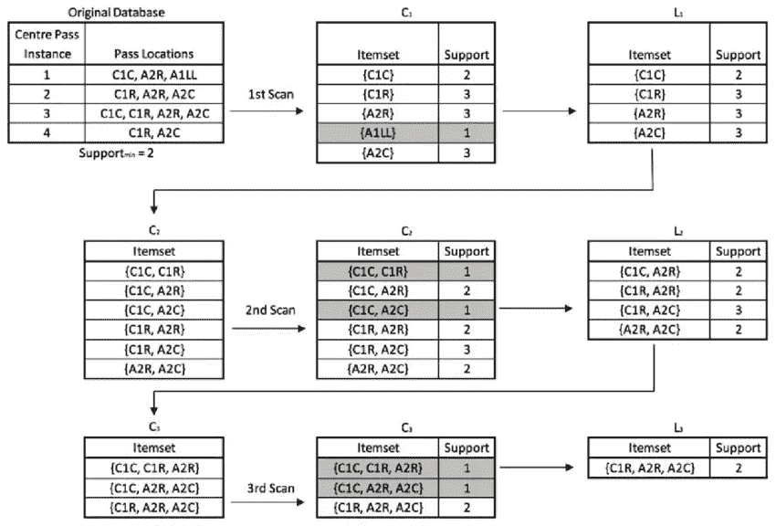

Apriori 是一种在关系数据库上进行频繁项集挖掘和关联规则学习的算法。它通过识别数据库中频繁出现的单个项目，并将其扩展到越来越大的项目集，只要这些项目集在数据库中出现得足够频繁。由 Apriori 确定的频繁项目集可以用于确定关联规则，这些规则突出了数据库中的一般趋势:这在诸如市场购物篮分析的领域中有应用。

***优点:***

*   简单算法
*   使用联合和修剪步骤在大型数据库中的大型项目集上容易实现

***缺点:***

*   如果项目集非常大并且最小支持度保持得非常低，则需要很高的计算量
*   该算法扫描数据库的次数过多，从而降低了整体性能
*   该算法的时间和空间复杂度非常高

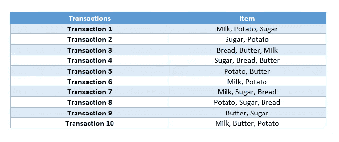

它有一个迭代的工作原理。首先，将查看带有 2 的产品，然后是带有 3 的产品，依此类推。通过支持值，也就是阈值的，就到了最后一个阶段。

例如，我将确定 2 种产品，并计算这些产品的支持度、置信度和提升值。

*牛奶和糖的例子:*

计算牛奶和糖单独出现的概率。

支持(牛奶)= 5/10

支持(糖)= 6/10

计算牛奶和糖一起出现的概率。

支持(牛奶、糖)= 2/10

买入 X 时卖出 Y 的概率

信心(牛奶、糖)= 2/5

升力= 2/10/((5/10)*(6/10))= 0.66

购买牛奶时，买糖的概率增加 0.66 倍。

当其中一个很好的托起对方的产品卖的比较合适的时候，在另一个增加购买概率的时候增加了购买概率。

***提高先验效率的方法***

有许多方法可以提高算法的效率。

***基于哈希的技术*** :这种方法使用一种基于哈希的结构，称为哈希表，用于生成 k 个项目集及其对应的计数。它使用散列函数来生成表。

***事务减少:*** 该方法减少了迭代中事务扫描的次数。不包含频繁项目的事务被标记或删除。

***划分:*** 这种方法只需要两次数据库扫描就可以挖掘出频繁项集。它说，对于数据库中任何潜在的频繁项集，它应该至少在数据库的一个分区中是频繁的。

***采样:*** 该方法从数据库 D 中随机选取一个样本 S，然后在 S 中搜索频繁项集，可能会丢失一个全局频繁项集。这可以通过降低 min_sup 来降低。

***动态项集计数*** :该技术可以在扫描数据库的过程中，在数据库的任何一个标记的起始点添加新的候选项集。

**2.2.1-关联规则学习实现**

**2.3-基于内容的模型**

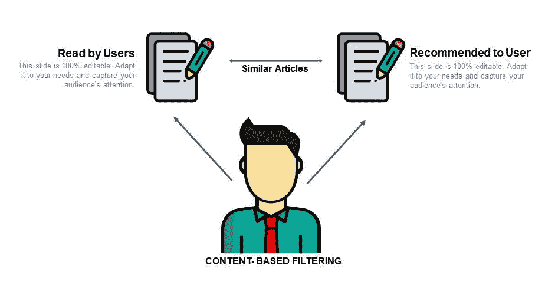

基于内容的过滤使用项目特征，根据用户以前的行为或明确的反馈，推荐与用户喜欢的项目相似的其他项目。

为了演示基于内容的过滤，让我们为 Google Play 商店手工设计一些功能。下图显示了一个功能矩阵，其中每行代表一个应用程序，每列代表一个功能。功能可以包括类别(如教育、休闲、健康)、应用程序的发布者和许多其他内容。为了简化，假设这个特征矩阵是二进制的:非零值意味着应用程序具有该特征。

您还在相同的特征空间中表示用户。一些与用户相关的特征可以由用户明确提供。例如，用户在其简档中选择“娱乐应用”。其他功能可以是隐式的，基于他们之前安装的应用程序。例如，用户安装了另一个由 Science R Us 发布的应用程序。

该模型应该推荐与该用户相关的项目。为此，您必须首先选择一个相似性度量(例如，点积)。然后，您必须设置系统，根据这个相似性度量对每个候选项进行评分。请注意，这些建议是特定于该用户的，因为模型没有使用任何关于其他用户的信息。

*   计数向量(字数)法
*   TF-IDF 方法

***计数向量(字数)法***

距离/相似性是基于行中的电影、列中描述电影的唯一单词以及表中的匹配值来计算的。

示例:

**计算将在实施部分解释

***TF-IDF 方法***

在信息检索中，TF–IDF、TF*IDF 或 TFIDF 是术语频率–逆文档频率的缩写，是一种数字统计，旨在反映一个词对集合或语料库中的文档有多重要。在信息检索、文本挖掘和用户建模的搜索中，它经常被用作加权因子。TF–IDF 值与某个单词在文档中出现的次数成比例增加，并被语料库中包含该单词的文档数抵消，这有助于调整某些单词通常出现频率更高的事实。TF–IDF 是当今最流行的术语加权方案之一。2015 年进行的一项调查显示，数字图书馆中 83%的基于文本的推荐系统使用 TF–IDF。

TF–IDF 加权方案的变体通常被搜索引擎用作在给定用户查询的情况下对文档的相关性进行评分和排名的核心工具。TF–IDF 可以成功地用于各种主题领域的停用词过滤，包括文本摘要和分类。

最简单的排名函数之一是通过对每个查询词的 TF–IDF 求和来计算的；许多更复杂的排名函数是这个简单模型的变体。

*   步骤 1: TF(w)(术语频率)=(w 术语在相关文档中的出现频率)/(文档中的术语总数)
*   第二步:IDF(w)(逆文档频率)= 1 + ln((文档总数+ 1) /(其中有 w 项的文档数+ 1)
*   第三步:TF-IDF = TF(w) * IDF(w)
*   步骤 4:将 L2 归一化为 TF-IDF 值。

***【TF】***

它是一个单词(w)在文档(d)中出现频率的度量。TF 被定义为单词在文档中出现的次数与文档中单词总数的比率。公式中的分母项是归一化，因为所有语料库文档的长度都不同。

[https://towardsdatascience.com/text-vectorization-term-frequency-inverse-document-frequency-tfidf-5a3f9604da6d](https://towardsdatascience.com/text-vectorization-term-frequency-inverse-document-frequency-tfidf-5a3f9604da6d)

***逆文档频率(IDF)***

它是衡量一个单词重要性的标准。词频(TF)不考虑词的重要性。有些词如 of、and 等。可能最常见，但意义不大。IDF 基于每个单词在语料库 d 中的频率为其提供权重

***L2 归一化***

向量的 L2 范数的符号是||v||2，其中 2 是下标。…因此，它也被称为欧几里德范数，因为它是以离原点的欧几里德距离来计算的。结果是正的距离值。L2 范数计算为矢量值平方之和的平方根

*示例:*

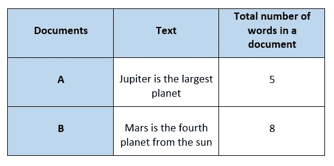

[https://mldeeplearning.com/text-vectorization-term-frequency-inverse-document-frequency-tfidf/](https://mldeeplearning.com/text-vectorization-term-frequency-inverse-document-frequency-tfidf/)

[https://mldeeplearning.com/text-vectorization-term-frequency-inverse-document-frequency-tfidf/](https://mldeeplearning.com/text-vectorization-term-frequency-inverse-document-frequency-tfidf/)

[https://mldeeplearning.com/text-vectorization-term-frequency-inverse-document-frequency-tfidf/](https://mldeeplearning.com/text-vectorization-term-frequency-inverse-document-frequency-tfidf/)

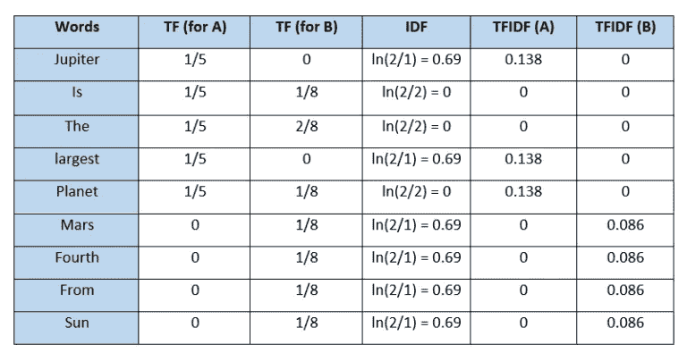

[https://mldeeplearning.com/text-vectorization-term-frequency-inverse-document-frequency-tfidf/](https://mldeeplearning.com/text-vectorization-term-frequency-inverse-document-frequency-tfidf/)

**2.3.1-基于内容的实施**

**2.4 基于项目的协同过滤模型**

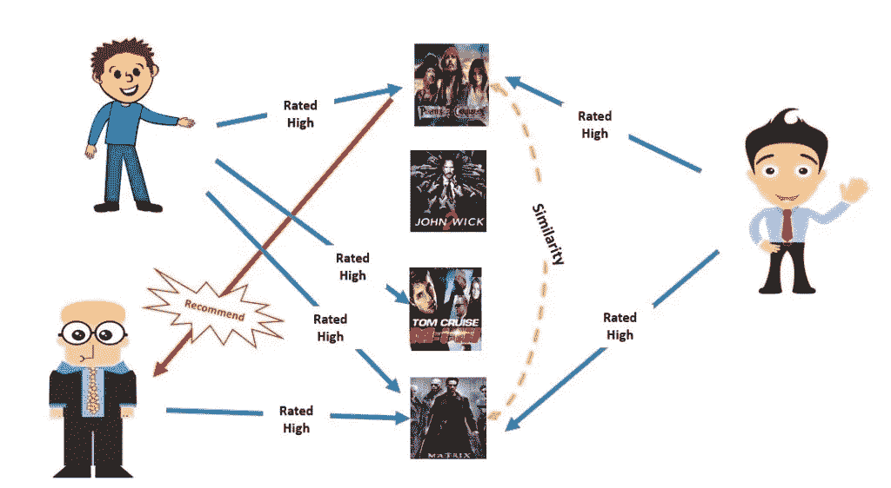

[http://sumanthrb.com/ml/recommendation-techniques/](http://sumanthrb.com/ml/recommendation-techniques/)

项目-项目协同过滤，或基于项目，或项目-项目，是推荐系统的一种协同过滤形式，基于使用人们对那些项目的评级计算的项目之间的相似性。项目-项目协同过滤是由 Amazon.com 在 1998 年发明和使用的。它在 2001 年的一次学术会议上首次发表。

早期的基于用户间相似性评级的协同过滤系统(称为用户-用户协同过滤)有几个问题:

*   当系统有许多项目但相对较少的评级时，系统表现很差
*   计算所有用户对之间的相似性是非常昂贵的
*   用户配置文件变化很快，整个系统模型必须重新计算

项目-项目模型解决了用户比项目多的系统中的这些问题。项目-项目模型使用每个项目的评级分布，而不是每个用户。由于用户比项目多，每个项目往往比每个用户有更多的评分，因此项目的平均评分通常不会快速变化。这导致模型中更稳定的评级分布，因此模型不必经常重建。当用户消费并评价一个项目时，该项目的相似项目从现有的系统模型中选取并添加到用户的推荐中。

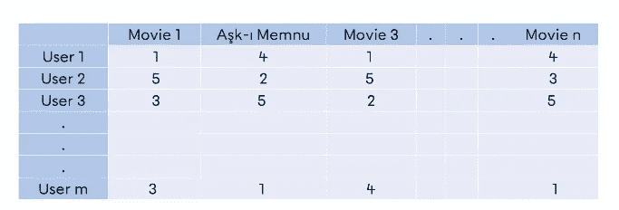

[www.veribilimiokulu.com](http://www.veribilimiokulu.com)

上表中给出了用户对电影的评分。给定的电影与电影 2 最相似的评分是多少？我们可以看到电影是 n，这种关系可以用基于相关性或者基于距离的形式抓住他们。在第一阶段，我们将更喜欢相关性，因为它捕获了关系分布，并且是相似性的度量。

***皮尔森相关性概述***

[https://en.wikipedia.org/wiki/Pearson_correlation_coefficient](https://en.wikipedia.org/wiki/Pearson_correlation_coefficient)

类似于修改的欧几里德距离，皮尔逊相关系数 1 表示数据对象完全相关，但是在这种情况下，分数-1 意味着数据对象不相关。换句话说，皮尔逊相关分数量化了两个数据对象符合一条线的程度。

公式:

[https://towardsdatascience.com/calculate-similarity-the-most-relevant-metrics-in-a-nutshell-9a43564f533e](https://towardsdatascience.com/calculate-similarity-the-most-relevant-metrics-in-a-nutshell-9a43564f533e)

第二阶段包括执行一个推荐系统。它使用与缺失项目最相似的项目(已经由用户评级)来生成评级。因此，我们试图根据类似产品的评级来做出预测。我们使用一个公式来计算这一点，该公式使用其他类似产品评级的加权和来计算特定项目的评级。

[https://miro.medium.com/max/3092/1*zMKWM0qTWK3wtepol7fIiQ.png](https://miro.medium.com/max/3092/1*zMKWM0qTWK3wtepol7fIiQ.png)

**2.4.1-基于项目的协同过滤实现**

**2.5-基于用户的协同过滤模型**

[http://sumanthrb.com/ml/recommendation-techniques/](http://sumanthrb.com/ml/recommendation-techniques/)

基于用户的协同过滤使用该逻辑，并通过找到与活动用户相似的用户来推荐项目。

任何两个用户‘a’和‘b’的相似性可以从给定的公式中计算出来:

[https://www.geeksforgeeks.org/user-based-collaborative-filtering/](https://www.geeksforgeeks.org/user-based-collaborative-filtering/)

目标用户可能与一些用户非常相似，而可能与其他用户不太相似。因此，由更相似的用户给出的对特定项目的评价应该比由不太相似的用户给出的评价给予更大的权重，等等。这个问题可以通过使用加权平均方法来解决。在这种方法中，您将每个用户的评级乘以使用上述公式计算的相似性因子。缺失的评级可计算如下:

[https://www.geeksforgeeks.org/user-based-collaborative-filtering/](https://www.geeksforgeeks.org/user-based-collaborative-filtering/)

**2.5.1-基于用户的协同过滤实现**

**2.6 混动车型**

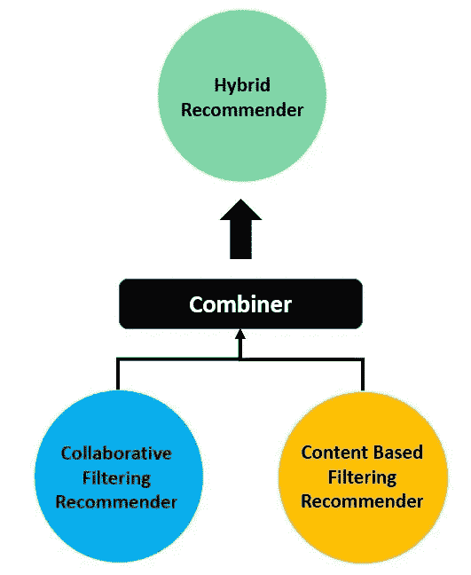

[http://sumanthrb.com/ml/recommendation-techniques/](http://sumanthrb.com/ml/recommendation-techniques/)

它可以用作基于内容和协作过滤方法的并行或顺序编译。没有固定的方法。可以根据会分析的人的意愿和公司的需求来设计。

**基于 2.7 车型**

***矩阵分解***

矩阵分解是一类用于推荐系统的协同过滤算法。矩阵分解算法通过将用户-项目交互矩阵分解成两个低维度矩形矩阵的乘积来工作。由于 Simon Funk 在 2006 年的博客帖子中与研究团体分享了他的发现，这一系列方法在网飞奖挑战期间因其有效性而广为人知。根据项目的受欢迎程度和用户的活跃程度，为潜在因素分配不同的正则化权重，可以改善预测结果。

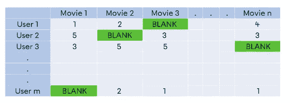

[www.veribilimiokulu.com](http://www.veribilimiokulu.com)

为了填补空白，在现有数据上找到假设对用户和电影存在的潜在特征的权重，并且用这些权重对不存在的观察进行预测。

它将用户项目矩阵分解成 2 个维度更低的矩阵。

它假设从它所解析的 2 个矩阵到用户项目矩阵的转换伴随着潜在的因素发生。

潜在因素的权重在填充的观察值上找到。

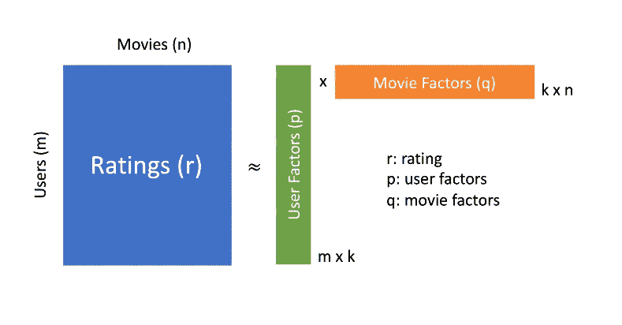

[www.veribilimiokulu.com](http://www.veribilimiokulu.com)

我们有一个用户-电影矩阵，在它的交叉点上有评级。

方法假设说，对于用户和电影来说，都有一些隐藏的因素。

比如，有一些我们还没有观察到的隐藏因素影响着用户对一部电影的喜好。同样的因素在电影中也有对应的因素，例如，布拉德·皮特是否在电影中，或者这部电影是否是一部冒险电影。事实上，用户基于这些潜在因素来选择电影。

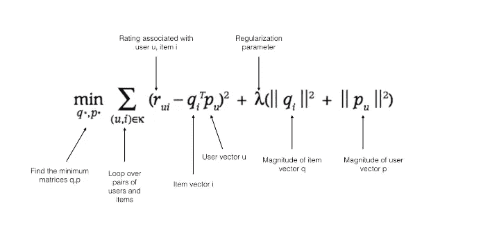

[www.veribilimiokulu.com](http://www.veribilimiokulu.com)

换句话说，该公式表示从与用户向量相乘的评级矩阵中减去评级矩阵的值和项目向量的转置，取它们的平方，并且在校正过程之后通过求和来达到误差的最低 q 和 p 值，以避免过度学习。

所以，当你看所有的数据，考虑所有的用户，这些潜在特征(100 或 1000)在用户方面的权重是多少，潜在特征在所有电影方面的权重是多少。利用它们，它填补了空白。

假设评级矩阵由两个因子矩阵的乘积(点积)构成。

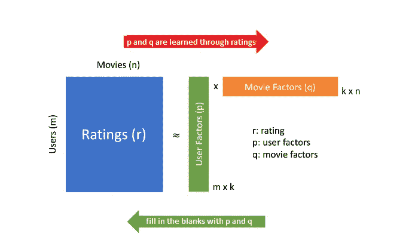

[www.veribilimiokulu.com](http://www.veribilimiokulu.com)

因素矩阵→用户潜在因素和电影潜在因素

潜在因素或潜在特征→潜在因素或变量。

用户和电影被认为具有潜在特征的分数。

这些权重(分数)是在现有数据上找到的，然后根据这些权重填充空白部分。

[www.veribilimiokulu.com](http://www.veribilimiokulu.com)

左边的表格显示了用户对电影的评价。

在中间的表中，F1 和 F2(例如，有一个著名的电影明星)对每个用户的用户端的影响用 p 来度量

在右边的表格中，每个潜在因素(例如，著名的电影明星或电影类型)对电影的影响用 q 值来衡量。

所有的 p 和 q 在现有的值上迭代地被找到，然后被使用。

最初，尝试估计随机 p 和 q 值以及评级矩阵中的值。

在每次迭代中，错误的预测被安排来试图接近评级矩阵中的值。随着迭代次数的变化，权重也会变化，直到达到给定的实际等级。

例如，如果 5 在一次迭代中调用 3，那么在下一次迭代中调用 4，在最后一次迭代中调用 5。

[www.veribilimiokulu.com](http://www.veribilimiokulu.com)

当我们想要估计 U1 用户的 M3 电影分级时，我们做矩阵乘法。

[www.veribilimiokulu.com](http://www.veribilimiokulu.com)

所以对 M3 来说；0.8 * 0.1 + 0.5 * 4.2 = 2.18 à u1 用户对 m3 电影的预估评分

这样所有的空白都被填满了。

*注:*

我们说它将用户条目矩阵分解成 2 个低维矩阵用于矩阵分解。SVD 通过 3 个矩阵来实现这一点。

**2.7.1-基于模型的实施**

**3-冷启动问题**

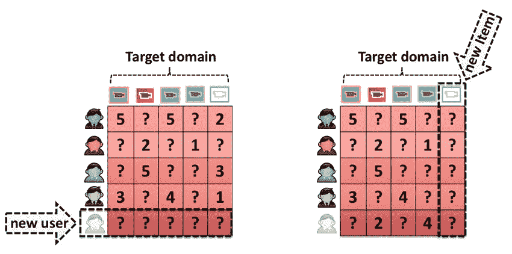

冷启动是基于计算机的信息系统中的一个潜在问题，它涉及一定程度的自动化数据建模。具体来说，它关注的问题是，系统无法为尚未收集足够信息的用户或项目做出任何推断。

冷启动有三种情况:

*新社区:*指的是推荐者的启动，尽管可能存在项目目录，但是几乎没有用户在场，并且缺乏用户交互使得很难提供可靠的推荐

*新项目:*系统中添加了一个新项目，它可能包含一些内容信息，但不存在交互

*新用户*:新用户注册，尚未提供任何交互，因此无法提供个性化推荐

根据公司的战略，这类问题可以用几种方法解决。我们不可能为一个全新的用户提供基于数据的推荐。在这种情况下，如果我们没有关于用户的任何信息，我们可以进行基于流行度的推荐。或者，如果他/她搜索了特定的产品，我们可以提供类似于该产品的基于内容的建议。

**4-结论**

推荐系统有许多方法可以根据需要使用。推荐系统仍然是一个有待改进的领域。在本文中，我试图包含推荐系统的几乎所有方法。需要注意的是，这是一篇综述文章。每种方法都有自己的优缺点。您可以在参考资料部分找到关于您需要的方法的详细信息。我希望这些信息对你有用。谢谢你的时间。

**参考文献**

【www.veribilimiokulu.com 

[https://onespire . Hu/sap-news-en/history-of-recommender-systems/](https://onespire.hu/sap-news-en/history-of-recommender-systems/)

[https://en.wikipedia.org/wiki/Recommender_system](https://en.wikipedia.org/wiki/Recommender_system)

[https://en.wikipedia.org/wiki/Netflix_Prize](https://en.wikipedia.org/wiki/Netflix_Prize)

[https://towards data science . com/calculate-similarity-the-most-relevant-metrics-in-a-shell-9a 43564 f533 e](https://towardsdatascience.com/calculate-similarity-the-most-relevant-metrics-in-a-nutshell-9a43564f533e)

[https://www . analyticssteps . com/blogs/what-are-recommendation-systems-machine-learning](https://www.analyticssteps.com/blogs/what-are-recommendation-systems-machine-learning)

[https://en.wikipedia.org/wiki/Apriori_algorithm](https://en.wikipedia.org/wiki/Apriori_algorithm)

[https://www.softwaretestinghelp.com/apriori-algorithm/](https://www.softwaretestinghelp.com/apriori-algorithm/)

https://developers . Google . com/machine-learning/recommendation/content-based/basics

[https://en . Wikipedia . org/wiki/Item-Item _ collaborative _ filtering](https://en.wikipedia.org/wiki/Item-item_collaborative_filtering)

[https://www . geeks forgeeks . org/user-based-collaborative-filtering/](https://www.geeksforgeeks.org/user-based-collaborative-filtering/)

[https://www . mygreatlearning . com/blog/apriori-algorithm-explained/](https://www.mygreatlearning.com/blog/apriori-algorithm-explained/)