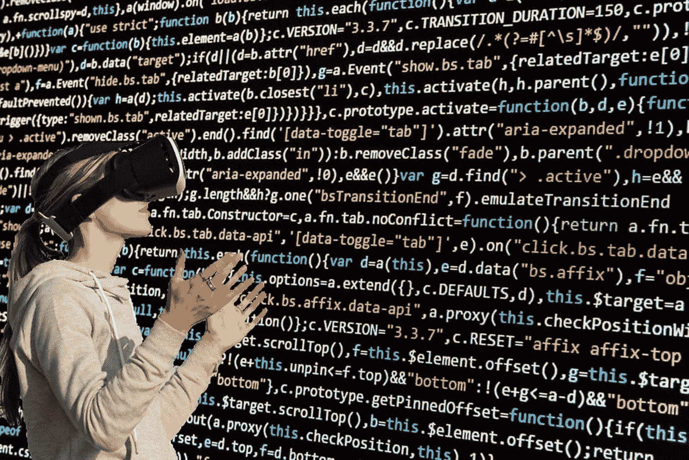

# 平行期货和元宇宙

> 原文：<https://medium.com/geekculture/parallel-futures-and-the-blackhole-of-metaverse-4f4054f6ce4c?source=collection_archive---------16----------------------->

# 模糊现实和虚拟空间之间的界限

我们大多数人的日常工作都有固定的程序、责任和可交付成果。通常，思维会走神，作为人类，我们会试图衡量其他可能性。如果我从一个团队成员那里拿走负担，给一个项目增加另一个团队成员，向执行领导团队提出一些建议，我们晚餐应该做什么，周末去哪家餐馆，等等，会发生什么？？它们是我们平庸的思维过程。我们不断地玩弄因果关系，选择最好的结果。一般来说，人类可以在一眨眼的时间内完成所有这些推理，这是人工通用智能的预言性独特销售命题。这样的决定及其影响向我们展示了一个可能存在的平行未来——进入元宇宙，一个嵌入了增强和虚拟现实的虚拟空间环境。想想以数字形式存在的人、城市和国家，而不是血肉之躯或水泥和钢铁。简单来说，元宇宙汇集了我们在上个世纪倡导的模拟技术的力量，并建立了虚拟世界(几乎像一个视频游戏)，人们可以在其中获得身临其境的体验。

# 沉浸式体验

尼尔·斯蒂芬森(《冰雪奇缘》(1992 年)的作者，术语元宇宙的发明者)一点也不知道这个术语将是 30 年后建立亿万美元产业的基础。元宇宙非常令人兴奋，许多公司都在创建数字存在。耐克宣布将在元宇宙平台 Roblox 上创建 Nikeland。它将非常类似于真实的实体耐克总部，用户可以使用耐克商品打扮他们的化身，从虚拟商店购买产品等。另一个元宇宙平台“分散之地”正在举办首次元宇宙时装周，许多品牌展示他们的新系列，并让时装模特走上斜坡。一些品牌将为虚拟形象提供数字服装，买家可以选择出售该物品，并兑换 NFT(虚拟货币——不可替代的代币)来购买实物服装。沃尔玛(Walmart)等零售商预计将进军元宇宙，创造他们的加密货币和 NFT 集合。我们也许可以在一个商店复制品周围走动，购买我们的食品杂货(显然是送到我们的住所——我们仍然不能吃虚拟的面包和黄油),而不是把你的牛奶和面包放在手推车里。除了笑话，许多令人兴奋的商业模式已经在这个领域发展。

广告是另一个用例，因为嵌入元宇宙的人们可以为他们的数字自我购买商品。这种购买行为无疑会渗透到他们的现实生活中。我们不再在你的网络浏览器上输入 Amazon.com，而是走向虚拟世界，通过在这个虚拟空间(而不是你的 2D 电脑屏幕)筛选各种广告产品，购买我们晚餐聚会所需的陶器。为 2D 电子购物世界获得一个无缝的用户界面确实花了 20 多年的时间；我想，鉴于创新的速度，一个人可以在一半的时间内把它做好。其他使用案例包括购买虚拟化身、购买房屋以及在虚拟教室中进行沉浸式学习。因此，下一代广告公司有很大的发展空间。

技术专家有什么好处？元宇宙可以成为计算机视觉(CV)、自然语言处理(NLP)和强化学习(RL)等机器学习技术的大熔炉。我们目前有一个短视的观点——使用 NLP 来创建语音代理，使用 CV 来计算货架上遗漏的商品，或者使用 RL 来进行调度和计划。只有一些人看到了当我们用声音和眼光做决定时会发生什么。谷歌 Deepmind、FAIR、OpenAI 和许多其他实验室一直在倡导人工智能的决策方面。除非我们能够以协调一致的方式使用这些感觉来做决定，否则仅凭语音和视觉方面的技术进步无法让我们接近人工智能。因此，元宇宙可能会成为一个虚拟的实验场——一个大型的多人游戏(RL 朋友们，请多想想多智能体 RL 和你最喜欢的分散的部分可观察马尔可夫决策过程的配方)。

# 建造它，他们会蜂拥而至…

像微软和 Meta(以前的脸书)这样的重要技术公司和像摩根士丹利这样的金融服务公司已经蜂拥而至，将某种形式的元宇宙产品集成到他们的产品线中。虚拟现实头戴设备公司(Oculus、Pico、Varjo、Vive 等。)使我们能够进入元宇宙，从联发科和 TSMC 到 Luxshare 的硬件制造商已经投资为基础的元宇宙构建硬件。尽管经过了几十年的发展，这些“元宇宙入场券”穿起来笨重，拥有起来昂贵。创造一个与现实平行的未来(元宇宙)的全部意义在于拥有一种身临其境的体验。从用户体验的角度来看，我们遇到了硬件方面的第一个障碍。

此外，难道我们不应该开始考虑那些看不见、听不见或患有焦虑症的人吗(这在我看网飞的《我们眼中的世界》时被重新点燃)。还是我们又要创造一个批判的元宇宙？还有其他问题涉及数据和安全、支付系统、元宇宙的跨国司法管辖权、所有权等。—在随后的帖子中会有更多相关内容。

作为学术界的机器学习科学家和业内的技术高管，我学会了在技术和产品的交叉点上看待元宇宙(及其早期的化身“第二人生”和其他几个人)等想法，但用的是“价值”的镜头。更重要的是，这会被消费者接受吗？这样的思考过程很快变得费力。元宇宙有望成为一个虚拟空间，在这里人们可以“感受”到身体和情感的存在——我们到了吗？还没有。只要有这样的系统，我们会买吗？也许吧。我们要问的下一个问题是为什么？请记住，总而言之，我们必须投入实际(而非虚拟)的时间、金钱和精力来与元宇宙互动。与此同时，我可以看到这就像和你的虚拟邻居一起玩视频游戏建立一个社区，但是我们有认知能力去过平行的生活吗？我们不是已经信息过剩了吗？是的，向风投和用户展示元宇宙这块乐土，会有成千上万的公司赚到钱，但关键是要问产品是什么？打造它，顾客就会蜂拥而至。这句口头禅可能不管用。

那么，什么能起作用呢？在我看来，当你可以使用它来(a)做出**决策**和(b)将它用作机器学习(ML)数据生成的**合成世界**时，迈向元宇宙的第一步就开始了。人们需要逐步建立[产品与市场的契合度](https://biswasengupta.medium.com/the-product-market-fit-of-ai-technologies-ffbf3c618720)。否则，如果各行业开始在虚拟空间开设“商店”，并使用数字货币或不可替代的代币来购买/出售数字资产，那么消费者采纳的论点就会变得相当紧张。迈向元宇宙的第一步是数字双胞胎**，这又是一个古老的概念。以自然世界的一小部分为例，比如一家零售店，并使用一个简单的元宇宙(数字双胞胎)来实现所有资产(商品、商店员工、供应链流程等)的实时可见性。).然后使用计算机视觉等技术来测量商店的实时供需情况。自然语言处理从成千上万的信件中筛选，并告诉你需要完成什么任务。最后，在数字双胞胎的约束下，强化学习做出展现未来的决策。这将有助于商店经理实时了解商店运营情况，并利用新生的数字双胞胎领域做出有用的决策。在技术上，它允许我们结合各种声音和视觉属性，并采取最佳决策。难道我们都不想做出明智的决定吗？我打赌我们有。**

**迈向元宇宙的另一小步再次围绕着数字双胞胎，但这一次是为了生成合成数据。我们在 Unity Technologies 的朋友已经在支持这种想法，还有许多其他创业公司和科技公司。所有这些背后的核心概念是领域随机化。数字双胞胎是元宇宙想法的一个子集，它使我们能够创造合成世界和同一个世界的各种子集。如果我的卧室被涂成红色而不是白色，我走的路是鹅卵石而不是混凝土，改变可见度统计(标准的计算机图形技巧)等等，会发生什么？例如，大多数基于深度学习的计算机视觉算法需要大量的训练数据。数字双胞胎(如果构造严谨，以减少真实环境中协方差偏移)可以为我们提供带注释的合成数据。无论是无人驾驶汽车的数百万公里行驶数据，还是不同视角统计下的数百种物体排列。类似地，当领域被随机化时，即，材料(纹理、颜色)、光方向、光条件和物体的放置的随机变化时，RL 算法很难一般化。元宇宙概念可以帮助我们缓解一些数据效率问题。**

**总之，如果从最终产品的讨论中引出，对元宇宙的兴奋可以形成并很可能减少产品和市场需求之间的阻抗不匹配。不管解决方案在技术上有多好，未经检查的错误假设都会扼杀公司。**