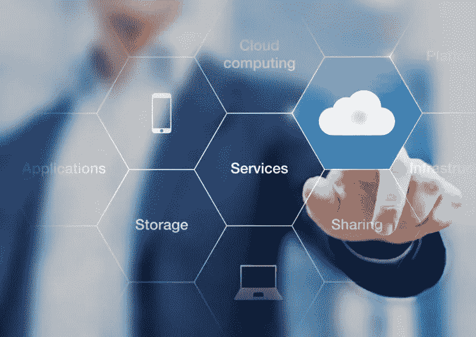
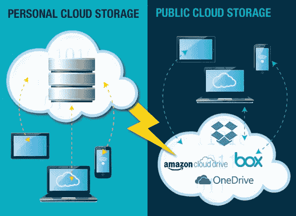
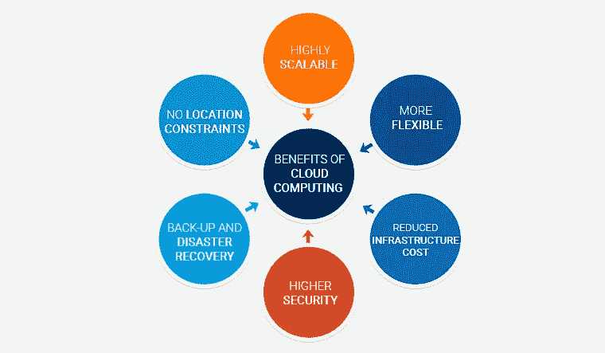
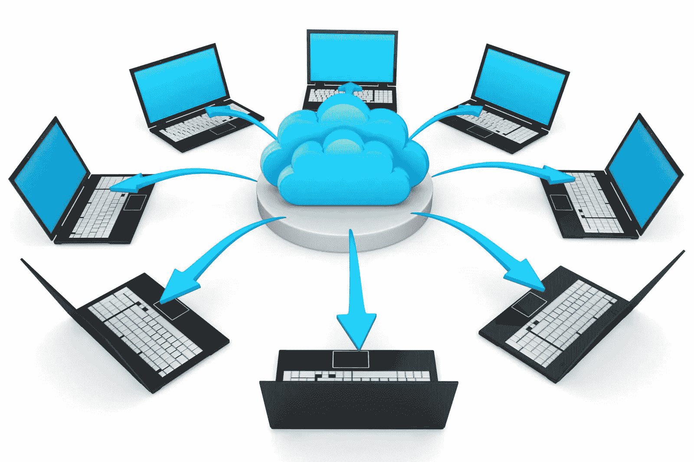
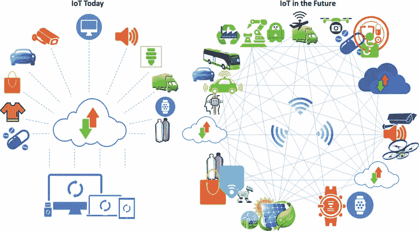
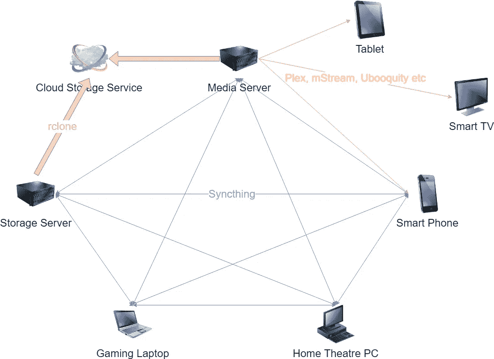
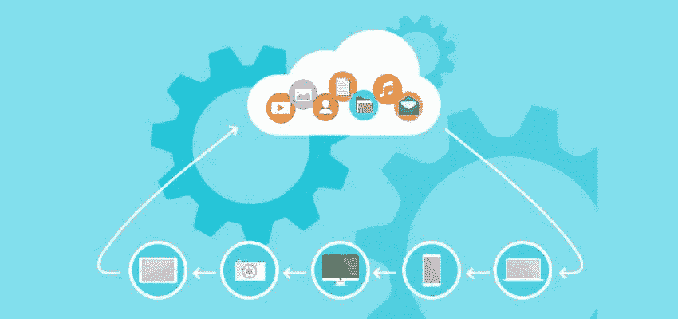

# 个人私有分布式云服务的设计与实现

> 原文：<https://medium.com/geekculture/personal-distributed-cloud-services-design-implementation-d8a70b982f18?source=collection_archive---------3----------------------->

Image by [NicoElNino](https://www.istockphoto.com/portfolio/nicoelnino) from [iStock](https://www.istockphoto.com/photo/concept-about-cloud-computing-applications-storage-services-online-gm519831360-90736045)

在我之前的帖子中，我描述了一个典型的智能家庭或小型办公系统的迁移，该系统依赖于来自大公司的公共消费者云服务，例如来自 [Dropbox](https://www.dropbox.com/) 、 [Google Drive](https://www.google.com/drive/) 、[One Drive](https://onedrive.live.com/)；媒体流来自，比如说[网飞](https://www.netflix.com/)；来自 [Spotify](https://www.spotify.com/) 的音乐流；或者通过亚马逊 Kindle 生态系统看书；与任何特定应用程序或提供商分离的个人私有分布式云服务解决方案，并概述您为什么想要这样做。让我们来看看这样一个系统的实现。

Image by [*Karim Lahlou*](https://www.linkedin.com/in/karim-lahlou-3832347a/) From [Consumer Reports](https://www.consumerreports.org/cro/news/2014/06/public-cloud-vs-private-cloud-which-is-right-for-you/index.htm)

他们的内部实施可能是分散的，也可能是从用户 p.o.v 分布的，公共云服务充当集中式系统。然而，从我们的角度来看，我们对它们有依赖性，就像我们在任何基于客户机-服务器的集中式系统中一样。更糟糕的是，我们的数据，比如媒体本身，完全耦合到了服务中。

现在，这提供了好处；否则，云服务不会流行起来；例如，灵活性和可扩展性使我们能够轻松添加更多使用特定服务的设备；灾难恢复，因为我们的数据保存在云中，即使从特定设备中删除或因任何原因损坏，也不会丢失；自动更新和同步，即我们知道我们总是拥有特定数据的最新版本，没有购买昂贵硬件的资本支出(购买后会迅速贬值);能够从任何位置访问我们的数据，以及不依赖于物理位置的持续可用性。

Image by [Shiftwave](https://www.shiftwave.com/) from [Shiftwave](https://www.shiftwave.com/cloud-applications.php)

我们需要建立一个系统，提供消费者云服务的好处，但结合来自多个提供商的功能，将我们的数据从特定服务中分离出来，比如让你拥有的所有电影的蓝光副本都可以流到你的所有设备上，而不仅仅是你在网飞或[亚马逊 Prime Video 上的部分电影收藏](https://www.primevideo.com/)， 不得不在 Spotify 和 [Tidal](https://tidal.com/) 等不同的音乐流媒体应用程序之间切换，以便从您预先存在的音乐库中收听特定艺术家的歌曲，从不同的在线来源阅读不同格式的书籍，而不必切换到不同提供商的不同电子书阅读应用程序； 同时也是分布式的，所以我们不会简单地从一个中央依赖项转移到另一个。

Image by [Slide Team](https://www.slideteam.net/) from [Slide Team](https://www.slideteam.net/business_powerpoint_diagrams/0914-laptop-computers-connected-through-cloud-computing-stock-photo.html)

正如前面的所述，低成本的数据中心托管(通常基于 Linux 机器非常适合这种情况。它们提供高可用性和连接性，无论物理位置如何，没有硬件资本或维护成本。对于分发关键数据，开源的点对点跨平台同步应用程序，如 [Syncthing](https://syncthing.net/) 是理想的选择。

对于特定的应用程序，如远程文件访问、媒体流或书籍阅读，我们可以从许多不同的服务器应用程序选项中选择；常见的例子有用于远程文件访问的 [ownCloud](https://owncloud.org/) 和 [NextCloud](https://nextcloud.com/) ，用于媒体流的 [Plex](https://www.plex.tv/) ，用于音乐流的 [mStream](http://www.mstream.io/) ，或者用于书籍阅读的 [Ubooquity](https://vaemendis.net/ubooquity/) 。

Image by [Arne Bröring](https://www.researchgate.net/profile/Arne-Broering) from [ResearchGate](https://www.researchgate.net/figure/From-a-centralised-cloud-to-distributed-edge-IoT-platforms-and-applications_fig1_318012442)

T21:由于数据是分布式的，并且与服务器分离，我们可以自由选择我们想要的任何服务器应用程序，甚至可以使用客户机-服务器模型。我们可以利用当前设备的计算能力和存储能力来存储、处理、&使用这些数据。

在许多情况下，考虑到智能手机等低功耗设备上相对较高的计算能力和存储能力，以及目前本地驱动器或 SD 卡存储的相对可承受性，这可能是最佳选择，同时仍然可以从数据的同步和分布式特性中获得云服务的优势。

Image by [syedrali](https://github.com/syedrali) from [GitHub](https://github.com/syedrali/architecture)

这是我的具体设置，你可以看到所描述的想法和架构的实现。让我们看看这里发生了什么。使用 Syncthing 可以实现数据复制，而不受特定平台的影响，sync thing 以对等方式在整个系统中仅分发每个设备所需的数据。能够完全处理和存储数据的设备自己直接获取文件，如基于 Windows 的游戏笔记本电脑或家庭影院 PC，在那里他们可以使用应用程序，如 [VLC](https://www.videolan.org/) 或 [Kodi](https://kodi.tv/) 进行查看&访问。

对于没有足够的存储容量或处理能力来存储和播放 1080p 高清电影集的设备，基于 [Ubuntu](https://ubuntu.com/) 的媒体服务器使用适当的服务器软件(如 Plex for videos 或 mStream for music)将数据传输到这些设备上的客户端应用程序；同时还为我们提供了从公共消费者云服务中无法获得的访问完整集合的聚合功能，以及在更高功率或更高存储容量的设备上可获得的相同内容。

Image by [Branding Process](https://www.pinterest.fr/businessenligneTIPS/) from [Pinterest](https://www.pinterest.fr/pin/672514156840282245/)

上述系统满足我们概述的要求，同时具有改变任何具体实施细节的灵活性，例如使用什么文件同步应用程序；我们可以使用 ownCloud 运行在基于 CentOS 的存储服务器上，迁移到当前设置或与当前设置一起运行一个更集中的系统，用于文件访问同步，将 Plex 替换为不同的媒体流服务器应用程序，如 Emby 使用不同的音乐流服务器软件，如 Subsonic 不同的图书服务器，如 Calibre 内容服务器。 添加一台基于 Windows 的游戏服务器，从高规格游戏笔记本电脑可用的同一游戏库中流式传输游戏，到低功耗硬件，如 HTPC 或任何其他机器，甚至添加更多公共消费者云服务替代产品，以满足从生产力到聊天应用程序的所有需求； 对我们个人私有云服务中的其他组件没有影响。

Image source unknown

E 每个设备本身都保存着关键数据的副本，服务器上有更多的备份功能。传输应用程序对设备流量使用 TLS 加密，来自免费公共提供商(如 [Let's Encrypt](https://letsencrypt.org/) )的 TLS 证书可用于保护我们用来访问 web 应用程序的任何 web 客户端的连接，如果我们愿意，我们可以加密存储在磁盘上的数据；提供类似于公共云的安全性，但没有将我们的所有数据和应用程序控制权交给他人的隐私顾虑。

由于其广泛的存储容量，存储服务器具有整个系统中所有当前数据的单一完整画面，这对于归档非常有用。尽管如此，我们并不依赖于它，因为所有数据本身的完整图像保存在分布式系统本身中。即使完全移除存储服务器，也不会对任何服务或系统中保存的数据的有效性和同步性产生影响。

Image by [Ngan Tengyuen](https://www.geckoandfly.com/) from [Geckoandfly](https://www.geckoandfly.com/24024/self-hosted-cloud-storage/)

我们甚至可以通过使用 rclone 以分离的方式利用公共云，进一步安全地将我们的数据从服务器直接分发到公共云存储服务，从而允许我们在出于任何原因不想连接到我们的私有个人云时共享或访问任何特定数据。我们的 VPS 机器的数据中心托管性质为我们提供了高可用性和连接性，可与来自任何设备的公共消费者云服务相媲美。

但是同样，我们不依赖这些服务器，也不与它们紧密耦合。它们可以很容易地被我们运行相同或不同服务器应用程序的自托管本地服务器替换掉，或者完全移除。正如您所看到的，对于技术专家来说，从完全依赖公共消费者云服务转向部分自托管的私有分布式系统，由于替代应用程序的典型开源性质和 VPS 主机的可负担性，成本并不高，或者在技术上难以实施，同时提供许多好处和优势。