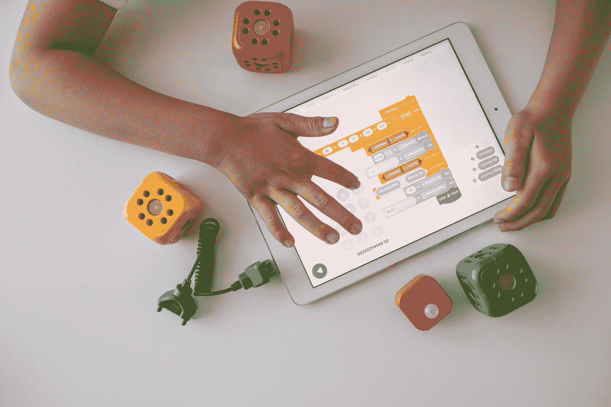

# 无意识偏差下的个性化学习

> 原文：<https://medium.com/geekculture/personalized-learning-with-unconscious-bias-f1ab45c52ebf?source=collection_archive---------14----------------------->

在过去的十年里，STEM 对于教育界的几乎每个人来说都是一个大词。它在我们的日常生活中变得越来越重要，而我们的日常生活在很大程度上是由我们的孩子塑造的。如果你是老师，你可能会被你教的学生所驱使。

Photo by [Robo Wunderkind](https://unsplash.com/@robowunderkind?utm_source=medium&utm_medium=referral) on [Unsplash](https://unsplash.com?utm_source=medium&utm_medium=referral)

我想谈谈“在教室里被学生驱动”，以及在学习空间里如何应对这种情况。最重要的是如何把 STEM 放在我们课程的方向盘上，以便内容和概念可以有效地传递给年轻人。

在课堂环境中，为了确定影响教与学的关键因素，应该考虑学生的本能。偏见起到了关键作用。特别是无意识偏见，可以定义为" ***"偏见或无根据的判断，与另一个相比，支持或反对一个事物*** *、人或群体，通常被认为是不公平的。**(引:***)**

*教师几乎每天都在处理无意识偏见，因为他们是学习空间的一线工作者，同时在平等和公平的背景下尽可能好地促进概念、教学和为学生提供机会。无意识的偏见肯定首先影响教育工作者，而准备单元计划、选择正确的课程位置或学生的期望，以及教学实践可能会受到沉重打击。*

*另一方面，无意识偏见塑造了学生对学习环境、课堂或整个学校的看法。它操纵着他/她对学习领域、教育成就、实现和成就的选择。它将贯穿学生的一生，并影响未来的就业选择。*

*那么，如何消除无意识的偏见或者把它减到最小呢？根据[教育要素](https://www.edelements.com/blog/the-core-4-of-personalized-learning)，个性化学习有四大支柱，可以帮助我们应对无意识偏见。*

*   ***灵活的内容和工具:**教师应该精确、开放、灵活地提供各种资源，包括在线或离线、工作表的软拷贝或硬拷贝、扑克牌等。学生将参与所有提供的活动，但将根据他们的学术和社会背景做出反应。*
*   ***有针对性的教学和数据驱动的决策:**在现代设计良好的教室中，差异化是不可避免的。教师需要很好地了解他/她的学生，并找出他们的弱点和优势，因此教学应该有相应的框架。*
*   ***反思和所有权:**教师让学生进行反思，独立表达自己的想法，并对自己的工作和项目承担责任和所有权。*

*你需要工具吗？一头扎进去。*

**

*[https://www.commonsense.org/education/](https://www.commonsense.org/education/)*

*别忘了查看这个链接；*

*【https://benedtech.medium.com/membership *