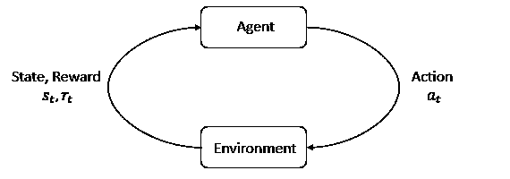

# 哲学、计算、人工智能(1/？)

> 原文：<https://medium.com/geekculture/philosophy-computing-and-artificial-intelligence-1-42e72f516acb?source=collection_archive---------17----------------------->

这是亚利桑那州立大学托马斯·a·布莱克教授指导的 PHI 319 的(部分)课程笔记。我从课程网页上借用了大量的例子和解释。

Photo by [愚木混株 cdd20](https://unsplash.com/@cdd20?utm_source=unsplash&utm_medium=referral&utm_content=creditCopyText) on [Unsplash](https://unsplash.com/s/photos/logic?utm_source=unsplash&utm_medium=referral&utm_content=creditCopyText)

# 介绍

我们已经(再次)进入了一个符号时代，因为我们在由深度神经网络方法促进的现代人工智能中遇到了几个问题，即:可解释性、可验证性和效率(就数据而言)。人工智能从根本上说是建造思维机器的过程，几十年前，来自 CS 和哲学学科的研究人员对此进行了大量思考。

在我看来，这门课程是作为符号人工智能初学者甚至是普通读者重访该领域的完美来源。所以，和我一起享受旅程吧。

# 理性和智慧

什么是理性？斯图尔特·罗素和彼得·诺维格在他们的书中这样描述它:

> 对于每一个可能的感知序列，一个理性的主体应该选择一个行动，在给定感知序列提供的证据和主体拥有的任何内在知识的情况下，该行动应该最大化其性能度量
> 
> ——([*人工智能。现代方法*](https://cs.calvin.edu/courses/cs/344/kvlinden/resources/AIMA-3rd-edition.pdf) ，37)

这在博弈论中也被称为效用函数，它捕捉了玩家(或代理人)对实数形式的不同结果的偏好，从而使实值函数能够用于博弈论分析。

理性主体的智能是什么？在头脑中有一个目标，通常由一个性能测量或效用函数定义，代理应该能够通过在某些情况下得出结论来形成信念，以实现其目标。

# OTDA 循环

## RL 中我们的循环与代理-环境的相互作用？

OTDA 指的是观察-思考-决策-行动。正如我们之前提到的，代理人是否理性取决于其效用函数:代理人想要的是可测量的吗？智能体拥有的智能水平是它如何对环境做出反应并提高他的效用。这个循环看起来有点像下面显示的大多数强化学习(以下简称 RL)文献中的环境-主体交互。

[https://spinningup.openai.com/en/latest/spinningup/rl_intro.html](https://spinningup.openai.com/en/latest/spinningup/rl_intro.html)

他们完全一样。为了理解我们的周期，让我们举个例子。如果我们由效用函数定义的目标是不要靠近任何火，当火可见时，我们显然可以选择向某个方向移动。但作为人类，当我们看到烟时，我们可能也会做出同样的决定，烟意味着可能有火灾。我们所看到的是**而不是**我们知道没有推理能力。考虑到世界在本质上是部分信息的，建模起来更加复杂。RL 框架来自于代理和环境之间真实交互的简化版本。

## 什么是思考？

“思考”是这个循环的基础，在人工智能中是一个很重要的词，指的是两种能力，满足 1)形成关于世界如何的信念；2)评价这些信念所代表的世界，选择旨在改变世界的计划，并执行这些计划。前者被称为“认识的”认知，后者被称为“实践的”认知。

## 什么是知识？

用一句话来说，这是一套可废止的信念。在感知器官的支持下，智能体通过感知周围环境来获取知识。由于我们对一个物体的信息有限，我们有理由说没有什么是绝对正确的。如果我们观察到与我们以前的知识相反的新信息，我们被允许收回那些信念。

现在，知识和信念的定义是(有争议的)哲学问题，但我们使用知识库(以下简称 KB)来表示一组信念。(而不是知识)

# 知识库上的计算(KB)

> “核心思想是，智能代理在一些逻辑系统(例如，一阶逻辑)中以公式的形式从外部世界接收感知，并在这些感知及其知识库的基础上，推断出应该执行什么动作来确保代理的目标”(*斯坦福哲学百科全书*，[人工智能，3.2](https://plato.stanford.edu/entries/artificial-intelligence/#WhatExacAI) )。

推理是基于信念的计算过程。在本课程中，我们将使用反向链接和其他算法来表示推理。

## 反向链接

这个概念可以追溯到亚里士多德。他观察到，关于如何实现目标的思考是一个从目标到他/她能做的事情的逆向思维过程。商议是一个**目标缩减程序**，如下面的例子所示。

有一堆不基于任何其他东西的基本动作。对于一个机器人来说，要打开一扇门，它必须经历复杂的动作:抬起一只手臂，抓住门把手，然后转动它。这可以用一种正式的方式来表达:

> 门打开

为了使命题“门开了”为真，右边的三个命题为真就足够了。如果箭头是向前的方向，我们可以通过沿着箭头向后的**将任务简化为三个基本动作。**

如果我们没有看到一个箭头，这是可能的，公式是一个事实，就像在下面，陈述了一个信念或世界的状态，门现在是打开的。

> 门开了

## 知识库作为程序

> 为什么知识库被称为程序？其思想是给定一个输入，知识库可以“运行”以产生一个输出。知识库的输入被称为*查询*。使用此输入运行知识库时，会发生反向链接。如果输入是知识库的逻辑结果，则输出为正。
> 
> ——【https://tomblackson.com/PHI_319_420/lecture1.html 

让我们用一个程序例子来理解这一点。

[https://tomblackson.com/PHI_319_420/lecture1.html](https://tomblackson.com/PHI_319_420/lecture1.html)

在这个程序中有 7 个信念(或者你可以说 KB)。如果查询是“a”我们该怎么办？

1.  首先，我们找到头是“a”的所有行(每个信念中箭头指向的位置)。
2.  有两个结果:a ← b，c 和 a ← f。对于我们找到的每个信念，使用公式的主体作为新的查询。
3.  对于 a ← b，c。新的查询是 b 和 c，我们可以搜索程序的其余部分来进行事实检查。它们是真的，意味着“a”是知识库的一个**逻辑结果**。

## Prolog 和真实世界的例子

一个精心制作的例子可以在参考资料的课堂上找到。

# 参考:

[https://tomblackson.com/PHI_319_420/lecture1.html](https://tomblackson.com/PHI_319_420/lecture1.html)