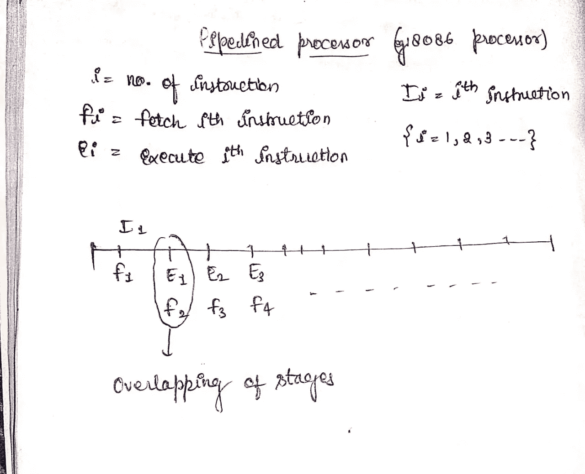

# 流水线操作——一种简单的方法

> 原文：<https://medium.com/geekculture/pipelining-an-easy-way-583ca48ab3d0?source=collection_archive---------21----------------------->

这是我有史以来的第一篇文章，我选择的主题本身就是一个巨大的主题。我只是在这里介绍了一些基础知识。这是一个很难理解的话题，有些人很难理解。所以通过这个博客，我试着让你更容易理解。希望有帮助。

今天**流水线**是处理器仍在改进的最大原因，在与紧凑架构保持一致的同时变得更快。

但是在开始这个话题之前，让我们先讨论一下其他一些有助于处理器快速计算能力的原因。

## **1。增加数据总线的大小:**

数据总线帮助处理器从存储器获取指令和数据。总线是处理器最好的朋友，有助于各种发送和接收数据。这是公共汽车的介绍部分。现在回到主题，数据总线如何帮助处理器变得更快？
你知道数据总线将数据从主板的其他组件传送到处理器。数据总线的大小控制着可以从存储器中读取的位数。现在，如果我们增加数据总线的尺寸会怎么样？我们可以一次获得更多的指令，从而加快处理速度。但目前，我们使用的是自 20 世纪 90 年代以来的相同尺寸的公交车。早在 1993 年，当奔腾首次发布 64 位数据总线时，它仍然没有改变。如果数据总线是增加处理能力的唯一原因，计算机应该一直以一种速度工作到现在。所以，它不再是数据总线了。概念结束了。

现在你们中的很多人会想为什么我们不增加公交车的尺寸。原因是继 64 位数据总线之后，下一个选择将是 128 位数据总线，这将增加如此多的数据线，主板将无法构建。但是今天，我们不仅希望计算机速度快，我们还希望它体积小。牢记这一点，他们至少在未来的一段时间内将 64 位作为标准尺寸。

## **2。增加时钟频率:**

> **时钟是干什么的？**
> 每一个时钟脉冲和每一个时钟脉冲都是一个触发器，促使处理器改变它的状态，做一些新的事情和再做一些新的事情。因此，提高时钟频率意味着让您的处理器工作得更快。

时钟频率越高，处理器越快。
最初推出的处理器频率为 3MHz，之后是 16 MHz，然后奔腾推出了 66 至 100MHz 的处理器，2000 年发布的奔腾 4 采用 1.4GHz 时钟频率处理器。从 20 世纪 70 年代到 2000 年代，3MHz 变成了 1.4GHz，然后在 2004 年发布的处理器具有 2.8GHz、3.2GHz 的时钟频率。

自过去 20 年以来，频率几乎相同。甚至今天我们工作在 2.8、3.2GHz。现在，即使是高端处理器也停止了提高时钟速度。专用超频器可以通过液氮冷却系统迫使最好的硅达到 9 GHz 左右，但对大多数用户来说，5 GHz 是一个尚未超过的极限。

因此，如果时钟频率是唯一的原因，那么让处理器更强大将只是一个梦想。尽管如此，处理器仍然变得更快。

如果你想知道为什么我们不能通过增加时钟频率来提高处理器的速度，请告诉我，我会用同样简单的语言写另一篇博客。

所以，让处理器更快不仅仅是这些基本原因，还有其他因素。但是让你的处理器如此快速的最大贡献者是流水线技术。

## 什么是流水线？

流水线简单地意味着在处理器中多个指令的不同阶段的重叠。这种说法会让一些人感到困惑，所以让我们简单点。
阶段只是指完成一个过程所采取的步骤。完成一个流程的三个重要阶段是:
1。从存储器中取出指令。
2。解码控制单元(CU)中的指令。
(解码意味着理解二进制模式)
3 .执行 ALU(算术逻辑单元)中的指令。

这是非流水线处理器的工作方式，它使用总线从内存中获取指令，然后开始解码，接着在总线空闲时执行指令。

在流水线技术出现之前，处理器在给定的时间点执行一条指令。获取和执行一条指令所需的时间称为指令周期。所以，更专业的说法是非流水线处理器每个周期完成一条指令。

Non-pipelined processor works at one instruction at a time

然后有人想到，我们可以做得更好，在非流水线处理器中，如果你分析，有一个存储器和一个处理器，现在要从存储器中获取指令，你需要总线，指令将通过数据总线被获取到处理器中。一旦指令被取出，它们就在处理器中被执行，现在当处理器执行指令时，总线在做什么，没有什么是空闲的。因此，他们意识到，当处理器执行第一条指令时，可以使用总线来获取下一条指令。

During executing first instruction fetch the second instruction

那么这样做有什么好处呢？
处理器执行完第一条指令后，会立即开始执行第二条指令，执行第二条指令会获取第三条指令，执行第三条指令会获取第四条指令，如此循环，直到所有的流程都执行完毕。通过重叠，我们将时间减少到非流水线处理器所用时间的一半。它不再浪费取指令的时间，这并不意味着取指令没有发生，它与前一条指令的执行同时发生，它没有占用额外的时间。

这被称为两级流水线，这里我们采用不同指令的两个阶段，即第一条指令的执行阶段和下一条指令的提取阶段，并将它们重叠。
这只是流水线操作的基础，但如果你想了解更多，这是流水线操作更高阶段的坚实基础。

微处理器 8086 使用 2 级流水线，在 80386 微处理器中发生了最大的变化，他们意识到他们可以做得更好，而不是仅仅重叠 2 级，他们使处理器重叠 3 级，形成 3 级流水线处理器，然后是 4 级流水线，5 级流水线，继续计数。我可以告诉你，Netburst Pentium 4 体系结构发布时是一个 20 级管道，这意味着 20 条指令同时执行，这可能会让你大吃一惊。说真的哇，这个概念多美好啊，是不是很神奇。
这意味着流水线阶段数量的增加会增加同时执行的指令数量。

流水线操作达到了另一个层次，这就是通过以最勤奋的方式使用处理器的资源来使处理器更快，从而在系统中的任何地方都没有空闲跨度。时钟频率和数据总线也起了很大作用，但是流水线的概念非常棒。

关于流水线还有很多要学的，这个博客只包含了基本的概念，以便理解什么是流水线，以及它是如何帮助处理器提高其计算能力的。所以如果有人想了解更多，请通过评论让我知道，我很乐意帮忙。

保持饥饿，保持愚蠢。