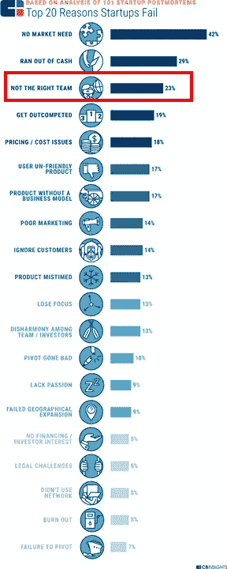
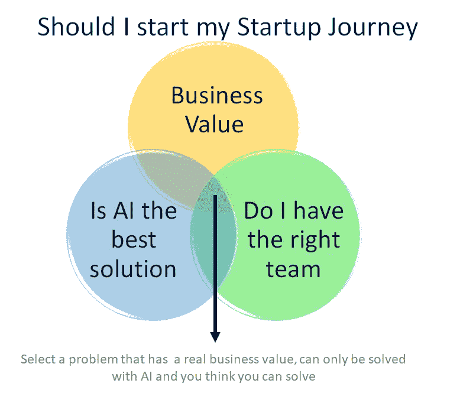

# 创建人工智能创业公司时要避免的陷阱

> 原文：<https://medium.com/geekculture/pitfalls-to-avoid-when-building-an-ai-artificial-intelligence-startup-b71bef6899f2?source=collection_archive---------60----------------------->

[Dancing Bot PixaBay](https://pixabay.com/images/id-151516/)

毫无疑问，AI 对创业公司来说是一个巨大的机会，几乎每个行业的每个公司都需要实施 AI。然而，启动人工智能创业公司会遇到一系列独特的困难，这使其极具挑战性。

很多创业公司声称使用 AI，但实际上他们使用的是外包的人类劳动或基本的统计技术。[总部位于伦敦的 MMC Ventures](https://www.theverge.com/2019/3/5/18251326/ai-startups-europe-fake-40-percent-mmc-report) 的一项研究发现，40%的所谓人工智能初创公司实际上并不使用人工智能。就本文而言，人工智能初创公司是指没有先进的机器学习技术就无法存在的公司(deci.ai)，而其他人工智能初创公司则可以在不完全依赖人工智能的情况下存在(网飞)。

在你开始漫长的创业之旅之前，你应该根据以下四个因素来检验你的想法:

1.你有正确的数据吗？
2。你解决的是客户愿意花钱买的东西吗？
3。你有合适的团队吗？
4。你能解释一下你的模型吗？

# 1.数据，有人吗？

好的。听起来显而易见，但在围绕人工智能构建服务时，获取专有数据至关重要。不要建立一个分析公共数据集的业务。使用专有数据会让你的公司更有竞争力，对投资者更有吸引力。很难将一家初创公司与更成熟的竞争对手区分开来，尤其是当他们都在使用类似的数据时。

数据产生了一个有趣的先有鸡还是先有蛋的问题。没有客户，你就没有数据，也就无法训练你的算法。没有算法，你就不能为你的客户创造多少价值。所以你很可能无法从潜在客户那里获得有价值的数据。
获取数据的主要方式是与大数据持有者合作，以获取他们的数据。这就是绝大多数 AI 创业公司都是 B2B 的原因。大型机构和公司往往相当迟缓，所以这通常需要一些时间。允许另一家公司访问他们的数据很可能会有道德或商业上的顾虑，从而使这个过程变得漫长而繁琐。总的来说，公司越来越意识到他们数据的价值，并且不愿意允许访问这些数据。
另一个选择是创建一个收集数据的免费应用程序。然而，这可能是一个昂贵而漫长的过程(需要建立一个创业公司来收集数据)

# 2.测试你的市场适合度

和几乎所有的创业公司一样，这里也是一样:如果你没有成功地解决客户愿意付钱给你的问题，你就没有创业公司。

投资者对那些在解决特定工作流程和他们可以理解的问题的领域开发定制人工智能解决方案的初创公司感兴趣，例如管理销售渠道、对话式人工智能或机器人。他们需要能够立即掌握服务的价值和货币化。解释不了，就卖不出去。

你可能有算法来缩短交通 10 倍或减少碳排放的秘密采矿。但是，如果解决方案要求人们改变他们的行为或像预编程的机器人一样行事，它将永远不会被采用。您的客户有特定的做事方式。你的产品需要符合这个工作流程。

假设你已经发现了一个值得解决的问题，那么问题就变成了:人工智能对于解决问题是必不可少的吗？在这一点上，如果你正在使用真实的人类或其他方式来测试你的问题，停下来问自己以下问题:“我的问题是什么让人工智能成为最佳甚至唯一的解决方案？”

你可以通过使用[精益创业方法](http://theleanstartup.com/principles)来测试你是否能找到愿意为你的解决方案买单的人。人工智能的一个好处是，使用真人或者用现有组件的组合构建一个 MVP 原型来创建一个简单版本的解决方案是相当容易的。
通常，现有的人工智能服务(例如，来自谷歌/亚马逊/微软)、对现有模型的调整、现有的非人工智能统计工具和一些手动任务的组合可以形成一个原型，模拟你设想的解决方案。通过这种方式，您可以在致力于构建完整的人工智能服务之前进行产品解决方案测试。

# 3.和合适的人在一起

选择你的团队，要么可以把你举向天空，要么把你引向深渊。考虑在关键岗位上聘用那些对你的愿景抱有同样热情的人，更重要的是，他们对你想要的公司文化有所了解。引入外部主题专家或人工智能顾问来帮助你的团队——这将帮助你更好地理解价值主张是否有意义。
根据 CB Insights2019 年[对 101 家失败创业公司的调查，风险投资失败的第三个原因是“没有合适的团队”因此，难怪投资者希望首先相信人民。](https://www.cbinsights.com/research/startup-failure-reasons-top/)

CB INSIGHTS

# 4.可解释性是关键

即使你有专有的数据集和出色的算法，也不一定意味着你的产品会大受欢迎。如果你正在启动一家人工智能初创公司，你(希望)了解人工智能和机器学习。然而，普通人并不熟悉这些话题，可能会怀疑它们的潜力。你需要令人信服的证据证明你的模型运行良好。现场演示可能有效，但如果不可行，请尝试使用特定的、精选的 KPI，而不是高精度数字(混淆矩阵)。
解释模型预测的能力增加了对模型的信心。解释模型中每个预测的能力通常和准确性一样重要。可解释性是一个很大的话题，但是一般来说，你的解释越“像人类”越好。
初创公司必须会说技术和商业语言。[哈佛商业评论分析](https://hbr.org/2017/11/can-you-be-a-great-leader-without-technical-expertise)发现，最有可能成功的初创公司拥有雇佣商务人士的科技创始人。

# 第一次你不会做对的。

考虑到所有的挑战，一家初创公司可能会经历几个转折点。如果你从一个问题开始，并对许多不同的解决方案持开放态度，你将从市场中学习，并找到最佳的解决方案来建立你的业务。如果你花六个月的时间来研究和选择正确的问题，你将会为自己节省六年的时间来尝试围绕一个有缺陷的想法建立一个企业。

人工智能初创公司通常比 SaaS 初创公司需要更长的时间才能起步。AI 算法依赖于数据，而大数据的拥有者通常是大公司，获取他们的数据非常耗时。即使你可以访问数据，你也需要不仅关注业务发展和你的软件平台，还要关注你的人工智能算法。这就是为什么拥有一个主题专家和人工智能专家团队对初创公司的成功至关重要。

**来源:**

[https://www . Forbes . com/sites/tomtaulli/2020/08/08/how-to-create-an-ai-artificial-intelligence-startup/？sh=47bb641e19a4](https://www.forbes.com/sites/tomtaulli/2020/08/08/how-to-create-an-ai-artificial-intelligence-startup/?sh=47bb641e19a4)

[https://medium . com/swlh/three-critical-lessons-for-launch-an-ai-startup-976 D1 d 44 f 370](/swlh/three-crucial-lessons-for-launching-an-ai-startup-976d1d44f370)

[https://thoughtbot . com/blog/how-to-build-an-ai-startup-and-do-you-really-need to # test-your-problem-solution-fit](https://thoughtbot.com/blog/how-to-build-an-ai-startup-and-do-you-really-need-to#test-your-problem-solution-fit)

[https://HBR . org/2017/11/没有技术专长的你能成为伟大的领导者吗](https://hbr.org/2017/11/can-you-be-a-great-leader-without-technical-expertise)

[www . CB insights . com % 2f research % 2f startup-failure-reasons-top % 2F](https://www.cbinsights.com/research/startup-failure-reasons-top/)