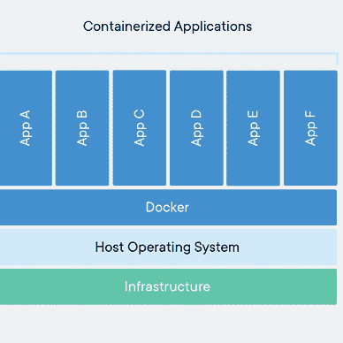

# Pod 安全准入控制器—名称空间级别

> 原文：<https://medium.com/geekculture/pod-security-admission-controller-namespace-level-52158281d918?source=collection_archive---------2----------------------->

## 如何在命名空间级别应用 pod 安全性概述


Photo by [Alina Grubnyak](https://unsplash.com/@alinnnaaaa?utm_source=medium&utm_medium=referral) on [Unsplash](https://unsplash.com?utm_source=medium&utm_medium=referral)

## 准入控制器

一个 [***准入控制器***](https://faun.pub/kubernetes-admission-controller-2913a5b3d0c1) 是一段代码，它在对象持久化之前，但是在请求被认证和授权之后，拦截对 Kubernetes API 服务器的请求。
了解更多— [**入院控制器**](https://faun.pub/kubernetes-admission-controller-2913a5b3d0c1)

## Pod 安全策略→ Pod 安全准入控制器

之前有 **PodSecurityPolicy (PSP)** 但是从 Kubernetes v1.21 开始， **PodSecurityPolicy** 被[弃用](https://kubernetes.io/blog/2021/04/08/kubernetes-1-21-release-announcement/#podsecuritypolicy-deprecation)并且**在 **v1.25** 中从 Kubernetes 中移除**。

**从 1.23 版开始→** 默认启用 PodSecurity 准入功能。1.23 版之前的
**→**需要手动启用 PodSecuirty 许可。

## Pod 安全准入控制器相对于 Pod 安全策略准入控制器的优势

PSP 的一个问题是很难在粒度级别上申请限制性权限，因此不可避免地增加了安全风险。当创建 pod 的请求被提交到集群时，PSP 被应用，没有办法将 PSP 应用到已经在集群中运行的 pod。

我们可以使用 Pod 安全准入控制器来代替 PSP 准入控制器。它可以应用于命名空间级别，也可以应用于集群级别。

Pod 安全准入控制器使用 Pod 安全标准，可假设为三种精确预定义的 Pod 安全策略(*特权、基线、*和*受限*)。

在下一节中，我们将讨论如何通过利用 pod 安全准入控制器在名称空间级别上应用 pod 安全标准。

## 在命名空间级别应用 Pod 安全性

正如我们已经讨论过的，我们可以在名称空间级别应用 pod 安全性。为此，我们必须在名称空间定义中添加一些标签，以便一个名称空间能够响应我们的需求。以下是将附加到我们的名称空间的标签。

```
# Mandatory
pod-security.kubernetes.io/**<MODE>**: **<LEVEL>** # Optional     
pod-security.kubernetes.io/**<MODE>**-version: **<VERSION>**
```

为了在特定的名称空间上启用 pod 安全效果，我们可以附加两个标签。一个是强制的，另一个是可选的。

在上面的标签中，有几个占位符。如— `**<MODE>**` **、** `**<LEVEL>**` 和 `**<VERSION>**` **。**接下来，我们将讨论应该放置什么来代替这些占位符。

## pod 安全标准

`**LEVEL :**` 代替`**<LEVEL>**`，我们必须定义 **pod 安全标准之一**。目前，有三种 pod 安全标准可用。

> ***●特权级—*** *无限制策略，提供尽可能广泛的权限级别。*
> 
> ***●基线—*** *防止已知权限升级的最低限制性策略。有一个* [*综合列表*](https://kubernetes.io/docs/concepts/security/pod-security-standards/#baseline) *列出了应该实施或禁止的控制。例如，如果我们想要在标记为名称空间的基线中创建一个 pod，那么必须禁止特权 pod。*
> 
> ***●受限—*** *严格受限策略，该策略的主要目的是遵循当前的 pod 强化最佳实践。类似于基线标准，有一个* [*控制列表*](https://kubernetes.io/docs/concepts/security/pod-security-standards/#restricted) *应该被强制或禁止。例如，任何容器都不能有根用户权限。容器必须以非根用户身份运行。*

## 准入控制模式

如前所述，Kubernetes**[**Pod 安全标准**](https://kubernetes.io/docs/concepts/security/pod-security-standards/) 为 Pod 定义了不同的隔离级别。这些标准让我们定义如何以一种清晰、一致的方式限制 pod 的行为。**

**Kubernetes 提供了一个内置的 *Pod 安全*准入控制器来执行 Pod 安全标准。我们可以配置名称空间来定义我们希望在每个名称空间中用于 pod 安全性的准入控制`**MODE**`。目前，有三种模式可用。讨论如下—**

> *****● enforce —*** *违反政策将导致 pod 被拒绝。***
> 
> *****●审计—*** *违反策略会触发向* [*审计日志*](https://kubernetes.io/docs/tasks/debug/debug-cluster/audit/) *中记录的事件添加审计注释，但在其他情况下是允许的。***
> 
> *****●警告—*** *违反策略将触发面向用户的警告，但在其他情况下是允许的。***

**`**VERSION :**` 版本必须是有效的 Kubernetes 次要版本，或“最新”版本。此标签将 Pod 安全策略的版本固定为定义的版本。**

## **游戏攻略**

**创建一个名为 *baseline-ns-1* 的新命名空间，并用以下标签对其进行标记:**

```
**$** kubectl create ns baseline-ns-1**# Add labels****$** kubectl label ns baseline-ns-1 \
> pod-security.kubernetes.io/enforce=baseline \
> pod-security.kubernetes.io/enforce-version=v1.25
```

**创建命名空间并应用标签后，pod 清单文件如下所示:**

```
apiVersion: v1
kind: Namespace
metadata:
  creationTimestamp: "2022-11-08T09:26:17Z"
 **labels:**
    kubernetes.io/metadata.name: baseline-ns-1
 **pod-security.kubernetes.io/enforce: baseline
    pod-security.kubernetes.io/enforce-version: v1.25**
 **name: baseline-ns-1**
  resourceVersion: "4779"
  uid: 2a8708f3-6f25-4cfb-84c1-ef6c825e23c5
spec:
  finalizers:
  - kubernetes
status:
  phase: Active
```

**由于我们贴有“**强制**模式”和“**基线**pod 安全标准”的标签，如果一个 pod 不符合“**基线**标准，它将被拒绝。让我们使用以下 pod 清单在 *baseline-ns-1* 名称空间中创建一个 pod:**

```
# pod-1.yamlapiVersion: v1
kind: Pod
metadata:
  labels:
    run: pod-1
  name: pod-1
  namespace: baseline-ns-1
spec:
  containers:
  - image: nginx
    name: pod-1
 **securityContext:
       privileged: true**
```

**在应用上述 pod 清单创建 pod 后，将发出以下命令:**

```
Error from server (Forbidden): error when creating "pod-1.yaml": **pods "pod-1" is forbidden: violates PodSecurity "baseline:v1.25": privileged (container "pod-1" must not set securityContext.privileged=true)**
```

**出现错误是因为在 pod 定义中我们定义了一个**security context . privileged = true**。这违反了*基线-ns-1* 名称空间的 *Pod 安全性*标准。**

**现在，有两种方法可以将我们的 pod 部署到 *baseline-ns-1* 名称空间中。要么我们必须将名称空间标签修改为“ **warn** 或“ **audit** ”，要么我们可以从 pod 清单中删除***特权*** 权限。**

**让我们将 pod 安全准入控制器模式更改为“**警告**，而不是“**强制**”**

```
apiVersion: v1
kind: Namespace
metadata:
  creationTimestamp: "2022-11-08T09:26:17Z"
labels:
    kubernetes.io/metadata.name: baseline-ns-1
    pod-security.kubernetes.io/**warn**: baselinepod-security.kubernetes.io/**warn**-version: v1.25
  name: baseline-ns-1
  resourceVersion: "4779"
  uid: 2a8708f3-6f25-4cfb-84c1-ef6c825e23c5
spec:
  finalizers:
  - kubernetes
status:
  phase: Active
```

**然后应用相同的 pod 清单文件在 *baseline-ns-1* 名称空间上创建一个 pod。应用 pod 清单后，将会创建 pod，但由于 pod 清单仍然违反 pod 安全标准，将会出现如下警告消息:**

```
**Warning:** *would violate PodSecurity "baseline:v1.25": privileged* (container "pod-1" must not set securityContext.privileged=true)
pod/pod-1 created
```

## **同时应用多个 Pod 安全标准:**

**如果需要，我们可以使用多个 pod 安全标准和一个名称空间。下面是一个名为***baseline-ns-2****的名称空间的例子，它标有不同的 pod 安全标准组合。使用以下清单创建新的命名空间:***

```
*apiVersion: v1
kind: Namespace
metadata:
  name: baseline-ns-2
  labels:
   # ***baseline*** Standard with ***enforce*** Mode     pod-security.kubernetes.io/enforce: baseline
    pod-security.kubernetes.io/enforce-version: v1.25 # ***restricted*** Standard with ***warn*** Mode pod-security.kubernetes.io/warn: restricted
    pod-security.kubernetes.io/warn-version: v1.25*
```

***上面定义的清单定义了一个名称空间***baseline-ns-2****，它将****

****●阻止任何不满足`baseline`策略要求的 pod。****

****●为任何不符合`restricted`策略要求的已创建 pod 生成面向用户的警告。****

****●将`baseline`和`restricted`策略的版本固定为 v1.25****

******具有 root 权限的容器:**下面是一个具有 ***nginx*** 容器的 pod 的清单，它将作为 Root 用户运行。让我们使用下面的清单创建一个 pod，看看***baseline-ns-2***名称空间的 pod 安全标准是如何反应的。****

```
**# pod-2.yamlapiVersion: v1
kind: Pod
metadata:
  name: pod-2
  namespace: baseline-ns-2
spec:
  containers:
  - name: pod-2
    image: nginx
 **securityContext:
      runAsUser: 0****
```

****应用上述清单后，将创建一个新的 pod，因为它不违反**基线**标准，但它违反**限制**标准。尽管它违反了**受限**标准，还是创建了一个 pod。为什么？因为受限标准处于警告模式。这就是为什么它会在 pod 创建过程中抛出警告消息。警告消息应该是这样的:****

```
****Warning:** would violate PodSecurity "restricted:v1.25": allowPrivilegeEscalation != false (container "pod-2" must set securityContext.allowPrivilegeEscalation=false), unrestricted capabilities (container "pod-2" must set securityContext.capabilities.drop=["ALL"]), **runAsNonRoot != true (pod or container "pod-2" must set securityContext.runAsNonRoot=true**), runAsUser=0 (container "pod-2" must not set runAsUser=0), seccompProfile (pod or container "pod-2" must set securityContext.seccompProfile.type to "RuntimeDefault" or "Localhost")**
```

****在下一篇文章中，我们将讨论如何在集群级别实施 pod 安全标准。****

******接下来:** [**Pod 安全准入控制器—集群级**](/faun/pod-security-admission-controller-cluster-level-bda83b80d916)****

> *****如果你觉得这篇文章很有帮助，请点击* ***跟随*** *👉* *和* ***拍手*** *👏* *按钮帮助我写更多这样的文章。
> 谢谢🖤*****

## ****👉所有关于 Linux 的文章****

****

[Md 沙米姆](/@shamimice03?source=post_page-----52158281d918--------------------------------)**** 

## ****所有关于 Linux 的文章****

****[View list](/@shamimice03/list/all-articles-on-linux-1339e15e3304?source=post_page-----52158281d918--------------------------------)********12 stories****************************

## ****👉关于 Kubernetes 的所有文章****

****

[Md 沙米姆](/@shamimice03?source=post_page-----52158281d918--------------------------------)**** 

## ****关于 Kubernetes 的所有文章****

****[View list](/@shamimice03/list/all-articles-on-kubernetes-7ae1a0f96f3b?source=post_page-----52158281d918--------------------------------)********24 stories****************************

## ****👉所有关于头盔的文章****

****

[Md 沙米姆](/@shamimice03?source=post_page-----52158281d918--------------------------------)**** 

## ****HelmーSeries****

****[View list](/@shamimice03/list/helmseries-6e2076d48ba8?source=post_page-----52158281d918--------------------------------)********11 stories****************************