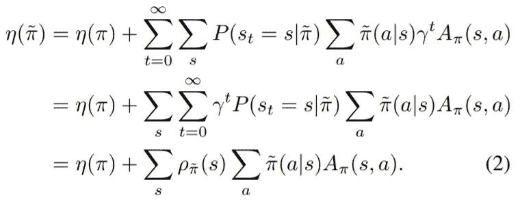
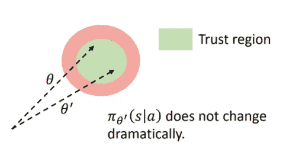
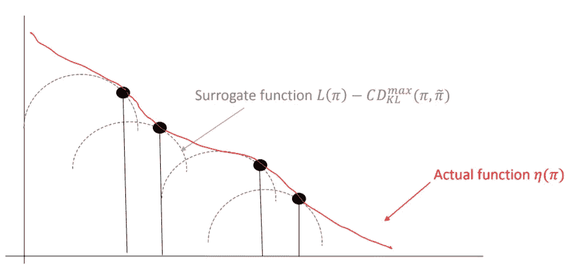
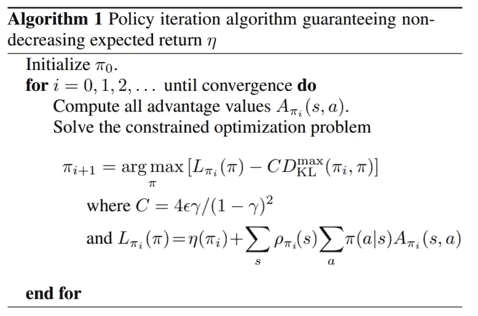
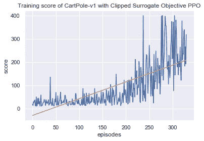
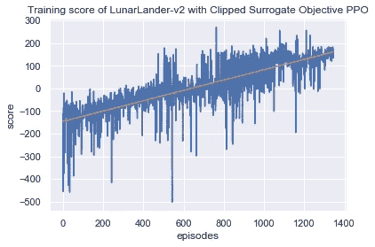

# 政策优化:TRPO/PPO

> 原文：<https://medium.com/geekculture/policy-optimizations-trpo-ppo-cf9479407df1?source=collection_archive---------12----------------------->

在这篇文章中，我将从论文[信任区域策略优化(舒尔曼等人，2015)](https://arxiv.org/pdf/1502.05477.pdf) 和[邻近策略优化算法(舒尔曼等人，2017)](https://arxiv.org/pdf/1707.06347.pdf) 中讨论策略优化方法。然后，我将简要介绍信赖域策略优化方法，并实现两种类型的近似策略优化方法:对代理目标的自适应 KL (Kullback-Leibler)惩罚和裁剪代理目标。

# **简介**

在传统的策略梯度方法中，我们采样状态、动作和奖励的轨迹，然后使用采样轨迹更新策略。虽然这种方法很好，并且解决了基本的控制问题，但是该算法往往不稳定，并且在解决环境问题时不一致。一个问题是，当我们更新策略时，近似策略分布的输入和输出的分布将改变，导致不稳定性。

另一个问题是，当执行梯度上升时，我们不能保证策略在正确的方向上更新。优势函数是随机初始化的，因此根据优势更新策略会导致性能下降，而不是提高。对此的解决方案将是在旧策略和新策略之间创建某种安全距离，使得更新策略将保证单调改进而不发散。

# 信任区域策略优化

让我们从 TRPO 论文中引入信任区域的概念开始。

Trust Region Policy Optimization (Schulman et al. 2015)

这里，我们有 *η，*遵循策略 *π的预期贴现收益。*我们可以在以下等式中使用该预期贴现回报，该等式根据相对于另一项政策的优势来表达一项政策的预期贴现回报[(Kakade&Langford 2002)](https://people.eecs.berkeley.edu/~pabbeel/cs287-fa09/readings/KakadeLangford-icml2002.pdf):

Trust Region Policy Optimization (Schulman et al. 2015)

我们使用优势函数 *A* 的标准定义，其中 *A(s，a)= Q(s，a)- V(s)，*其中 *Q* 是在状态 *s* 中采取行动 A 的值， *V* 是状态 s 的值。该恒等式通过计算π分布下的优势，同时从π'策略中采样，来计算选择策略π'相对于π的优势。然后，我们将这个身份重写为状态和动作的总和，而不是时间步长:

Trust Region Policy Optimization (Schulman et al. 2015)

在最后一行中，我们将 *ρ_π(s)* 定义为在策略 *π* 下状态 s 的贴现访问频率，因此我们可以去掉时间步长。从这个等式可以看出，只要优势对于所有状态 *s* 都是非负的，那么从π→π’更新策略将保证非负的改善。然后，该论文介绍了该恒等式的局部近似:

Trust Region Policy Optimization (Schulman et al. 2015)

我们使用旧策略的分布，而不是从新策略中采样状态转换。这是因为计算新政策的折扣访问频率太复杂，因为您需要在新政策上再次模拟收集的轨迹。通过这种近似，我们可以在更新策略之前简单地使用收集的轨迹。

既然这是局部近似，这并不意味着 *L* 可以全局近似 *η* 。本文推导出一个近似精确的下界或信赖域，这样我们就知道在近似可行的情况下，我们可以向新政策迈出多大的一步。

Taken from UWaterloo CS885 Lecture 15a

Kakade 和 Langford 推导出下限如下:

Trust Region Policy Optimization (Schulman et al. 2015)

罚函数使用函数 D_KL，它是π和π'之间的 Kullback-Leibler 散度，用于测量任意变量 *x* 的两个分布之间的距离。这是局部近似值的视觉效果:

Taken from UWaterloo CS885 Lecture 15a

现在，利用我们的代理函数和信赖域下界，我们可以提出一个保证非递减预期收益η的算法:

Trust Region Policy Optimization (Schulman et al. 2015)

我们知道，这个算法通过查看具有导出的下限的代理目标来保证改进。如果我们改进右边的代理函数，这意味着我们改进了预期收益η。在这里，我们在每次迭代中最大化代理目标，所以我们知道新政策的代理目标至少是一样好的，所以预期的贴现回报将有非负的改善。

TRPO 论文随后提出了一种在我们参数化策略π时实现该算法的更实用的方法。如果我们使用算法 1 中提出的惩罚常数 C，更新步骤将非常小。相反，我们将最大化没有惩罚的代理目标，这是补偿局部近似的导出的下限，并且在新旧策略之间的 KL 差异上使用信任区域约束。

Trust Region Policy Optimization (Schulman et al. 2015)

在实践中，保证 KL 散度在每个可能的状态下都遵循约束是不切实际的，因此，我们使用一种近似，只要平均 KL 散度在约束内，它就是好的。接下来，让我们尝试重写代理目标函数。回想一下，这是我们当前试图解决的优化问题:

Trust Region Policy Optimization (Schulman et al. 2015)

首先，我们可以通过使用一个无穷几何序列(1/1-γ)从状态分布和状态访问频率中采样的期望来消除状态的求和。然后，我们用不改变目标的 Q 函数代替优势函数，因为唯一的差别是常数。最后，我们可以通过从动作分布中抽样并使用重要性抽样来消除动作的总和。现在我们有以下目标:

Trust Region Policy Optimization (Schulman et al. 2015)

TRPO 论文使用这个目标和一个 Q 函数来代替，并提出了一个实用的算法来解决每次迭代中的约束问题。我不会详细介绍 TRPO 算法，因为与它的继任者 PPO 相比，它的计算量太大，太复杂。

# 最近策略优化

现在，有了 TRPO 的背景知识，我们可以讨论 PPO 论文中提出的修改，这些修改简化了 TRPO 中的约束优化问题，该问题解决起来可能很复杂且计算量很大。回顾 TRPO 试图最大化的目标:

Proximal Policy Optimization Algorithms (Schulman et al. 2017)

这里，我们只是将 *rₜ(θ)* 定义为新旧政策之间的重要抽样比。PPO 论文提出了一种新的目标:截断替代目标。

Proximal Policy Optimization Algorithms (Schulman et al. 2017)

如果没有约束，代理目标可能会被夸大。然而，我们没有对替代目标使用约束，而是将新旧政策之间的比率限制在[1 - ϵ，1 + ϵ]的范围内，ϵ作为超参数常数，指示比率可以偏离 1 多远。然后，我们取削波和未削波目标之间的最小值。直观地说，我们可以这样看待这个剪辑:

如果优势为正，我们希望比率大于 1，因为我们希望新策略更频繁地出现。然后，剪辑会将比率限制在 1 + ϵ以下，以便新政策不会偏离旧政策太远。如果优势是负的，我们希望比率小于 1，因为我们希望新策略发生的频率更低。该剪辑将确保该比率超过 1 - ϵ，因此新政策不会偏离旧政策太远。

本文提出的另一种方法是采用自适应 KL 罚函数。回想一下本地近似值与真实预期贴现回报的偏差的导出下限。像在 TRPO 中一样，我们将对代理目标使用惩罚。然而，我们使用超参数常数β，而不是使用导致小更新的计算常数 C。这是带有惩罚的替代目标:

Proximal Policy Optimization Algorithms (Schulman et al. 2017)

由于很难选择一个包含所有情况的β，我们可以使用一个自适应惩罚来代替。在几个时期的策略更新之后，我们在以下条件下改变β常数(假设 d =新旧策略之间的 KL 散度):

Proximal Policy Optimization Algorithms (Schulman et al. 2017)

我们选择了新老政策的一个目标。如果 KL 偏离低于我们的目标，我们可以减少对替代目标的惩罚。如果 KL 偏离超过我们的目标，我们将增加对替代目标的惩罚。

使用截取的替代目标或具有自适应 KL 惩罚的目标，我们可以在实践中对目标进行更多的修改。如果我们使用在演员和评论家之间共享其参数的神经网络结构，因为我们需要评论家来估计优势，我们可以向目标函数添加两个以上的项。

Proximal Policy Optimization Algorithms (Schulman et al. 2017)

在这里，替代目标使用剪切目标，尽管它也与自适应 KL 惩罚一起工作。我们为价值函数损失(通常为均方误差损失)设定了权重 c1，为熵红利 s 设定了权重 c2。将所有因素放在一起，我们就有了采用行动者-批评家结构的 PPO 算法:

Proximal Policy Optimization Algorithms (Schulman et al. 2017)

# 履行

对于我的实现，我在训练循环中使用了具有共享参数的 Actor-Critic 结构，用价值网络计算了我的优势估计，并实现了两种优化方法，clipped 和 KL 自适应惩罚。然后，我在 CartPole-v1 和 LunarLander-v2 环境中使用这两种优化方法来训练我的 PPO 代理。这里快速回顾一下这两种环境。

CartPole 是一个经典的控制问题，代理人试图平衡推车上的杆子。该环境有一个具有 4 个变量的连续状态空间，手推车速度/加速度和角速度/加速度，以及一个具有向左或向右推动动作的离散动作空间。代理人每平衡一步都会得到奖励。

LunarLander-v2 是一个火箭轨迹优化问题，其中一个代理人试图将火箭降落在一个表面上。该环境具有 8 个变量的连续状态空间，x 位置、y 位置、水平速度、垂直速度、着陆器方向角、角速度、左腿触地(布尔型)和右腿触地(布尔型)，以及具有动作点火主引擎、左引擎、右引擎和无动作的离散动作空间。代理人因正确着陆在表面上和着陆垫内而受到奖励，因燃料使用而受到惩罚。

对于我的演员-评论家网络，我使用了与 PPO 文件相同的层，具有 64 个单元和 tanh 激活函数的两个隐藏层。下面是我用来训练代理的超参数和实验设置:

*   γ(折扣系数):0.99
*   ϵ(代理剪辑):0.2
*   β(初始 KL 惩罚):1
*   δ(目标 KL 偏差):0.01
*   c1(价值损失重量):0.5
*   c2(熵权):0.01
*   k_epoch(更新中训练时期的数量):40
*   α_θ(演员学习率):0.0003
*   αv(评论家学习率):0.001
*   总训练步骤:300，000
*   最大每集步数:400
*   批量:1600 个

这是有着被削减的替代目标的扁担的训练历史:

该代理能够在 30，000 个步骤中解决环境问题，在 50 次测试运行中的平均回报为 242.26。训练历史看起来有点不稳定，但我怀疑这是因为我没有进行任何类型的超参数搜索。另一个原因可能是因为我计算自己优势的方式。PPO 论文使用广义优势估计(Schulman et al. 2015)来计算优势，但我只是从累积贴现回报中减去了一个学习价值基线。在没有提前停止的情况下再次训练代理后，代理能够通过 100，000 步的训练达到最高平均分 400。

我曾经试图用适应性 KL 惩罚来训练代理，但结果是不一致和不稳定的，尽管它仍然能够解决横竿环境。

接下来，这是 LunarLander 的训练历史和视频，其中包含了替代目标:

代理人被训练了 300，000 步，在 50 次测试中平均奖励 142.4。与横竿环境一样，由于上述因素，训练历史有点不稳定。虽然 142.4 的测试分数不被认为是解决了问题，但 LunarLander 能够平稳地在表面着陆，比随机策略好得多。通过超参数扫描，PPO 试剂应该能够实现超过 200 的求解分数。这是一段特工行动的视频:

LunarLander-v2 trained with PPO

code:[https://github . com/cheng i600/rl stuff/blob/master/Policy % 20 optimization % 20 algorithms/PPO _ discrete . ipynb](https://github.com/chengxi600/RLStuff/blob/master/Policy%20Optimization%20Algorithms/PPO_Discrete.ipynb)

参考资料:

*   [信任区域政策优化(舒尔曼等，2015)](https://arxiv.org/pdf/1502.05477.pdf)
*   [近似策略优化算法(舒尔曼等人，2017)](https://arxiv.org/pdf/1707.06347.pdf)
*   [UWaterloo CS885 讲座 15b](https://cs.uwaterloo.ca/~ppoupart/teaching/cs885-spring18/slides/cs885-lecture15b.pdf)