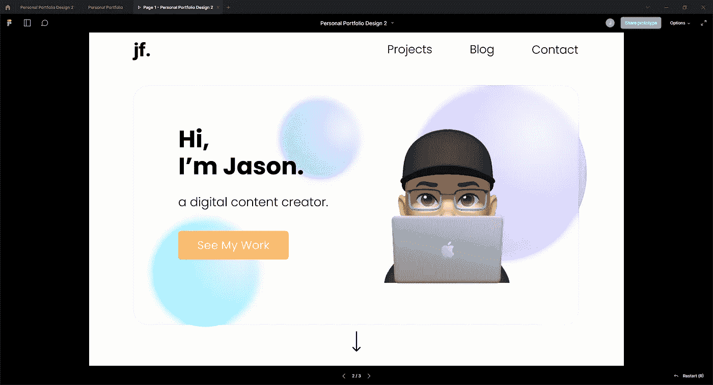

# 投资组合设计返工项目。一

> 原文：<https://medium.com/geekculture/portfolio-design-rework-pt-1-e05cbde384cc?source=collection_archive---------18----------------------->

在我第一次尝试为我的作品集网页创建一个模型后，我对我所创建的整体设计并不满意。我真的不知道为什么我不喜欢它，所以我决定学习一下设计。

我在 Udemy 上的[前端开发](https://www.udemy.com/share/101qYw3@wYzD5g-Bnhchx4iTGbbnFfFA65gbUBIF-I54NrSPRlmboqFkNvBvEQJp3ThVLyAq/)课程有很大一部分是关于 UI/UX 设计的，它给了你一些工具，你可以在设计自己的网站或用户界面时应用。它涵盖了诸如排版，色彩理论以及如何在使用你的界面时管理用户的注意力等主题。

我试图把我从那个模块中学到的东西应用到我自己的设计中。我做的第一件事是对照我学到的设计规则来批判性地检查我的初始设计

Screenshot of my first attempt.

我对最初设计的第一个批评是，它感觉不连贯。感觉我的页面没有任何结构，许多元素似乎相互冲突。虽然页面上没有太多的元素，但那些元素似乎在努力吸引用户的注意力。

我决定让我的设计更吸引人，我需要简化它。

我想简化的第一个地方是我对颜色的使用。色彩是吸引用户注意力的一种非常有效的方式，但是如果你过度使用色彩，你的设计可能会让用户不知所措。我在 Youtube 上看了[这个由未来学院制作的视频](https://www.youtube.com/watch?v=eXcKOqviLE0)，他们详细介绍了如何在设计中有效地使用调色板。

我从这个视频中得到的一个很好的提示是，仅仅因为你有一个调色板并不意味着你需要使用所有的颜色。你应该选择原色、次色和强调色，然后根据比例使用这些颜色。例如，你页面的 60%使用主色，30%使用次色，而强调色只占你设计的最后 10%。

通过使用这一原则，你可以确保你的颜色不会相互冲突，你需要突出的元素会更加突出。

我决定使用更微妙的调色板，并使用 60-30-10 原则。

Colour Palette with ratios.

另一个在颜色方面困扰我的因素是我的个人资料照片。理想情况下，我会选择一张颜色或多或少与页面上其他颜色相配的照片。我当前图片的背景有太多的变化，颜色与调色板的其他颜色冲突。

我决定做一些更简单的事情，暂时使用我 iPhone 上的 memoji 贴纸。

对于未来的版本，我想我会有一个专业的摄影师，这样我就可以在良好的光线下拍出更好的照片。

Updated Portfolio Design

好的设计的一个原则是确保你的设计有一个明确的目的，并且这个目的通过你的设计选择清楚地传达出来。对于我的投资组合页面，我希望用户检查我的工作，然后联系我，如果他们喜欢他们看到的。在网页设计中，这通常被称为行动号召。

以我的作品集为例，我的行动号召是我希望用户点击来查看我的作品的按钮。如果我想抓住用户的注意力，我需要让行动号召从页面的其余部分中脱颖而出。我使用了调色板中对比最强烈的颜色来使按钮弹出。

我的作品集还有很多工作要做，但对我来说，它看起来已经比我最初的尝试好多了。通过简化布局和颜色，我获得了一个更有设计感的外观。

在接下来的文章中，我将继续使用我学到的设计原则来设计我的作品集的其他页面。