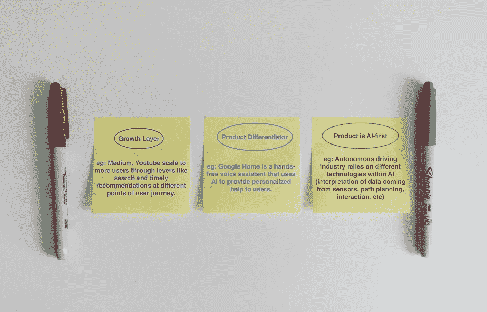
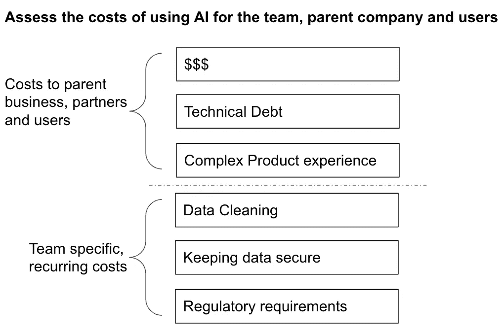
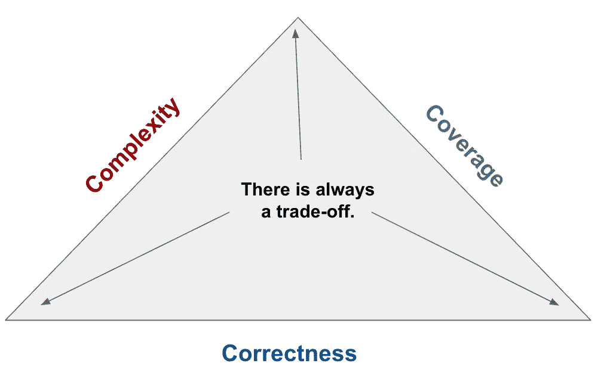

# 产品经理使用人工智能实用指南

> 原文：<https://medium.com/geekculture/practical-guide-for-product-managers-using-ai-ad583fc011a5?source=collection_archive---------23----------------------->

Photo by [Hans-Peter Gauster](https://unsplash.com/@sloppyperfectionist?utm_source=unsplash&utm_medium=referral&utm_content=creditCopyText) on [Unsplash](https://unsplash.com/s/photos/chaos?utm_source=unsplash&utm_medium=referral&utm_content=creditCopyText)

产品管理已经是一个相当模糊的工作，需要多种技能:战略、沟通、影响、执行、增长、数据分析等等。

有一项技能在产品管理中没有得到足够的讨论，但所有产品经理都必须尽早认识到这一点:**使用人工智能**。

> 今天，每个公司都在他们的业务堆栈中使用某种形式的人工智能，作为以下之一:(1)增长层(2)产品差异(3)人工智能优先的产品。

Background Photo by [Kelly Sikkema](https://unsplash.com/@kellysikkema?utm_source=unsplash&utm_medium=referral&utm_content=creditCopyText) on [Unsplash](https://unsplash.com/s/photos/stickies?utm_source=unsplash&utm_medium=referral&utm_content=creditCopyText)

这并不意味着**而不是**产品经理(“pm”)必须与专业的人工智能工程师交换位置，或者去学习人工智能/人工智能的所有技术课程。**项目经理需要主动识别以下内容:**

# **一、有一个学习曲线。提升自己和团队的技能。**

第一篇关于[人工智能的学术论文可以追溯到 20 世纪 50 年代的](https://computerhistory.org/profile/john-mccarthy/?alias=bio&person=john-mccarthy)**，[反向传播的发明可以追溯到 20 世纪 80 年代的](http://www.iro.umontreal.ca/~pift6266/A06/refs/backprop_old.pdf)**。虽然这些理论概念已经存在了很长时间，但在实践中它们仍然是相对“新”的技术。****

****如果你不花时间和精力去努力，就没有赶上进度的捷径。好消息是，你并不孤单，有大量的在线资料可供各种兴趣/技能水平的人参考。****

> ****你提升技能的目标应该是达到这样一个点，当谈到这些概念时，你团队中的每个人都说一种共同的语言。****

****尽管会有专门的 ML 工程师(或整个团队)负责实施，但作为他们的 PM，您希望能够用简单的术语向团队中的其他利益相关者、领导层和您的客户阐明用户问题、业务动机和建议解决方案的利弊。****

****另一件需要注意的事情是，你的用例通常会在 ***服务方*** 上，也就是说，你的团队会应用机器学习而不是设计它。有专注于 ML 的团队正在设计 TensorFlow 或 Pytorch 库。如果是这样的话，你需要更多的机器学习知识。****

# ******二。你是在解决一个真正的用户需求，还是在给你的用户问题强加一个解决方案。******

****在您的团队决定加入 AI/ML 团队之前，请检查以下内容:****

****Q1:这解决了真正的用户需求吗？****

****这应该在你的用户研究或竞争分析中体现出来。在开始执行一个听起来令人兴奋的基于人工智能的解决方案之前，要非常清楚用户的问题以及可能的解决方案。****

****Q2:你的问题有没有非人工智能/人工智能的解决方案？****

****剧透提醒:答案永远是 ***是*** 。****

****需要注意的是，通过基于规则的(“启发式”)方法，这种解决方案的质量通常会更差。至少在原型阶段，大多数基于人工智能的解决方案可以在某种程度上被逆向工程为可解释的方法。****

> ****您可以通过启发式方法尽早降低风险，并确保团队获得正确的 API、指标和评估标准等构建模块。未来的 ML 版本也需要相同的管道。****

******Q3:您是否有足够的数据来实际建模，以及建模的成本。******

****如果您计划获取(例如:用户历史)或购买(例如:金融市场)数据，与之相关的成本是多少。****

****成本的形式可以是$$$、团队的技术债务、将提供数据的负担加在用户身上的新产品体验。****

****还有经常性成本，如(1)数据清理所需的额外时间/投资，(2)以安全可用的方式维护此数据的运营成本，以及(3)满足与此数据相关的国家特定法规要求。****

********

# ******三。你在组织上准备好投资来训练、测试和大规模推出你的模型了吗？******

****既然您知道您的用户可以从该解决方案中受益，并且您的团队对可能性感到兴奋，那么您已经意识到**您不能在孤岛中运营。******

> ****在你的组织中会有其他团队接触产品，影响用户体验，并影响你的团队的投入。****

****请仔细考虑以下事项:****

******1:数据将存放、使用和保护在哪里？******

****任何 ML 系统的收集、标记和培训数据都需要大量的设置和维护工作。在使用数据时，还需要注意隐私、完整性和法律方面的问题。****

****你的工作的一部分是继续成为用户的代言人，推动高的可解释性、完整性和透明度标准。****

******2:你是否有合适的领导支持和人员来持续支持这项工作。******

> ****任何选择的解决方案都将在**覆盖率、正确性和复杂性**之间进行权衡。为您的团队创建正确的框架，以便能够跨这些轴做出决策。****

********

****确保你有不同的观点，不要把其他产品合作伙伴抛在后面。****

****作为团队的产品经理，您为用户和您的组织推行正确解决方案的信心很大程度上依赖于为所有相关的利益相关者提供一个席位:设计和内容、UX 研究、营销以及工程和数据科学。****

****让这些相关的涉众**尽早**参与进来，并让**共享语言**(如上所述)来解决**已确定的用户需求**确保你的团队继续拥有快速的迭代周期和成功的产品。****