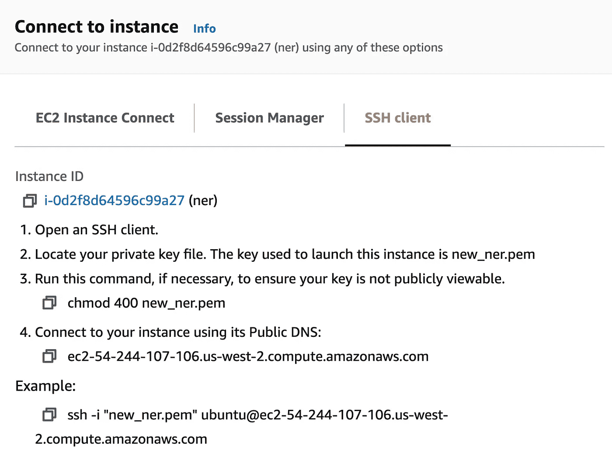
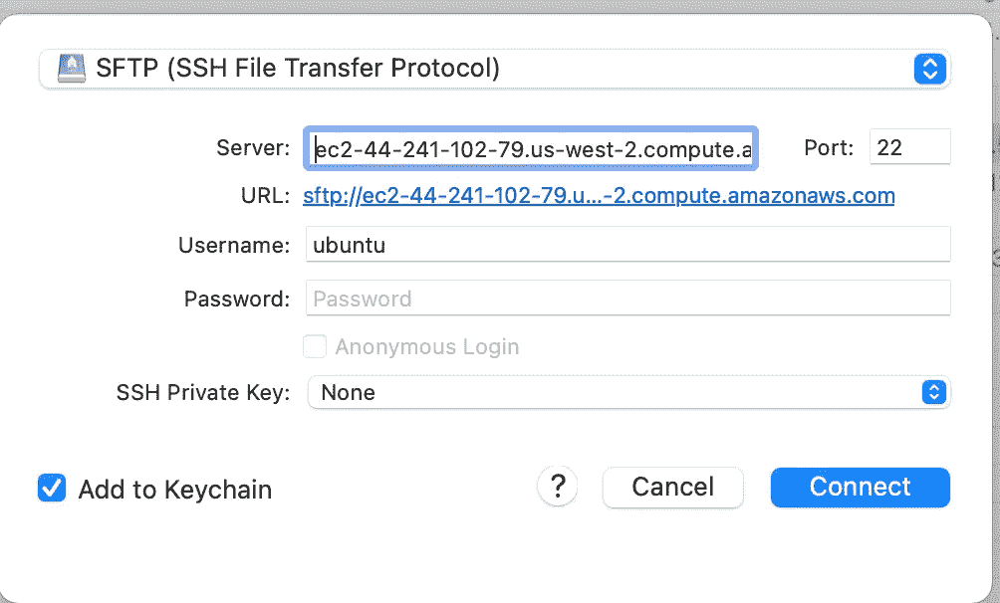

# 语言学习的实用自然语言处理:2A 部分。部署大型语言模型

> 原文：<https://medium.com/geekculture/practical-natural-language-processing-for-language-learning-part-2-b91ae3428448?source=collection_archive---------55----------------------->

## 在 AWS 上部署大型命名实体识别(NER)模型，帮助学生识别专有名词(创建 EC2 实例)

## 文章摘要和快速警告

如果你读了我之前的文章，你就会知道为什么我认为 NER 对语言学习者很重要。简短总结:语言学习者迷失在一篇课文中的一个原因是，他们学习了很多语法和实词(名词/动词)，但他们没有学习专有名词(人名、地名、组织机构、电影片名等)。)在你的本地机器上使用 NER 的[空间语言模型](https://spacy.io/models)很容易，但是我想要一种方式让人们在线访问模型，而不必为自己设置。然而，在互联网上托管 Spacy(免费)被证明是很麻烦的，因为这种模式需要超过 2GB 的内存，而大多数提供托管的网站，如 Heroku 或 Streamlit share，只需 500 MB。如果你想看最终产品，它将在 AWS [这里](http://44.241.102.79/)展出。以下是我们将涵盖的内容列表:

1.  设置 AWS 帐户
2.  创建 EC2 实例
3.  连接到您的实例并准备一个 Ubuntu 服务器
4.  进行内存交换以增加可用内存
5.  将 EC2 实例与一个固定的 IP 地址相关联
6.  设置账单提醒，这样您就不会收到意外的惊喜:)
7.  文章第 2 部分(即将发布):创建一个虚拟环境，创建一个 Flask 应用程序，并使用 wsgi 和 nginx 设置一个生产级服务器

## 首先是一些背景信息

这篇文章的重点是免费在线获得一个超过 2 GB 的语言模型，而不用做任何疯狂的模型修补。我假设观众对 web 开发只有中等程度的了解(像我一样)。我是一名向计算机工作转型的语言学家，所以我对非技术人员在 web 开发中可能遇到的困难有第一手的了解。托管生产级 API 是一个漫长的过程，我将详细讨论我遇到的一些棘手问题，同时还会为您提供一些指南以获取更多信息。如果您熟悉在 AWS 上设置 EC2，您可能想跳过本文的某些部分，或者直接进入本主题的第 2 部分(使用 wsgi 和 nginx 设置生产级服务器)。另一方面，如果你想知道更多细节，请在评论中或 github/LinkedIn 上联系我。

## 如果这很痛苦，我为什么要部署全尺寸模型呢？

在 Heroku 和 Streamlit Sharing 等免费服务上部署一个小模型相对容易，但这些服务通常会将你限制在 500 MB。我使用的型号每个都超过 400 MB，它们还要求您安装 pytorch 或 tensorflow，因此我们至少需要 2 GB 的 RAM 才能运行。有一个强有力的论点是，训练一个较小的模型或使用基于规则的方法比部署一个巨大的模型更有效。尽管如此，NLP 目前的趋势是使用建立在 transformer 架构上的大型预训练语言模型，如 BERT、RoBERTa、XLNet、GPT-2 等。此外，自从 transformer 架构问世以来，已经取得了快速的进步，如果在不久的将来，基于 transformer 的模型的精度和效率没有显著提高，我会感到很惊讶。这些模型很容易使用，可以在 Spacy 和 Hugging Face 等网站上公开获得，你可以在开箱后立即获得出色的性能。我想，一旦我知道如何部署和运行一个更大的模型，我就可以用这个模型在 NER 之外做许多其他的工作。另外，瞎折腾 AWS 也挺好玩的:)

## 什么是 AWS，什么是 Amazon EC2 实例？

亚马逊网络服务是亚马逊提供给开发者的一套应用。重要的是，他们有一个免费层，这样你就可以免费做小规模的工作，但同时，如果你对一个项目很认真，亚马逊会按你的需求扩大规模——但要付费。EC2 代表弹性计算云，是这些免费服务之一。EC2 实例是一个虚拟服务器；也就是一个 web 服务，在云端给你提供一台电脑。基本上，亚马逊有一大堆实际的机器 24/7 运行，他们会根据你的需求卖给你一些计算能力。您可以根据需要使用，并且只为您使用的东西付费，而不是购买自己的机器。最重要的是，我们可能期望的业余爱好项目的有限流量落在他们的免费等级的限制之内。所以，让我们开始吧。

## (1)建立一个亚马逊 AWS 账户

去 aws.amazon.com，点击创建账户。基本上只需按照屏幕上的提示创建一个免费帐户。你需要提供一张信用卡，如果你不遵守规则，你可能需要支付一些费用。但是亚马逊有一个很好的系统来防止令人讨厌的意外……如果你注意的话。记下你在哪个地区开设了账户，这很重要！如果您失去了 EC2 实例的踪迹，请确保您位于 Amazon dashboard 上的正确区域。例如，如果你看下面，我的 EC2 在 USWest2 -Oregon，但是如果我换到另一个地区(例如 US east (N. Virginia)us-east-1)。我看不到我的实例。

This is what your AWS dashboard should look like

## (2)创建一个 EC2 实例(30 GB 内存)

创建帐户并登录后，转到“服务”(见上文)并选择 EC2，您将看到一个橙色的“启动实例”按钮。启动实例的过程有 6 个步骤。以下是每一步要做的事情:

*   第一步:选择亚马逊机器映像(AMI):我们将使用 Ubuntu Server 20.04 LTS (HVM)
*   步骤 2 选择实例类型:选择 t2.micro(符合自由层条件)
*   步骤 3 配置实例细节:使用默认值即可
*   添加存储空间:最大 30GB，即使你不会用光它。
*   添加标签:留空即可
*   步骤 6:安全组:如果你想让其他人访问你的 api，你可以在这里给他们访问权限。按下“添加规则”按钮，添加一个规则，将“类型”更改为“所有流量”，将“来源”更改为“任何地方”。亚马逊会警告你这是有风险的…不要把任何有价值的东西放在服务器上。

新闻评论和发布。Amazon 会提示你做一个 PEM 文件以保证安全。确保将 PEM 文件保存在一个您以后可以找到的地方。启动将需要几分钟时间，但是当您返回到实例仪表板时，您应该会发现一个实例正在运行。您可以在等待时点击“获得估计费用通知”下的链接来创建一个账单提醒，因为…..

提醒一句，亚马逊称免费层“包括每月 750 小时的 Linux、RHEL 或 SLES t2.micro 或 t3.micro 实例，具体视地区而定。”此外，如果您启动然后停止一个实例，它将计为 1 小时。一个月有 672 到 744 个小时，所以如果你启动一个实例并且不频繁地启动和停止它，你将停留在自由层。但是，如果您启动 2 个或更多实例并让它们运行，或者如果您频繁地启动/停止您的实例，您将超过限制。

## (3)连接到您的实例

您将通过一个虚拟机(我们在上面的步骤 2 中创建的 Ubuntu 服务器)来控制您的实例。请记住，一切实际上都发生在世界上某个地方的亚马逊真实电脑上。您将在这个虚拟的 ubuntu 机器上“云中”部署您的模型，所以您需要从您的机器连接到它。按查看实例，您应该会看到:

选中您的实例旁边的复选框(这里是“ner”)，connect 按钮将会亮起。按连接，你会看到以下选项。选择“SSH 客户端”并按照屏幕上的说明进行操作。请注意，SSH 代表安全外壳协议，它用于在不安全的网络上提供安全性。我们用它在 Ubuntu 服务器上远程登录和执行命令。另外，请记住 SSH 默认使用端口 22。

打开您的终端/bash，导航到您计算机上存储您的的位置。pem 文件。您可以复制 3 和 4 中的命令(示例)。“chmod 400 file_name.pem”防止其他任何人看到/使用您的安全证书。" ssh-I " file _ name . PEM "**ubuntu @ ec2–54–244–107–106 . us-west-2 . compute . Amazon AWS . com "**在您的电脑和虚拟 Ubuntu 之间建立实际连接。**命令中加粗的部分是您的公共 DNS，稍后您会用到它**。您也可以在 EC2 仪表板上看到它。请注意，amazon 将尝试获得正确的文件名(对我来说是“new_ner.pem”)，但是如果您的 pem 文件名由于某种原因不同，您将需要更改它。您可以在文件名两边保留“.”。您现在应该在终端/bash 的命令提示符下看到**Ubuntu @ IP-XXX–XX–X–XX**:**~**$了。

## (4)进行内存交换以增加可用 RAM

接下来，您需要进行内存交换。EC2 实例提供了 1 GB 的 RAM，但是对于更大的型号，我们需要更多。我们将把 30 GB 的一部分换成 RAM。换下来的内存会慢一些，但价格没问题。让我们使用以下命令添加 4 GB 的 RAM。请注意，您可能需要对所有命令使用 sudo 来建立您的管理访问权限。首先为您的新 RAM 创建一个交换文件。

*   sudo fallocate -l 4G /swapfile
*   sudo chmod 600 /swapfile
*   sudo mkswap /swapfile
*   sudo swapon /swapfile

您还需要保存您的交换文件，以便它在机器启动时初始化。您可以这样做:

*   sudo cp /etc/fstab /etc/fstab.bak
*   echo '/swap file none swap SW 0 0 ' | sudo tee-a/etc/fstab
*   要查看您的内存情况，请键入“free -h”或“df -h”

## (5)将您的文件传输到虚拟机:

你需要一种简单的方法在你的机器和虚拟 ubuntu 机器之间传输文件。您可以使用文件传输协议(FTP)客户端。我用的是麦金塔电脑，所以我选择了赛博鸭；Windows 用户可能想尝试 WinSCP 或只是谷歌“免费 FTP 客户端”和货比三家。**请记住，如果您的防火墙被激活，您需要使用命令“sudo ufw allow SSH”**通过端口 22 允许 SSH。顺便说一下，ufw 代表简单防火墙；更多详情[此处](https://phoenixnap.com/kb/ssh-connection-refused)。要连接赛博鸭，选择菜单栏上的“打开连接”，将会打开一个窗口

*   在下拉菜单中选择 SFTP (SSH 文件传输协议)
*   服务器是您的公共 DNS(记得回到“连接到您的实例”)
*   默认用户名= ubuntu
*   将密码留空
*   单击 SH private key 旁边的箭头，导航到您的 PEM 文件(参见步骤 2)并选择它
*   按连接

## (6)将您的实例与固定的 IP 地址相关联。

我将在本文的第 2 部分讨论如何部署 Flask 应用程序。但是，如果你已经让你的 API 工作，你会希望能够分享它。每次重新启动实例时，EC2 IP 地址都会改变，这可能很烦人。亚马逊为你的 EC2 提供了一个免费的“弹性 IP ”,它将保持相同的 IP 地址。请注意，您不必为弹性 IP **付费，只要它与您的实例相关联。**也就是说，如果您启动您的实例，将它关联到弹性 IP，然后让一切运行，这一切都是免费的。但是，如果您停止实例或取消弹性 IP 与实例的关联，您将需要付费。当您解除弹性 IP 的关联时，您还必须将其归还给亚马逊池，以避免支付。要获取弹性 IP，请返回 AWS EC2 控制台，从左侧菜单的“网络&安全”中选择弹性 IP。您将看到下面的屏幕，这是一个两步过程:

首先，您分配弹性 IP 地址，然后操作下拉列表将可用(或只需转到白色大关联此弹性 IP 地址按钮)。

当您关联地址时，您必须选择将它关联到哪个实例(假设您只有一个实例:)。此外，在您将实例关联到新的 IP 地址之后，您必须再次连接到 ubuntu 终端(上面的步骤 3)。请记住，如果您取消弹性 IP 与 EC2 的关联，您还必须[释放](https://docs.aws.amazon.com/AWSEC2/latest/UserGuide/elastic-ip-addresses-eip.html#using-instance-addressing-eips-associating-different)它以避免被收费。

最后，一定要设置一个[提醒](https://docs.aws.amazon.com/AmazonCloudWatch/latest/monitoring/monitor_estimated_charges_with_cloudwatch.html)，如果你将要超过免费等级的限制，它会提醒你。

好吧，我试图在太长的路和不够的信息之间找到一个平衡，我不知道我是否击中了它！尽管如此，您现在有了一个工作的 EC2 实例，即使它还没有做任何事情。您将希望在您的实例上部署一些东西。如果您想听我讲述将语言模型部署为 Flask 应用程序的具体细节，请阅读我的帖子，它即将发布。

一如既往，如果您有任何问题或意见，请告诉我。