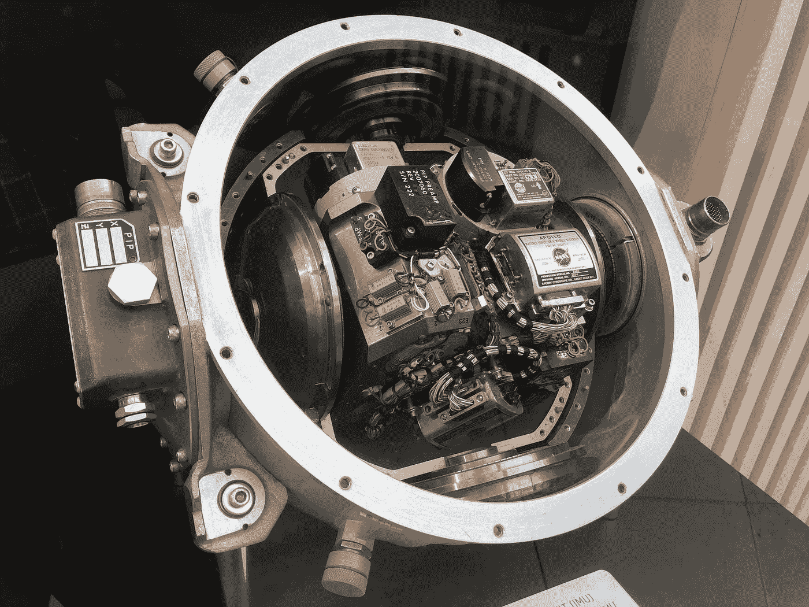

# 实际问题，数学和人工智能

> 原文：<https://medium.com/geekculture/practical-problems-math-and-ai-c934a95bde28?source=collection_archive---------4----------------------->

Practical Problems. Image source: [Uri Almog Photography](https://www.facebook.com/uri.almog.photography/)

在第一篇帖子的结尾，我写道，接下来我们将学习一个基本的神经网络，但后来我意识到应该有另一个部分，从数学的角度讨论人工智能。这就是这一小部分的主题，接下来是关于**感知器**的帖子。

在我们的头脑中、在一张纸上或在计算机中以方程的形式阐述一个问题的能力，允许我们寻求解决方案并将其转化为现实世界中的行动。如果你[在真空中扔一个球](https://en.wikipedia.org/wiki/Projectile_motion)有一个封闭形式的解:

这允许你预测球在未来任何时刻的位置，作为初始条件的函数，并根据这一知识采取行动。

A ballistic trajectory. Image Source: By Zátonyi Sándor, (ifj.) Fizped — Own work, CC BY-SA 3.0, [https://commons.wikimedia.org/w/index.php?curid=18807446](https://commons.wikimedia.org/w/index.php?curid=18807446)

Problems

许多常见的实际情况是由众所周知的方程描述的问题，但没有封闭形式的解决方案，如 **x(t) = *f* (初始条件)**，因为系统随时间的演化及其组件之间的相互作用太复杂而无法解决，或者因为这些方程依赖于部分未知的数据。举几个例子:

Apollo IMU. Image Source: [https://en.wikipedia.org/wiki/Inertial_measurement_unit](https://en.wikipedia.org/wiki/Inertial_measurement_unit)

1.  假设你想要**发射一颗绕地球轨道运行的卫星**，你想要在发射前对导弹的操纵指令进行硬编码。理论上你可以做到，因为你的导弹的运动是由众所周知的经典力学方程、膨胀推进剂的热力学和空气动力学描述的。但是在实践中，我们不知道如何通过使用初始条件来完全表达导弹的位置。这就是为什么我们给它一个编程的轨迹，但也给它配备了昂贵的传感器(IMU——惯性导航单元和其他类型)，以获得精确的测量值，车辆可以通过转向做出反应。
2.  **仅仅通过天线的形状和材料来确定天线的质量并不是一件容易的事情，即使电磁理论已经非常完善。当形状非常不规则时，方程很快变得无法精确求解，我们需要[将天线的部件近似为相互作用的“块”](https://en.wikipedia.org/wiki/Computational_electromagnetics)，或者模拟穿过天线的波，及时求解特定时刻，并逐步推进时间，再次求解方程。— **问题的一个更难版本**——它将我们带到第三类问题，这种情况下，你对天线有一组**约束**——比如说——在给定的频率、尺寸、材料等范围内的性能。你需要想出一个设计。你能阐明一个思维过程吗？**

An evolved antenna — the result of AI (genetic algorithm) designing an antenna based on constraints. Image Source: [https://en.wikipedia.org/wiki/Evolved_antenna](https://en.wikipedia.org/wiki/Evolved_antenna)

实际问题的第三个领域是那些我们知道可以用一些方程组来表示，甚至可以求解的问题(因为我们一直在求解这些问题，却不知道这些方程是什么)。

1.  确定照片中的人脸是否属于你的朋友，或者你面前的物体是否是一匹马，
2.  识别邮政编码中的手写数字以便分类，
3.  从英语到法语找到一个段落的最佳翻译
4.  制定使**两足机器人**行走的规则。在给定精确的姿态、速度和地形的情况下，每一秒所需的精确运动和反应，以及在这样做的同时保持平衡，是一个很难用公式表达的问题！而我们人类天生如此！
5.  给定一组约束条件设计新天线。

[A bipedal robot. https://en.wikipedia.org/wiki/Humanoid_robot](https://en.wikipedia.org/wiki/Humanoid_robot)

我应该说，成功处理这样的任务并不局限于人类。每一个活的有机体都会对它从环境中收到的感官刺激做出反应，刺激-反应的模式很快变得太复杂，我们无法完全用公式表达出来。

*输入 AI* 。

人工智能算法的本质是能够找到——然后求解——**一个近似方程**来解决那些我们无法用公式表示的问题。在许多人工智能方法中，我们构造一个 ***目标函数*** (它的另一个名字是 ***损失函数*** )，当我们的人工智能算法执行良好时，它被**最小化**，训练阶段的目标是**找到该目标函数的全局最小值**，而不用显式地求解问题的原始方程组，因为它是(并且将保持)未知的。

Particle Swarm Optimization — Genetic algorithm approach to sampling and solving a complicated equation by finding the global minimum of an objective function. By Ephramac — Own work, CC BY-SA 4.0, [https://commons.wikimedia.org/w/index.php?curid=54975083](https://commons.wikimedia.org/w/index.php?curid=54975083)

由于现代计算机的计算能力，我们可以构建参数足够丰富的模型**(一些计算机视觉神经网络有数十亿个参数)，它们可以逼近极其复杂的方程，也就是说，检测输入中不同特征之间的关系，这些特征对输出有影响。在**神经网络**中，那些关系是通过 AI 模型的 ***训练*** 阶段建立的。训练阶段的设计方式是，当 AI 模型正确执行时，它会给它一个正反馈，当它出错时，它会给它一个负反馈，反馈会导致模型参数的变化，推动它在下一次迭代中执行得更好。如果一个人工智能模型能够 ***概括——***也就是说——不仅正确地解决在训练期间呈现给它的完全相同的案例，而且正确地解决它以前从未遇到过的其他案例，那么它就被认为训练得很好。当它这样做时，这意味着它实际上发现了数据中不同特征之间的深刻关系，这对于描述问题的(未知)精确函数是必不可少的。**