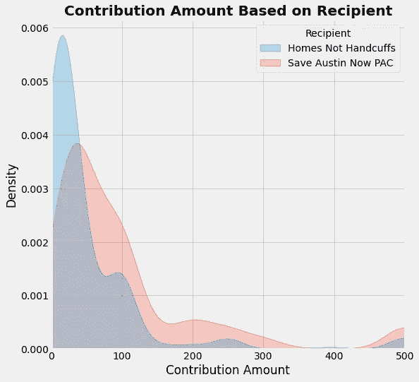
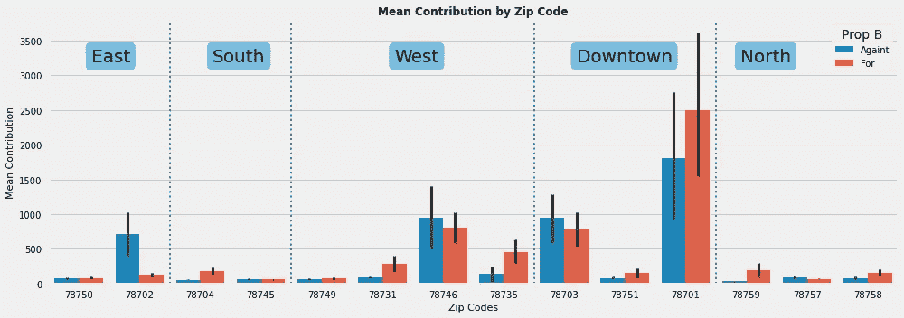
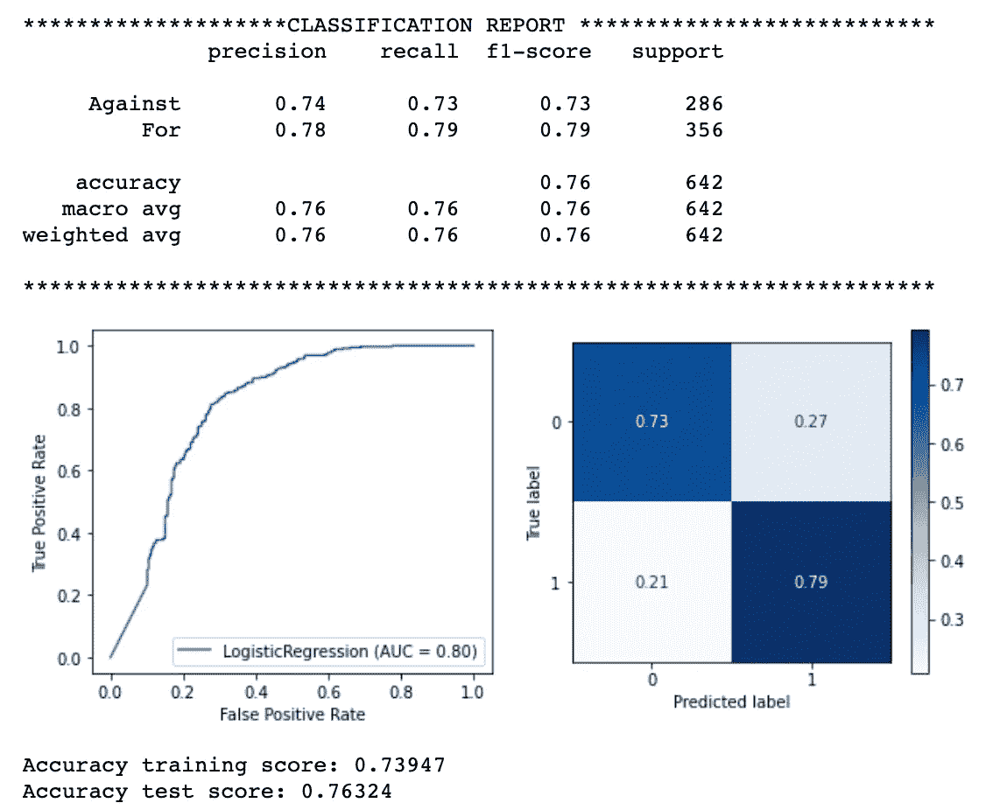

# 使用逻辑回归预测奥斯汀的提案 B 选民

> 原文：<https://medium.com/geekculture/predicting-austins-prop-b-voters-using-logistic-regression-e596518cc724?source=collection_archive---------29----------------------->

[https://www.kvue.com/article/news/local/texas/austin-prop-b-camping-ban-reinstated-whats-next/269-7eb2a893-cce8-4011-9e4b-001a762208e1](https://www.kvue.com/article/news/local/texas/austin-prop-b-camping-ban-reinstated-whats-next/269-7eb2a893-cce8-4011-9e4b-001a762208e1)

5 月 1 日，奥斯汀以 57%对 43%的高票通过了 B 提案。B 提案恢复了 2019 年 5 月被撤销的城市露营禁令。考虑到这个问题在当地社区的争议性，许多人对压倒性的结果感到惊讶。那些支持提案 B 的人把公共安全和清洁作为他们恢复禁令的主要原因。当地人声称他们不希望奥斯汀“变得像加利福尼亚一样”，指的是旧金山和洛杉矶的大量无家可归者。另一方面，那些投票反对提案 B 的人认为，在该县缺乏负担得起的住房和快速中产阶级化的情况下，对露营发出传票是不道德的。

Austin.gov 提供竞选资金的开源数据集。我将使用探索性数据分析来分析这些冲突选民的特征。然后，我将使用逻辑回归模型，根据就业状况、所在地、捐款金额等特征，将选民分为赞成或反对 B 提案的。

竞选财务记录没有明确列出对提案 B 的捐款。然而，有两个政治行动委员会专注于通过和击败提案 B。“现在就拯救奥斯丁”([https://www.saveaustinnowpac.com/](https://www.saveaustinnowpac.com/))赞成通过提案 B(恢复露营禁令)。“家不是手铐”(【https://noonpropb2021.org/】T2)是一个旨在击败提案 B(不是恢复露营禁令)的政治行动委员会。

Save Austin Now PAC 在分布的右侧有极端的异常值，这使得 KDE 图很难解释，所以我只包括了 500 美元以下的捐款。97%的捐款低于 500 美元，但也有异常值，最高为 98，000 美元。由于高异常值和许多捐款非常低，两个捐助群体都有右偏。Save Austin 现在有更大的分布，并且在分布的左侧密度较低。拯救奥斯汀现在捐款有更大的密度，每收到超过 50 美元的捐款，家庭而不是手铐捐赠者。

这些汇总统计数据进一步证实了“拯救奥斯汀行动计划”的传播范围比“家庭而不是手铐”更广。虽然捐款的数目相似，但现在拯救奥斯汀的捐款往往更大。

此外，我探索了基于邮政编码的选民平均贡献，并按地区对邮政编码进行了分类。

奥斯汀无家可归的人口主要分布在城市的东部、南部和市区。从经济上来说，城市的西部和市中心地区往往拥有收入最高的居民。如图所示，东部地区是唯一强烈反对提案 b 的地区。南奥斯汀似乎更热衷于通过提案 b。西奥斯汀是混合的，某些邮政编码支持，其他则反对。78746“反对”在统计上没有比“赞成”更大的意义市中心也是一个大杂烩，但主要是有利于 Prob。两个群体的最大平均值是 78701。这让我相信它在提案 b 中有最大的既得利益。这个邮政编码的居民也可能有最多的可支配收入捐赠给政治事业。与其他地区相比，北奥斯汀的价值相对较低，但似乎主要倾向于 b 提案。

一旦理解了数据的特征，就该开始特征工程和建模了。我向数据集添加了三个要素。我将住宅分为独立住宅或公寓/共管公寓。接下来，我创建了一个二元变量来将捐赠者分类为奥斯汀居民或非奥斯汀居民。最后，我添加了“选举前几天”,它列出了选举前几天的捐款。

像大多数机器学习模型一样，数据在拟合之前需要进行预处理。Scikit-learn 需要数字数据。我使用 OneHotEncoder 对象来处理这个问题，代码如下。如果排除正则化，数值列不需要标准化。

下一步是使用 scikit-learn 运行一个虚拟模型，以获得一个简单预测的基线分数。假设该模型预测的是一个二元类，并且它不是不平衡的，那么它有 50%的准确率就不足为奇了。未来迭代的目标将是提高虚拟分数。

逻辑回归模型必须满足三个主要假设。首先，观察值必须是独立的，这意味着预测变量不应相互依赖。其次，预测变量应该具有非常小的多重共线性。多重共线性是有问题的，因为如果影响相似，模型很难解释哪些要素会影响目标变量。最后，独立变量和它们的对数概率之间必须有线性关系。应该注意，极端的异常值会影响模型性能。

在运行统计测试以确保假设得到满足之后，我实例化并拟合了一个普通的逻辑回归。分数代表准确度，计算方法为 TP + TN/TP+TN+FP+FN。查看模型是否“过度拟合”也很重要，这意味着训练性能大于测试性能。过度拟合模型在为新数据生成预测时表现不佳。换句话说，它不能很好地概括。训练和测试数据的精度约为 83%,这意味着模型没有过度拟合。

为了进一步探索模型性能，我引入了 sklearn 的内置分类报告来分析准确度、精确度、召回率和 F1 分数。根据目标，不同类型的分数将被优化。例如，如果医生试图检测患者是否患有危及生命的疾病，回忆将是最重要的评分标准。为了对投票人进行分类，准确度(一个宽泛的评分标准)就足够了。

在运行一个初始模型之后，是时候使用 sklearn 的 GridSearchCV 调优模型了。GrisSearchCV 是一个强大的工具，可以交叉验证模型的不同迭代。交叉验证的分数是有用的，因为它们减少了随机性的影响。在这个例子中，我调整了 C，param_penalty 并保持 max_iter 不变。我保持 max_iter 不变，因为否则模型将无法覆盖。C 值越低意味着正则化越强。请注意，必须对数据进行缩放才能使用正则化。正则化对于要素选择非常有用，因为它会对系数较大的要素造成不利影响。较大的系数可能会导致模型做出较差的预测，因为它严重依赖于一小部分特征。里奇(L1)和拉索(L2)都试图减少系数值，从而减少方差和过度拟合。L1 使系数接近于 0，而 L2 可以将值一直减小到 0，这对于特征选择是有用的

在调整了模型的准确性之后，是时候解释模型的系数了。逻辑回归是一种流行的模型选择，因为它相对容易解释。这是一个玻璃盒子模型。正系数使预测偏向 1，有利于命题 B，负系数使预测偏向 0，不利于命题 B。最大的系数绝对值是对模型预测影响最大的要素。再一次，投票“赞成”提案 B 是赞成恢复露营禁令，反之亦然。

职业是预测选民对 B 提案偏好的最有影响力的特征。如果投票人失业，他们可能会“反对”提案 B，如果他们退休，他们可能会“支持”提案 B。那些失业的人可能会对那些也失业并且可能在生活中的某个时刻也经历过无家可归的人更有同情心。邮政编码是投票偏好的另一个有力指标。靠近无家可归者营地的城市地区可能会经历房价下跌。这可能是恢复露营禁令的动力。这些预测值以对数优势比表示，但可以很容易地转换成概率，如图所示。

总的来说，本文的目的是分享分析数据不仅仅是建模。理解变量代表什么以及如何解释结果至关重要。希望这有助于读者理解预测建模的力量，并启发他们了解我所在社区的地方政治。感谢您的阅读！