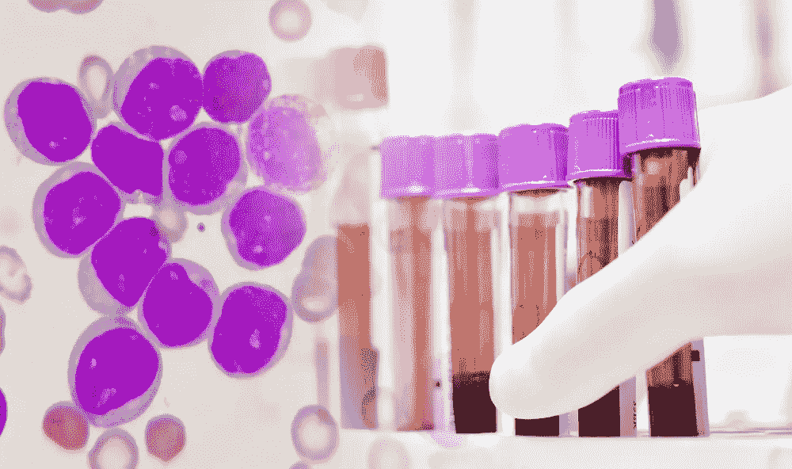

# 通过时间序列和其他先进技术预测白血病复发

> 原文：<https://medium.com/geekculture/predicting-leukemia-relapses-through-time-series-and-other-advanced-techniques-eb89783c98d7?source=collection_archive---------17----------------------->

[每三分钟](https://www.lls.org/facts-and-statistics/facts-and-statistics-overview)，美国就有一人被诊断患有白血病或类似的血癌。每九分钟，美国就有一个人死于这些疾病。

事实上，白血病和相关疾病非常普遍，即使在医疗系统发达的国家也是如此。2021 年，这些疾病占美国新癌症病例的 10%左右。全国超过 150 万人患有白血病、淋巴瘤、骨髓瘤、骨髓增生异常综合征(MDS)或骨髓增生性肿瘤(MPNs)，或正在缓解。

尽管有这些数字，那些患有白血病或其他血癌的人现在比以往任何时候都有更好的生存机会。从 1960 年到 2016 年，白血病的五年存活率[翻了两番多](https://www.lls.org/facts-and-statistics/facts-and-statistics-overview)。

## 白血病复发:一个太常见的现象

然而，白血病患者的复发非常普遍。例如，患有急性淋巴细胞白血病(ALL)的成年人有 50%的几率[复发](https://www.healthline.com/health/leukemia/leukemia-relapse#:~:text=Overall%2C%20about%2010%20to%2020,than%20children%20(10%20percent).)。所有年龄段的患者中有 10%到 20%会复发。

其他类型的白血病，如急性髓细胞性白血病(AML)的复发也相对频繁。这是部分原因，因为化疗不能杀死导致 AML 的白血病干细胞。多伦多玛格丽特公主癌症中心的临床科学家 Jean Wang 博士说:“白血病干细胞倾向于在化疗后存活，留在骨髓中，并使疾病重新生长。

目前通过各种数据点评估患者的复发风险，包括分子和细胞遗传学检测或临床/生物因素，如年龄和白细胞计数。但是这些技术是出了名的慢，并且经常不能及时产生结果来拯救病人免于恶性复发。

为了避免过度治疗或治疗不足，并最终确保积极的健康结果，准确、更及时的评估是必要的。

## 时间序列和其他新技术如何改善白血病复发预测

最近开发了几种预测白血病复发的新方法，包括 DNA 和基因测试以及使用由时间序列数据提供的机器学习模型。

## 基因签名测试:LSC17 测试

玛格丽特公主癌症中心的王博士和他的同事最近开发了一种新的 AML 基因检测技术，可以在一到两天内给出准确的结果。

王博士和她的同事们发现了 17 个基因的签名，即“LSC17 评分”，可以准确预测患者化疗后的复发风险。该测试使用[纳米字符串](https://nanostring.com/)平台来评估患者并计算 LSC17 分数。得分越高，患者复发的可能性越大。

因为测试是在诊断时进行的，所以它可以根据患者复发的可能性告知最合适的治疗方法，包括实验性治疗或更强的初始治疗。“在临床试验中使用它作为相关测试，对于确定可以使高危患者受益的药物来说，将非常有价值，”王博士说。

## DNA 测序:NGS-MRD 生物标志物

来自犹他大学、宾夕法尼亚大学和其他机构[的研究人员最近发现了](https://journals.lww.com/oncology-times/fulltext/2022/01050/dna_sequencing_to_predict_leukemia_relapse_after.3.aspx)一种生物标志物，它几乎总能预测所有患者在 CAR-T 细胞治疗的 3 至 12 个月内会复发或需要进一步治疗。

虽然 CAR-T 细胞治疗导致大约 80%的儿童和年轻成人患者完全缓解，但大约一半的患者最终复发。

研究人员在 2021 年 12 月*的 [*血癌发现*](https://aacrjournals.org/bloodcancerdiscov/article/3/1/66/675483/Next-Generation-Sequencing-of-Minimal-Residual) 中写道:“这项研究表明，迄今为止，在使用 tisagenlecleucel 进行 CAR-T 细胞治疗后的第一年中，确定复发风险的最佳生物标志物是 NGS-MRD 评估骨髓，检测到的截断值> 0 个细胞。”。*

研究人员在分析了数百份临床试验样本后确定了这种生物标志物，样本以 1 个月、3 个月、6 个月、9 个月和 12 个月的间隔进行筛选。

## 时间推移预测:机器学习和其他计算方法

其他研究人员已经采用了上述类似的区间方法，并将其与各种计算方法配对，包括机器学习。2021 年末霍夫曼等人。设计了一个综合实验，比较三种计算方法(机械模型、广义线性模型和深度神经网络)预测急性髓细胞白血病复发的准确性。

分析表明，当频繁测量可用时，长短期记忆(LSTM)神经网络在预测复发方面表现良好。然而，使用先验知识的机械模型或统计方法对于数据有限的情况更有效。

[研究人员写道](https://www.ncbi.nlm.nih.gov/pmc/articles/PMC8592437/)“我们的研究表明，测量方案和临床协议的优化是一种有前途的策略，可以提高整体预测准确性，而不需要对每个患者进行更多的测量。”。“在我们对 AML 复发的预测中，我们可以达到约 80%的准确率，因为复发的预后发生在诊断后的两年内。”

时间推移技术也被[用于](https://onlinelibrary.wiley.com/doi/10.1111/bjh.15252)预测儿童急性淋巴细胞白血病的复发。Yeoh 等人。使用缓解诱导治疗期间骨髓样本的时序基因表达谱(GEPs)来预测复发的可能性。

研究人员测量了诊断后八天的时间序列变化，这种计算被称为有效反应度量(ERM-D8)。在独立的盲法测试中，该指标确定了 ERM-D8 不良者复发风险增加三倍。作者写道，该指标“通过在没有遗传高危特征的患者中增加 23.9%的复发率，显著改善了风险分配”。