# 使用 Umami 和 NextJS 进行隐私友好型网站分析

> 原文：<https://medium.com/geekculture/privacy-friendly-website-analytics-with-umami-and-nextjs-8b587aecc916?source=collection_archive---------14----------------------->


网站分析确实是一件非常重要的事情。我们可以很好地了解我们的受众，并可以根据受众定制我们的内容，以提高参与度。[谷歌分析](https://analytics.google.com/)一直是首选解决方案，因为它很受欢迎，易于设置，并提供大量数据。

然而，谷歌分析也有自己的一系列问题。使用 Google Analytics 必须获得 cookie 许可，因为 Google Analytics 使用 cookie。谷歌分析脚本也很大，众所周知会降低网站速度。最近有指控称谷歌分析对隐私不友好，而且[许多欧洲当局也发现它违反了 GDPR](https://techcrunch.com/2022/02/10/cnil-google-analytics-gdpr-breach/) 。

那么，解决办法是什么呢？

多年来，出现了许多隐私友好的分析解决方案，包括 [Fathom Analytics](https://usefathom.com/) 、[似是而非的分析](https://plausible.io/)和[鲜味分析](https://umami.is/)。最后两个是开源的，三个都没有 cookie，有一个轻量级的脚本，不会影响网站的加载时间。

在这篇文章中，我们将关注鲜味

# 关于鲜味的一点点

Umami 是一个开源的自托管分析服务。这意味着任何人都可以访问源代码，并且必须自己托管它。现在，你可能会说这要花钱，而且不是免费的，但是今天我们要看看我们如何免费托管它。此外，Umami 使用 NextJS API 路由作为后端，因此它可以在任何无服务器架构上运行。我们今天将在[铁路](https://railway.app/)上设置它，然而，它也可以在 [Vercel](https://vercel.com/dashboard) 或 [Netlify](https://www.netlify.com/) 上托管。我们还将考虑在 NextJS 应用程序中添加分析功能。

您可以在此处看到该平台的[现场演示](https://app.umami.is/share/8rmHaheU/umami.is)

有趣的事实: [Hashnode](https://hashnode.com/) 也使用鲜味，并推出了鲜味仪表板作为高级分析😎

你可以在这里看到我博客的[公共分析](https://stats.hashnode.com/share/VDldVSkU/9f4dd26c-c7e6-4fa1-88aa-87d90a0dba43)

# 在铁路上免费招待鲜味

[Railway](https://railway.app/) 是一个非常棒的托管平台，可以让你快速轻松地托管应用程序。免费计划允许每月使用 5 美元，这对一些中小型网站来说已经足够了。

事实上，我在过去的 3-4 个月里一直在使用它，这是一次令人惊奇的经历。我的使用成本通常低于每月 2 美元，因此我从未支付任何费用。甚至不需要链接信用卡！

我本月的使用情况(3 个网站)

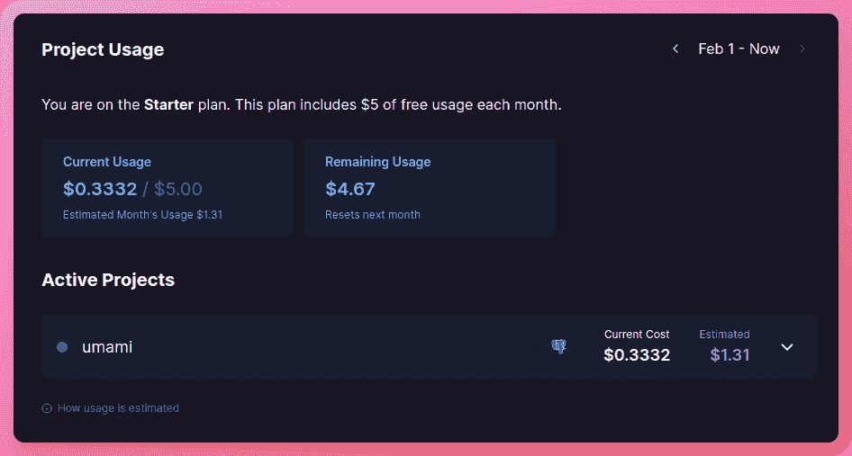

你也可以链接一张信用卡，每月免费使用 10 美元(超过 10 美元的部分将向你收费)。

你可以在这里报名

# 建立铁路项目

我们将遵循[官方指南在铁路上举办](https://umami.is/docs/running-on-railway)

首先要分叉知识库。这将帮助我们对源代码进行修改以适应我们自己的需要，更重要的是，在将来接收更新(正如我们将在本教程后面看到的)。前往 [Umami GitHub 库](https://github.com/mikecao/umami)并点击右上角的 fork


您可能会被要求选择您的个人帐户或组织，如果您在任何。我会建议去个人帐户，除非是为一个组织。

一旦你注册了一个帐户，点击“新项目”(注意，我已经有一个现有的项目，因此布局看起来像这样。对你来说可能不一样)—


现在，在新项目屏幕上选择“从回购部署”

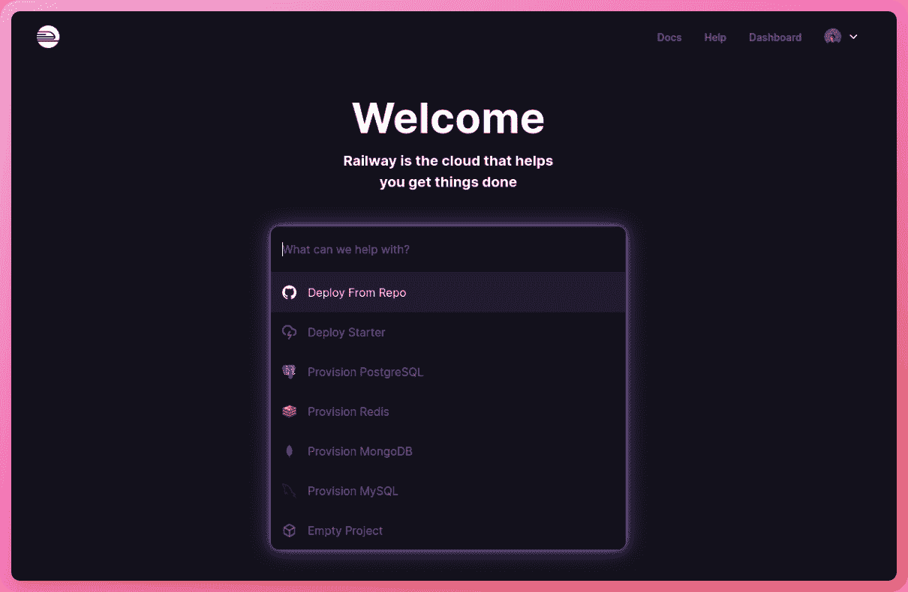

请注意，如果您没有注册 GitHub，系统会提示您连接 GitHub 帐户。

在那里搜索并选择鲜味。

确保已选择主分支。现在点击部署-

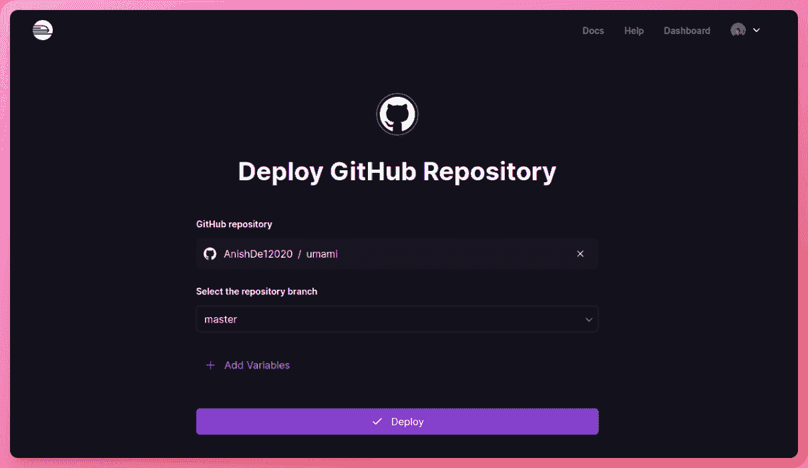

这可能需要一些时间(2-5 分钟)。

这是部署后它应该看起来的样子(请注意，我目前正在使用 Metro UI，布局可能看起来有点不同)

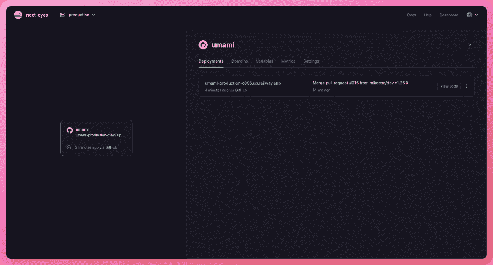

现在，我们需要添加一个数据库。在这个例子中，我们将使用 PostgreSQL。现在，Railway 内置了对数据库的支持，因此我们可以在 Railway 内部免费构建 PostgreSQL 实例。

点击这个“新建”按钮-

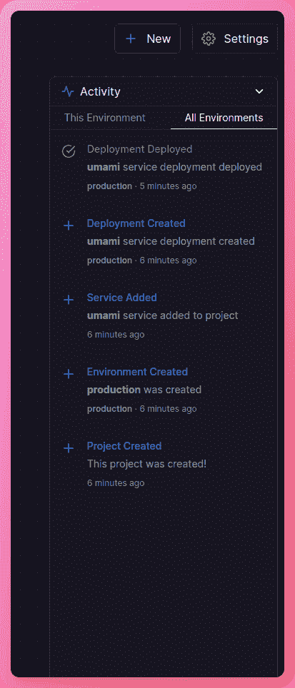

选择“数据库”，然后选择“PostgreSQL”


这可能也需要一些时间。

请注意，如果你使用旧的用户界面，你必须选择“添加插件”按钮。

现在，我们需要添加两个环境变量，`PORT`和`HASH_SALT`。点击写着“鲜味”的卡片，进入“变量”标签-

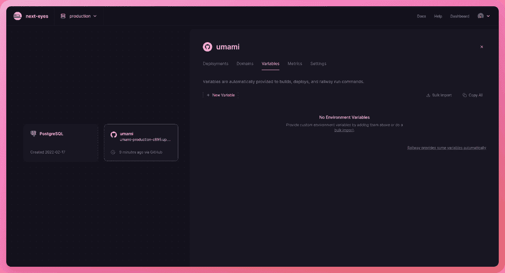

在旧的 UI 中，侧边栏会有一个名为“变量”的按钮。单击它，然后在“custom”下添加以下变量。

我们需要为环境变量`HASH_SALT`放置一个随机字符串。使用任何随机字符串发生器，如[这个](https://devkit.one/generators/random-string)。让我们用 20 个字符，包括大写和小写字母，数字和符号-


现在把它粘贴到铁路上，点击“添加”


另外，添加一个名为`PORT`的环境变量，并将其设置为`3000`

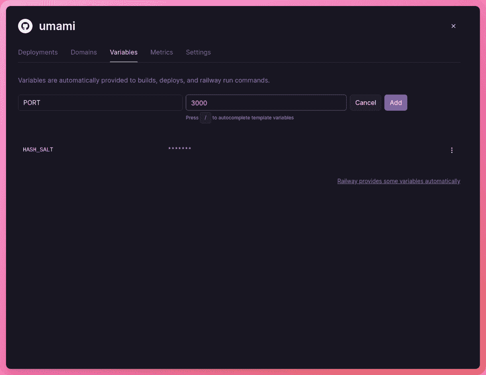

请注意，每次我们添加环境变量时，Railway 都会重新部署我们的应用程序。

# 设置我们的数据库模式

现在，我们需要在数据库中制作表格。为此，我们需要在本地克隆这个项目。继续用 git 克隆它，并在该存储库中打开一个终端(我在这里使用 GitHub CLI 克隆，但您也可以使用`git`)


现在，我们需要[安装铁路 CLI](https://docs.railway.app/develop/cli) 。您可以用 NPM 安装它，命令如下-

```
npm i -g @railway/cli
```

你也可以用下面的命令用 [Homebrew](https://brew.sh/) 安装它

```
brew install railwayapp/railway/railway
```

现在运行以下命令，使用您的 Railway 帐户验证 CLI

```
railway 
```

请注意，如果您在执行此操作时遇到任何问题，您也可以尝试使用以下命令登录

```
railway login --browserless
```

现在运行以下命令将本地目录与您的铁路项目链接起来-

```
railway link
```

现在，前往 Railway，单击 PostgreSQL 卡，进入“变量”选项卡-

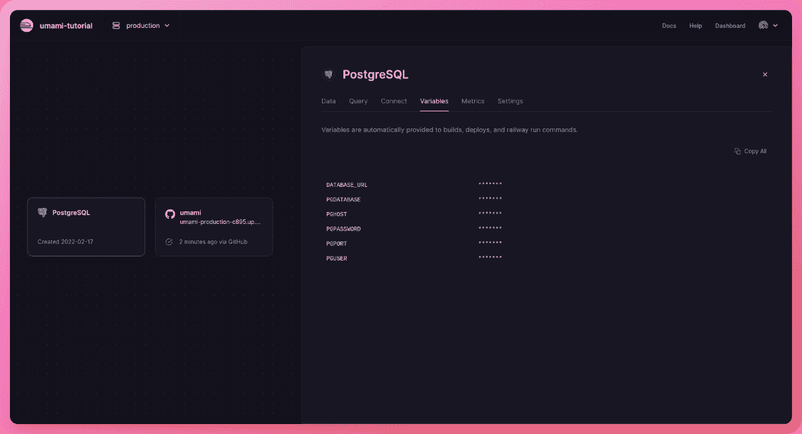

现在在终端中运行以下命令-

```
railway run psql -h PGHOST -U PGUSER -d PGDATABASE -f sql/schema.postgresql.sql
```

用 Railway 仪表板中的相应值替换值上限(从上一步中 PostgreSQL 的环境变量选项卡中)

现在按回车键运行命令。

请注意，为此您需要 PostgreSQL CLI。如果没有，可以按照[这个指南安装](https://www.timescale.com/blog/how-to-install-psql-on-mac-ubuntu-debian-windows/)。

现在运行以下命令来部署它-

```
railway up
```

万岁，我们成功部署了🥳鲜味

# 使用鲜味

部署后，您将获得登录到 CLI 的部署 URL。您也可以从 Railway web 应用程序中检索此 URL。

您也可以从 Umami dashboard 设置一个自定义子域(甚至自定义域)


您将看到一个登录屏幕。用户名是“admin”，默认密码是“umami”(我们会更改这个)。

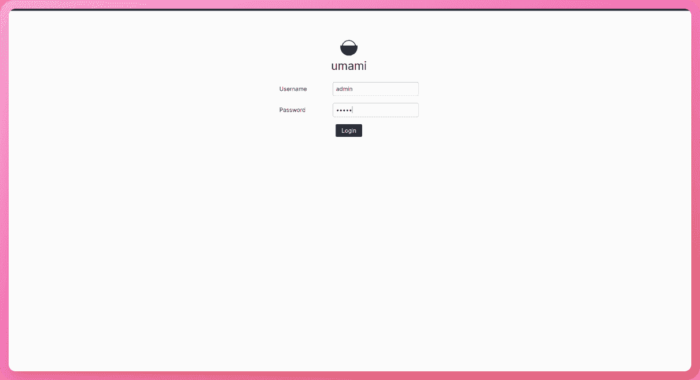

我们的仪表板现在应该是这样的-

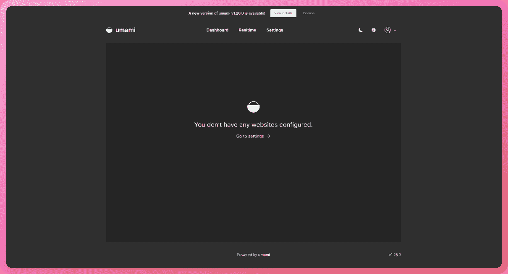

现在，有一个横幅说有一个新版本出来了！在写这个教程的时候，鲜味的创造者 [Mikecao](https://github.com/mikecao) 推了一个新版本😅

这是一件好事，因为现在我要向你们展示如何更新鲜味😎

在此之前，让我们快速更改我们的密码，因为“鲜味”不是一个安全的密码。

转到设置→个人资料，点击“更改密码”

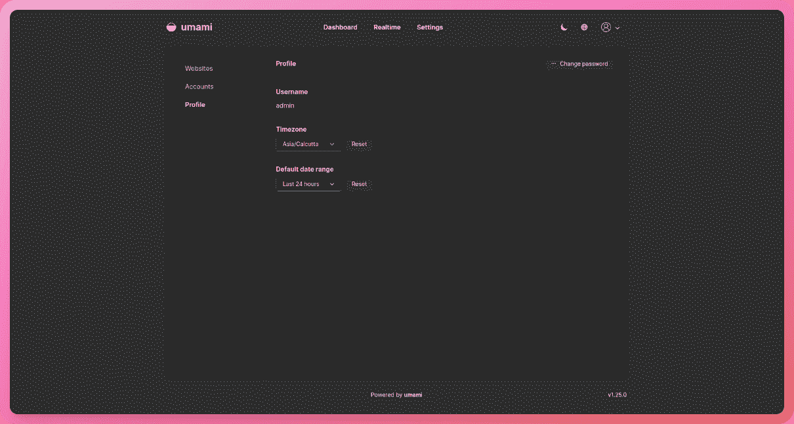

在“当前密码”字段中输入“umami ”,然后设置新的安全密码并点击“保存”

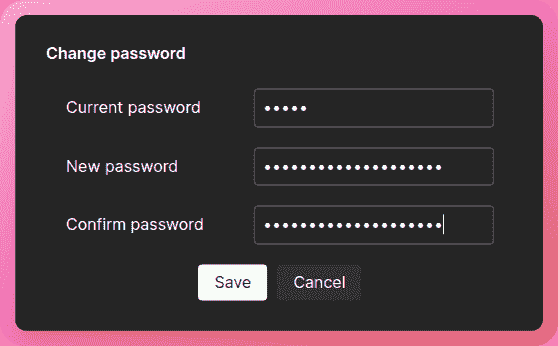

# 更新鲜味

前往 GitHub 上的分叉鲜味库。您应该看到我们的分支落后了几个提交-


点击“获取上游”，然后点击“获取并合并”


就是这样！新的部署将在 Railway 上启动，几分钟后，您应该可以启动并运行最新版本-


# 向 NextJS 网站添加鲜味

现在，让我们来看看如何向 NextJS 网站添加鲜味。为此，让我们首先创建一个新的 NextJS 应用程序(注意，它也可以与现有的 NextJS 应用程序一起工作)

```
npx create-next-app umami-tutorial
```

现在让我们进入目录-

```
cd umami-tutorial
```

现在，在您最喜欢的文本编辑器中打开它。我们将在本教程中使用 VSCode

```
code .
```

现在，打开`pages/_app.js`文件。应该是这样的-

现在，让我们为鲜味添加脚本标记。这就是我们的`_app.js`现在的样子-

这里，我们使用了 [NextJS 脚本组件](https://nextjs.org/docs/api-reference/next/script)并延迟加载脚本，这样它就不会阻止我们网站的加载。

我们还需要添加环境变量，但在此之前，我们需要将网站添加到鲜味。

前往鲜味，然后前往设置→网站-


现在，点击“添加网站”

我将这个命名为“鲜味教程”,但是你可以随意命名。在下一个字段中，请确保输入域，而不是网站的 URL。请注意，我已经快速创建了一个 GitHub 存储库，并将这个 NextJS 应用程序部署到了 [Vercel](https://vercel.com/) 中。我也检查了“启用分享网址”,这样我就可以与你们分享这个网站的分析😁

就是这里——[https://Umami-tutorial . up . railway . app/share/3lOPyajp/Umami % 20 tutorial](https://umami-tutorial.up.railway.app/share/3lOPyajp/Umami%20Tutorial)

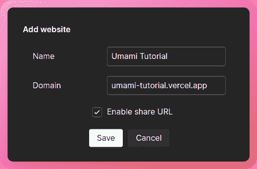

现在，点击“保存”，然后“获取跟踪代码”


从出现的模态中，复制`data-website-id`和`src`的值即可

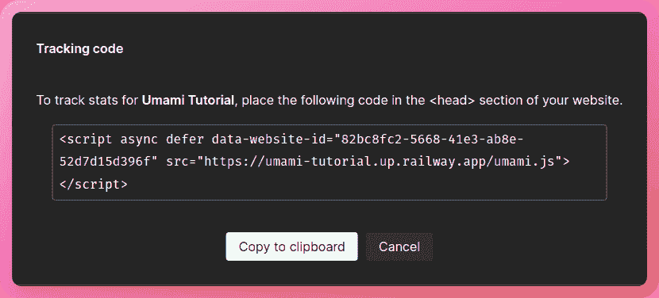

现在，在 NextJS 应用程序中创建一个名为`.env.local`的新文件，并添加以下环境变量

现在，在你的浏览器上访问这个网站，看看鲜味仪表板，它应该在“实时”标签下记录一个视图和一次访问-

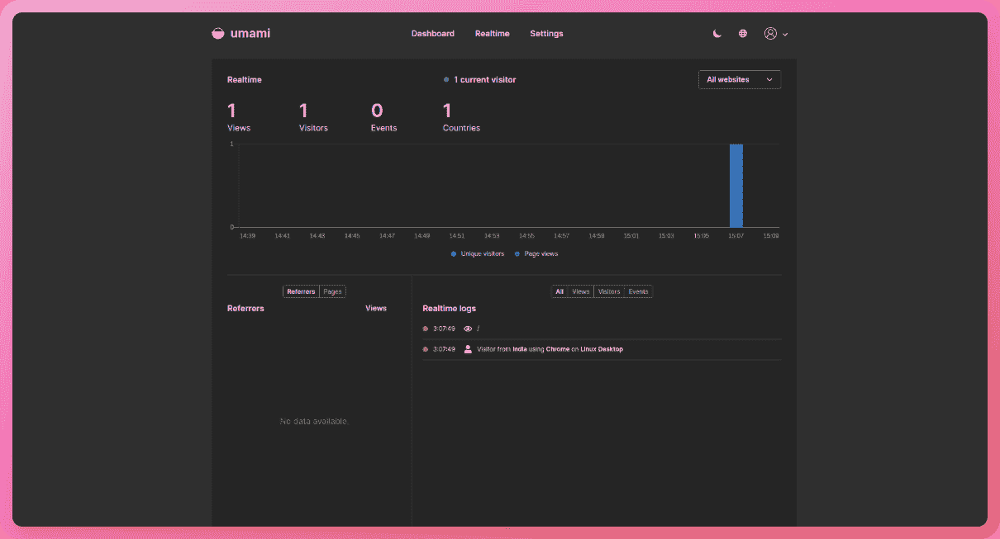

我们可以在网站的详细页面下看到更多详细的分析-

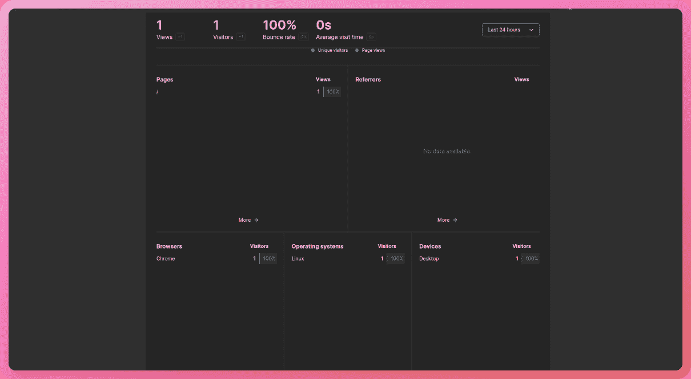

当你的网站开始吸引访问者时，更多的数据会堆积起来

注意:一些浏览器，比如 brave，有内置的广告拦截器，在很多情况下会阻止这些脚本的加载。甚至第三方广告拦截器也可能对此负责。如果您的 Umami dashboard 中没有显示任何数据，请尝试一个没有广告拦截器的浏览器(或私有模式)，尝试重新启动您的开发服务器，并确保环境变量的值是正确的。

哇哦，太多了！

# 结论

我们建立并运行了 Umami，并向 NextJS 应用程序添加了分析功能。鲜味更像是记录事件。查看[他们的文档了解更多信息](https://umami.is/docs)

我希望你一切顺利。请随意评论这篇文章，或者在[推特](https://twitter.com/AnishDe12020)上联系我，我会帮你解决问题😄

# 重要链接

*   [鲜味](https://umami.is/)
*   [鲜味文件](https://umami.is/docs/about)
*   [关于在铁路上设置鲜味的官方指南](https://umami.is/docs/running-on-railway)
*   [铁路](https://railway.app/)
*   [本教程的资源库](https://github.com/AnishDe12020/umami-tutorial)
*   [本教程的演示网站](https://umami-tutorial.vercel.app/)
*   [演示网站的公共分析](https://umami-tutorial.up.railway.app/share/3lOPyajp/Umami%20Tutorial)

*原载于*[*https://blog . anishde . dev*](https://blog.anishde.dev/privacy-friendly-website-analytics-with-umami-and-nextjs)*。*