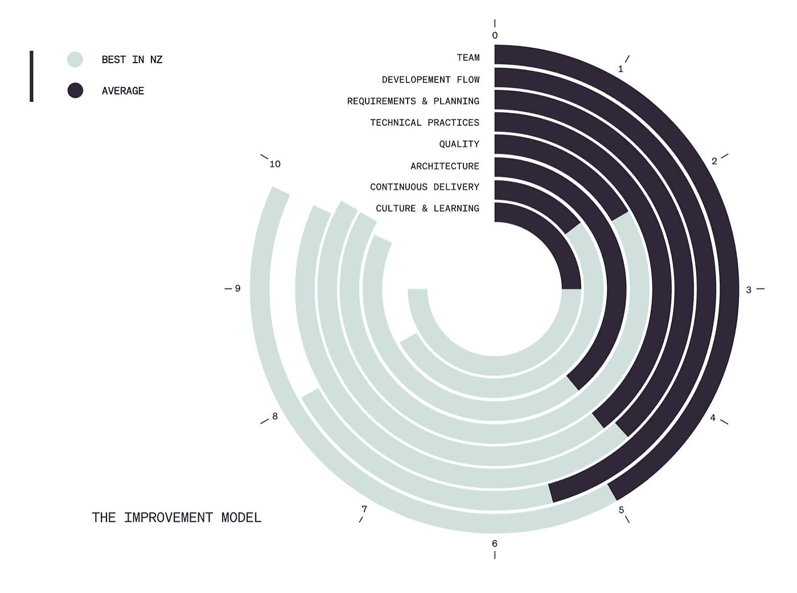

# 产品开发和解决方案开发几乎在每个方面都是不同的

> 原文：<https://medium.com/geekculture/product-development-and-solution-development-are-different-in-almost-every-dimension-458e174f94af?source=collection_archive---------9----------------------->

Photo by [Dietmar Becker](https://unsplash.com/@dietmarbecker?utm_source=medium&utm_medium=referral) on [Unsplash](https://unsplash.com?utm_source=medium&utm_medium=referral)

## 除了它们都涉及编写代码！

> 上面这句话是我一直以来最喜欢的双关语，是我的朋友和前商业伙伴说的。他精于提炼这类单句评论。

过去几年，我们为新西兰的[卡拉汉创新](https://www.callaghaninnovation.govt.nz/)做了许多“为速度而建”( BFS)的发现，他是在我们写其中一个发现的时候想到的。在那里，我们评估了由 Callaghan 资助的新西兰各软件公司的产品开发能力、能力和文化。

在这四年多的过程中，我们已经揭开了全国许多不同行业、不同规模的各种软件公司的面纱。他们都是*无疑是*从构建和销售软件给他们的客户中获得收入。但是，也许令人惊讶的是，他们中的一些人也从无意中为他们的客户构建定制解决方案中获得了收入！

如果你对这一重要工作计划的结果感兴趣，在评估了大约 150 多家科技公司后，以下是新西兰产品科技行业的代表性状况:

Callaghan Innovation — [Build for Speed Improvement Model performance snapshot — Hypr Innovation](https://hypr.nz/solutions/improve-practices)

> 理解这张图片的方式是:深色的分数代表所有 150 家被评估公司的平均分数，浅灰色的分数代表该组中最好公司的分数。有一个没人说的巨大差距！

几乎所有这些公司都有一个共同的主要问题，它代表了所有发达国家的其他科技公司，而不仅仅是新西兰。这些技术产品公司中的许多人并不知道他们实际上是在使用相同的思维方式、技术实践和管理流程来创造他们的技术产品，这些思维方式、技术实践和管理流程被其他企业和解决方案提供商/服务公司所采用，这些企业和公司也生产软件。同样类型的公司为他们的公司/客户构建软件解决方案——如果你还不知道，这与为你的客户构建产品是完全不同的软件游戏！

这些科技公司的许多创始人和管理团队来自“解决方案”(服务提供商模式)思维占主导地位的公司(即大多数公司企业)。他们带着这个包袱进入他们的产品公司，因为这是他们在那里所知道和学到的，他们只是假设产品是以同样的方式制造的。对于非技术背景的创始人来说，似乎他们只是认为企业 it 方式是构建软件产品的事实上的方式。两位创始人都错误地认为，制造科技产品就像其他行业生产产品一样；也就是说，遵循你可能会遵循的相同的基本生产过程，比如说，建造你自己的家。换句话说，他们把生产和发展混为一谈。他们认为这只是一个知道你到底想要什么的过程，然后你计划它，然后报价，估计它，获得资金，然后交付它，你就完成了。快速致富！！超级简单，对吧？

这些人可能要么消息不灵通，要么建议不周，这是一个奇耻大辱，因为他们的业务长期受损，他们往往无法扩大规模，在十年或二十年的过程中逐渐消失。最终，惹恼了他们辛苦赚来的早期用户。

最终结果是，这些科技企业无意中未能扩大业务规模，他们也不明白为什么会出现这种情况。

当然，没有一个企业主认为这与他们如何在企业内部建立执行力有任何关系，也不是因为执行是由公司高层决定的。

相反，他们倾向于指责企业内部的人无能。

现在让我们看看构建**产品**和构建**解决方案**有什么根本的不同。

> 但首先，如果你想了解什么是**产品**的[含义，什么是**解决方案**](https://jezz-santos.medium.com/is-it-a-product-or-is-it-a-solution-5194f12a2dfb) 的含义，先跳到那篇文章解释这一点，然后再回到这里。

Photo by [Florian Schmidinger](https://unsplash.com/@fensterschmidinger?utm_source=medium&utm_medium=referral) on [Unsplash](https://unsplash.com?utm_source=medium&utm_medium=referral)

## 不匹配的期望

好的，这就是大多数创办或拥有这些产品公司的商业人士如何“看待”和解释他们应该如何制造一个产品的过程。

就像他们想象建造梦想家园的过程一样。

建造你自己的梦想家园是这样的:

> 我绝对是为了简洁而简化，我也没有考虑到地区差异。

1.  你雇佣了一个好的(土木)建筑师和一个好的(土木)建筑公司/建筑商来确保你的房子可以建造，而且价格合理。
2.  你得到了一些土地
3.  你为你的房产提出了一些想法，建筑师会验证并为你修改成蓝图和一些计划(以确保你的想法在现实世界中与人的设计因素一起工作，并符合当地的建筑规范)。
4.  [土木]建筑商和[土木]工程师可能会为建筑师验证的计划(实际上可以用您的市场上可以获得的材料和工具在您的预算内建造)。
5.  你从建筑公司/建筑商那里得到报价和估价、时间表和开工日期。
6.  你得到当地政府的批准和签字，他们会核实其他因素，如分区、公用设施、区域规划等。
7.  你获得了支付土地和所有这些估算工作的钱。你基本上已经计划好了大部分失败的风险,无法在你想要的地方找到一个适合你个性化需求的舒适的家。
8.  一旦所有的规划和官僚主义都结束了，你有了许可、执照和资金，你扣动扳机，买下土地，让别人(建筑商)按照你与他们协商的时间表建造房屋。
9.  最终，只要每个人都做了他们承诺要做的事情，你就会得到一个实用舒适的家，适合你作为新房主的特殊需求。

Tada！

当然，制造一个技术产品应该看起来像这个相当复杂的过程？

Photo by [Andrea De Santis](https://unsplash.com/@santesson89?utm_source=medium&utm_medium=referral) on [Unsplash](https://unsplash.com?utm_source=medium&utm_medium=referral)

不对！

当你在*构建任何*软件、解决方案或产品的时候，**不会以这种方式**发生。为什么不呢？

主要是因为你在用未知的材料，用未知的零件，为未知的观众建造未知的东西，而这些观众必须舒适地生活在其中。更糟糕的是，随着时间的推移，所有这些方面都在演变和被发现。很少有人能够提前做出可靠的计划。

更糟糕的是，在软件中，没有标准的材料，没有标准的实践，也没有规范的权威。但是，即使我们拥有所有这些东西，我们仍然试图创造一些独特的和适合目的的东西，无论是对一个公司还是对一个市场。

**也是最重要的**，除非人们(他们将“生活”在你的新软件中)在整个过程中(确保为他们构建正确的东西，并且构建正确)，那么你将永远使用它并让它为他们工作来处理他们的问题(即可用性差，功能差)，并永远用它来解决问题(即质量差和部件损坏)。

所有这些都适用于构建任何软件、解决方案或产品——构建任何一个都不像盖房子。

## 构建产品还是解决方案？

现在，这个世界上建筑产品和解决方案的区别很大程度上取决于你在这个类比中是谁？

你是为你的客户构建软件产品的人，还是承包为你的企业/用户构建软件解决方案的人？

在做这种工作并关心其结果的几十年中，我看到类似的企业一次又一次地犯同样的根本性错误。我在世界各地工作过的地方都见过这种情况，我知道这不仅仅是新西兰的事情。

> 但是感觉新西兰比我生活和工作过的其他国家都多。也许这是 DIY 文化，也许这是一个小规模的影响，或者也许在 20 世纪 20 年代，这里仍然有更多的解决方案开发而不是产品开发。

不管怎样，我看到的最基本的错误假设似乎是构建软件产品和构建软件解决方案是同一个游戏！

这是大多数人的想法:

> 都只是软件，对吗？

没有。错，不是。

在技术领域，这是一个非常丰富的假设，你可以选择几乎任何成功的技术解决方案提供商/解决方案集成商，在玩了大约 5 到 10 年的服务游戏后，创始人或他们的董事会可能会想要开始开发产品。

为什么不呢？当然，从财务上来说，这是完全有意义的，因为那些解决方案提供商知道构建解决方案一次只能扩展一个项目(也就是说，它不能扩展)。在解决方案游戏中没有经常性收入或收入乘数。产品可以通过规模经济和基于订阅的许可等方式为您带来收入倍增。

特别是对于那些拥有这些服务企业的人来说，一旦他们不再把自己的身体放在提供服务的线上，这是一条通往退休的明确道路。

## 做这项工作的人

对于在这些服务行业工作的设计师/开发人员来说，构建产品似乎比构建他们习惯使用的解决方案更有吸引力。

难怪，对吧？所有的创意者/制作者都希望更多的人欣赏他们精心制作的手工作品。本质上都是“设计师”，不是艺术家记得的。因此，与解决方案相比，产品提供了一种对世界产生更大影响的方式。

然而，在现实中，构建产品比构建解决方案更困难、更严格，并且在某种程度上更少创造性的自由。当然没有解决方案的多样性。

从经验来看，我还认为*开发解决方案*和*开发工程产品*所需的能力确实有所不同，而且并不是所有的软件开发人员都有这种能力。因为他们只有在大型软件产品公司面试时才会发现这一点。

另一个有趣的观点是，在软件行业中有一些有趣且可识别的个人职业道路，许多人都选择了这些道路。例如，许多解决方案开发人员渴望从解决方案开发转移到产品工程，可能希望对更多的人产生更大的影响，或者在特定的技术领域磨练他们的技能。产品工程师也希望转向解决方案开发(作为独立顾问)，以获得更多的多样性和应用尖端技术的机会，或许还能获得更多的时间报酬。然后是解决方案顾问，大约五年后，他们希望创建自己的咨询公司，为开发自己的新产品提供资金。

我想这山望着那山高。当然，这种运动已经持续了几十年，对这些人的职业生涯和经历都有好处。

Photo by [Towfiqu barbhuiya](https://unsplash.com/@towfiqu999999?utm_source=medium&utm_medium=referral) on [Unsplash](https://unsplash.com?utm_source=medium&utm_medium=referral)

## 过渡

开始涉足产品的解决方案集成商/提供商似乎一开始就把它当作他们的一个特殊的内部公司项目来管理，就像管理他们服务业务的其他部分一样。他们非常自信并确信他们的目标客户会购买该产品，因为他们这样做是为了响应他们在咨询工作中看到的真正机会。

在某些情况下，他们的客户实际上可能会委托他们做这项工作！但是不管机会是什么，不幸的结果往往是无法将耐用产品经济地投放市场，从而从足够多的实际客户那里获得投资回报。有各种各样的动机驱使他们一头扎进去，但是他们严重忽略了“如何”完成这件事，这也是成功的关键。

他们可能会说:“我们已经拥有了制造这种产品的所有技术技能和经验”，他们确实是多年来处理这种产品/解决方案的专家。他们可能会说:“让我们开发一个产品，当我们的技术顾问坐在板凳上没有收入时，我们可以给他们配备人员。”这些人可能毕竟是这些特定技术领域的专家。他们将提议:“我们将从我们的服务利润中提供全部资金”，以避免前期投入任何资本。

从解决方案提供商管理团队和董事会的角度来看，这些都是非常诱人的想法，但它们都是有缺陷的假设。这些都不是你成功构建产品所真正需要的。

## 脱节

你可能认为软件行业的每个人都足够博学，知道构建解决方案和构建产品之间的明显区别。正如 Fred Brooks 在他的开创性工作 [*中明确指出的那样，1975 年的神话人月*](https://en.wikipedia.org/wiki/The_Mythical_Man-Month) ！但是，唉，我经常遇到软件企业主、软件经理、首席执行官和工程师之类的人，他们对这些真正的区别知之甚少。这只是写软件给他们。

Photo by [Gary Meulemans](https://unsplash.com/@anakin1814?utm_source=medium&utm_medium=referral) on [Unsplash](https://unsplash.com?utm_source=medium&utm_medium=referral)

## 清楚

几年来我一直想写这篇文章，实际上已经放弃这个想法好几次了。

为什么？因为这篇文章谈论的事情和细微差别在今天被软件世界中的许多人误解了，所以**和**现在这两个不同的世界有如此多的融合和变化，几乎任何人都可以声称他们不再清楚这种区别——他们可能是正确的。

例如，他们可能会说一个不合理的推论，比如“我们为客户制造产品”。或者“我们在我的产品公司为客户构建定制解决方案”。

例如，我有一些非常值得尊敬和非常能干的朋友，他们为实际的软件产品公司开发实际的产品，但是他们是从解决方案提供商那里聘请的顾问！

例如，在我自己的职业生涯中，我是一家产品公司(微软)的顾问，帮助解决方案提供商为他们的客户构建解决方案。

天哪如今有各种各样的私生子商业模式。只是不再清楚谁在什么环境下工作了。因此，难怪很难让人们同意什么是建筑产品，什么是建筑解决方案，以及是什么使它们有所不同。

但是，唉，我打算再试一次这篇文章。我希望你有时间看完我要分享的内容。

# TL；灾难恢复摘要

我决定把这篇文章分成两篇，这样你可以选择在哪里投入时间。链接在本文末尾。

下面是这篇长文和下一篇文章的简写摘要。如果你需要这些细节，下一篇文章将详细介绍“为什么”这些事情是真的。以下是一些亮点:

*   在这篇文章中你可以学到的很多东西在 40 多年前就已经知道了。这里没什么新东西。令人惊讶的是，直到今天仍然没有很多软件行业的人真正了解这些东西。
*   如今，绝大多数创建软件公司的人都来自服务公司(任何行业)，或者有构建软件解决方案的经验。如果他们的公司是一家产品公司，他们不会意识到这将是一家非常不同的公司。
*   软件构建解决方案的人远远多于构建产品的人。我估计(根据传闻)大约是 50:1
*   许多产品公司一开始认为构建软件产品和构建软件解决方案是一样的(因为这是他们习惯做的)，然后他们使用相同的思维模式、实践、流程和管理优化来运营他们的业务。从长远来看，这通常是昂贵且灾难性的。如果你这样做，你将加入其他解决方案提供商/集成商的行列，在你之前，他们在追求经常性收入的过程中未能构建成功的产品。
*   构建软件解决方案和构建软件产品在现实中各方面都是不相似的，包括它们的:实践、过程、心态、技能、角色、关注点等等。因为很多不明显的原因，有些你可能知道，大部分你不会。(除非你对这两种业务都有经验)。
*   建立可行的解决方案公司的成功率比建立一个成功的产品公司要容易得多，这是有充分理由的。制造新产品并销售它们远比销售现有的和已知的解决方案更难。
*   解决方案开发总是由另一个企业(通常使用“项目”)驱动，然后这个企业严重地*低估了*构建健壮、耐用的软件产品以长期维持他们自己的业务所需的时间和金钱。因为他们的核心业务已经稳定(从长期来看)，所以他们专注于优化业务的短期变化。他们在做实验。同时，他们渴望软件能带给他们的所有成本节约和功能。他们相信所有的成本都在构建软件(因此使用项目来“完成”)中，并且许多人忽略了改变、维护和长期支持软件的成本。
*   当谈到购买解决方案时，人们很自然地认为他们组织中的某个人(通常是指导 BA 的高管)可以提出一个可靠的计划，准确地说明其他人(在他们的组织中)将需要获得什么来实现工作自动化，他们充当这些人和企业的*代理人/倡导者*来决定应该做什么——他们指定功能。然后，他们认为他们可以付钱给其他专业公司(解决方案提供商)来按照他们的某种规格(需求)为他们构建。
*   当谈到建筑产品时，我们对建筑投资做一些小的有根据的猜测，并在市场上测试，看看什么在市场上实际上是有效的。我们不认为我们知道需要什么。我们测试真实的人类，看看他们是否想要它，他们是否真的会买它。如果你是用项目来构建产品，那你肯定是做错了！
*   在解决方案开发中，许多为长期变化构建持久的、可伸缩的、健壮的软件所需的训练有素的实践被跳过/忽略，以利于按时和按预算完成和交付软件。构建解决方案的结果是软件不可支持、不可维护，并且在质量和健壮性方面变化很大。软件产品(大部分是软件解决方案)*永远不会结束*，它们必须随着时间不断变化，并且必须随着时间的推移而变得容易——随着它们的发展。否则，你将陷入一个漫长而昂贵的重写周期，它们将延续下去。有几个关键指标需要注意，以了解这种情况何时可能发生在您的产品中——比如在一个代码库上有太多的开发人员，赶着截止日期，以及从不做任何发现工作。
*   你的方式:投资、指定、拥有、管理风险、支持，以及你在构建产品和解决方案时所关注的是完全不同的。在你进入产品开发之前，你应该知道它们有什么不同。它们并不明显，并且与解决方案开发中的方式不同。
*   假设您通过将软件开发外包给某个远程的开发团队来构建软件产品。这没什么不对的。然而，如果你不信任他们，并希望保持对他们所构建的东西的控制，那么你很可能通过向他们提供一些要求和期限来做到这一点。因此，他们既没有建造正确的东西所需的东西，也没有正确的动机去建造正确的东西。你的产品会让你失败，它会让你未来对它的所有渴望都失败，非常痛苦，以你无法想象的方式。你已经被警告了。

好吧，如果你还和我在一起，让我们进入为什么这个东西是真的细节。

[产品开发和解决方案开发—第二部分](https://jezz-santos.medium.com/product-development-and-solution-development-are-different-in-almost-every-dimension-part-2-c290c6e3619e)

*改写自* [*原文此处发现同一作者的*](https://www.linkedin.com/pulse/product-development-solution-different-almost-every-dimension-santos/) *。*