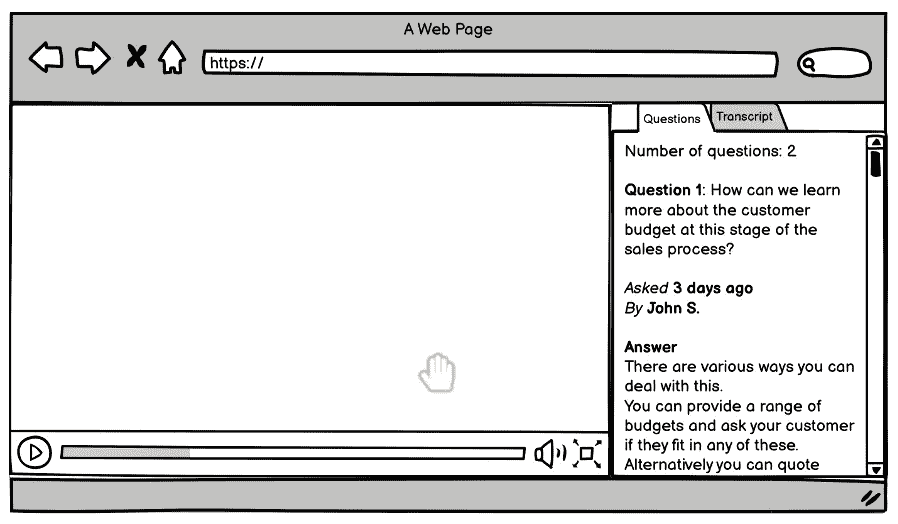

# 产品经理面试任务——学习世界，案例研究

> 原文：<https://medium.com/geekculture/product-manager-interview-assignment-learnworlds-case-study-bdfc00b8b8d0?source=collection_archive---------11----------------------->

## 产品方面

这篇文章是[系列](/@dtsirikos/how-to-nail-the-product-management-interview-assignment-7654685daa85)的一部分，回答了真实的面试任务。这份是 LearnWorlds 的产品经理职位。这项任务总计:

> **第一步**
> A .列举视频作为学习工具的几个缺点。
> B .提出 KPI 来评估你的产品的性能。
> 
> **第二步**
> 提出一些关于让视频更加社会化的改进，并描述一些用户故事。
> 
> **第三步**创建原型。

# 第一步

## 视频学习的缺点

A.视频作为学习工具的一些缺点是:

1.**它不是交互式的。**学生看到的是预烤版的课堂，无法实时提问。也没有和其他学生的互动，就像在典型的课堂环境中一样。

2.**很难深究细节。**与书籍相比，视频不能展示太多信息(不会变得太长而无法观看)，因此它更适合介绍一个主题，而不是分析它[1]。

3.**很难定位具体的语境。**一本书有一个目录，一个详细的索引和文本搜索功能[2]。即使有了章节索引，您可能仍然需要看几分钟的内容才能找到您感兴趣的部分(如果您从错误的章节开始，情况会变得更糟)。

4.**在发送方(即流媒体平台)和接收方(即学生)都需要高带宽**。

5.**难产。**对于初学者来说，教练最好学习摄影、照明和视频捕捉。然后，她应该准备并遵循一个脚本，做大量的编辑，以创建捕捉内容。

## 候选 KPI

B.我们假设情况是:

*   我们的公司(比如说“LW”)正在雇佣讲师(比如说“Ian”这个讲师)来制作视频。
*   另一家公司(比如“Acme”，客户)，正在购买视频培训服务，以便培训他们的员工(比如“Mary”，经理，即最终用户)。

为了评估 LW 产品的性能，可以使用以下 KPI:

**供给方(即指导者)** 1。可用课程的数量。
2。可用教师人数。
3。可用视频的数量和持续时间。
4。制作视频的成本。
5。教员费用(工资、福利等。)

**需求方(即客户/用户)** 6。客户订阅(公司/客户)。
7。取消的百分比。
8。总利润(总/每个视频/每个讲师/每个客户)。
9。平均利润(总利润/每个视频/每个教师/每个客户)。

Ian 作为一名讲师，可能会采用一套不同的 KPI 来评估他的视频课程的表现
10。消费内容的小时数(总/每个用户)。11。浏览量(总/每个用户/每个视频)
12。注册人数(总数/每个用户/每个视频)
13。每个视频的观看时间与标称视频持续时间，即如果用户不断跳过视频的某些部分，那么实际观看时间将少于标称视频持续时间。
14。视频评级(假设我们允许用户评价视频[3]):平均。评分和总评分数。
15。评论/问题(假设我们允许用户发表评论/问题):总/平均。每用户/平均值。每个视频/喜欢-不喜欢。

ACME 有不同的观点。ACME 进行任何培训的主要目的是向其员工(即学生)灌输新的知识/技能，而不管培训采用何种方法。因此，ACME 将用来测试通过视频学习是否是一个好主意的 KPI 可能类似于他们用来测试一般培训的 KPI。与其他培训方法相比，如果视频课程能够 a)获得更好的结果，或者 b)在更短的时间内获得相同的结果，那么它们将显示出优势。

考虑到这一点，ACME 可能用来评估视频课程/培训绩效的一些 KPI 包括:

16.认证通过率和分数(例如，员工在完成培训后需要参加认证考试)。
17。培训完成百分比。18。平均完成时间。
19。获得认证的平均成本。

# 第二步

在提出候选想法之前，我们可能需要:
a .与团队讨论，以便更好地了解我们面临的问题以及哪些是最重要的挑战。
b .倾听客户反馈，无论是支持票、论坛中的提及还是互联网上的其他地方(reddit 等)。).查看是否有相关的研究。d .看看我们的竞争对手迄今为止实施了哪些解决方案，以及哪些在现实生活中有效(或无效)。

## 主意

让我们首先围绕让视频课程更“社会化”的含义添加一些上下文。这个:

a.可能需要与:
i .指导者建立更多的互动。
二。看同一视频的那群人(姑且称之为“同学”)
三。其他:学生的一般朋友/熟人(不包括同学)。

b.可能有助于:
i .促进学生的学习过程。
二。认可学生参加/完成课程的成绩。
三。让其他人向学生建议新的/类似的课程。

在这方面，我们可以研究以下想法。

注意:我故意没有包括诸如用户论坛、徽章、在社交媒体上分享结业证书等想法。，因为它们相当普遍。

## 用户故事

A.以下是一些关于第一个想法的用户故事:“举手”。

(注意:代替“作为一个<role>，我<action>，为了<justification>格式，我们可以使用“给定/何时/然后”格式，它可以直接映射到行为驱动测试。然而，在这种情况下，用户故事会更长。)</justification></action></role>

1.作为一名学生，我可以在观看视频时举手向讲师提问，以便更好地理解课程。
*接受标准:* 【我的问题将是纯文本(即没有格式，如粗体，斜体，项目符号)。
“我的问题”可以包含附件和外部链接。

2.作为学生，我可以将我的问题标记为“私人”，以便不允许任何其他学生看到(只有讲师可以看到)。默认情况下，问题被认为是公开的。

3.作为一名学生，我可以看到我发送给教师的任何未回答的问题并删除它们，因此我不会问我已经找到答案的问题。
*条件:*
·我无法删除教师已经提供答案(或正在开始写答案)的问题。

4.作为一名学生，我可以看到我发送给教师的未回答的问题，并编辑它们，以便更好地表述我的问题。
*条件:*
我无法编辑教师已经提供答案(或正在开始写答案)的问题。

5.作为一名教师，我看到学生举手时提出的所有问题的列表，以便回答这些问题。
*验收标准:* 教师应能够根据问题文本、视频时间、学生姓名、发布日期对列表进行排序。排序应该按升序或降序进行。
教师应该能够过滤(搜索)以下列表:问题文本、视频时间从—到、学生姓名、发布日期从—到。
教师看到 20 页的结果(分页)。教师可以将页面大小更改为 10 / 20 / 50 条记录。

6.作为一名讲师，我可以为举手的学生问题写一个答案。
*接受标准:* 我的回复将是纯文本(即没有粗体、斜体、项目符号等格式)。我的回复可以包含附件和外部链接。

7.作为一名教师，为了节省时间，我可以同时为许多学生的问题提供相同的答案。

8.作为一名学生，每当导师回答我的一个问题时，我都会收到一封邮件和一条推送通知，以便不错过导师的回复。

9.作为一名学生，我在观看视频时，可以看到其他学生举手的要点，以便通过他们的问题获得见解。

10.作为一名学生，我可以查看和搜索其他用户发布的公共问题。

# 第三步

我们将使用 Balsamiq 为上面的用户故事#9 创建一个原型。我们的原型是桌面屏幕上的 web 应用程序。

当用户正在观看视频时，当提出问题时，一只黄色的手出现在视频的顶部(类似于脸书直播视频中出现喜欢的方式)。问题文本(和答案，如果有的话)会自动出现在右侧的“问题”选项卡中(淡入效果)。

1.我们可以让视频在用户点击黄色举手时暂停，以便学生可以阅读问题和答案(支持滚动)。这种方法也可以用在手机上。

如果我们想避免点击，我们可以暂停视频，如果学生在“问题”标签内移动鼠标指针。当学生将鼠标指针移回视频窗口内时，视频会自动恢复。(参见[https://stack overflow . com/questions/47381793/html-js-how-to-play-stop-video-on-hover](https://stackoverflow.com/questions/47381793/html-js-how-to-play-stop-video-on-hover)了解相关方法)。然而，这不是真正直观的，也不能在移动设备上复制。

2.在任何其他情况下，问题保持可见 4 秒钟，然后淡出，以免分散学生对视频的注意力。

除了到目前为止描述的快乐路径，我们还必须考虑边缘情况，看看我们的解决方案会如何执行。

## **边缘案例:问题太多？**

注意:可能会有这样的情况，不同的学生在视频的同一点上提出了许多问题。然后黄色的手和相应的问题会时隐时现，看起来好像在眨眼，这可不好。在这方面，我们可以尝试对问题进行分组:

**选项 1 —分组** 如果在视频的同一点上问了一个以上的问题(即每个问题之间的时间间隔不超过 10 秒)，那么我们会将它们视为一组，一个接一个地展示。问题总数显示在顶部，学生可以向下滚动查看其他问题。该组的第一个问题和最后一个问题之间的时间间隔不能超过 30 秒，以防出现第二组问题。

示例 A:在 01:20 询问 Q1，在 01:24 询问 Q2，在 01:50 询问 Q3。Q1 和 Q2 形成一个群体，Q2 是独立的。

例 B:01:20 问 Q1，01:29 问 Q2，01:39 问 Q3，01:49 问 Q4，01:59 问 Q5。Q1、Q2、Q3、Q4 组成一个组，而 Q5 不属于这个组，尽管它是在 Q4 之后 9 秒被询问的。

然而，这只是一个临时的解决方案，因为问题可能仍然会变得太多；在同一点上超过 5 个问题会使这个解决方案不切实际。

**选项 2 —限制** 另一种方法是总是只显示两个最新的问题。也就是说，在每 30 秒的视频中，我们找到被问到的问题，我们按发布日期降序排列，显示前两个问题。对于其余的问题，我们可以有一个链接(如“查看更多问题”)，将学生带到一个单独的页面，在那里他可以以自己的速度查看所有问题。

**尾注:**

[1]最佳视频长度在 10 分钟左右，最好不超过 30 分钟，来源:[http://site . Kaltura . com/RS/984-SDM-859/images/The _ State _ of _ Video _ in _ Education _ 2015 _ a _ Kaltura _ report . pdf？aliId=144122175](http://site.kaltura.com/rs/984-SDM-859/images/The_State_of_Video_in_Education_2015_a_Kaltura_Report.pdf?aliId=144122175)

[2]这可以通过让人们在视频文本中进行文本搜索并向他们展示视频中的相应点来改善。

[3]或者，我们可以允许用户喜欢/不喜欢某个视频，就像 YouTube 和网飞那样。