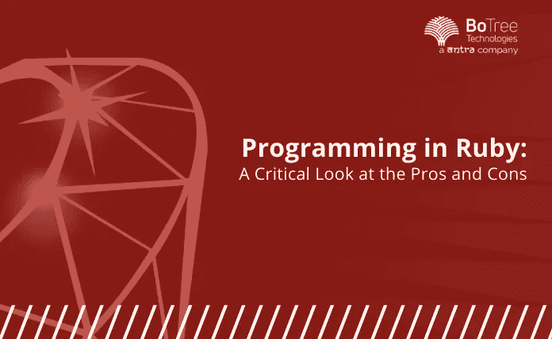

# Ruby 编程:对利弊的批判性审视

> 原文：<https://medium.com/geekculture/programming-in-ruby-a-critical-look-at-the-pros-and-cons-fef2cb9c36c9?source=collection_archive---------9----------------------->

Ruby 是一种编程语言，由 Yukihiro Matsumoto 于 1995 年创建。2000 年初，David Heinemeier Hansson 在开发一个名为 Basecamp 的项目管理工具时，对 Ruby 做了一些改进，并创建了一个框架，即今天的 Ruby on Rails。

Ruby 是一种解释型、高级、通用、面向对象的编程语言，支持多种编程模式。它的功能就像胶水代码，帮助 [**软件开发服务**](https://www.botreetechnologies.com/software-development-company) 为基本的东西创建定制的脚本，比如公共网关接口、命令行接口、应用包装器和外壳命令。它的设计强调编程效率和简单性，随着 Ruby on Rails 的引入，它越来越受欢迎。

*   Ruby 拥有 45，000 多颗 GitHub 星星
*   大约有 4000 名程序员为 Ruby on Rails 的发展做出了贡献
*   根据上的声明，一个高级 Ruby on Rails 开发人员在北美的平均时薪是 121-140 美元

选择编程语言就像选择一辆新车。有不同类型的汽车适合各种各样的人。应用开发也是如此。要做决定，学习曲线、成本、可扩展性等因素。，需要加以考虑。没有一种语言是完美的，但只有一种正确的语言。

在你决定 [**雇佣 ruby on rails 开发者**](https://www.botreetechnologies.com/hire-ruby-on-rails-developers)**之前，让我们来看看这种语言的利与弊。本文涵盖了 Ruby in Rails 的主要优点和缺点。**

> ***阅读更多:-* [*是什么让 Ruby on Rails 成为电子商务产品的完美选择*](https://www.botreetechnologies.com/blog/how-ruby-on-rails-supports-ecommerce-products/)**

# **Ruby 的优点**

*   ****开发速度:****
*   **当与 Rails 结合使用时，即使是复杂的应用程序编程也变得更快更容易。与其他语言相比，Ruby on rails 软件开发更加敏捷和快速。**
*   **敏捷的方法和少量的代码提高了开发速度。**
*   ****预算友好:****
*   **由于 Ruby 的开发速度很快，所以减少了生产时间，降低了生产费用。此外，Ruby 有一个伟大的开发人员社区，他们不断地为 GitHub 库做出贡献。**
*   **而且，市场上有很多经验丰富的 [**ruby on rails 开发服务**](https://www.botreetechnologies.com/ruby-on-rails-development) 。因此，公司可以以有竞争力的成本租用服务。**
*   ****工具和库:****
*   **Ruby on Rails 有几个被称为 GEMS 的内置库。gem 是开源的免费库，开发者可以使用它们来满足特定的 [**ruby on rails 应用开发**](https://www.botreetechnologies.com/blog/ruby-on-rails-why-choose-for-app-development/) 。**
*   **庞大的 Ruby 社区不断在 GitHub 等平台上分享。GitHub 上有 3000 多种 gem，这使得它成为 GitHub 库上十大贡献语言之一。**
*   **这些工具有助于改善软件设计体验，也有助于代码的调试和优化。**
*   ****与前端框架的兼容性:****
*   **Angular、Vue 等前端框架的流行。，是相当明显的。Ruby on Rails 拥有与这种前端框架的强大集成能力。**
*   **程序员可以选择任何框架，RoR 已经准备好毫不费力地快速使用它。**
*   ****遵守标准:****
*   **从用户界面到数据传输，Ruby in Rails 对应用程序的每个部分都有很强的 web 标准。**
*   **基于 Ruby on Rails 构建的应用程序遵循既定的软件设计范式，比如“按照惯例编码”、“不要重复”和“活动记录模式”。**

# **红宝石的缺点**

*   ****缺乏灵活性:****
*   **Ruby 在组件和模块之间有很大的依赖性，因此，它只是 web 应用程序开发的理想选择。使用 Ruby on Rails 开发具有特定和独特功能的应用程序具有挑战性。**
*   **路由、数据库迁移和其他要素使得创建产品的过程更加漫长。因此，必须在原创性和开发时间之间做出选择。**
*   ****性能缓慢:****
*   **说到 Ruby on rails 应用程序开发 的速度，ruby 是最快的语言之一。然而，就应用程序的性能速度而言，Ruby on Rails 并没有那么快。**
*   **最常见的情况是，性能速度受数据库连接的影响，它取决于开发人员的技能和代码的质量。**
*   ****文档质量差:****
*   **Ruby GEMS 的文档不是最新的，ruby on rails web 开发公司大量使用 Ruby GEMS 进行应用程序开发。虽然知名的库都有文档，但是尝试不太知名的库和 gem 可能会有风险。**
*   **在这种情况下，ruby on rails 咨询公司深受其害，因为他们必须反复检查所需的功能，从而影响生产速度。**
*   ****降低人气:****
*   **尽管 Ruby 被广泛使用，但它的受欢迎程度一直在下降。尽管开发人员和社区的数量有所增加，但该技术在应用程序开发中的应用并不广泛。**
*   **主要原因是框架需要陡峭的学习曲线。精通 Ruby on Rails 的开发人员通常已经是其他语言的专家了。**
*   ****错误的代价:****
*   **一个错误的架构错误或者任何其他判断错误，在开始的时候，都会减缓 [**ruby on rails web 开发**](https://www.botreetechnologies.com/blog/pros-and-cons-of-ruby-on-rails-for-web-development/) 服务的进度。这可能导致比任何其他框架更高的成本。在简单快捷的原型制作的掩护下，一个没有经验的 Ruby 开发人员可能会犯一些不明显的错误，这些错误可能会影响应用程序的性能。**
*   **由于 Ruby on Rails 是一个开放的框架，所有组件都紧密耦合并相互依赖，这样的结构缺陷将很难修复。**

> ***阅读更多:*[*2022 年 Web 开发的 7 个最佳 Ruby 框架*](https://hackernoon.com/the-7-best-ruby-frameworks-for-web-development-in-2022)**

# **结论:对 Ruby on Rails 的判决**

**Ruby on Rails 是最好的 web 开发框架之一。如果您的项目有严格的期限和预算要求，这是一个很好的选择。**

**庞大的开发者社区，大量被称为 GEMS 的内置库，以及 Ruby 应用程序的可维护性，使其成为 Airbnb、GitHub、彭博等项目的首选。**

**像任何 web 框架一样，Ruby on Rails 也有许多缺点。与其他框架相比，缺乏灵活性和缓慢的性能只是 Rails 的一些缺点。**

**任何平台的选择取决于需求和预算分配。在为你的产品选择框架之前，权衡 Ruby 的利弊，并将其与你的最终目标对应起来。**

***原载于 2022 年 4 月 21 日 https://www.itsmypost.com***。****