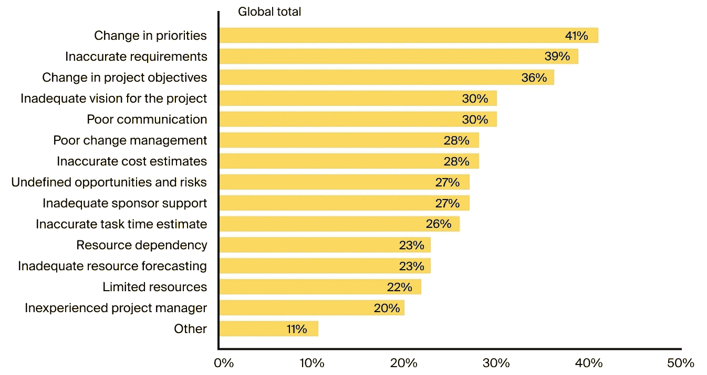
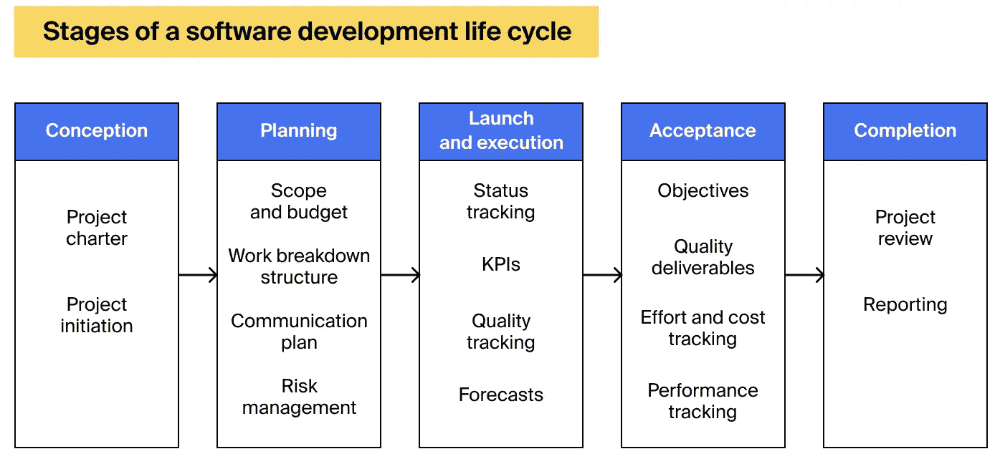
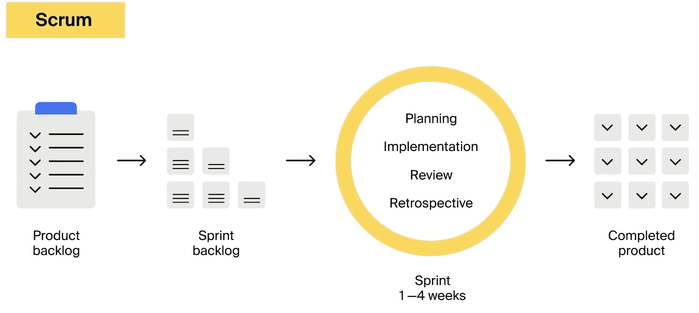
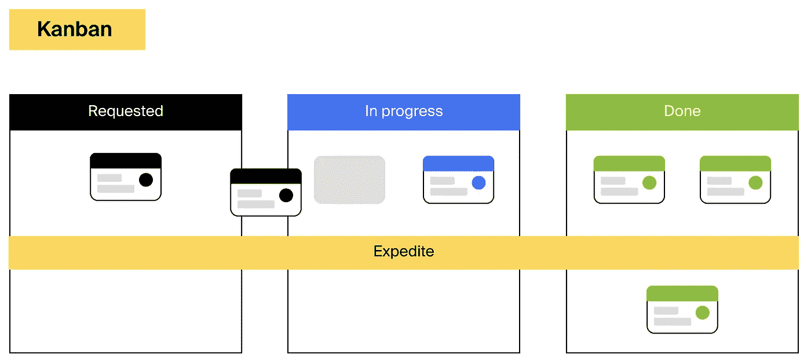
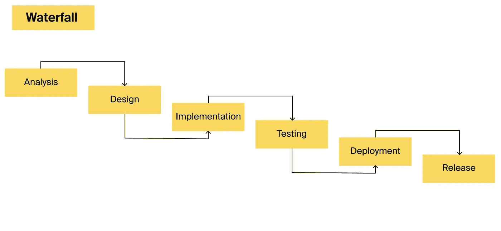
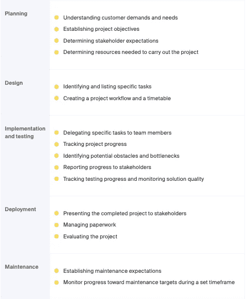
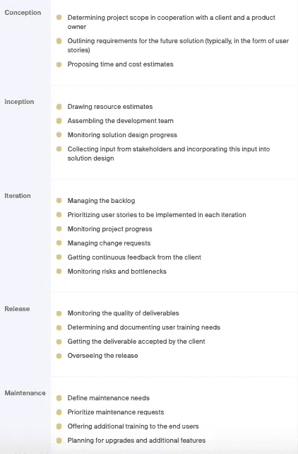

# 软件开发中的项目管理:关键问题解答

> 原文：<https://medium.com/geekculture/project-management-in-software-development-key-questions-answered-52271a1c98dd?source=collection_archive---------19----------------------->

你正在涉足软件开发。你有一个面向未来的想法，详细的需求，足够的技术专长，和一个熟练的团队。你只是缺少一个专业的项目经理。有了 said givens，你完成这个项目的几率有多大？

可悲的事实是成功的机会并没有那么高。各种研究表明，软件开发失败的主要原因大多与糟糕的项目管理有关。

管理软件开发项目中导致失败的常见错误是改变项目目标、不充分的沟通、糟糕的变更管理、不准确的成本估计、未识别的风险等等。

因此，为了确保你的项目不会失去控制，你必须优先考虑健康的项目管理。下面，我们分享我们在[企业软件解决方案开发](https://itrexgroup.com/)方面的专业知识，回答关于管理软件开发项目的尖锐问题。

# 项目管理对于软件开发项目的成功有多重要？

很快，非常。

软件开发项目通常非常复杂。对于一个被认为是成功的项目，它必须交付需求并保证高执行质量，同时在预算内按时完成。这就是项目经理的职责。

因此，[雇佣专门的人才](https://itrexgroup.com/services/dedicated-development-team/)来管理软件开发项目的好处是:

*   降低风险
*   项目经理负责有效的风险管理。在项目一开始，他们就规划、记录潜在风险并确定其优先级，同时设计风险应对策略。

应对风险的四种常见方式包括:

*   避免:消除或放弃威胁
*   缓解:减少威胁的可能性或影响
*   **转移:**将威胁分配或转移给第三方
*   **接受:**承认威胁并选择不解决、转移或减轻威胁。

为了提出适当的风险应对策略，项目经理可能会与团队召开头脑风暴会议，求助于故事板，或者采访来自运营各个部分的个人。有了风险管理策略，项目团队就更容易预见风险并及时预防风险。

*   更好地控制项目成本
*   成本超支在管理软件开发项目中很常见。因为它们不仅影响利润，而且阻碍项目的执行能力，一个有经验的项目经理会提出一个成本管理的最佳方法。
*   他们在整个项目生命周期中估算、预算和控制成本，旨在将支出控制在批准的范围内。健康的成本管理还有助于为利益相关者设定期望值，控制范围蔓延，提高项目投资回报率，以及监控长期成本趋势。
*   资源的最佳利用
*   软件开发中健康的项目管理有助于确保跨越人员、技能、时间、工具、设备和服务的所有项目资源得到有效的协调和利用。
*   在项目的[发现阶段，PM 估计、分配和计划所需的资源，并根据优先级分配它们。在开发过程中，项目经理跟踪资源利用情况，并消除任何可能阻碍项目完成的瓶颈。](https://itrexgroup.com/blog/product-discovery-choosing-between-waterfall-agile-kickoff/)
*   更好地控制项目范围
*   管理软件开发项目中的一个常见问题，范围蔓延最好避免。不受控制的变更会影响项目进度、预算、成本和资源分配，并危及里程碑的交付。
*   在软件开发中进行项目管理时，项目经理会建立一个变更请求程序，并确保每个新的需求都得到遵循。目的是避免不受控制的范围蔓延，并确保项目在预算内按时交付。一旦新活动被批准并添加到范围中，项目时间表和预算基线就会相应地更新。

# 什么是软件开发中的项目管理？

软件开发中的项目管理是在给定可用资源和约束的情况下计划、安排和跟踪项目活动的艺术。

> 如上所述，软件开发项目相当复杂，包括多个阶段。项目经理计划并监督这些阶段的项目执行。

根据[项目管理研究所](https://www.pmi.org/learning/library/project-management-middle-five-stages-6969)的说法，从项目经理的角度来看，软件开发生命周期有五个关键阶段。

*   项目构思

项目构思阶段的主要目标是确定核心项目目标、定义业务需求和起草工作说明书。后者首先应该包括未来解决方案的需求和项目交付时间表。项目构思通常需要所有项目干系人之间的密切协作，由业务分析师和项目经理牵头。

*   计划图编制

项目规划阶段是项目经理和项目团队的共同努力。项目团队设计解决方案的技术架构，并提出其外观和感觉。反过来，项目经理设计项目计划，制定工作分解结构，并准备项目进度表。该阶段的最终目标是清楚地了解项目范围，并为项目绩效监控奠定基础。

在这个阶段，项目经理还建立沟通和进度跟踪工具，以及未来部署的计划，定义验收标准。

*   项目启动和执行

当项目团队参与设计和测试未来解决方案时，项目经理监控团队的表现，消除可能阻碍项目工作的瓶颈，促进团队成员和项目利益相关者之间的沟通，记录项目进度，跟踪风险触发因素，并向客户或高级管理层报告。

*   项目验收

在项目验收阶段，解决方案或一组可交付成果被推广到试运行环境中，在那里进行 beta 测试。如果需要，开发团队提供必要的 fox。项目经理确保解决方案完全按时交付，并保证交付的软件符合约定的验收标准。在项目验收阶段，软件开发中项目管理的另一部分是准备用户指南、安装说明和其他项目文档。

*   项目完成

项目完成后，项目经理会召开回顾会，评估并记录整个项目的起伏。他们还确保交付物的全部范围被移交给客户/产品所有者，包括所有源代码、软件文档、开发环境等等。

这些基本阶段可以线性地相互跟随，或者允许更多的重叠——这取决于管理软件开发项目所选择的方法。

# 软件开发中的项目管理:流行的方法

最广泛使用的软件项目管理方法包括 Scrum、看板(都属于敏捷家族)和瀑布。

其他不太流行的软件开发项目管理方法包括:增量开发模型、螺旋模型、PRINCE2 和 Rational 统一过程(RUP)。

**Scrum**

Scrum 是软件开发中最流行的项目管理方法之一，它将开发过程分解成冲刺阶段，每个阶段两到四周。冲刺之前通常会有周密的计划。Scrum 非常适合具有高度不确定性的项目，它依赖于跨职能、自组织的团队，并接受基于观察和实验的增量开发思想。

软件开发中基于 Scrum 的项目管理与传统管理有些不同，因为没有 PM。相反，一个人的职责由产品负责人和 Scrum 主管共同承担。

**看板**

看板的特点是没有明确定义的迭代。这是一种管理软件开发项目的精益方法，有助于可视化项目范围，限制正在进行的工作，并确保工作的顺利进行。该方法使用物理或数字看板来代表团队独特的工作流程。

由于其性质，该模型非常适合支持和维护项目。

看板的另一个特点是对正在进行的工作数量进行限制。该方法旨在平衡范围和资源。任务在可用能力允许的情况下被拉出，而不是在请求时被推入流程。

管理软件开发项目的责任通常由看板的两个重要角色分担:服务交付经理和服务请求经理。前者负责提高工作流程的效率，而后者主要负责解释客户的需求和期望。

然而，没有必要雇佣额外的团队成员来适应看板规则。实际上，一个有经验的项目经理通常非常适合这两个角色。

**瀑布**

与敏捷系列相反，基于瀑布的项目管理将项目分解成不同的、连续的阶段。

传统上，一旦前一阶段完全完成，新的阶段就开始了。然而，现代瀑布项目允许一定程度的重叠。例如，对于测试团队来说，在开发过程中开始验证单个特性是很常见的。

管理软件开发项目的瀑布方法对于具有可预测范围的项目非常有效，但是，它可能会使开发团队措手不及，无法比竞争对手调整得更快。

既然瀑布式项目管理和敏捷式项目管理都有其独特之处，那么让我们深入探讨一下它们的主要区别。

# 瀑布和敏捷项目管理有什么区别？

现在让我们更详细地看看[管理实践在瀑布项目和敏捷项目](https://itrexgroup.com/blog/waterfall-vs-agile-how-to-choose-the-right-approach/)中有什么不同。我们将两者进行比较，因为它们比其他项目管理方法更常见，并且在两者中项目工作的组织方式上有显著的差异。后者影响项目经理的角色和职责(或敏捷中的相应角色)。)

**项目策划**

在瀑布中，如果不彻底了解您正在构建什么以及为什么要构建，就不可能前进。这就是为什么精心制作一份[详尽的软件需求规格说明书](https://itrexgroup.com/blog/guide-to-software-requirements-specification-document-benefits-expert-tips/)是瀑布项目中的头等大事。通常，SRS 是由业务分析师编写的。但是如果没有，项目经理可以接手。

另一方面，敏捷允许更多的灵活性。在旅途中引入产品和过程改进是敏捷方法的本质。规划活动通常提前一个冲刺阶段进行。积压是在所谓的冲刺阶段创建的。

在 sprint zero 期间，团队提出最少数量的用户故事，以转化为可工作的产品，并且可选地，为开发建立基础设施。短跑通常保持轻量级和高水平。

**项目范围管理和预算**

在瀑布中，解决方案范围必须在整个项目中保持不变。变更请求通过变更管理程序进行管理，并单独计费。敏捷软件开发中的项目管理在范围管理方面提供了更多的灵活性，但是很难评估范围变化对最终软件成本的影响。这影响了项目预算的方法。

在瀑布中，预算是自上而下的，受控的，并基于详细的业务案例。这种方法使得一旦需求被引出和分析，就有可能给出现实的成本估计。主要的缺点是，这种方法在易变的、不确定的和不明确的环境中不起作用，而软件开发项目通常就是这样。

敏捷管理软件开发项目成本的方式是对变化做出反应。这既是优势也是复杂性。敏捷预算与项目的结构和时间表相一致。由于它也遵循 sprint 结构，团队更容易适应变化的环境——而不会影响整个项目预算。项目经理只是在下一轮计划中重新调整支出。

**项目可交付成果**

通过走敏捷路线，公司在每次迭代后都会获得新功能或其他可交付成果的增量——无论是技术远景、工作特性还是 MVP。

另一方面，在经典瀑布模型中，直到项目结束，客户才真正得到一致的、可行的解决方案。全面测试活动也在开发过程的后期进行，这可能会影响上市时间。

**项目文件**

根据瀑布理论，在管理软件开发项目时，适当的、文档化的计划是必须的。项目需求必须预先明确，每个团队成员都应该知道。每个团队成员还应该了解他们在项目中的角色以及对他们的期望。这些信息通常也有文档记录，并在项目团队中分发。

瀑布团队在整个开发过程中经常参考文档，以便更容易跟踪进度。这是唯一的方法——考虑到通常根据瀑布管理的项目的长度和复杂性。文档记录发生在每个阶段，确保每个人都了解项目的进度，尽管模型是连续的。

虽然大量的文档有助于降低瀑布中的风险，但是它降低了敏捷中对变化的适应性。因此，在敏捷项目中产生较少的文档是很常见的。而且如果产生了，文档也保持简洁。

但是尽管有一个普遍的误解，敏捷方法中并没有什么固有地阻止团队创建尽可能多的文档。事实上，有些文件是绝对必要的。将用户故事添加到 backlog 中，绘制线框，记录客户会议是必须的。敏捷所建议的是更聪明的文档化过程，避免过长的文档。

# 项目经理的职责是什么？

基于管理软件开发项目的方法，项目经理的职责也会有所不同。让我们看看项目经理或相应的敏捷角色在项目的每个阶段具体做什么。

**在瀑布中**

项目经理是每个瀑布团队中最重要的角色。他们是负责交付品质量和项目按时完成的人。他们的主要职责包括监督项目活动和向团队成员分配任务。

现在让我们将项目经理的工作范围分成几个阶段。

**敏捷中的**

敏捷项目经理对每个 sprint 的待办事项进行优先级排序，监控开发进度，并在团队内部以及团队和涉众之间建立有效的沟通。他们还监控项目每个阶段的风险，并确保开发过程遵循敏捷原则。

这是项目经理在敏捷项目的每个阶段具体做的事情:

# 项目经理需要注意哪些陷阱？

管理软件开发项目成功的关键是能够预防和避免风险。一个优秀的项目经理应该注意的常见陷阱:

无法控制范围特别是在敏捷中，客户经常会要求额外的特性，这经常会使项目出错。因此，项目经理需要制定一个清晰的变更管理程序来防止范围蔓延。他们还需要确保涉众对项目时间表和资源的变化的影响有相同的看法。

**不是专注于满足交付日期**开发具有严格上市时间要求的产品，例如，需要在新学年开始前发布的教育应用程序或必须在圣诞节销售时推出的零售应用程序，项目经理需要在按时交付和确保高质量之间取得适当的平衡。

他们需要投入额外的精力来区分特性的优先级，并为每个要交付的特性设定最后期限。质量要求也必须提前定义，以避免在展示后出现问题。

**未能建立有效的沟通**软件开发中有效的项目管理需要有效和透明的沟通。建立一个是总理的主要职责。他们需要让团队了解涉众的决定，并定期通知涉众所有的项目活动、瓶颈和挑战。

对于团队成员来说，未能建立清晰的过程来遵循软件开发过程似乎是一种负担。尽管如此，还是有必要建立一个清晰的工作流程来适应项目的具体情况。它将组织工作并使期望变得清晰。

**依靠不熟悉的技术**项目经理需要确保工程团队在做出技术选择时专注于解决客户的业务问题。他们还需要验证选择的技术组合是否符合工程最佳实践。

另一个与技术相关的陷阱是未能在产品开发的早期阶段规划可伸缩性。因此，我们建议预先定义可伸缩性需求和其他非功能性需求。

**未能提前考虑推广流程**在开发的早期阶段，推广流程经常被忽视，这导致了部署过程中的重大延误。软件开发中健康的项目管理需要一个 PM 来确保在开发过程的早期就考虑到展示和安装问题。

# 如何在软件开发中进行项目管理:ITRex 的观点

我们与 ITRex 的首席项目经理 Alexander Belkavets 坐在一起，就 ITRex 的软件项目管理方法采访了他。以下是我们了解到的情况。

> 在为我们的客户选择合适的项目管理模式时，您依赖哪些因素？

Alexander: 选择这样或那样的项目管理方法背后有许多因素。最重要的是项目范围、预算和上市时间。

如果我们正在开发一个需要定期更新的产品，为最终用户持续产生价值，比如一个游戏应用，我们自然会选择 Scrum 或者类似 Scrum 的方法。

另一方面，如果我们正在开发一个政府实体委托的软件解决方案，这通常意味着预算是固定的，我们宁愿选择瀑布式的方法来确保所需的可预测性。然而，将开发阶段分成更小的迭代并不罕见。因此，我们经常求助于一种混合方法，这种方法允许我们从瀑布的可预测性和敏捷的持续改进和交付速度中获益。

> 还有其他因素会影响项目管理方法的选择吗？

**亚历山大:**当然可以。未来解决方案将用于的领域、认证需求、客户参与该过程的意愿以及影响项目的许多其他因素。

例如，在开发医疗保健解决方案时，通常会选择瀑布。在美国，比如说，在一种新型医疗设备上市之前，他们必须获得 FDA 的批准；这需要大量的文档，这不可能保证遵循敏捷。

> 作为项目经理，你的职责到底是什么？你管理我们客户项目的主要目标是什么？

**Alexander:** 我从两个角度看待我作为项目经理的角色。

第一个是:管理项目就是管理风险。软件开发项目容易遭受许多风险——从固有的错误需求到不充分的资源，再到不断变化的技术环境等等。项目经理在这方面的主要目标是最小化风险对项目的影响，从而最大化软件成功交付的可能性。

第二个观点是:管理一个项目正在成为一种集成者，使许多项目子系统，如开发、测试和部署，和谐地走到一起。PM 的关键目标是以一种触发更少风险并确保资源最大化利用的方式协调项目中的所有过程。

> 你能回想起一个项目吗？在这个项目中，选择的项目管理方法被证明是确保产品成功的决定性因素。

Alexander: 我们正在为我们的客户开发一个移动应用程序，我们用 Scrum 启动了这个项目。一旦我们发布了应用程序的第一个版本，并获得了第一个产品指标，我们就决定改用看板。

为了留住第一批用户，我们需要继续定期发布新功能，尽管两周的冲刺不再是必要的。看板允许我们调整 sprint 长度以适应新特性的复杂性，平均 sprint 为三到四周，所以我们保持交付速度，而不会给开发团队带来额外的压力。结果，我们的客户成功地留住并吸引了新用户。

> 因为敏捷团队被定位为自我管理，所以很容易相信一个项目也可以在没有专门的项目经理的情况下完成。是这样吗？

**Alexander:** 如果没有专门的项目经理，其中一个人的职责就必须分散到所有团队成员身上。人们仍然需要花时间对待办事项进行优先级排序、获取资源、报告以及执行其他重要的管理任务。但是在没有项目经理的情况下，这些任务将被委派给没有专业知识的人。这无助于最大限度地利用人才。

无 PM 方法可能适用于 3-4 人的小团队，但是当这个数字变大时，拥有一个专门的项目经理变得至关重要。

> *如果你对管理软件开发项目仍有未解的疑问，或者愿意将指导你的项目的责任交给有经验的合作伙伴，* [*联系 ITRex*](https://itrexgroup.com/contact-us/) *。*

*原载于 2022 年 10 月 24 日 https://itrexgroup.com***。**