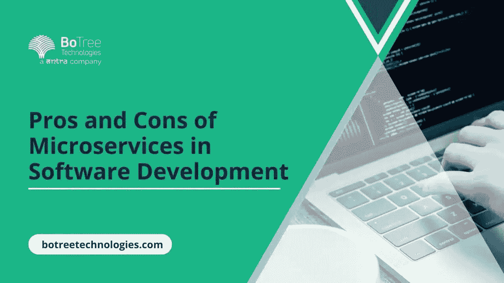

# 软件开发中微服务的利与弊

> 原文：<https://medium.com/geekculture/pros-and-cons-of-microservices-in-software-development-786835c71170?source=collection_archive---------16----------------------->

微服务指的是一种独特的架构，软件开发公司遵循这种架构来开发系统，这些系统试图专注于构建具有合适接口和操作的单功能模块。

作为一个开发框架，微服务是非常松散耦合的；因此，一个团队的更新不会损害整个应用程序。这允许所有团队快速构建他们各自的组件。

随着企业期望变得更加敏捷，并朝着 [DevOps](https://www.tntra.io/blog/why-devops-matters-in-innovation/) 和持续测试的方向发展，微服务的趋势已经增长。因此，微服务预计将从 2018 年的 6.832 亿美元增长到 2023 年的 18.80 亿美元，CAGR 为 22.4%。

微服务具有高度的可维护性和可测试性。此外，由于是松散耦合的，它们可以独立部署来组织业务功能。该博客将揭示更多关于微服务的事实，并解释为什么它们对一家[企业软件开发公司](https://www.botreetechnologies.com/enterprise-software-development-company)至关重要。

# 软件开发中的微服务:构建应用的一种方式

微服务架构在分解核心功能的方式上不同于传统方法。它的每个部分被称为一个服务；因此，它可以在竖井中构建和部署。此外，相应地，可以在不影响其他功能的情况下更新每个功能。这有助于包含 DevOps 的技术方面，并使一致的迭代和交付(CI/CD)更加平滑和可实现。

微服务是指独立于其他服务运行的应用程序的核心功能。微服务架构是关于以一种为不可避免的故障、未来可伸缩性和新功能集成做准备的方式来重组开发团队和服务通信。

> **阅读更多:**[**2022 年敏捷如何惠及定制软件开发**](https://www.botreetechnologies.com/blog/agile-benefits-custom-software-development/)

# 微服务架构的特点

1.  **各种组件:**

*   微服务可以通过软件开发服务分解成不同的服务。它支持独立部署服务，而不会损害应用程序的完整性。此外，它只允许中断一项服务，而不是重新部署整个应用程序。
*   这种方法的负面影响是，它包括昂贵的远程调用、粗粒度的远程 API，以及在组件之间重新分配职责时更高的复杂性。

**2。针对企业:**

*   软件开发中的微服务围绕着业务需求和优先级。不像传统的单一方法，只关注单一的服务，如用户界面、数据库等。
*   微服务架构利用跨职能团队。每个团队负责基于通过消息总线通信的单个服务开发特定的产品或服务。

**3。简单路由:**

*   在某种程度上，微服务的行为有点像 UNIX 系统。它们接收请求，处理请求，并相应地生成响应。这与其他产品很少起作用正好相反。
*   这里使用了用于消息路由、编排和应用业务规则的高科技系统。微服务有几个端点，帮助处理信息，应用逻辑和“哑管道”，信息可以通过这些管道流动。

**4。分散:**

*   由于微服务包括多种技术，中央控制系统下的老派方法可能更为优化。
*   软件开发解决方案服务偏爱微服务，因为它在一个分散的治理模型上工作。

与分散治理一样，微服务架构侧重于分散的数据管理。相反，单一系统在不同的应用程序中使用一个数据库。在微服务中，每个服务通常管理其唯一的数据库。

# 微服务在软件开发中的优势

1.  **开发速度更快:**

*   微服务最显著的好处是，它使[全球定制软件开发公司](https://botreetechnologies.medium.com/top-10-custom-software-development-companies-in-2022-5045e31cadd3)能够确保定制应用的快速开发和部署。
*   微服务方法有助于缩短开发周期。微服务架构基于[敏捷部署](https://www.botreetechnologies.com/blog/top-reasons-adopting-agile-software-delivery-approach/)原则工作，并在不同阶段更新。

**2。弹性**

*   微服务非常适合软件开发项目，因为它们确保了有弹性的应用程序开发。此外，微服务框架允许开发独立的服务，而不会对其他服务产生任何影响或暗示。
*   服务的独立开发确保了它们在正确构建时不会互相妨碍。因此，如果有时服务失败，整个应用程序不会停止运行，就像整体应用程序的情况一样。

**3。易于部署**:

*   微服务应用是模块化的，比传统的单片应用更小。这有助于应对部署带来的挑战。微服务需要更多的协调，服务网格层可以帮助这一点，但回报可能是巨大的。
*   微服务允许通过诸如 Jenkins、Hudson 等开源集成工具轻松集成和自动部署。

> **阅读更多:** [**开发者十大软件开发最佳实践**](https://www.botreetechnologies.com/blog/top-software-development-best-practices-for-developers/)

# 微服务在软件开发中的缺点

1.  **更高的复杂度:**

*   微服务有许多复杂性。这种复杂性给那些对微服务不友好的公司带来了严重的问题。
*   此外，由于微服务被分解为多个独立的服务，一个没有经验的[软件开发服务提供商](https://www.botreetechnologies.com/blog/what-services-does-a-software-development-firm-provide/) 可能需要帮助跟踪错误并解决它们。

**2。网络流量增加:**

*   微服务被设计成独立的，它们依靠网络相互通信。不幸的是，这会导致网络延迟，这意味着更慢的响应时间和网络流量的快速增加。
*   此外，当多个服务试图相互通信时，跟踪错误变得很困难

**3。对 DevOps 的依赖:**

*   一个强大的 DeOps 团队帮助一个[软件开发公司](https://www.botreetechnologies.com/) 做好微服务。之所以如此，是因为 DevOps 负责部署和管理微服务。
*   因此，如果没有一个好的 DevOps 团队，管理和部署基于微服务的应用是很困难的。

# 常见微服务示例

微服务适用于多个领域，可以用来提高多个企业应用程序的效率和性能。下面提到了一些使用案例-

1.  **批处理:**批处理活动包括一个过程，在这个过程中，许多任务被一起批处理，并作为一个单独的单元进行处理。微服务也可以用于批处理。批处理中的微服务已被证明可以提高性能和效率。
2.  **数据分析:**数据分析涉及多个来源的原始数据的积累。然后对大量数据进行分析，以获得必要的信息。微服务可以用来聚集来自各种来源的数据，然后使用 AI/ML 工具对其进行分析。
3.  **物联网应用:**物联网应用已经在各个领域变得非常流行。例如，它在使用传感器和物联网设备的制造、运输和公用事业组织中发现了大量的用途。

软件开发服务提供商可以使用微服务来开发物联网应用。微服务可以开发易于部署和管理的小型轻量级应用程序。

> **阅读更多:** [顶级 SaaS 软件开发案例研究](https://www.botreetechnologies.com/case-studies/saas-software-development)

## 结论

微服务架构帮助组织快速构建和部署业务应用。此外，它在构建应用程序时提供了比基于整体架构的应用程序更大的灵活性。

微服务已被证明有助于降低[软件开发解决方案](https://techsprohub.com/biggest-challenges-in-software-development/)的复杂性。因此，许多企业正在采用微服务架构，这对于开发公用事业业务应用程序至关重要。

[**联系我们**](https://www.botreetechnologies.com/contact) **今天免费咨询。**

**常见问题解答**

1.  **什么是微服务？**

微服务可以定义为企业软件应用程序开发的架构和组织技术。软件开发由小型的、独立的服务组成，这些服务通过定义良好的 API 进行通信。

2.**为什么要采用微服务？**

采用微服务开发流程的好处——

*   改进的可扩展性
*   更好的故障隔离
*   易于调试和维护
*   更容易接近和更开放

**3。有哪些公司使用过微服务进行软件开发？**

微服务允许企业快速构建、扩展和增强其最低可行产品(MVP)、概念验证(PoC)和全面应用。因为它有许多优点，所以被许多顶级组织使用。下面提到了一些[软件微服务示例](https://www.botreetechnologies.com/blog/customized-software-what-is-it-types-and-examples/)

1.  网飞
2.  亚马孙
3.  优步
4.  可口可乐
5.  Spotify
6.  电子港湾

*原载于 2022 年 11 月 30 日 https://www.botreetechnologies.com***。**