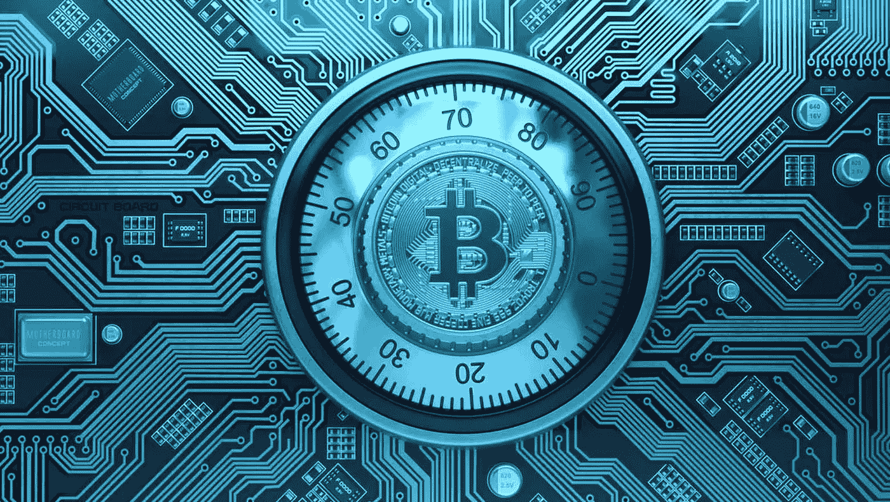

# 公共区块链:一个残局论题

> 原文：<https://medium.com/geekculture/public-blockchains-an-endgame-thesis-bb0351a03e02?source=collection_archive---------1----------------------->

## 以及对基本原则的呼唤。

当 Aptos 今年早些时候推出时，它加入了区块链公众争夺突出地位的大杂烩。而且，考虑到 Sui 即将推出，它不会是最后一个。

这让我思考公共区块链的最终结局。从阿尔格兰德到 Zilliqa，所有的第一层区块链都有未来吗？事实上，为了具有长期相关性，第 1 层*必须是什么样的*？

不幸的是，随着 FTX 的惊人崩溃，这个问题变得更加现实。(自我)怀疑的严寒已经蔓延到许多老前辈。大实验失败了吗？我们为什么在这里？

在这篇文章中，我阐述了一个关于公共区块链最终结局的论点。

TL；博士认为，区块链必须首先是一个**货币**和**政治**项目。如果一个区块链不能创造一个支撑主权数字经济(或“数字联邦”)的全球价值储存库，它将走向死胡同。

为了理解为什么，让我们从一些基本原则开始。

# 原则一:技术只是赌注

坚实的技术是任何区块链竞争的最低要求，但是——在足够长的时间框架内——它很难在一个基本开源的空间创造独特的卖点或经济护城河。如果第 1 层区块链的叙述是基于技术角度，如吞吐量或虚拟机，那么很快就会出现一个更好的替代方案，很可能是基于前者的代码。

这不是一个抽象的理论观点:第一层区块链，如 Avalanche、币安智能链和 Polygon，是以太坊更快、更便宜的克隆，而 Aptos 因其预期的吞吐量已经被描述为“[索拉纳黑仔](https://decrypt.co/112219/solana-killer-aptos-launches-its-highly-anticipated-mainnet)”。

简而言之，即使拥有技术优势是相关性的先决条件，它也不是获取长期价值的机制。第一层区块链肯定不止这些。

# 原则二:费用将趋于零

区块链陷入了为用户提供最低网费的激烈竞争中。

现有的智能合约平台以太坊正在通过各种“汇总”技术逐渐将交易从主链(L1)转移出去。这将降低对第一层区块空间的需求，进而降低天然气价格。较低的交易量*和*交易单位成本的结合将使以太坊的“费用收入”下降。

与此同时，以太坊的每一个挑战者都将高吞吐量和低交易费用置于其竞争设计和叙事的核心。

正如宇宙公司的桑尼·阿加瓦尔和扎基·马年最近解释的那样，对于第一层区块链来说，交易费应该“不是一个有意义的收入来源”，因为[“从长远来看，块空间将会很便宜”](https://www.youtube.com/watch?v=pO5OO5vOlys&t=4680s)。

*因此*，从长期来看，基于费用的应计价值的说法不成立:

1.  费用不会使区块链本地货币通货紧缩。
2.  对于股权证明验证者来说，费用并不代表本地资产的有意义的收益。
3.  不能依靠收费来覆盖网络的安全预算。

# 原则三:没有(有价值的)令牌，就没有安全性

在工作证明中，一个有价值的令牌激励矿工投资哈希能力。网络的[散列率](https://www.investopedia.com/hash-rate-6746261)越高，其遭受 51%攻击的脆弱性就越低。在股权证明中，代币的价格是总股权价值的关键因素。总股份越有价值，通过收购股份来破坏网络的成本就越高。简而言之，网络作为一个安全且可信的中立经济层的成功，不能脱离其本地令牌的成功。

# 长寿的论点

考虑到上述三个原则，我认为，一个公共的区块链只有在成功交付支撑繁荣的数字联邦的自主货币的情况下才会持久。

数字联邦的概念呼应了 Balaji Srinivasan 的同名著作[中描述的从“创业社会”到“网络国家”的旅程。它可以被理解为一个由共同利益联合起来的在线社区，基于一种道德创新并能够采取集体行动。](https://thenetworkstate.com/)

重要的是，创业社会的基本创新要有道德基础。它吸引的是“公民”，而不是消费者或雇佣兵。比特币的道德创新——本质上是货币和国家的分离——已经证明了它的持久力。另一方面，专注于成本或可扩展性的创新很难构成新社会的基础。

以道德创新为核心，一个创业社会也必须明确建立一个强大的社会层。正如巴拉吉所说，“社区建设在类固醇上”。但如果这个社会是建立在区块链基础上的，我认为另外两个方面值得特别关注:社会智能契约和本币。

## 社交智能合约

术语“社会智能契约”结合了 Rousseau 的社会契约概念和区块链的智能契约概念，表示约束区块链参与者的纲领性治理参数(或条款和条件)。

至少，区块链的社会智能契约应该支持抵制审查和可信的中立。如果 OFAC 能够有意义地发起或导致将伊朗或俄罗斯用户排除在某个特定的区块链之外，那么就很难找到这个区块链存在的道德前提。事实上，人们甚至可以质疑商业前提，因为这样的区块链有效地与从谷歌云到 Visa 的许可系统竞争。

除此之外，区块链的社会智能契约应该为进化变革和集体行动提供民主机制。这不仅关系到赋予“公民”塑造其“社会”未来的政治重要性，也关系到吸收创新和资助公共产品。Tezos 的社区治理模式是一个早期的例子，它促进了几个连锁升级和一个针对 tez 流动性的[补贴机制](https://news.tezoscommons.org/what-is-liquidity-baking-a-k-a-sirius-dex-140fc2bd0ac9)(通过通胀)。

## 本地资产

一种公开的区块链本国货币是其支柱，原因如下:

1.  根据原则一，技术是可以复制的，这使得本地资产成为创造粘性网络效应的关键工具。
2.  根据原则二，区块空间最终是一种廉价商品，使得原生资产成为区块链获取价值的唯一途径。
3.  根据原则三，如果本地资产的市场资本化没有达到临界质量，区块链的社会智能契约容易受到协调攻击。
4.  一个没有主权货币的数字联邦不是主权的，这使得它没有存在的意义。

许多第 1 层针对应用层进行优化，优先考虑可伸缩性和吞吐量，而不是关注本地货币。抛开由此产生的损害了社会智能契约的区块链设计，这种方法本末倒置。正如林恩·奥尔登[解释的](https://www.lynalden.com/lightning-network/)，这类似于在没有基础美元系统的情况下建立万事达卡或维萨卡:

> 这些[项目][牺牲]了某种程度的稳定性、分散性、不变性或可审计性，以优化自己成为更高吞吐量的交易媒介，尽管几乎没有人把它们作为价值储存手段。他们基本上只是在建立金融科技支付公司，并期望与 Visa 竞争，尽管用户体验差得多，速度慢得多，交易吞吐量也少得多。

为了清晰起见，区块链的应用层对于吸引开发人才和向世界输出实用程序至关重要。然而，如果没有一个强大的本国货币，它就变成了“现行法定体系的延伸”。这不仅扼杀了道德创新，而且对于收费趋于零的开源技术来说，在经济上也是不稳定的。正是由于这些原因，以太坊基金会的研究员贾斯汀·德雷克正在推动以太坊生态系统作为一种货币资产[【让以太成功】](https://www.youtube.com/watch?v=9q6RAQVkeZ4)。

针对原生货币的优化会牺牲应用层吗？随着模块化区块链建筑的兴起，事实并非如此。由最大程度分散的链保护的高吞吐量、定制虚拟机汇总的愿景离现实不远了。换句话说，“区块链三难困境”最终得到了解决。

达到临界质量的最有说服力的途径是将本地资产设计成**通用货币**。

在某种程度上，金钱是一种迷因，无论是以美联储、EIP-1559 还是金毛猎犬的脸为中心。然而，它也有设计方面。在后一个方面，你如何以最佳方式制造区块链货币？

首先，正如社交智能合约需要强大的加密货币才能可信一样，加密货币需要可信的社交智能合约才能强大。很难想象任何不可信的中立的、不受审查的东西会成为人民币或美元体系的替代品。因此，以下选择是有问题的:

1.  砌块生产商的高准入门槛。如果由一组基础广泛且易于获取的大宗商品生产商来维护，社交智能合约将更具弹性。相反，一个受限的验证集(无论是设计上的还是事实上的)会导致审查媒介和一种“精英捕获”。这是硬件要求、最小风险、设置简易性和停机惩罚严重程度等因素的函数。
2.  ****以投资者为中心的初次分配。很难想象一个真正的未来替代经济体系会被一小群交易所和风险资本家所拥有或操纵。****
3.  ****改变社会智能契约的框架薄弱或定义不清。可以通过清晰的民主程序修改的社交智能契约比可以通过非正式、秘密渠道共识修改的契约更可信——或者更糟，是一组管理密钥。****
4.  ****缺乏流动性的股权证明。**这种设计需要锁定原生代币，在某些情况下，将它们暴露在削减风险之下，以累积通货膨胀块奖励。随之而来的摩擦降低了总发行量中用于保障网络安全的比例——例如，以太坊仅由 ETH 供应的 [~12%](https://dune.com/hildobby/ETH2-Deposits) 来保障，这个数字对于 [Tezos](https://tzstats.com/) 和 [Cardano](https://cardanoscan.io/) 来说更接近 75%。这也不可避免地导致了流动性赌注衍生品的兴起。由于 LSD 倾向于将本地令牌集中在少数发行者手中，他们被称为[“卡特尔化阶层】](https://notes.ethereum.org/@djrtwo/risks-of-lsd)。(而且，如果 LSD 没有出现，如果你想让它可供使用，原生令牌将被征收通货膨胀税，这不是一个令人信服的货币设计)**

**最后一个反思是，令牌经济学必须优雅地平衡网络安全和货币稳健性的目标。在这里，第一个原则是，供应上限是一个被转化为可信度的设计缺陷。也就是说，如果按照原则一，费用不能成为令人信服的收入来源，那么对于区块生产商来说，唯一的长期补偿机制就是通胀奖励。你可以在 Arthur Breitman 的文章中阅读更多内容。**

**如果通货膨胀是必须的，那么这个链条应该被设计成动态地找到一个足够高的通货膨胀水平来补偿大宗商品生产者，但又不能高到损害储值质量。**

**业内没有结论性的设计，但我发现流动的股权证明是最有说服力的。在这种模式下，普通用户可以委托给验证者，而不会被锁定或面临巨大的风险。通过促进更广泛地获得通胀大宗奖励，流动性股权凭证降低了通胀的稀释性。如果通货膨胀没有稀释任何人，它在功能上是无关紧要的。至于证券预算，它是由验证者收取的佣金的总和，可以根据市场动态而变化。**

**_________________________________________________________________**

**总之，对于一个公开的区块链来说，唯一的结局是让数字经济以一种强大的自主货币为基础。所有技术和社会设计决策都必须反映这一点。**

**我不打算在这篇文章的结尾武断地谈论什么是第一层更好和更差。可能比特币已经赢了，也可能我们太早了。事实上，我相信这仍然是一个宏大的实验，没有一个区块链符合所有的条件。**

**但我会以呼吁行动来结束这篇文章。如果区块链技术作为一个政治和货币项目获得成功，它将为人类提供一些不朽的东西。如果它仅仅提供了菲亚特系统的开源扩展，或者一个[“全球性的、没有许可的、巨大的无价值数字资产赌场”](https://www.nicolasbustamante.com/p/the-end-of-my-crypto-explorations?sd=pf)，那就很难看出这有什么意义了。**

**所以，让我们逆流而行，回到首要原则上来。**

**在我们这个充斥着烟雾、镜子和欺诈的行业中，太多的建筑商基于盲目的模式匹配和欺骗性的社会证明标准做出决策。我们必须大声疾呼；改变从我们开始。**

**而且，在一个连加拿大都可以[冻结那些抗议政府政策的人的银行账户的世界里，区块链科技是人类自由唯一可见的先锋。它在实现这一愿景方面的成功应该是最重要的——不是因为意识形态的武断，而是因为这是这个行业是否有任何存在意义的核心。](https://www.businessinsider.com/trudeau-canada-freeze-bank-accounts-freedom-convoy-truckers-2022-2)**

**_________________________________________________________________**

***不理财建议。特别感谢* [*亚瑟·布莱曼*](https://medium.com/u/50f422e6e1a9?source=post_page-----bb0351a03e02--------------------------------)*[*巴拉吉·s·斯里尼瓦桑*](https://medium.com/u/f5a2e83d6d8f?source=post_page-----bb0351a03e02--------------------------------)*[*利恩·奥尔登*](https://medium.com/u/56936bc12146?source=post_page-----bb0351a03e02--------------------------------)*[*波里纳*](https://medium.com/u/923c922a6d67?source=post_page-----bb0351a03e02--------------------------------) *等人用他们的真知灼见启发了这篇文章。******

****有兴趣讨论这些想法吗？伸手到 helvantine@pm.me 。****