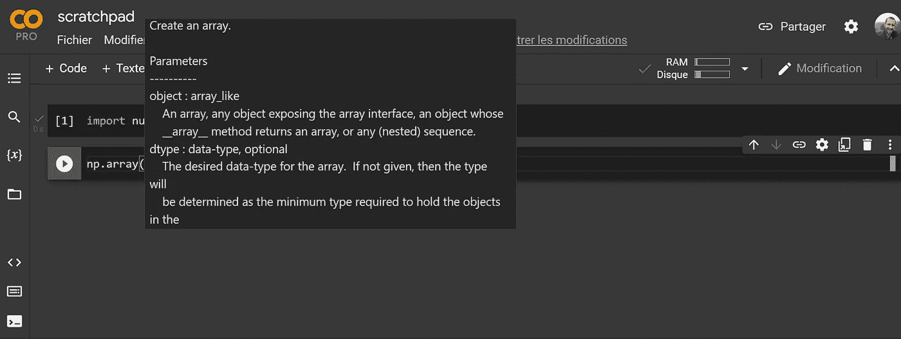

# 即使是数据科学家也应该知道的 Python 最佳实践

> 原文：<https://medium.com/geekculture/python-best-practices-even-data-scientists-should-know-b86b925b8d6b?source=collection_archive---------7----------------------->


Python logo from the official [python website](https://www.python.org/community/logos/).

## 如何让你的代码尽可能的简洁易读

在加拿大 Décathlon 担任数据科学家的近 3 年时间里，我的编码技能有了很大提高。然而，这种提高是非常渐进的，所以有时我很难评估到目前为止我学到了什么。

我意识到我学到了多少的一个时刻是当我审查新实习生或团队成员编写的代码时，他们不习惯在行业中编写 python 代码。有一些简单的最佳实践几乎总是不为新人所知，这就是我想在这篇文章中分享的。当您在 jupyter 笔记本中编写训练代码时，这些当然是有用的，但是当您编写脚本以将您的模型包含在完整的项目中时，这些就更有用了。

# 文档字符串

我对人们的第一个评论通常是关于他们代码的文档。描述你的每一个函数在做什么，它期望什么参数以及它返回什么是非常重要的。这可以通过两种方式实现，第一种是 docstrings。

docstring 是用来描述函数的字符串。它对任何阅读你的代码的人都有帮助，对使用你的代码的人也有帮助，因为文档字符串可以通过 ide 或 jupyter 笔记本很容易地显示出来。



Example of docstring displayed in a colab notebook

下面是一个非常简单的函数的 docstring 示例

你可以看到这个字符串包含了上面提到的所有元素，其他人不需要深入代码就可以知道如何使用这个函数。有许多样式可以使用，但所有样式都包含相同的必需信息。

当你想为你的代码库写一个完整的文档时，文档字符串也会变得非常有用。像 [sphinx](https://eikonomega.medium.com/getting-started-with-sphinx-autodoc-part-1-2cebbbca5365) 这样的包允许你从 docstrings 中自动生成文档，这样你可以节省很多时间。

# 类型提示

记录函数的第二种方法是使用类型提示，通常应该与 docstrings 结合使用以获得最佳的清晰度。这里的想法是在定义函数时包含每个参数的类型，以及返回的类型。这是我们之前函数的一个例子

有各种各样的基本类型，像`float`、`int`、`str`和`bool`，但是也可以通过从`Typing`模块导入更复杂的类型来使用类型提示。指定函数何时不返回任何内容也是一个好习惯。下面是一个更复杂的例子，它说明了类型提示的大部分思想。

除了对阅读您代码的人有用之外，许多 ide(如 pycharm)使用您的类型提示来帮助您避免键入错误。但是请注意，即使您没有完全遵守类型提示，您的代码也会运行良好。Python 不是像 C 这样的类型化语言，所以你只能得到警告消息。


Example of typing errors reported by pycharm

你可以在这里获得更多类型提示的例子[。](/depurr/python-type-hinting-a7afe4a5637e)

# 自述文件

每当你在 github 上做一个 Pull 请求来把你的代码推送到生产中，总会有一个 README 的更新来解释你添加的新特性。不要写得太多，因为这会让人们不愿意去读它，但是要确保使用你的代码所需要的一切都被解释清楚了。确保你的代码的总体思路也是清晰的。确保你的自述文件没问题的最好办法是把自己想象成这个项目的新成员。你需要什么信息来尽快开始处理代码？

另一方面，当你开始一个新项目时，**阅读自述文件**。它这样叫是有原因的。人们多次带着我几个月前写的自述文件中已经回答的问题来找我。

# PEP8

这是 python 代码首选的样式约定。它包含了很多各种各样的规则，可以在这里找到。这些是为了确保所有的 python 代码都有相同的风格和相似的视觉效果，不管它在哪里。

编码时最好记住这些规则，但是也有一些工具可以帮助你清理代码。像 pycharm 这样的 IDEs 可以告诉你应该在哪里改变一些东西。像`autopep8`这样的工具也可以自动格式化你的代码，但是要小心，因为有时它会过多地重新格式化你的代码，使其可读性降低。


Example where pycharm reports a PEP8 error

接下来是我最喜欢遵循的几条规则。

## 进口

这条规则起初看起来有点烦人，也不是很有用，但是当你习惯了它，你就会意识到它很有用。这个想法是为您的导入遵循一个简单的组织原则。将他们分成 3 组:

1.  python 附带的标准包
2.  您使用`pip`安装的第三方软件包
3.  本地文件和模块

然后在每个块中按字母顺序排列导入。这种编写导入的方式非常有用，原因有几个，最重要的是它标准化了所有的代码。第三方部分是你将会得到写你的`requirements.txt`文件所需要的信息的地方，如下所述。本地导入部分帮助您看到不同文件之间的相互依赖关系。这里有一个它应该是什么样子的例子。

要知道一个包是否是 python 的原生包，你可以谷歌一下它的文档。如果你在 docs.python.org 找到信息，那么它就是本地的。如果文档托管在其他地方，或者如果你可以在[pypi.org](http://pypi.org)上找到这个包，那么它就是一个外部包。

## 间隔

有许多关于空格的规则有助于使脚本更加统一。这个想法并不是说一种方法比另一种好。重要的是要有一个人人都遵守的统一规则。

*   总是在逗号`,`和冒号`:`后面加空格。
*   除了在函数的关键字参数中使用之外，像`=`、`-`、`>`这样的数学运算符要用空格括起来。
*   不要用空格将`()`、`{}`和`[]`这样的括号括起来。
*   用两个空行分隔函数。
*   避免任何尾随空格和带有空格的空行。

下面的例子展示了许多规则。

## 命名规格

Python 函数和变量使用 snake case，其形式为`my_function`。这些名称中不应有任何大写字母，也不应以数字开头。然而，全局变量应该用大写字母书写，以区别于局部变量。这个约定的唯一例外是类名，它应该使用 camel case 格式`myClass`。

# 要求

本节的第一个重要建议是，当您开始一个新项目时，请始终使用一个单独的虚拟环境。这可以用`venv`、`conda`或你想要的任何其他方法来管理。这里的想法是从一个空的项目环境开始，这样您就可以只安装您需要的包。这避免了包的不同版本之间的冲突，并帮助您跟踪所使用的版本。

除了虚拟环境，你应该**总是**在你的项目中包含一个`requirements.txt`文件。这是记录运行代码所需的 python 包以及所用版本的地方。如果你使用虚拟环境并正确组织你的导入，这个列表应该很容易制作。下面是一个文件示例，为了方便起见，列表是按字母顺序排列的。

有多种方法可以指定您想要的软件包版本。您可以用`==`询问确切的版本，但是请记住，当另一个包试图安装不同的版本时，这可能会导致问题。例如 *tensorflow* 需要某个版本的 *numpy* ，这可能与您需要的版本不同。为了避免这种情况，你应该使用`~=`来允许包版本中的一点变化。如果在包的不同版本中出现了突破性的变化，你可以最后用`>=`指定一个最小值(或者用`<=`指定一个最大值)。

如果您希望其他人能够执行您的代码，这个需求文件是必不可少的。如果他们使用错误的版本，他们可能会得到奇怪的错误，不能使用你的项目。当您想在生产中部署代码时，这一点甚至更重要，因为安装将自动完成，而不是手动完成。要使用该文件安装软件包，您只需

```
pip install -e requirements.txt
```

# 清除名称

即使您对变量和函数名称使用了正确的 PEP8 约定，也并不意味着您的代码就容易理解。给它们起一个有意义的名字也是非常重要的，这样人们就可以跟踪变量包含了什么或者函数做了什么。有时在名称中指定变量类型也很有用。让我们看几个例子，这样你就可以自己看了。

Can you tell what result_func is?

Which loop is the most readable?

# 列表理解

这个更高级一点，但是它有助于使你的代码更紧凑，避免为了完成一个任务而必须定义许多中间变量。一个将循环转换成列表理解的例子并不令人印象深刻，但是当一个函数中有很多这样的循环时，通过转换可以节省很多空间。这里有一个简单的例子来说明列表理解是如何工作的。

重要的是要注意不要过度使用列表理解。最终结果应该仍然易于阅读，因此避免使用这种方法进行复杂的计算。注意，理解也可以用字典来完成。

我仍然喜欢用许多习惯和技巧来改进我的代码，但这是一个很好的最佳实践范例，在编写代码时要牢记在心。这应该变得很自然，你应该在编码时自动完成，而不是在所有事情都完成后或在 PR 中得到评论时。

如果你有其他重要的最佳实践的例子，请在评论中分享:)