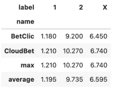
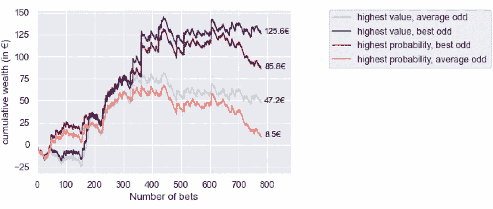

# 用 Python 定量下注:如何回溯测试价值下注策略

> 原文：<https://medium.com/geekculture/quantitative-betting-with-python-how-to-backtest-a-value-bet-strategy-1b8a0dc62a6c?source=collection_archive---------5----------------------->

## 分析变得简单

## 用数据打败庄家


定量投注在于使用数学和算法来下注，因为它可以在金融中完成。要做到这一点，有两个重要步骤。首先，你需要有预测，其次，你需要回测你的策略。回溯测试是一个简单的模拟，它将有助于理解一个策略的盈利能力，也有助于理解使用历史数据的风险。

本文将关注给定概率的策略的回溯测试。为此，我们将使用由[Sportmonks.com](http://Sportmonks.com)提供的数据和概率。在第一部分，我们将详细解释如何回测一个关于足球的交易策略**和关于价值下注的交易策略**。第二部分将重点介绍数据清理、常见错误和一个具体的例子。****

# ****如何对交易策略进行回溯测试？****

****回溯测试是量化交易和赌博的核心。使用历史数据作为赔率或概率，你可以测试假设。例如，你可以在一个特定的市场上测试一个价值赌注系统，试着找到盈亏平衡点，如何管理你的资金，甚至限制你的市场影响。****

****对假设进行回溯测试相当简单。我们只需重建过去某个特定时间的市场状况**，而无需使用此时**不可用的信息。这意味着不要使用你没有的赔率数据或不可用的概率，所以最好使用有时间戳的数据。****

## ****概率是关键****

****正如我们提到的，回溯测试的起点是收集数据。例如，以英格兰超级联赛 2 年的所有比赛为例，给出相关的赔率、结果和概率。几率和结果很容易找到，而且通常有很好的时间标记。但是找到正确的概率可能更难。****

****有两种获得概率的方法:自己建立一个模型，或者使用一个或几个外部提供者。在这两种情况下，您必须了解以下几点。****

******概率不能依赖于赔率:**事实上，你需要确保赔率不会被用来计算概率，尤其是对于价值押注模型。例如，不要在机器学习算法中使用赔率作为一个特征来进行概率预测。试图利用博彩公司的赔率击败他们是没有意义的。****

****概率不能使用未来的数据:这似乎是显而易见的，但这是一个常见的错误。例如，不要使用 2020 年 10 月之后的数据来预测该日期。你会得到乐观的预测。****

****虽然当你自己建立一个模型时，遵守这些规则是相对容易的，但是如果你使用外部预测就不是这样了，你应该非常小心地选择它们。事实上，数据提供者很容易在事后修改概率，或者使用样本内预测，再次得出乐观的结果。****

## ****回溯测试开门****

****现在我们有了过去一个赛季的概率、赔率和比赛结果，让我们回测一下**一个足球价值下注策略，**关注 1x2 市场。价值下注是一种非常常见的策略，本质上是利用博彩公司错误定价的赔率。我们不会详述战略，因为[有多种在线资源](/geekculture/why-beating-the-bookmakers-is-not-a-prediction-game-195ac921363a#:~:text=the%20answer%20is%20simple%3A%20because,will%20exactly%20lose%20the%20margin.)，但我们会更新主要步骤。****

****给定每个结果的概率 **1** (主队获胜)、 **2** (客队获胜)和 **X** (平局)以及相关的赔率，如果:****

********

****the value detection****

****如果找到一个值，我们就要下注。为了简单起见，我们将赌 1 个货币单位，例如 1€。****

> ****可以同时检测一个、两个或所有结果**的值。**在这种情况下，你不会对 3 种结果下注。你可以选择最高值或最高概率。这是一个你可以回溯测试的假设。****

****比方说，对于一场特定的比赛，我们发现“主队获胜”是一种价值赌注。因为我们有赔率，所以我们可以根据结果来计算我们下注的输赢金额。****

*   ****如果**主队赢了**，我们得到**赔率减去我们最初的赌注 1€。如果赔率是 3.2，我们的损益是 2.2€。******
*   ****如果 T18 主队输了或平了,我们将一无所获，减去我们最初的 1€赌注。在这种情况下，我们的 P & L 是-1€，这也是我们一次下注能承受的最大损失**。******

****就是这样。我们对样本中的所有匹配重复这些步骤，我们可以计算策略的性能。使用 Python，假设我们总是取最大值，用于主要回溯测试的伪代码将是:****

```
**cumulated_wealth = 0
for a_match in match_data: odds = a_match["odds"]
    probabilities = a_match["probabilities"]
    result = a_match["result"] value = bet_usd * probs - 1
    is_value = value * (value>0.) #value bet detection if is_value.max() == 0:
        #no values
        continue is_win_bet = result == is_value.idxmax()
    pnl = odds[result] * is_win_bet - 1 #P&L calculation cumulated_wealth += pnl# Example
# result: 'X'
# odds: pd.Series({'1':1.45,'2':2.87,'X':2.1})
# probabilities: pd.Series({'1':0.35,'2':0.1,'X':0.55})
# is_value: pd.Series({'1': 0, '2': 0, 'X': 0.155})
# pnl: 1.1€**
```

****我们现在有了测试策略的完美工具，还有资金管理、下注规模等等。在这个旅程的最后，你甚至可以建立一个交易机器人，它会根据策略规则自动下注。****

> ****回测的一个危险是过度拟合。当我们在你的策略中加入太多规则时，你的策略很有可能在未来不会像预期的那样发挥作用。例如，你可能会尝试在所有联赛中测试一个策略，并选择最好的一个来下注。显然存在过度拟合的风险。没有什么能告诉你，如果一个策略今年在一个联盟奏效了，它明年还会继续。****

# ****回溯测试价值下注策略****

****第一步是**获取数据。**为此，我们将使用 [sportmonks 的 API](https://www.sportmonks.com/) 。从中，我们可以得到多个市场的概率、结果和赔率。今天，我们将重点关注回测一个 **1x2 价值下注策略**。****

****第二步**是清理赔率**数据。事实上，我们需要确保在下注时赔率是可用的。假设**我们在开球前的最后 15 分钟**下注。举个例子，让我们用 2021 年 10 月 30 日的 Ekstraliga 女子联赛。这场比赛是 UJ 克拉科夫-塔尔诺维亚塔诺，比赛在世界标准时间**上午 11 点**开始。****

****赔率可用于 10 家博彩公司:888Sport、Bet-At-Home、BetClic、Betfair、Cashpoint、CloudBet、Dafabet、Pncl、Unibet 和 Bwin。下表显示了每个 odd 的时间戳****

********

****UTC timestamp of odds for UJ Krakow-Tarnovia Tarnów, 30 of October 2021****

****如你所见，并不是所有的赔率都是可用的。例如，Betfair 的时间戳是开球后 16 秒，或者 Cashpoint 赔率从 29 日起就没有更新过，这可能是事实，但最好还是放弃它。在这场比赛中，只有两个供应商将符合我们的要求: **BetClic 和 CloudBet。******

****现在我们知道了如何清理赔率数据，我们可以采用两组剩余赔率来计算损益。首先，对于每个结果，我们采用最大赔率。事实上，我们总是希望有最好的机会，但他们可能有点过于乐观。我们可以使用的第二组概率是平均值。所有器械包如下表所示。****

********

****The final set of odds****

****显然，“平均”集是不可投资的，但它可以作为一个代理，你总是可以找到高于或等于平均值的赔率，所以你的策略 P&L 被低估而不是高估。****

****在本文发表时，我们有 16114 场比赛在 2021 年 10 月到 2021 年 12 月之间，分布在 643 个联赛中。使用如上所述的价值下注检测器**，我们发现了 779 个价值下注**，大约是所有可用匹配的 5%。是的，价值赌注很少。现在让我们看看 P & L。我们将比较两种策略:****

*   ****如果检测到多个值，我们选择具有最高值的一个(bleu 中的策略)并下注 1€****
*   ****如果检测到多个值，我们选择概率最高的一个(红色策略),下注 1€****

****这两种策略都是为了最佳(暗)和平均几率(亮)。策略是按时间排序的，所以我们从旧的比赛开始，到最近的比赛。接下来的数字显示了€的累计 P&L。****

********

****Cumulative P&L for strategies****

****可以进行几项观察。首先，在这个样本中，概率显然有助于发现价值押注。事实上，所有策略都有正的损益。其次，我们想知道当检测到多个值时，使用最高概率规则还是最高值规则更好。在 779 次下注后，**最高值似乎比 40€表现得更好。******

****第三，我们来说说赔率。正如你所看到的，赌最佳赔率会产生 125.6€的总财富，而赌平均赔率会产生 47.2。减少了 35%以上。****

> ****“真正的”最终财富可能介于给你一个下限的平均奇数策略和给你一个**上限**的最佳奇数策略之间。****

****我们之前提到过，真正的最终财富大概在两个版本之间。事实上，你总是比平均水平有更好的胜算，但并不总是得到最好的胜算。原因可能是你没有庄家，赔率在你交易时消失了，赔率在移动，等等。****

****除了价值押注策略奏效这一事实之外，有趣的是，根据你的假设，你最终可能得到 125.6 的€P&L 或 8.5 的€，这是一个很大的差距。这就是为什么要记住 P&L 的方差可能会很高，这取决于您的假设，并且随着假设和测试的增加会变得更高。****

# ******结论******

****在本文中，我们描述了如何在实践中测试和验证价值下注策略。通过数据，我们展示了如何使用 python 对策略的历史性能进行回溯测试。****

****虽然在过去几年中，获得赔率、概率和比赛结果的数据变得更加容易，但这并不意味着工作已经完成。事实上，我们已经看到，清理数据以及测试假设是一个重要的步骤。验证一个策略和附属于它的规则是定量和算法赌博的起点。****

****然而，我们需要意识到我们可能面临的多重风险:过度适应风险、前瞻偏差、生存偏差或选择偏差等等。****

****回溯测试是一个很好的工具，它打开了发现定量策略的大门，在这种情况下，没有人做出决定，你让算法为你选择正确的赌注。****

****本文中使用的所有数据均可在 [sportmonks](https://www.sportmonks.com/) API 中找到，或应要求提供。****

## ****放弃****

****本文旨在向您展示如何对价值下注策略进行回溯测试。它不是赌博建议，也不鼓励你以任何方式使用概率数据进行赌博。本文给出的结果是模拟的。****

****此处包含的任何信息都不构成下注、投资或参与任何特定下注策略的要约(或要约邀请)。赌博涉及真正的损失风险，作者不对任何相关损失负责。过去的表现并不代表未来的表现；此处包含的材料仅用于教育目的****