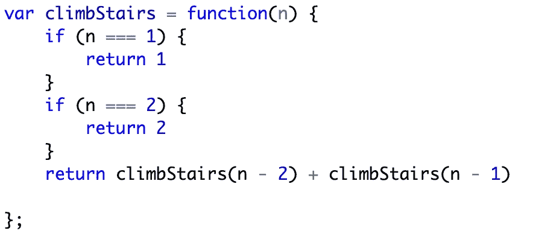
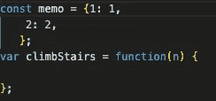
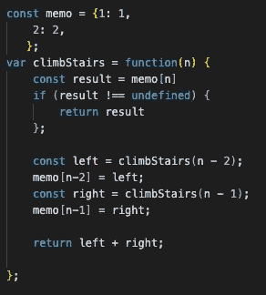

# 登顶:如何用 JavaScript 解决爬楼梯算法问题

> 原文：<https://medium.com/geekculture/reaching-the-summit-how-to-solve-climbing-stairs-algorithm-question-in-javascript-c4d49933e0e4?source=collection_archive---------7----------------------->

## 如何以高效的方式用 JavaScript 解决爬楼梯问题的分步演练

朋友们好，好久不见了。

我希望每个人都过得好&在这个疯狂的世界里保持安全。生活过得很快——自从我写了最后一篇博客后，我发现自己住在一个新的公寓里，丢失了一些关键的家具，因为它们在我搬家时被偷了，最后还从一家公司领取了一份全职薪水。

生活充满了惊喜，有好有坏。但我想这就是为什么我们每天早上起来，期待着意想不到的事情，并继续努力达到我们在所谓的生活之旅中试图达到的顶峰。


Photo by [Pascal Habermann](https://unsplash.com/@pascal_habermann?utm_source=medium&utm_medium=referral) on [Unsplash](https://unsplash.com?utm_source=medium&utm_medium=referral)

今天早上，当我坐在桌前时，我忍不住细数我的幸福。经过 8 个月紧张的求职(大约一年半前我拿到了全职薪水)，我终于可以说，一家公司决定给我一个机会。这个时机再好不过了——我的租赁协议即将到期，不确定性正在逼近。获得这份工作让我终于找到了自己的位置，我非常高兴。

然而，并非一切都是完美的。虽然在过去的一年里我发现了自己对编码的热情，但我发现自己并没有每天都积极地编码。事实上，我正在使用一个无代码平台，这种情况可能会持续几个月，甚至几年。

我决定向我以前最好的朋友 Leetcode 挑战，以保持我的技能敏锐…只能说我们的重聚并不那么友好。

下面是我(和一个朋友)如何解决这个具有挑战性，但名字却恰如其分的问题——爬楼梯的演练。

**如果您想直接跳到我最有效的解决方案，请向下滚动到标题* ***解决方案***

# 问题是

使用以下链接可以在 Leetcode 上找到该算法。如果您有困难，我建议您继续编码:

[](https://leetcode.com/problems/climbing-stairs/) [## 爬楼梯- LeetCode

### 提高你的编码技能，迅速找到工作。这是扩展你的知识和做好准备的最好地方…

leetcode.com](https://leetcode.com/problems/climbing-stairs/) 

*“你在爬楼梯。到达顶端需要* `*n*` *步。
每次可以爬* `*1*` *或者* `*2*` *台阶。有多少种截然不同的方式可以让你爬到顶端？”*


Just keep climbing

这个问题听起来很简单，对吗？好吧，让我们来看看 Leetcode 提供的示例测试用例:

**例 1:**

```
**Input:** n = 2
**Output:** 2
**Explanation:** There are two ways to climb to the top.
1\. 1 step + 1 step
2\. 2 steps
```

好的，这看起来很简单。如果 n = 2，我们可以很容易地确定我们有两种方式来走这两步——我们可以慢慢地&稳步地走，一次走一步，或者我们可以冒险，跳过一步，走两步。

让我们看看下一个测试案例:

**例 2:**

```
**Input:** n = 3
**Output:** 3
**Explanation:** There are three ways to climb to the top.
1\. 1 step + 1 step + 1 step
2\. 1 step + 2 steps
3\. 2 steps + 1 step
```

这个有点复杂，但仍然非常简单。基于简单的逻辑，我们可以很快确定有三种不同的方法可以到达 3 级楼梯的顶端——我们可以缓慢而稳定地前进，立即进行冒险的跳跃，或者在迈出第一步后再进行。

到目前为止还不错，对吧？但是如果 n=12，或者 n=45 呢？除非你是逻辑大师，否则我们要花一些时间来写下所有不同的可能性。

我被难住了&不知道下一步该做什么。但是后来我的朋友建议我们继续从 n=4 & n=5 开始，看看我们是否注意到任何模式。这就是我们的电灯泡时刻。

# 方法

如上所述，让我们采取老学校的方法，看看会发生什么。我们已经做了 n=2 & n=3。我会在这里列出结果:

2: [2]
- 1，1
- 2

3: [3]
- 1，1，1
- 2，1
- 1，2

到目前为止还说得通，对吗？对于 n=2 有两种不同的方法，对于 n=3 有三种不同的方法。让我们假设 n=4，n=5，n=6，看看会发生什么:

4: [5]
- 1，1，1，1
- 2，2
- 1，1，2
- 2，1，1
- 1，2，1

5: [8]
- 1，1，1，1，1
- 2，2，1
- 1，2，2
- 2，1，2
- 1，2，1
- 2，1，1，1
- 1，2，1，1
- 1，1，1，2

6: [13]
- 1，1，1，1，1，1
- 2，2，2
-1，1，2，2
-1，2，1，2
-1，2，2，1
-2，2，1，1
-2，1，2，1
-2，1，2
-1，1，1，2
-1，1，1

咻，走了那么多步——你的腿开始酸了吗？:)

让我们从爬楼梯中休息一下，看看我们到目前为止有什么:

2:[2]
3:[3]
4:[5]
5:[8]
6:[13]

注意到模式了吗？它可能不会立即出现在你面前，但是如果你仔细观察结果的数目，你会发现前两个数字加起来就是下一个数字！2+3=5, 3+5=8, 5+8=13

那么我们如何用代码来写呢？我们可以使用以下等式递归求解:

f(n) -> f(n-2) + f(n-1)

让我们以 4 为例，看看它会是什么样子:

f(4)
f(4–2)+f(4–1)
f(2)+f(3)
f(2)+f(3–2)+f(3–1)
f(2)+(f(1)+f(2))

如果你算一下，你会发现它加起来是 5，这是 4 个步骤的总数！

这应该是我们的答案吧？我们知道，如果 n=1 或 n=2，我们可以跳过这种递归方法，因为方法的数量等于数字本身，所以我们的解决方案可能看起来像这样:



但是等一下，当我单击提交时，我们得到以下错误:

*31/45 个测试用例通过。超过时限*

从技术上讲，我们已经有了解决方案，但是为什么会出现这个错误呢？如果你仔细想想，当 n 到达某个点时，我们当前的解决方案是非常低效的，因为它每次都递归地运行 ***，即使我们以前见过相同的 n。***

那么我们如何解决这个问题呢？我们可以采取的一种方法是将我们的结果存储在一个备忘录或对象中，这样我们可以节省很多时间。

# 解决方案

让我们首先创建我们的 memo 对象。不仅仅是一个空对象，我们可以立即设置我们的前两个键:1 和 2 的值对(因为我们已经知道每个的值等于它自己)。同样重要的是，我们把备忘录*放在我们函数的*之外——原因是如果我们把它放在我们函数的内部，每次我们的函数被递归调用，它就会*覆盖*我们之前拥有的对象！



由于我们将在每次迭代中检查备忘录，我们接下来需要检查备忘录中是否已经存在这个键。记住，这种方法的目的是提高我们的效率。如果我们已经添加了某个 n 的值，我们不需要再做一次，而是直接从对象中提取值。

例如，如果 n=5，我们的第一次迭代将检查 memo[5]是否存在于我们的对象中，它不存在。

然后我们回到之前的逻辑:

f(n) -> f(n-2) + f(n-1)

只是这一次，我们把我们的价值观保存在备忘录里。这样，在每次后续迭代中，我们将检查 memo[n]是否存在。

我们继续递归地这样做，直到我们添加了所有需要的键和值。

我们最终的代码看起来会像这样:



Our final code

# 结论

看起来很简单的问题结果却一点也不简单。然而，我从中得到的最大收获是，即使答案在开始时并不明确，我们也可以通过尝试更多的测试案例来识别可能存在的任何模式，从而朝着这个方向努力。答案可能没有你想的那么遥远！

我希望这个演练能帮助您更好地理解这个问题。至于我，我想我宁愿只是走楼梯，而不是再次尝试类似的事情。

下次再见，别忘了继续攀登顶峰。