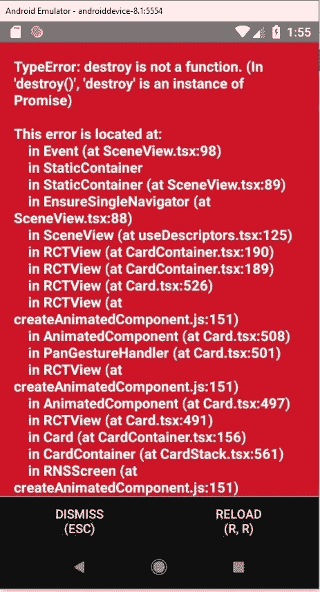

# React 未捕获的类型错误:destroy 不是函数

> 原文：<https://medium.com/geekculture/react-uncaught-typeerror-destroy-is-not-a-function-192738a6e79b?source=collection_archive---------5----------------------->



在 React 和 React Native 中试验 useEffect 挂钩时，我遇到了以下错误:

```
Uncaught TypeError: destroy is not a function
```

我的应用程序无法运行。经过调试和四处查找，我找到了原因和解决方法。

我的代码的简化版本如下所示:

这里的关键是“myFunction”是“async ”,以及我使用的快速箭头函数语法。

上面的简单代码导致我的应用程序崩溃的原因是由于 useEffect 钩子、异步函数和快速箭头函数语法的工作方式。

useEffect 钩子的一个特性是清理功能。如果从 useEffect 钩子函数返回任何东西，它必须是一个清理函数。该函数将在组件卸载时运行。这可以认为大致相当于类组件中的 componentWillUnmount 生命周期方法。

在 JavaScript 中，标有“async”关键字的函数允许使用“await”功能，该功能允许开发人员暂停函数的执行，同时等待异步任务完成。异步函数也总是返回一个承诺；如果函数还没有返回一个，返回值会自动包装在一个承诺中。

最后，简写箭头函数语法允许开发人员省略函数体周围的花括号，这对简单的一行程序很有用。函数体的值自动成为 arrow 函数的返回值，不需要' return '关键字。这种功能称为隐式返回。

现在，这些花絮是如何聚在一起导致如此神秘的错误的呢？简单来说，myFunction 的值，也就是一个承诺，变成了 useEffect 钩子中 arrow 函数的返回值。还记得 useEffect 钩子期望返回一个清理函数吗？承诺不是一种功能。所以 React 出错并产生错误。

要修复您的应用程序，请更改 useEffect arrow 函数以添加花括号并删除隐式 Return，如下所示:

现在，useEffect 钩子中的 arrow 函数返回' undefined ',这是可以接受的，并告诉 React 不需要清理函数。这将解决问题，但如果 React 在出现这种情况时给出一个更有用的错误消息就更好了！