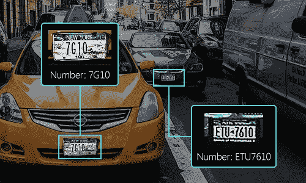
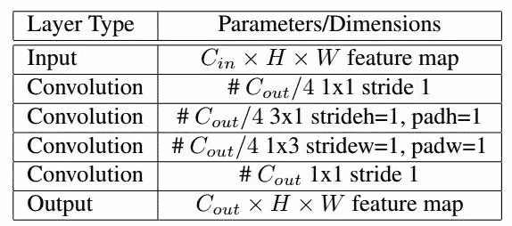
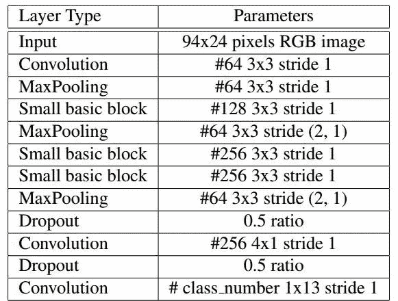
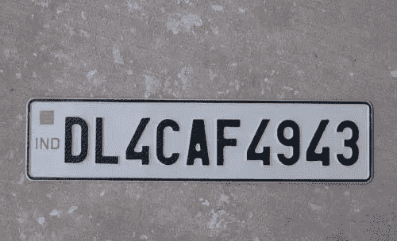

# 基于 LPRNET 的实时车牌识别

> 原文：<https://medium.com/geekculture/real-time-license-plate-recognition-with-lprnet-d650a023e8cb?source=collection_archive---------7----------------------->

Image from : [https://shahaab-co.com/mag/wp-content/uploads/2020/08/%D8%AA%D8%B4%D8%AE%DB%8C%D8%B5-%D9%BE%D9%84%D8%A7%DA%A92-1.jpg](https://shahaab-co.com/mag/wp-content/uploads/2020/08/%D8%AA%D8%B4%D8%AE%DB%8C%D8%B5-%D9%BE%D9%84%D8%A7%DA%A92-1.jpg)

自动车牌识别是一种从车牌中识别字符的系统。它是机器学习和深度学习的现实应用中最热门的领域之一。这可以通过多种方法实现。我们可以分割每个字符，并将其传递到光学字符识别管道，该管道将预测每个字符。虽然这是相当准确的，但它确实产生了许多问题。

基于 OCR 的方法计算量很大，这意味着它需要大量的计算，因此非常慢。由于车牌识别部分通常部署在自动车牌识别流水线的末端，该流水线还包括车牌检测和车牌校正(如果需要)，因此要求尽可能减少每个部分的计算量。

LPRNET 通过实现一个轻量级模型来解决这个问题，该模型将车牌图像作为一个整体作为输入，然后输出车牌号码，很酷吧？让我们看看它是如何做到这一点的。

模型架构非常简单。它由一个由 4 个卷积运算组成的基本块组成。该模型使用最大池操作来对特征图进行下采样，并且在最后一个和倒数第二个卷积操作之间引入 0.5 的比率丢失，以使该模型更通用。图 1 和图 2 显示了基本的块和主干网络架构。

Fig 1: Basic Block for LPRNET

Fig 2: Backbone Network Architecture

使用 CTC 损失来训练该模型，这是一种众所周知的用于解决输入和输出序列不对齐并且长度可变的情况的方法。

接下来，我们将讨论如何构建合适的车牌识别渠道。我的论文实现可以在我的 [**Github 库**](http://www.github.com/mesakarghm/LPRNET) 中找到。继续克隆 repo 以获得源代码。

> https://github.com/mesakarghm/LPRNET.git 的 git 克隆

# **工具和库**

这些是与这些库的特定版本一起使用的库。它们也可以在 github repo 的 requirements.txt 中找到。我建议您创建一个新的虚拟环境，并使用

> pip 安装-r 要求. txt

edit distance = = 0 . 5 . 3
Keras-Applications = = 1 . 0 . 8
matplotlib = = 3 . 1 . 1
numpy = = 1 . 20 . 1
tensor board = = 1 . 15 . 0
tensor flow = = 1 . 15 . 0
tensor flow-estimator = = 1 . 15 . 1
opencv = = 4 . 4 . 0

# 训练自定义模型

所有的工具和库都设置好了，你已经有了所有的代码，接下来，我们将看看如何训练我们自己的车牌识别器。在训练模型之前，我们需要收集数据集。这有点棘手。车牌的型号因国家而异。因此，如果你想训练一个可以在现实生活中使用的模型，你可能需要花一些时间来收集合适的数据集。在示例文件夹中可以找到一些示例图像。图像的文件名就是它的标签。如果你仔细看，每张图片的文件名都是“PlateNumber_randomnumber.jpg”。在训练过程中，我们提取车牌号码并实时将其转换为标签。

DL4CAF4943_123.jpg

一旦你收集了足够的数据，把它分成两个文件夹:train 和 valid。我建议使用 9:1 的分割比例，但是你也可以尝试其他的数字。现在我们已经设置好了一切，让我们继续学习培训脚本。

train.py 文件运行我们的训练操作。它由两个函数 parser_args()和 train()组成。函数 parser_args()返回 Python ArgumentParser()对象，该对象可用于提供命令行参数。您可以通过如下方式运行脚本来开始培训

> python train.py

默认训练和验证目录分别是“训练”和“有效”。您可以更改此值以及其他超参数，如 train_epcohs、学习率、batch_size 等。

> python train.py — train_dir”。/images”-批处理大小 32

默认情况下，训练运行 1000 个时期，每 25 个时期出现一次验证循环。最新的重量保存在每次验证循环中。/saved _ models/new _ out _ model _ best . Pb "。训练完成后，完整的模型和权重将保存在”。/saved _ models/new _ out _ model _ last . Pb "

# 使用训练好的模型进行预测

一旦我们完成了训练，我们就可以使用训练好的模型来执行预测。repo 提供了一个脚本 predict.py，可用于对图像执行预测。默认情况下，predict.py 会遍历“samples”文件夹中的所有文件，并输出预测的板号。

如果您在运行这些脚本时遇到任何麻烦，您可以在回购本身中创建一个问题，我将非常乐意帮助您。

看一下 LPRNET 论文原文 [**这里**](https://arxiv.org/abs/1806.10447) 。

# 进一步更新

本文还提供了使用定位网络进行空间变换的实现。我正在处理这件事，一旦完成，回购协议将会更新。
如果你对这个回购有任何更好的想法/概念，你可以随时发送拉式请求。我期待与你合作。

此外，这个博客是一个完整的 ANPR 管道的一部分，我们将涵盖车牌检测，车牌校正和车牌识别。在最终的解决方案中，我们将使用 WPOD 网络来检测车牌图像，对检测到的车牌执行空间变换，并对变换后的图像运行 LPRNET 以获得最终输出。我们还将使用 BeamSearch 的定制实现，使用语言模型代替 Keras CTC Decode 来提高我们的识别准确性。下一集再见。