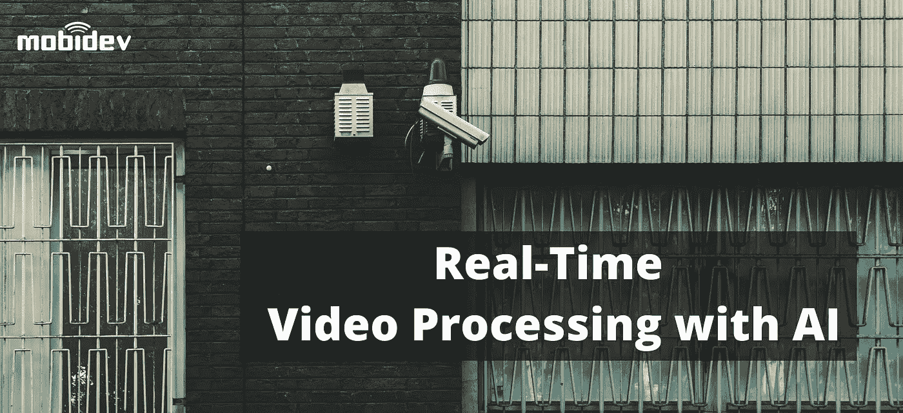
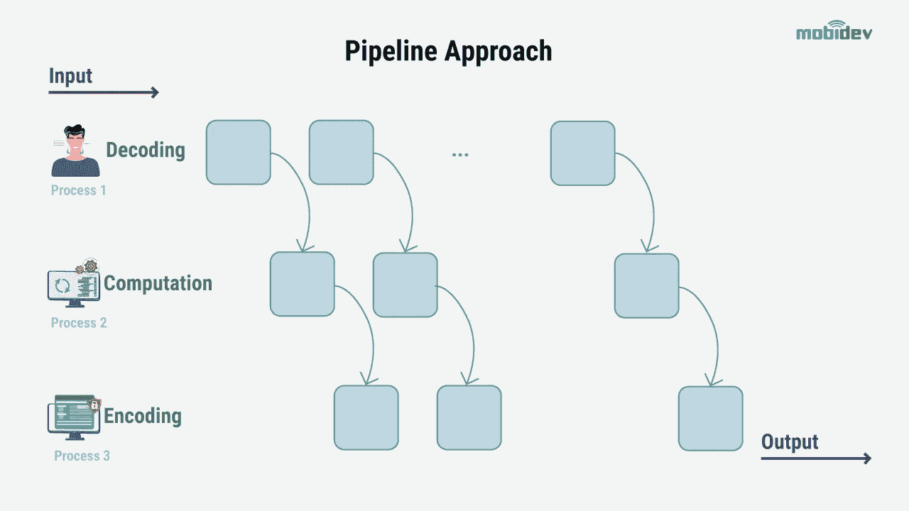
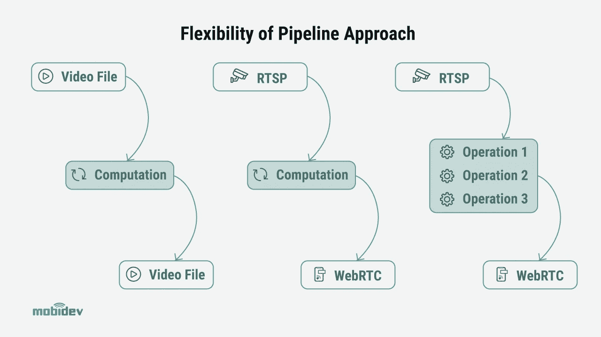
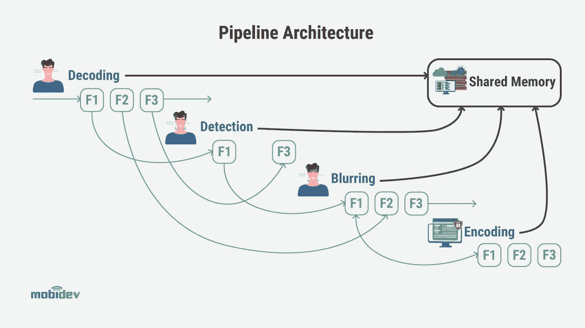

# 人工智能实时视频处理

> 原文：<https://medium.com/geekculture/real-time-video-processing-with-ai-4c38dd605165?source=collection_archive---------26----------------------->

[*Image Credit*](https://unsplash.com/photos/QQp9prhHNbQ)

本文是基于我们在构建实时视频处理产品方面的研究和专业知识，以及为应用机器学习和深度学习模型创建管道而撰写的。

当涉及到实时视频处理时，数据管道变得更加复杂。我们正努力将流媒体视频的延迟降至最低。另一方面，我们还必须确保实现的模型足够精确。

根据 dailyesports.gg 的统计数据，自去年以来，直播行业的观看时间增长了 99%。因此，它将完全改变球迷的体验，游戏，远程医疗等。此外，Grand View Research 报告称，到 2027 年，视频流市场价值将达到 1842.7 亿美元。

# 人工智能驱动的实时视频处理用例

训练有素的模型，能够检测某些对象，并不是一件简单的事情。然而，对于幼儿园的孩子来说，安全是重中之重。这些模型可能有助于防止，例如，孩子离家出走或溜出。或者，作为另一个例子，也是关于离家出走的，是离开农场、动物园或保护区的动物。

存储和处理面部图像以进行身份识别和身份验证的组织有时需要实施安全解决方案来确保隐私并满足 GDPR 数据保护要求。一些例子将是在流式会议等时模糊面部。通过 YouTube、闭路电视、私人频道或生产大楼和购物中心的安全摄像头。

用于缺陷检测的另一个领域[基于人工智能的视觉检测](https://mobidev.biz/blog/ai-visual-inspection-deep-learning-computer-vision-defect-detection)已经在制造工厂实施，这些工厂正在走向完全机器人化。所以，计算机视觉更容易辨别制造商的缺陷。利用视觉检查技术，深度学习方法的集成允许区分零件、异常和字符，这些零件、异常和字符在运行计算机化系统时模仿人类视觉检查。

# 如何加速实时视频处理？

我们正在解决的一个技术问题是，在直播时快速准确地模糊视频对象的面部，并且通过使用人工智能而没有质量损失。

简而言之，视频处理可以概括为一系列后续过程:解码、计算和编码。虽然这一系列过程的标准，如速度、准确性和灵活性可能会使第一次刷脸的容易程度变得复杂。因此，最终的解决方案在输入、输出和配置方面应该是灵活的。

为了加快处理速度，可以通过几种方式将精度保持在合理的水平:

1.  并行做某事
2.  为了加速算法

基本上，有两种并行处理的方法:文件分割和管道架构。

第一个，文件分割，是让算法并行运行，这样就有可能继续使用较慢但准确的模型。当视频被分成多个部分并被并行处理时，它被实现。以这种方式，分割是一种虚拟文件生成，而不是真正的子文件生成。然而，这种处理不太适合于实时处理，因为在时间旋转中可能难以在不同的位置暂停、恢复或者甚至移动处理。

Image by the author

第二个是流水线架构，即在不显著降低精度的情况下，努力加速算法本身或其部分。流水线方法不是分割视频，而是旨在分割和并行化在处理期间执行的操作。由于这个过程，管道方法更加灵活。

为什么管道方法更灵活？管道的一个好处是可以根据需要轻松操作组件。解码可以使用视频文件将帧编码到另一个文件中。

或者，输入可以是来自 IP 摄像机的 RTSP 流。输出可以是浏览器或移动应用程序中的 WebRTC 连接。有一个统一的架构，它是基于视频流的所有输入和输出格式的组合。计算过程不一定是整体操作。

Image by the author

# 如何实现管道方法

作为其中一个项目的一部分，我们必须使用人工智能算法实时处理视频。

流水线由解码、人脸检测、人脸模糊和编码阶段组成。在这种情况下，系统的灵活性至关重要，因为不仅要处理视频文件，还要处理不同格式的视频直播流。它在 30–60 的范围内显示了良好的 FPS，具体取决于配置。

# 跟踪插值

我们使用基于质心的跟踪算法，因为它更容易应用。但是，当有需要时，可以使用深度排序等其他算法。但是如果视频中有太多的人脸，它们真的会影响速度。这就是为什么要额外使用插值。

插值帧的质量如何？由于我们需要跳过一些帧，我们想知道插值帧的质量。因此，计算了 F1 度量，并确保不会因为插值而出现太多的假阳性和假阴性。对于大多数视频示例，F1 值约为 0.95。

# 共享内存

这个过程的下一个阶段是共享内存。通常，通过队列发送数据是相当慢的，所以在 Python 中在进程之间发送数据是完成这个过程的最好方法。

PyTorch 版本的多处理能够通过队列传递张量句柄，以便另一个进程可以获得指向现有 GPU 内存的指针。因此，使用了另一种方法:基于 POSIX API 的共享内存的系统级进程间通信(IPC)机制。在 Python 库的帮助下，进程间通信的速度得到了极大的提高，为使用这种内存提供了一个接口。

# 多个工作人员或多重处理

最后，需要为管道组件添加几个工人，以减少处理所需的时间。这被应用于面部检测阶段，并且也可以被用于不需要有序输入的每个繁重的操作。问题是，它实际上取决于在管道内部完成的操作。如果人脸检测比较快，增加更多的检测人员后，FPS 可能会降低。

管理多一个流程所需的时间可能比我们从添加流程中获得的时间还要多。用于多个工作器的神经网络将计算串行 CUDA 流中的张量，除非为每个网络创建单独的流，这可能很难实现。

多个工作者，由于它们的并发性，不能保证顺序与输入顺序相同。因此，例如，在编码时，需要额外的努力来固定流水线阶段中的顺序。尽管如此，跳帧可能会导致同样的问题。

因此，如果我们有 2 个工作人员运行一个带有 MobileNetv2 主干的模型，那么检测时间几乎减少了两倍。

Image by the author

# 如何开发基于人工智能的视频直播处理系统

将 AI 应用于视频直播流有多复杂？至于基本方案，实施过程包括几个阶段:

*   调整预训练的神经网络(或训练),使其能够执行所需的任务
*   设置云基础设施以支持视频处理并可扩展到某一点
*   构建一个软件层来打包流程和实现用户场景(移动应用程序、web 和管理面板等)。)

要创建这样的产品，使用预先训练的神经网络和一些简单的应用层需要 3-4 个月来构建 MVP。然而，细节是至关重要的，每个产品在范围和时间方面都是独一无二的。

我们强烈建议我们的客户从概念验证开始，探索主要和/或最复杂的流程。花几周时间探索最佳方法并获得结果，通常会确保进一步的开发流程，并为客户和工程团队带来信心。

由 MobiDev 的 AI 工程师 Serhii Maksymenko 撰写。

*全文原载于*[*https://mobi dev . biz*](https://mobidev.biz/blog/ai-computer-vision-real-time-video-processing)*。它基于移动视频技术研究。*