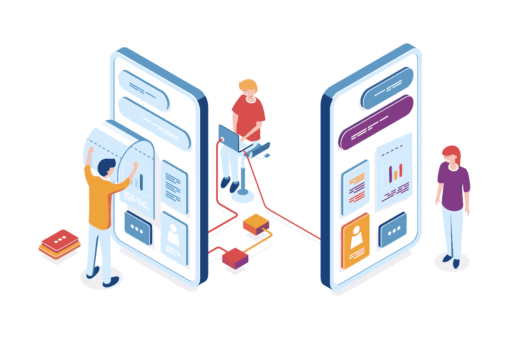

# 使用机器学习的推荐系统

> 原文：<https://medium.com/geekculture/recommendation-systems-using-machine-learning-e1d22b4a20fd?source=collection_archive---------22----------------------->

推荐系统是机器学习最成功和最广泛的应用。这些系统根据用户之前的相关数据过滤出产品给用户。如果用户以前没有任何历史，那么在这种情况下，推荐流行的产品。这些系统与我们今天看到的大多数科技巨头集成在一起，包括亚马逊、网飞、LinkedIn，以帮助用户发现新产品、电影和节目、工作等。

Source : Google Images

推荐系统一般分为**基于内容的过滤**和**基于协作的过滤**。这两种技术本身都是独一无二的，并且是基于用户-产品交互行为模式的。此外，这两种模式结合在一起构成了基于**混合动力的建议**。此外，在这样的领域中存在不同的模型，遵循不同的策略，但是现在在这个博客中，我们将研究协作的和基于内容的推荐系统。

## **1。基于内容的过滤**

基于内容的过滤模型捕捉用户的反馈和以前的行为，并向他们推荐新的类似产品。这个模型所依赖的参数是由用户的动作本身来决定的。用户以前的历史数据被提供给模型，该模型进一步充当向用户推荐的系统。

例如，让我们考虑电影领域下的推荐系统。我们有不同类型的电影，即冒险片、恐怖片、科幻片、爱情片、惊悚片等。

假设用户 **U1** 观看冒险类型的电影 **M1** 。他喜欢这部电影，给了 5/5 的评分。然后 **U1** 观看另一部同类型的电影 **M2** 并给出 4/5 的评分。所以我们看到这两部电影属于同一类型或同一内容，即*冒险*。这里要考虑的是内容。

再往前，如果我们考虑这两部电影， **M1** 和 **M2** 哪部是同一个内容下的，那么一部新电影或者一部已有电影假设 **M3** 的体裁——冒险的其参数——演员、导演、制作团队等。常见的有电影 **M1** 和**M2**会推荐给用户 **U1** 。这就是**基于内容的过滤**在推荐系统中的工作方式。

**优点**

1.  由于在推荐中基于内容的过滤模型特定于单个用户，因此该模型不需要关于任何其他用户的数据。
2.  由于该模型基于单个用户，因此它会推荐其他用户可能感兴趣或不感兴趣的特定于该用户的项目。
3.  用户满意度因为推荐是基于用户兴趣的。

**缺点**

1.  由于该模型基于单个用户进行推荐，因此对于其他用户来说，该模型没有任何用处。
2.  在这个模型中，自我定制的用户-产品交互只限于那个用户。
3.  只要用户不尝试不同的东西，新产品就不会被推荐给用户。

## 2.基于协作的过滤

协作过滤是一种用于过滤产品并将它们分配给多个用户的技术。这是一种向用户推荐感兴趣的新领域的有效方法，它充当了基于内容的过滤方法中的漏洞。通常，这种推荐方式不仅对单个用户有帮助，而且对在他们拥有的共同特征中匹配相似兴趣的一组用户也有帮助。

考虑场景中的两个用户——T2 U1 T3 和 T4 U2 T5。第一用户 **U1** 观看电影 **M1** 并给出 5/5 的评分，用户 **U2** 也观看电影 **M1** 并喜欢该电影，他也给出 5/5 的评分。然后 **U1** 和 **U2** 又不约而同地看了另一部同样的电影 **M2** 分别给出 4/5 和 5/5 的评分。因此，两个用户观看相同的电影，并且给这两部电影一个高评级。

现在，用户 **U1** 观看电影 **M3** 并给出 4/5 的评分，这意味着他喜欢这部电影。注意，这里用户 **U2** 没有看过电影 **M3** 。现在根据用户对电影 **M1** 和 **M2 的*相似度*和*心态*，将 M3** 推荐给用户 U2。这是因为用户对电影 **M1** 和 **M2** 显示的*相似的参数*(在这种情况下——电影评级)，这暗示用户 **U2** 喜欢电影 **M3** 的可能性很高，因此电影 **M3** 被推荐给用户 **U2** 。

**优点**

1.  基于内容的模型将它们的推荐扩展到新用户。
2.  该领域下的模型在多个用户活动上被训练，并且产品的推荐不限于单个用户。
3.  模型帮助用户发现他们范围之外的新兴趣和领域。

**缺点**

1.  可能存在用户不喜欢产品推荐的可能性。
2.  如果用户没有购买新项目或对其评级，则不能推荐新项目。
3.  用户可能对推荐给他们的产品的所有特性都不满意。

> 在基于协作的过滤中，考虑用户相似性，而在基于内容的过滤中，内容相似性是关键。

我希望这篇博客能够准确清晰地介绍业内现有推荐系统的概念和特点。

请随时在这些平台上与我联系—

1.  邮件:aryan.kenchappagol@gmail.com
2.  领英:[https://www.linkedin.com/in/aryan-kenchappagol/](https://www.linkedin.com/in/aryan-kenchappagol/)