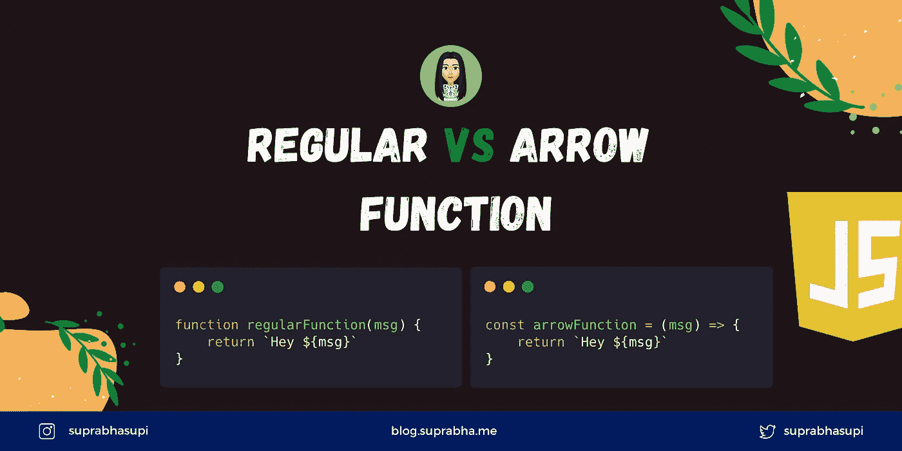

# 常规与箭头函数

> 原文：<https://medium.com/geekculture/regular-vs-arrow-function-1f8140fbcece?source=collection_archive---------0----------------------->



regular vs arrow function

用多种方式定义你的功能。

一种方法是使用`function`关键字:

```
// function declaration
function test(msg) {
    return `Hey ${msg}`
}// function expression
const test = function(msg) {
    return `Hey ${msg}`
}
```

您可以将**函数声明**和**表达式**作为普通/常规函数调用

箭头功能在 **ES6** 中介绍，也称为胖箭头功能。

```
const arrowFunction = (msg) => {
    return `Hey ${msg}`
}
```

正如你在上面的例子中看到的，两个函数的工作原理是一样的。现在问题来了，为什么我们需要正则或箭头函数。

下面我们来讨论一下👇

## 1.句法

## 2.参数绑定

## 3.这

## 4.新关键字

## 5.没有重复的命名参数

## 6.功能提升

## 7.方法

# 1️.句法

我们可以这样写法线和箭头函数😎

```
// ES5
var add = function(x, y) {
    return x + y
};// ES6
let add = (x, y) =>  x + y
```

# 隐性回报

在常规函数中，你必须使用 return 关键字来返回任何值。如果你不返回任何东西，那么函数将返回 undefined。

```
function regFunc() {
    return "Regular Function";
}
regFunc(); 
// Regular Functionfunction regFunc() {
    console.log("Regular Function")
}regFunc(); 
// Regular Function
// undefined
```

箭头函数在返回值时的行为方式相同。

如果 arrow 函数包含一个表达式，可以省略花括号，然后表达式将隐式返回。

## 如果只有一行陈述，则不需要

```
const addOne = (number) => number + 1;
addOne(10);
```

## `()`如果只传递一个参数，则不需要

```
let add = x => x + x;
```

## 如果没有争论

```
let arrowFunc = _ => console.log("Arrow Function");
```

# 2️.参数绑定

在常规函数中，Arguments 关键字可用于访问传递给函数的参数。

**例如:**

```
function regularFunction(a,b) {
    console.log(arguments)
}regularFunction(1,2)
// Arguments[1,2]
```

箭头函数没有参数绑定。

```
const arrowFunction = (a,b) => {
    console.log(arguments)
}arrowFunction(1,2)
//ReferenceError: arguments is not defined
```

但是，如果要访问箭头函数中的参数，可以使用 rest 运算符:

```
var arrowFunction = (...args) => {
    console.log(...args)
}arrowFunction(1,2)
// 1 2
```

# 3️.这

在常规函数中，这根据调用函数的方式而变化。

*   **简单调用:** `this`等于全局对象，或者如果使用严格模式，可能是未定义的。
*   **方法调用:** `this`等于拥有该方法的对象。
*   **间接调用:** `this`等于第一个自变量。
*   **构造函数调用:** `this`等于新创建的实例。

```
// 1️⃣ Simple Invocation
function simpleInvocation() {
    console.log(this);
}simpleInvocation(); 
// Window Object // 2️⃣ Method Invocation
const methodInvocation = {
  method() {
      console.log(this);
  }
};methodInvocation.method(); 
// logs methodInvocation object // 3️⃣ Indirect Invocation
const context = { aVal: 'A', bVal: 'B' };
function indirectInvocation() {
    console.log(this);
}indirectInvocation.call(context);  // logs { aVal: 'A' }
indirectInvocation.apply(context); // logs { bVal: 'A' } // 4️⃣ Constructor Invocation
function constructorInvocation() {
    console.log(this);
}new constructorInvocation(); 
// logs an instance of constructorInvocation
```

箭头函数没有自己的`this`，也不在函数内重定义`this`的值。

`this`在一个箭头函数内部总是从外部上下文引用这个。

```
var name = "Suprabha"
let newObject = {
    name : "supi",
    arrowFunc: () => {
        console.log(this.name); 
    },
    regularFunc() {
        console.log(this.name); 
    }   
}newObject.arrowFunc(); // Suprabha
newObject.regularFunc(); // supi
```

# 4️.新的

常规函数是可构造的，可以使用 new 关键字调用它们。

```
function add (x, y) {
    console.log(x + y)
}let sum = new add(2,3);
// 5
```

但是，箭头函数永远不能用作构造函数。因此，不能用 new 关键字调用它们

```
let add = (x, y) => console.log(x + y);const sum = new add(2,4); 
// TypeError: add is not a constructor
```

# 5️.没有重复的命名参数

在正常功能中，我们可以这样做:

```
// ✅ will work 
function add(a, a) {}// ❌ will not work 
'use strict';
function add(a, a) {}// Uncaught SyntaxError: Duplicate parameter name not allowed in this context
```

无论是在严格模式还是非严格模式下，箭头函数都不能有重复的命名参数。

```
const arrowFunc = (a,a) => {}// Uncaught SyntaxError: Duplicate parameter name not allowed in this context
```

# 6️.功能提升

在常规函数中，函数在顶部得到提升。

```
normalFunc()function normalFunc() {
    return "Normal Function"
}// "Normal Function"
```

在箭头函数中，函数被提升到你定义的地方。所以，如果你在初始化之前调用这个函数，你会得到 referenceError。

```
arrowFunc()const arrowFunc = () => {
    return "Arrow Function"
}// ReferenceError: Cannot access 'arrowFunc' before initialization
```

# 7️.方法

您可以使用正则函数在类中定义方法。

```
class FullName {
    constructor(name) {
        this.name = name;
    } result() {
        console.log(this.name)
    }
}let name = new FullName("Suprabha")console.log(name) 
// FullName {name: "Suprabha"}
```

您还需要将方法作为回调来应用。

```
setTimeout(name.result, 2000) 
// after 1 second logs ""
```

但是如果你绑定了`this`

```
setTimeout(name.result.bind(name), 2000) 
// Suprabha
```

通过上面的例子，你可以看到你必须将 this 绑定到上下文。

在 arrow 函数中，不必与上下文绑定。

```
class FullName {
    constructor(name) {
        this.name = name;
    } result = () => {
        console.log(this.name)
    }
}let name = new FullName("Suprabha")setTimeout(name.result, 2000) // Suprabha
```

# 何时不使用箭头功能👩🏻‍💻

**对象方法**

```
let dog = {
    count: 3,
    jumps: () => {
        this.count++
    }
}
```

当您调用`dog.jumps`时，count 的数量不会增加。这是因为它没有绑定到任何东西，并将从它的父作用域继承它的值。

# 参考🧐

*   [GeeksForGeeks 普通 vs 箭头功能](https://www.geeksforgeeks.org/difference-between-regular-functions-and-arrow-functions/)

# 摘要

在常规函数中，`this`值是动态的，在 arrow 函数中它等于外层函数的这个值。

在常规函数中，arguments 会给你函数中传递的参数列表，在 arrow 函数中 arguments 是没有定义的。

在常规函数中，你总是必须返回任何值，但是在 Arrow 函数中，你可以跳过 return 关键字，写在单行中。

在箭头函数中，参数应该是唯一的。

箭头函数中的提升问题，因为函数在初始化之前不会被调用。

感谢您阅读❤️这篇文章

🌟推特[👩🏻‍💻](https://twitter.com/suprabhasupi)[电子书](https://gum.co/css-pseudo-class-elements)🌟 [Instagram](https://www.instagram.com/suprabhasupi/)