# 远程队列定义:IBM MQ v9.2

> 原文：<https://medium.com/geekculture/remote-queue-definition-ibm-mq-v9-2-c3ec4f568dab?source=collection_archive---------7----------------------->

## 队列:点对点消息传递

## 面向消息的中间件(MOM)和异步通信

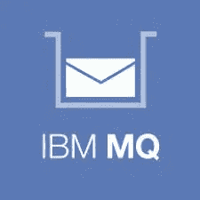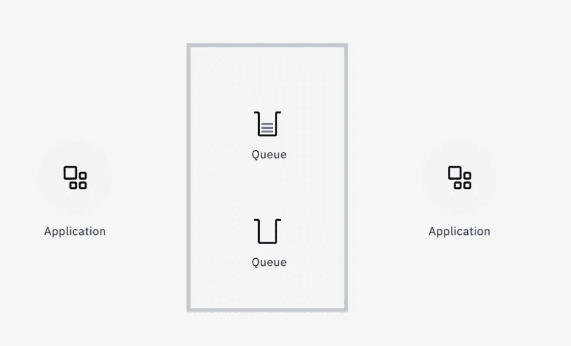

IBM MQ v9.2 [Message Oriented Middleware(MOM)]

# 范围

本文讨论 IBM MQ v9.2 消息中间件。涵盖了以下组件:
a .队列管理器
b .队列(本地、传输)
c .发送方、接收方和服务器连接通道
d .监听器
e .用于认证的系统对象
f .远程队列定义

# 观众

本文将帮助 ***初学者*** 和 ***中级*** 学习者理解和配置 IBM MQ，并开始异步发送和接收消息。

# 先决条件

a.IBM MQ v9.2 服务器***(***[***下载 IBM MQ 9.2.2 连续交付***](https://www.ibm.com/support/pages/downloading-ibm-mq-922-continuous-delivery)***)***
b .一个简单的使用 JMS API 发送和接收消息的 Java 客户端。

## **安装 IBM MQ v9.2 服务器**

a.下载文件包含一个压缩的 zip 文件夹。

IBM MQ v9.2 compressed zip

b.提取压缩的拉链。

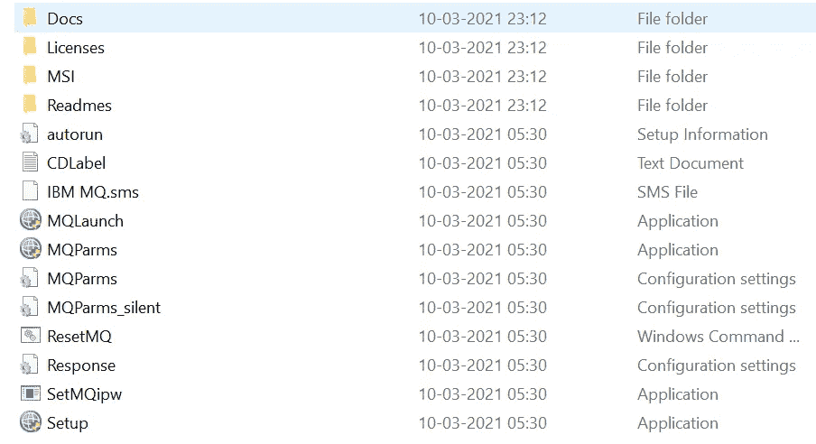

Extract compressed zip folder

c.启动**设置**并完成安装。
d .打开 MQ Explorer。

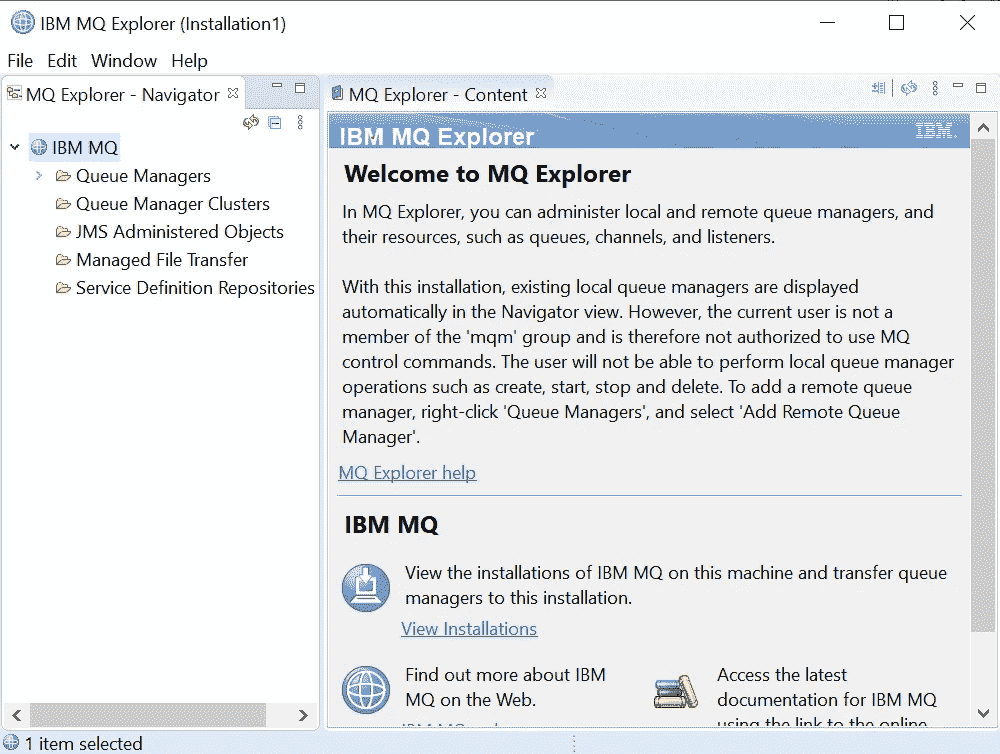

MQ Explorer

# 什么是点对点消息传递？

在点对点消息传递中，每条消息从一个生产应用程序传输到一个消费应用程序。消息通过生产应用程序传输，生产应用程序将消息放入队列，消费应用程序从该队列中获取消息。

# **一、队列管理器**

队列管理器是为应用程序提供队列服务的系统程序。它提供了一个应用程序编程接口，以便程序可以将消息放入队列，或者从队列中获取消息。队列管理器提供了额外的功能，以便管理员可以创建新队列、改变现有队列的属性以及控制队列管理器的操作。
要使消息队列服务可用，队列管理器必须正在运行。多个队列管理器可以在同一个系统中运行，通过远程队列定义来交换消息。

## 1.创建队列管理器:QM1 和 QM2

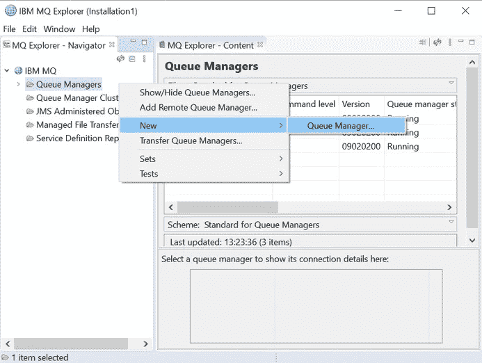

Create Queue Manager

## **在本练习中，我们将创建、配置并理解以下内容:**

两个队列管理器 QM1 和 QM2 演示远程队列定义。这意味着，从一个队列管理器 QM1 向另一个队列管理器 QM2 发送消息。

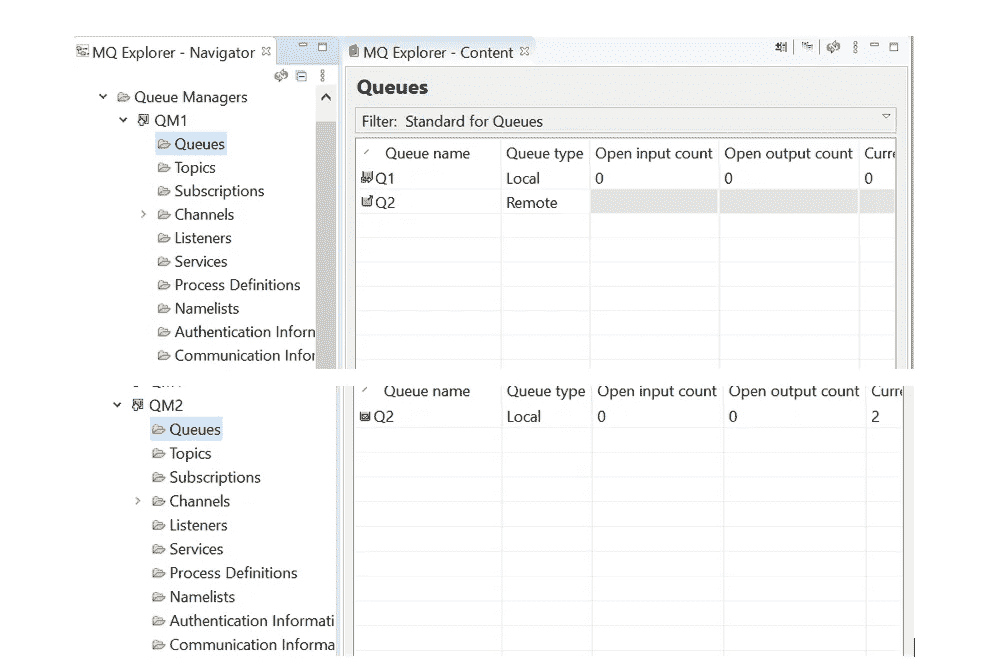

Create Queue managers and Queues

# 二。长队

消息可以发送到的命名目标。消息在队列中堆积，直到被服务于这些队列的程序检索到。

## 1.在 QM1 中创建本地队列 Q1

如果您看到下面的配置，本地队列被配置为**发送**消息。

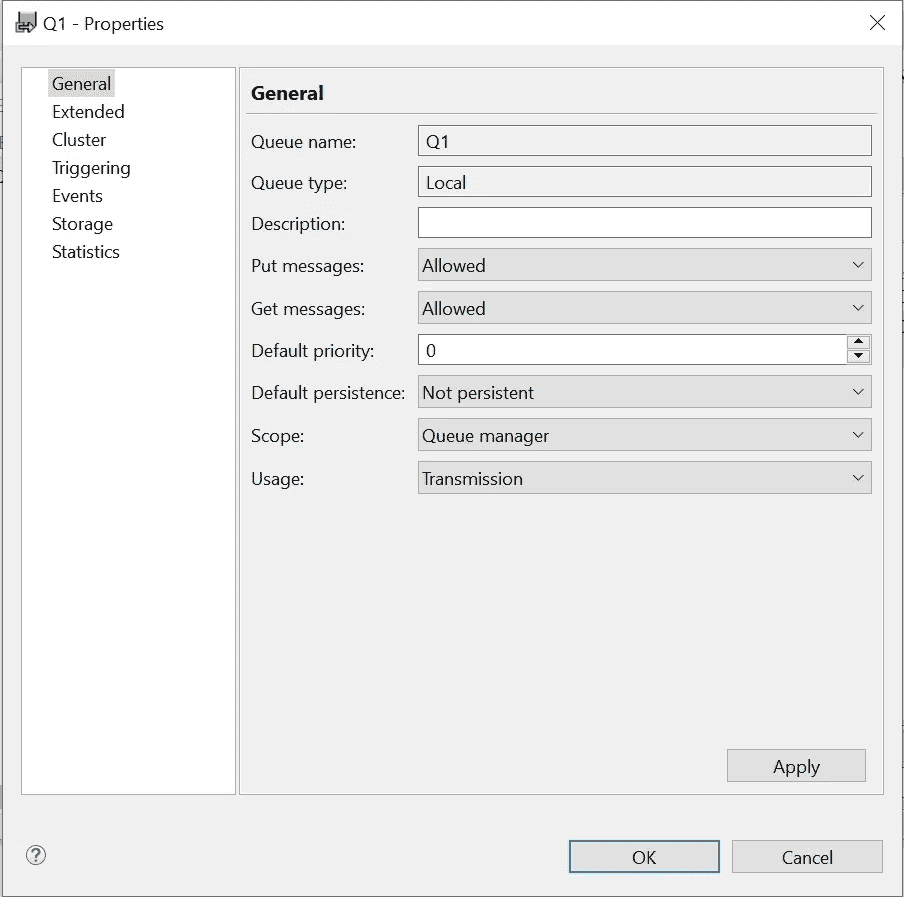

Configure local queue Q1 in QM1

## 2.在 QM1 中创建远程队列 Q2

如果您看到下面的配置，远程队列被配置为通过传输队列 QM1 的 Q1]向[QM2，队列 Q2]发送消息。另外，QM1 的远程队列名 Q2 应该与 QM2 的本地队列 Q2 相匹配。

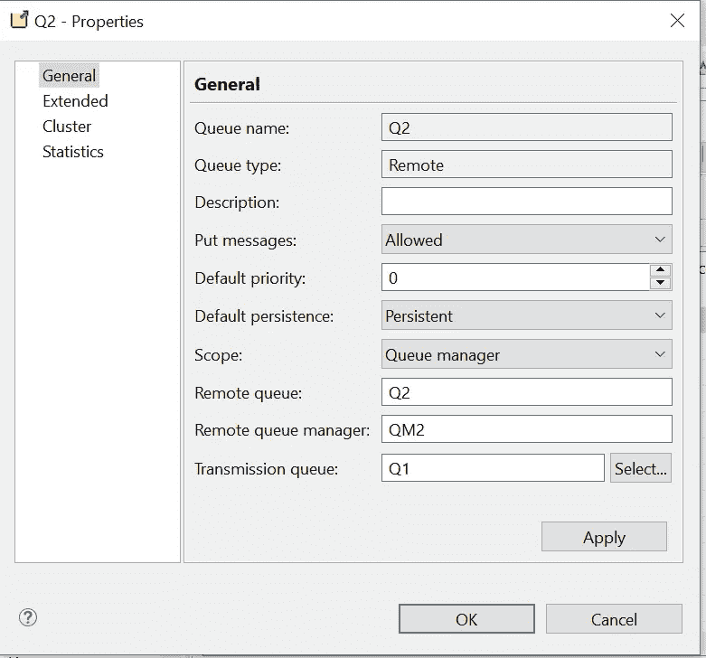

Configure remote queue definition in remote queue Q2 in QM1

## 3.在 QM2 创建本地队列 Q2

以下配置显示本地队列 Q2 已被配置为接收消息的目的地。

Configure local queue Q2 in QM2

# 三。频道

通道是提供从一个队列管理器到另一个队列管理器的通信路径的对象。在分布式队列中，通道用于将消息从一个队列管理器移动到另一个队列管理器，并保护应用程序不受底层通信协议的影响。队列管理器可能存在于相同或不同的平台上。

## 消息通道代理(MCA)

消息通道代理是通道的一端。一对消息通道代理(一个发送，一个接收)组成一个通道，将消息从一个队列管理器移动到另一个队列管理器。我们在 QM1 中创建一个发送方通道，在 QM2 创建一个同名的接收方通道，如下所示:
**端口号为** **1414** 的发送方通道，**端口号为 1415** 的接收方通道。

Configure sender and receiver channel

下面的配置显示**，**发送方通道**连接名称**被设置为指向目的队列管理器 QM2 的**主机名和端口号。**

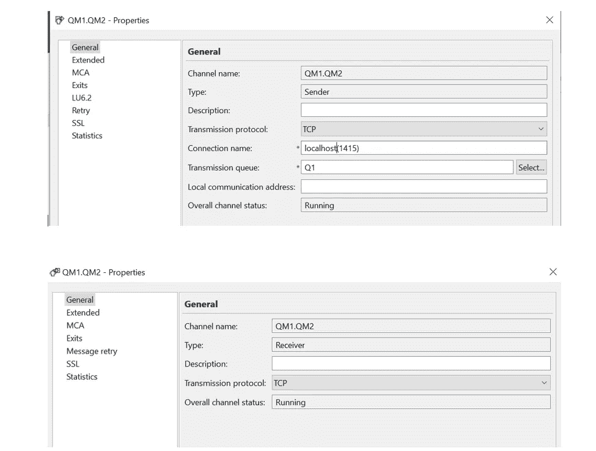

Channel configuration

# 四。听众

侦听器是一个 IBM MQ 进程，它侦听到队列管理器的连接。
MQ Explorer 中的每个监听器对象代表一个监听器进程；但是，如果您从命令行启动侦听器进程，那么在 MQ Explorer 中侦听器不会由侦听器对象表示。因此，要从 MQ Explorer 管理侦听器进程，请在 MQ Explorer 中创建侦听器对象。当您在 MQ Explorer 中启动监听器对象时，监听器进程就会启动。
根据消息通道代理(MCA)用于通过消息通道发送和接收消息的传输协议，IBM MQ 中有不同类型的侦听器:

*   LU6.2
*   **TCP/IP**
*   网络基本输入输出系统(Network Basic Input / Output System)
*   SPX

以下配置分别显示了 QM1 和 QM2 中发送方和接收方的 TCP/IP 传输协议和端口号。

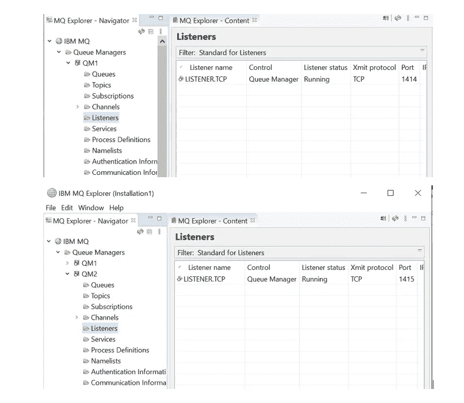

Listener configuration

# 动词 （verb 的缩写）用于身份验证的系统对象

## 1.什么是 MQ 连接身份验证？(CONNAUTH)

在 MQ V8.0 之前，MQ 没有开箱即用地验证用户 id 和/或密码，MQ“假设”如果操作系统允许用户 id 连接到队列管理器，那么一切正常，实现用户 id/密码验证的唯一方法是编写出口。MQ V8.0 引入了连接认证(CONNAUTH ),它允许在应用程序或用户连接到队列管理器时进行用户 id/密码认证，并允许在用户无法通过认证时拒绝连接请求。
MQ 连接身份验证为 MQ 应用程序提供了为 MQ 本地绑定(跨内存—同一主机)和 MQ 客户端连接通道连接提供用户和密码的能力。

## 2.新的认证信息对象

MQ V8.0 引入了两个新的身份验证对象，用于连接身份验证系统。这两个新类型的默认对象都可以在 MQ Explorer 的“身份验证信息”文件夹中的队列管理器中看到:

Authentication information

两个新的 AUTHINFO 对象类型在新的队列管理器上定义为“SYSTEM”。DEFAULT.AUTHINFO.IDPWOS '和' SYSTEM。DEFAULT.AUTHINFO.IDPWLDAP '其他两个—'系统。DEFAULT.AUTHINFO.CRLLDAP '和' SYSTEM。' DEFAULT.AUTHINFO.IDPWLDAP '是在 MQ 的早期版本中引入的，用于 SSL 证书吊销检查。

当一个新的 V8.0 或**以后的队列管理器**被创建时，它将被默认配置为使用 SYSTEM。通过 MQ Explorer 中的队列管理器扩展属性可以看到 DEFAULT.AUTHINFO.IDPWOS 的 AUTHINFO 对象:

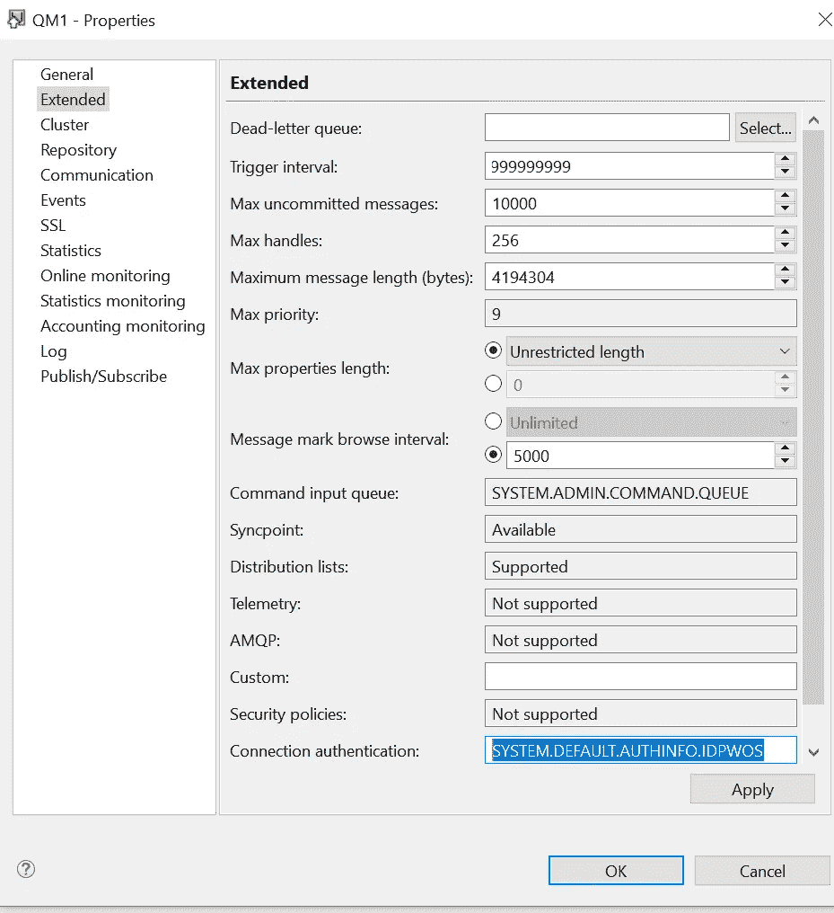

QM1 default Authentication through Operating System

# 认证信息:强制还是可选

您可以如上所示配置身份验证对象，以使应用程序发送身份验证信息(或者您可以通过不从应用程序发送身份验证信息来使其成为可选的)。

## 让我们看看如何配置:

在**系统中。DEFAULT.AUTHINFO.IDPWOS，**系统对象，您可以选择将身份验证设置为强制还是可选。基于此，操作系统将使用应用程序客户端传递的操作系统凭据进行身份验证。

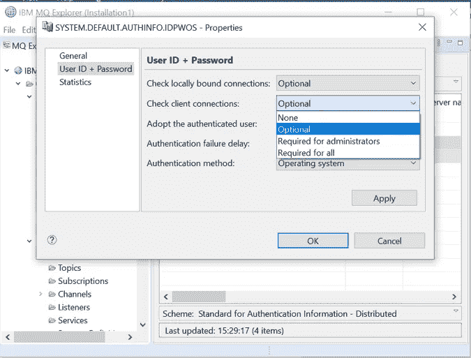

Authentication: mandatory vs optional

# 创建一个简单的 Java 客户端

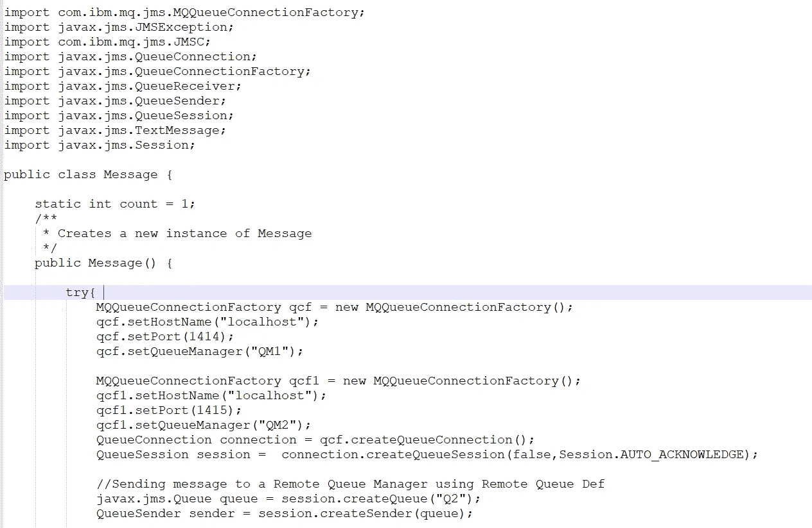

Java Message Client — continued…

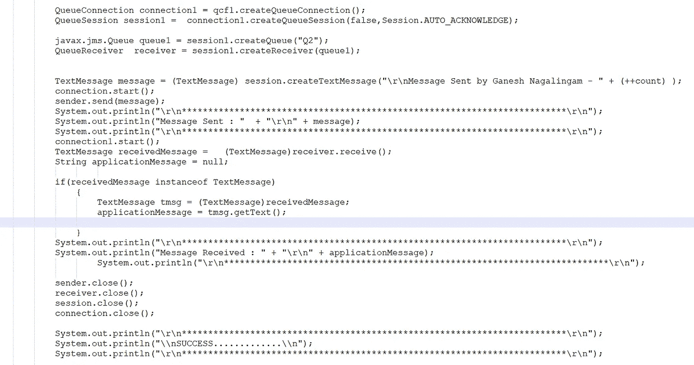

Java Message Client — continued…

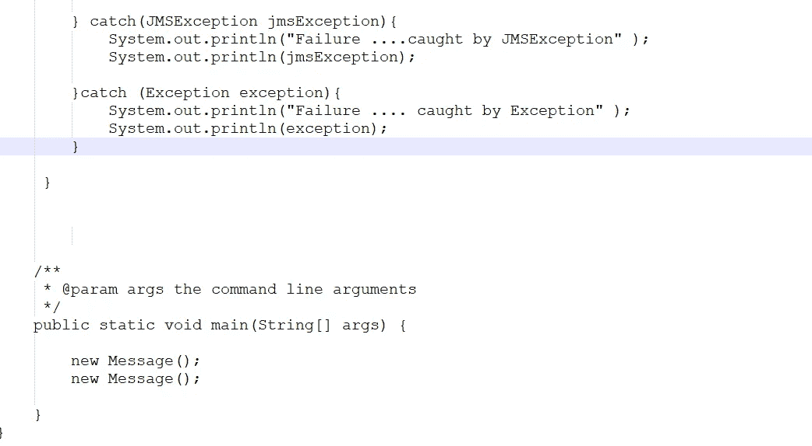

Java Message Client

# 运行应用程序并查看控制台输出

Message sent to QM1 and received from QM2

# 结论

我们学习了安装和配置 IBM MQ v 9.2。
本文展示了如何配置队列管理器、队列、通道、监听器和远程队列定义。我们还执行了一个 Java 客户端应用程序，通过远程队列定义向队列管理器发送消息，并从队列管理器接收消息。

## 发布于 2021 年 6 月 11 日

> ***其他中等文章，*由 *Ganesh Nagalingam***
> 
> [*Kubernetes Pods&Docker Containers:在 Windows 10 Home 中使用虚拟盒子旋转 VM*](https://ganesh-nagalingam.medium.com/kubernetes-pods-docker-containers-spin-vm-using-virtual-box-in-windows-10-home-d3be783ff087)
> 
> [*将 KERBEROS 与 SPRING SECURITY 集成:身份和访问管理(IAM)*](https://ganesh-nagalingam.medium.com/kerberos-v5-sso-authentication-in-windows-10-home-using-apache-directory-studio-fb0151899185)
> 
> [将 IBM 业务流程管理器与混合 MobileFirst 应用程序集成](https://ganesh-nagalingam.medium.com/integrate-ibm-business-process-manager-with-hybrid-mobilefirst-application-5aed20841bf3?source=your_stories_page-------------------------------------)
> 
> [*整合服务提供商(sp)与 OKTA 身份提供商(IdP)*](https://ganesh-nagalingam.medium.com/integrate-service-providers-sps-with-okta-identity-provider-idp-ce64a4e262ae)
> 
> [*将 IBM WebSphere Service Registry and Repository 与 IBM Process Server 集成*](https://ganesh-nagalingam.medium.com/integrate-ibm-websphere-service-registry-and-repository-with-ibm-process-server-f97eeb0e2ea)
> 
> [将 OKTA IdP 与 WSO2 API Manager 联合起来，作为 Spring boot 微服务集成的网关](https://ganesh-nagalingam.medium.com/federate-okta-idp-wso2-api-manager-as-gateway-to-spring-boot-microservices-integration-ba567567e81)