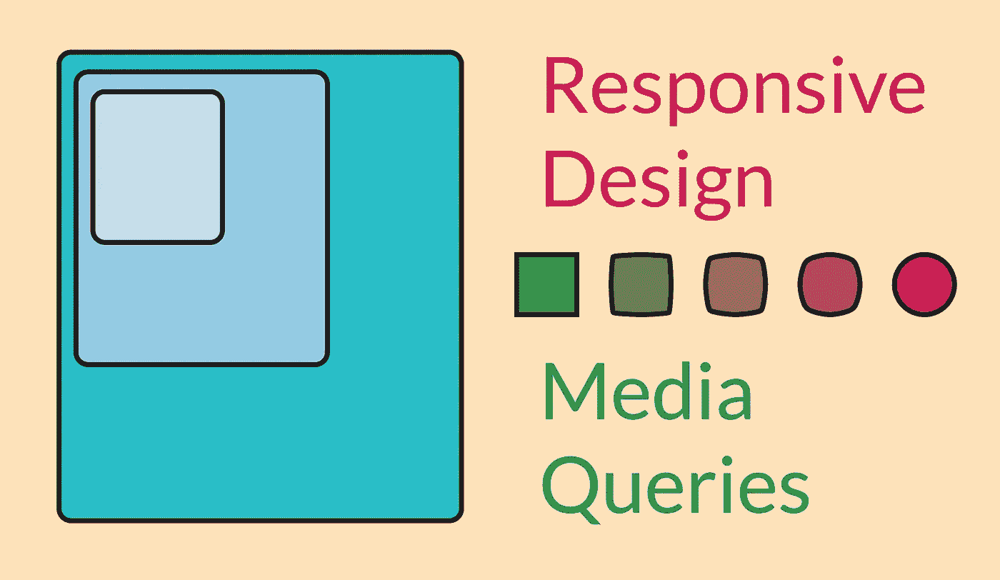

# 响应式设计和媒体询问

> 原文：<https://medium.com/geekculture/responsive-design-media-queries-df8ac0ae0492?source=collection_archive---------20----------------------->

响应式设计是根据所使用的设备类型或屏幕大小来设计网页，以最大限度地提高网页的视觉吸引力和可用性。我们的目标是提供尽可能好的用户体验，不管用户是如何访问网页的。响应式设计的核心是 [CSS 媒体查询](https://developer.mozilla.org/en-US/docs/Web/CSS/Media_Queries)。使用媒体查询允许开发人员针对特定的浏览器大小或属性来提供针对特定设备、分辨率或屏幕方向定制的样式。



Responsive Design & Media Queries

# 学习资源

## 响应式设计

响应式设计的概念已经存在一段时间了。2010 年(列表除外)和 2011 年(Smashing Magazine)的文章描述了响应式设计概念的最初描述。其他文章加强了初始阶段的想法，并添加了新的技术来改进响应式设计的开发。

*   [MDN —响应式设计](https://developer.mozilla.org/en-US/docs/Learn/CSS/CSS_layout/Responsive_Design)
*   [清单之外——响应式网页设计](https://alistapart.com/article/responsive-web-design/)
*   [粉碎杂志——响应式网页设计——它是什么以及如何使用它](https://www.smashingmagazine.com/2011/01/guidelines-for-responsive-web-design/)
*   [Web.dev —响应式网页设计基础](https://web.dev/responsive-web-design-basics/)
*   [CSS-Tricks —响应式设计和 CSS 自定义属性:定义变量和断点](https://css-tricks.com/responsive-designs-and-css-custom-properties-defining-variables-and-breakpoints/)

## 媒体查询

这两篇文章提供了关于使用媒体查询的语法和最佳实践的良好信息。

*   [CSS-Tricks—CSS 媒体查询完整指南](https://css-tricks.com/a-complete-guide-to-css-media-queries/)
*   [MDN —媒体查询](https://developer.mozilla.org/en-US/docs/Web/CSS/Media_Queries)

# 构建媒体查询

媒体查询由几部分组成。有一个**媒体类型**组件，描述设备的类别。接下来，有一个**媒体特征**组件，它描述了用户代理或设备的具体特征。媒体查询还可以包括**逻辑运算符**，以增加查询的复杂性。

## 媒体类型

用于描述设备的一般类别。可用的常规选项包括:

*   **all** —适用于所有设备
*   **打印** —用于打印或打印预览模式
*   **屏幕** —用于屏幕
*   **语音** —用于语音合成器

## 媒体特征

用于测试用户代理的特定存在或特性的特定值，例如，测试屏幕宽度是否为特定像素大小。每个媒体功能表达式必须用括号括起来。

可以使用的一些特征示例([还有几个可用的](https://developer.mozilla.org/en-US/docs/Web/CSS/Media_Queries/Using_media_queries#media_features))包括:

*   **纵横比** —视口的宽高比
*   **方位** —视口的方位
*   **分辨率** —输出设备的像素密度
*   **宽度** —视口的宽度，包括滚动条的宽度

## 逻辑运算符

可用的逻辑运算符有`not`、`and`和`only`。除了逻辑运算符，逗号还可以用于将多个媒体查询合并到一个规则中。

*   **not** —用于否定媒体查询，如果查询将返回 false，则返回 true。如果使用了*而不是*操作符，则必须使用介质类型
*   **和** —用于将多个媒体特征组合成单个媒体查询。要应用查询，所有链接的要素都必须返回 true
*   **only** —用于仅在整个查询匹配时应用样式。有助于防止旧浏览器错误应用规则。如果仅使用*操作符*，则必须使用介质类型
*   **逗号** —用于将多个媒体查询链接到一个规则中。像逻辑`or`操作符一样操作，如果至少有一个查询匹配，那么即使其他规则不匹配，规则也会被应用

# 使用媒体查询

结合了媒体类型和媒体特征测试的媒体查询的基本示例:

```
@media screen and (min-width: 600px) and (max-width: 1000px) {
  header {
    background-color: lightgreen;
  }
}
```

此媒体查询将应用于最小宽度为 600 像素或更大、最大宽度为 1000 像素或更小的屏幕类别和设备。实际上，这意味着对于设备宽度在 600 像素和 1000 像素之间的屏幕，标题的背景色是`lightgreen`。对于所有其他尺寸的宽度(小于 600 像素且大于 1000 像素)，将不应用样式。

## 不同媒体查询的示例

媒体查询可以被设计为针对一组广泛的或特定的页面属性或特征。例如，媒体查询可以针对多种[媒体特征](https://developer.mozilla.org/en-US/docs/Web/CSS/Media_Queries/Using_media_queries#media_features)，包括颜色、宽度、高度等等。媒体查询也可以以许多不同的方式组合。

```
@media screen and (min-width: 1000px) {
  .container {
    background-color: lightgray;
  }
}
```

此媒体查询将针对屏幕(媒体类型)，并且仅在设备的最小宽度(媒体功能)至少为 1000px 时应用；也可以将几个媒体特征组合成单个媒体查询。

```
@media (min-width: 1000px) and (orientation: landscape) {
  .container {
    background-color: skyblue;
  }
}
```

最后，可以用逗号将多个媒体查询组合起来，以测试多种类型或功能。如果任何查询匹配，则应用整个媒体查询。

```
@media (orientation: portrait), screen and (max-width: 1280px) {
  .container {
    background-color: crimson;
  }
}
```

# 结合媒体询问使用内置响应设计功能

Flexbox 和 CSS Grid 都内置了一些响应式设计特性。这些可以用来处理媒体查询通常可能已经解决的一些问题。

## Flexbox

Flexbox 允许内容换行，这可以通过使用`flex-basis`属性来控制。

```
<div class="container">
  <div class="item item-1">Item 1</div>
  <div class="item item-2">Item 2</div>
  <div class="item item-3">Item 3</div>
  <div class="item item-4">Item 4</div>
</div>.container {
  width: 50%;
  margin: 0 auto;
  display: flex;
  flex-flow: row wrap;
}.item {
  border: 1px solid #000;
  background-color: coral;
  flex: 1 1 400px;
  padding: 10px;
}
```

当容器的宽度大于 840px 时，此代码示例将创建一个包含两列内容的容器节。当它小于此数量时，flexbox 指示 flex 项目换行，形成一列。

## CSS 网格

CSS Grid 允许使用像`minmax()`函数这样的实用程序来调整网格列。

```
<div class="container">
  <div class="item item-1">Item 1</div>
  <div class="item item-2">Item 2</div>
  <div class="item item-3">Item 3</div>
  <div class="item item-4">Item 4</div>
  <div class="item item-5">Item 5</div>
  <div class="item item-6">Item 6</div>
</div>.container {
  display: grid;
  grid-template-columns: repeat(auto-fill, minmax(500px, 1fr));
}.item {
  background-color: beige;
  padding: 10px;
}
```

这里，网格容器使用`repeat()`函数和`auto-fill`值创建列，根据列的大小需求创建所需数量的列。每列的大小由`minmax()`函数决定，该函数表示每列最小为`500px`单位，最大为`1fr`单位。

在一个更复杂的例子中，媒体查询可以与 CSS 网格结合使用，以随着视口宽度的增加而改变网格的形状。这个例子采用了移动优先的方法，为所有网格项创建一个单列网格。随着视窗扩大到`1000px`，应用第一个媒体查询，网格变成 3 列。最后，当视口增加到`1280px`时，网格增加到 4 列，网格容器的宽度以`1280px`的大小居中。

```
.container {
  display: grid;
  grid-template-columns: 1fr;
  gap: 10px;
}@media screen and (min-width: 1000px) {
  .container {
    grid-template-columns: repeat(3, 1fr);
  } header {
    grid-column: 1 / 4;
  } nav {
    grid-column: 1 / 4;
  } main {
    grid-column: 1 / 3;
  } aside {
    grid-column: 3 / 4;
  } footer {
    grid-column: 1 / 4;
  }
}@media screen and (min-width: 1280px) {
  .container {
    width: 1280px;
    margin: 0 auto;
    grid-template-columns: repeat(4, 1fr);
  } header {
    grid-column: 1 / 5;
  } nav {
    grid-column: 1 / 5;
  } main {
    grid-column: 1 / 3;
  } aside {
    grid-column: 3 / 5;
  } footer {
    grid-column: 1 / 5;
  }
}
```