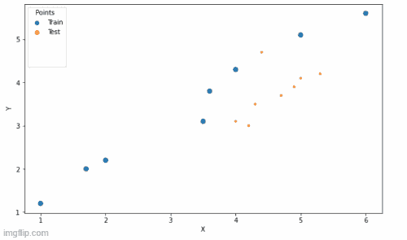
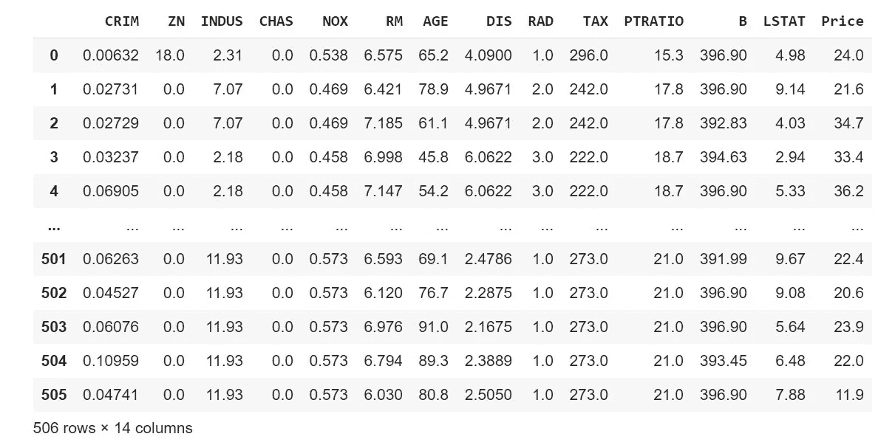
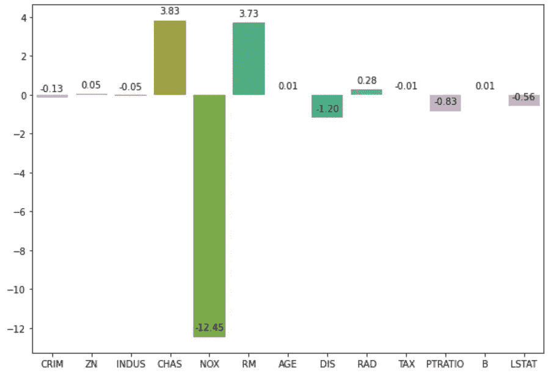
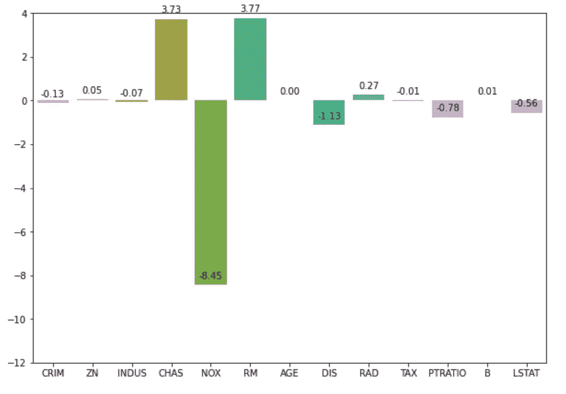
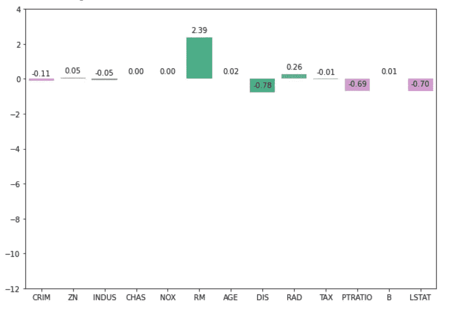

# 山脊和套索回归；

> 原文：<https://medium.com/geekculture/ridge-and-lasso-regression-51705b608fb9?source=collection_archive---------3----------------------->

## 对正则化技术的见解

线性回归是机器学习中最常用和最简单的监督学习技术之一。它建立了模型中的特征(自变量)和标签(因变量)之间的关系。在线性回归中，优化函数或损失函数被称为*【残差平方和(RSS)***，用于定义和度量模型的误差**。**梯度下降算法用于通过多次迭代找到最佳成本函数。**

****

**Cost function for linear regression (image by author)**

***这里，βj 代表不同独立变量或预测值(x)的系数估计值，并分别描述每个特征的权重或大小。***

**在线性回归中，如果我们向模型添加更多的特征，其复杂性会增加，这又会导致方差增加和偏差减少，即 ***过拟合*** 。在过度拟合的情况下，所创建的模型很好地拟合了训练数据，但是未能估计训练集之外的变量之间的真实关系。因此，该模型在测试数据上表现不佳。因此，为了克服过拟合情况，我们可以使用正则化技术，该技术将通过降低系数的幅度来降低模型复杂度。**

> **在正则化技术中，通过保持相同数量的变量来减少独立变量的大小。它的工作原理是在复杂模型的成本函数中增加一个惩罚或收缩项。它减少了模型的方差，代价是增加了少量的偏差。**

**正则化技术用于提高模型的泛化能力。这是通过调整最佳拟合线的斜率来实现的。参考下图，其中直线非常适合训练数据集，而不适合测试数据集。使用正则化，通过使用超参数或罚项α来改变最佳拟合线的斜率或使线倾斜一点。在正则化之后，该模型在训练中可能表现不好，因为该线没有精确地通过训练数据点，但是它将在测试中给出相当好的结果。**

****

**Image by author**

**主要有两种类型的正则化技术，下面给出:**

1.  **岭回归(L-2 范数)**
2.  **套索回归(L-1 范数)**

# ****岭回归:****

**在该技术中，通过添加罚项(收缩项)来改变线性回归的成本函数，罚项将λ(超参数)乘以每个要素的平方权重。岭回归的成本函数变为:**

****

**Cost function for Ridge Regression (Image by author)**

**根据上面的等式，罚项正则化了模型的系数或权重。因此，岭回归降低了系数的大小，这将有助于降低模型的复杂性。**

# ****拉索回归:****

**Lasso 代表*最小绝对和选择算子*。这是另一种用于降低模型复杂性的正则化技术。它类似于岭回归，只是罚项包括绝对权重而不是权重的平方。成本函数 lasso 回归如下所示:**

****

**Cost function for Lasso Regression (Image by author)**

> **当λ等于零时，岭回归或套索回归的成本函数就等于 RSS。随着λ值的增加，方差减小，偏差增大。最佳拟合线的斜率将减小，并且该线变为水平。随着该项的增加，模型对独立变量的响应变得越来越弱。因此，我们必须明智地选择 lambda 的值，在一系列值中进行迭代，选择一个误差最小的值。**

## **岭回归和套索回归的区别:**

*   **在岭回归中，通过降低系数的大小来降低模型的复杂性，但它从不将系数的值设置为绝对零。然而，套索回归往往使系数达到绝对零。**

****

**Boston Housing Price Data set (Image by author)**

****

**Magnitude of coefficients after Linear Regression (Image by author)**

****

**Magnitude of coefficients after Ridge Regression (Image by author)**

****

**Magnitude of coefficients after Lasso Regression (Image by author)**

**我们以波士顿房价数据集为例。数据集由 506 行和 14 列组成。“价格”列将是我们的因变量，所有其他列都是因变量。参考分别对数据集应用线性、岭型和套索回归后的三幅图。脊和套索回归的λ值取为 0.5。从图中可以看出，岭回归后系数的大小有所收缩。但是在套索回归的情况下，除了一些特征之外，所有其他特征的系数都降低到绝对零。**

*   **岭回归仅通过降低特征的系数并保持模型中存在的所有特征来帮助避免模型过度拟合。但是在套索回归的情况下，除了降低模型的复杂性，它还有助于自动特征选择。套索回归将系数值转换为零。系数变为零的特征在预测目标变量时不太重要，因此可以从模型中删除。**
*   **岭回归比套索回归快。**

## ****岭和套索回归的局限性:****

**▹岭回归无助于特征选择。**

**▹岭回归用于缩小系数，但从不将它们的值设置为绝对零。该模型将保留所有特征，并且将保持复杂，这可能导致模型性能较差。**

**▹当我们对一个具有高度相关变量的模型应用套索回归时，它将只保留几个变量，并将其他变量设置为零。这将导致一些信息的丢失以及模型精度的降低。**