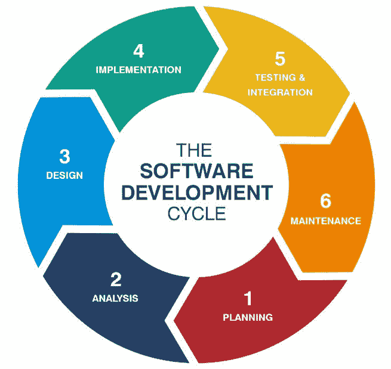

# 成功路线图:如何推出成功的软件产品

> 原文：<https://medium.com/geekculture/roadmap-to-success-how-to-launch-a-successful-software-product-b122766a58d1?source=collection_archive---------10----------------------->

Photo by [Austin Distel](https://unsplash.com/@austindistel?utm_source=medium&utm_medium=referral) on [Unsplash](https://unsplash.com?utm_source=medium&utm_medium=referral)

发布一个产品可能会非常令人兴奋，尤其是如果你已经在幕后工作了一段时间，并最终将它发布给你的目标受众。同时，如果你以前从未做过，它也会让你感到不知所措，望而生畏。如果你正在寻找创建和发布你的第一个软件产品，或者如果你希望成功地发布下一个，在你面前有一个路线图是有帮助的。

这个路线图可以作为你开发和推出产品的指南；随着每一步的深入，你会对目标市场有更多的了解，并对最重要的特征有更深入的了解。本指南将向您展示如何创建一个有效的发布计划，包括确保您的产品和业务成功所需的所有步骤，无论这是您的第一次还是第五十次产品发布。

# **什么是软件产品？**

软件产品是可以用来解决问题的一个程序或一段代码。例如，Google Docs 是一款允许人们在线创建和共享文档的软件产品。这些程序可以在笔记本电脑和智能手机等多种设备上使用。

一个软件产品不应该仅仅在理论上工作；在现实世界中也应该可以。用户希望程序对用户友好，这样他们就能轻松使用。为了开发一个成功的软件产品，在创建产品之前有一个创新的想法是很重要的，这样你就能确切地知道你想要你的程序或代码做什么。从那里，你可以为你的最终程序/代码所需的任何用户界面元素的设计过程创建草图。请看完整软件开发生命周期的图片:

# **拥有自己的软件产品的好处**

除了财务上的好处，拥有自己的软件产品可以让你建立一个完全属于你自己的网上形象。只要你创造了人们想要的东西，成功就无止境。以下是拥有软件产品的 10 个商业好处:

1) **控制**——你的产品将完全在你的控制之下，而不是别人的。您将能够更新它，而无需等待其他任何人的批准。

2) **低成本**——许多开发成本都是预先完成的，所以当需要更新或改变时，你只需要一些小费用

3) **有限责任**——一旦顾客购买了它，他们就在用自己的责任而不是你的责任。

4) **被动收入**——如果你知道如何创造一个成功的软件产品，你可以从它的销售中被动赚钱。

5) **你可以在任何地方出售** -一个主要的好处是，一旦你开发了一个程序并打包出售，它就可以在世界任何地方出售，因为到处都有客户。

6) **生产力的提高**——你的工作生活平衡将会改善，因为你不用整天在固定的工作岗位上工作，然后回家花更多的时间在电脑上或照顾孩子，你只需要在方便的时候专注于实现你的目标。

7)你**不需要任何人的许可**就可以开始用你的产品赚钱！

8) **定制**——负责意味着你可以按照自己喜欢的方式定制你的产品。

9) **有价值的资产**——如果做得好，你的新发现有可能随着时间的推移成为有价值的资产。

10) **长期投资**——拥有自己的软件产品的最终好处是知道它会持续下去，并随着时间的推移而发展壮大！

# ***推出成功软件产品的技巧:***

## **研究你的市场和竞争**

在你开始第一步之前，研究市场和竞争是很重要的。谁是主要参与者？他们的定价是多少？他们提供什么功能？他们身边的客户情绪如何？所有这些信息将帮助您更好地确定您的目标受众，并满足他们的需求。

在研究竞争对手时，注意是什么让他们彼此不同，是什么让他们与你不同。如果你想让自己与众不同，现在是时候开始集思广益了。

## **让你的团队重新认识你的用户和买家角色。**

制定路线图的关键一步是让你的团队步调一致。让你的团队重新熟悉你的用户和买家角色。如果你以前创建过角色，和你的团队成员一起检查一下。

确保每个人都知道你的用户和买家角色是谁，以及他们使用产品的目标是什么。如果你还没有创建角色，这将是一个很好的时机。一旦你完成了，和你的团队成员一起检查他们，确保每个人都明白他们是谁。

用户角色包括产品的主要用户以及偶尔使用产品的人；购买者角色是指参与像你这样的产品购买决策的人。

## 提醒自己产品背后的“为什么”。

提醒自己产品背后的原因很重要。你为什么想要它？世界需要什么？谁是你的理想客户？这些问题将帮助你知道你的产品应该朝什么方向发展。

你也能知道谁是你的竞争对手，他们做得对(或错)什么。重要的是，如果你没有所有这些答案，不要感到气馁，因为只要你对需要解决的问题以及为什么需要解决这个问题有一个坚实的想法，那么就有很多方法来找到解决方案。

考虑与导师或顾问一起工作，他们可以帮助指导这个过程并让你保持在正确的轨道上。

## **为增长和更多用户做好准备**

如果你刚刚开始，并且你知道你的应用将会流行，那么在发布之前采取措施是很重要的。这些提示将帮助你为成长和更多用户做好准备。

*   早点开始营销。创建一个有电子邮件列表的网站，发布在社交媒体网站上，使用谷歌广告词或脸书广告。
*   通过预先设置分析，为成功做好准备，这样您就可以跟踪会话持续时间和转化率等关键指标。
*   了解目标受众一天中的最佳时间，这样你就可以安排在人们最有可能使用它的时候发布。如果你预计在发布日会有大量的流量，请确保有足够的服务器空间，并确保所有页面加载迅速而不崩溃。
*   考虑将应用托管在云中，而不是依赖物理硬件，因为它允许按需扩展。您还应该创建一个 FAQ 页面，其中包含如何开始使用该应用程序的说明。
*   总是先在测试版中测试新特性。在对所有用户的体验做出改变之前，让测试人员给出反馈——这样你可以避免潜在的反弹并节省时间！
*   规划升级时，考虑是否有任何后端改进或优化，同时仍然保持与旧数据格式的兼容性

# **确保你有合适的工具来构建你的路线图。**

使用合适的工具，构建路线图很容易。以下是你需要知道的，以确保你有合适的工具来完成这项工作。

*   **研究你的目标市场**——确定你的目标受众及其需求。
*   **选择发布的最佳时机** —选择发布产品的最佳时机，比如你发布新功能的时候，或者市场上缺少竞争产品的时候。
*   **从两个版本的路线图开始** —确定两个与你未来目标相关的路线图版本。第一版应该是短期的，而第二版应该是长期的(1-3 年)。选择哪一组目标会帮助你更快地获得成功。
*   **构建原型**——在整个过程中尽早构建原型，以确保你的想法在开发成成熟的项目之前能够发挥作用。通过在线搜索关于原型制作的文章和博客帖子，找出最适合每个阶段的原型制作工具。
*   **让利益相关者参与**——在过程的所有阶段从参与该项目或计划的其他人那里获得输入，以便每个人都拥有所有权。要成功做到这一点，可以考虑使用管理仪表板、项目管理工具、调查等工具。，所以每个人都知道在任何给定的时间过程进行到什么程度。

# **保持路线图的内容简洁、高水平，并且没有术语。**

以下是成功推出您的软件产品的路线图。它简洁、高级，并且没有术语。要创建一个更完整的路线图，其中包含对读者有意义的内容，请在此处查阅我们关于如何创建有效路线图的白皮书。它概述了这篇文章中的所有细节，并在最后提供了一个详细的例子，说明这一切是如何结合在一起的。

# **为你的产品发布计划制定一个时间表。**

这个时间表是产品发布的一般指南。你处理每项任务的顺序可能不同，但这是理清思路的好方法。

*   发布前一个月——敲定商业计划，想好如何将你的产品推向市场。
*   **发布前两周** —用产品的新信息更新网站。创建一个 FAQ 页面，包含关于您的产品及其功能的常见问题。
*   **发布前一周** —发送关于产品发布日期的新闻稿。在 Twitter、脸书和 LinkedIn 等社交媒体渠道上宣布。

# **使用路线图泳道划分职责。**

路线图应该划分为泳道，泳道是您将用来分解整个项目的一组泳道。这些通道通常用于项目中的特定区域或阶段。常见的是将基于技术的项目分为五个泳道，分别用于预生产、生产、测试、发布和发布后。这是为了帮助保持对产品生命周期每个阶段的关注。

例如，一条路线将有在预生产阶段需要发生什么的目标，例如设计、测试和团队建设；而另一条路线将具有与设计营销活动和品牌标识相关的目标。

许多公司还在路线图中使用泳道来说明跨职能任务，如人力资源计划和营销活动。泳道图还可以通过表示组织结构的列来表示组织的层次结构。

# **为每项计划建立审查流程和时间框架。**

构建路线图的过程与创建商业计划非常相似。关键的区别在于路线图过程应该花费更少的时间，并且应该强调简单性和透明性。

路线图计划还需要更严格的要求，因为团队需要就每个行动试图完成的目标达成共识。对于一个好的路线图过程来说，为每个计划附加和分配所有权也是很重要的。

对于负责产品开发生命周期每个特定领域执行的任何人来说，这是必要的。

# **包括你将在发布后监控的产品指标。**

发布后，您需要监控以下指标，并相应地调整您的产品。

新用户的数量。这是你的产品做得有多好的一个指标。如果你在发布后的前三个月没有看到任何增长，可能是时候改进产品或开始以不同的方式营销了。

返回用户的数量。同样，这显示了你的产品有多有用，以及人们是否从中得到了他们想要的。如果人们不再回来，你将不得不重新审视这些功能，以使它们更有吸引力或更易于使用。用户参与度/使用时间。

# **将反馈方法纳入你的产品发布计划**

为你的顾客和用户找到对你的产品给出反馈的方法是很重要的。即使你知道自己在做什么，征求客户和用户的反馈也是一个好的做法。您应该尽早将反馈方法纳入您的产品发布计划。

询问以下问题:

您多久使用一次该产品？

您希望我们接下来实现什么功能？

让人们在发布日期之前测试产品，不仅能帮助他们理解产品的工作原理，还能提供有价值的反馈，这些反馈可以在开发过程中使用。

# **定期审查你的产品发布计划**

应定期审查产品上市计划。你应该每月回顾你的产品发布计划，即使你可能不想每天都做。

*   维护目标客户及其联系信息的更新列表
*   审查您产品的定价结构，并根据需要进行更新
*   详细计划你的营销活动，规划出你在每个阶段要做的事情
*   如果产品表现不如预期，你会怎么做？

为此做准备的最好方法是写一份详细的应急计划。你的计划越周密，你就越不可能为了挽回面子或弥补失败的发射所带来的损失而匆忙行事。使用这个路线图，这样你就能永远领先一步

## **结论**

我希望这个路线图已经帮助你创造了你自己的成功产品。在英国雇佣一家 [**软件开发公司**](https://www.hiddenbrains.co.uk/software-development.html) 对你产品的成功至关重要。一个熟练的软件开发人员或开发团队将帮助您构建一个直观、易于使用的界面，让您的客户回头客。如果您有任何问题，请随时联系我们！