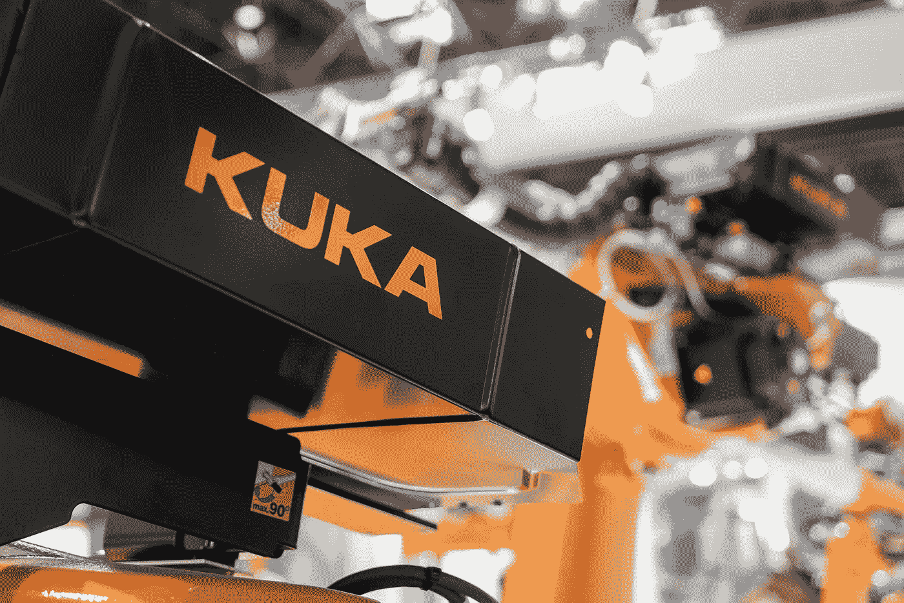

# 商业机器人:人类需要知道的一切

> 原文：<https://medium.com/geekculture/robotics-in-business-everything-humans-need-to-know-90acbf72297?source=collection_archive---------5----------------------->

一种存在了大约半个世纪的机器人是众所周知的在装配线上工作的独臂机器人。这些机器人有特定的任务，用于举升东西或点焊。他们不是最漂亮的，但他们完成了工作，他们改变了工业制造业，并随之改变了美国和欧洲大部分地区的中低水平劳动力。第一个亮相的工业机器人是 20 世纪 60 年代通用汽车公司的 [Unimate](https://en.wikipedia.org/wiki/Unimate) 。从那时起，机器人已经彻底改变了世界经济。

在新冠肺炎疫情的[之光下，自动化在制造业、零售业和餐饮业等各种领域的应用显著增加。越来越多的机器人每天出现在办公室、学校、仓库和小型制造中心。它们越来越多地出现在我们的道路上，飞过我们的头顶。](https://www.zdnet.com/article/robotics-firms-seeing-strong-backing-during-covid-19-pandemic/)

Photo by [Mika Baumeister](https://unsplash.com/@mbaumi?utm_source=unsplash&utm_medium=referral&utm_content=creditCopyText) on [Unsplash](https://unsplash.com/s/photos/robotics?utm_source=unsplash&utm_medium=referral&utm_content=creditCopyText)

这只是机器人通过比以前更好地提高性能和降低成本而迅速获得牵引力的几个领域。这让很多人兴奋不已，也让很多人忧心忡忡。行业的稳定发展阶段让很多人产生了疑问。

这篇文章将让我们对这个到 2025 年将达到[2100 亿美元(CAGR 26%)](https://www.statista.com/statistics/760190/worldwide-robotics-market-revenue/)的行业以及它在未来几十年对人类的影响有所了解。

## 什么是机器人？

这是一个有争议的话题，仍然受到全世界专业人士的激烈争论。你的洗衣机是机器人吗？在驾驶员不知情的情况下，从事上千道工序的现代高档汽车是机器人吗？

如果你在寻找“机器人”的正确定义，这就是了。

> 机器人是一种可编程的机器，它与周围的世界进行物理交互，并能够自主或半自动地执行一系列复杂的动作。

## 为什么这个领域在过去的几年里进步如此之大？

主要是因为这四个主要原因

*   传感器价格下降
*   不同技术的融合
*   开源开发
*   快速原型

## **传感器**

对移动计算的需求对机器人技术的发展来说是一个福音，导致价格下降、快速进步和传感器技术的小型化。例如，以前的加速度计价格高达数百美元。但现在，即使是智能手机也有多个加速度计。

物联网的普遍存在是另一个驱动因素。到 2025 年，将会有[1000 亿个物联网设备](http://www.prnewswire.com/news-releases/global-sensors-in-internet-of-things-iot-devices-market-analysis--forecast-2016-to-2022-focus-on-pressure-temperature-light-chemical--motion-sensors-and-applications-in-healthcare-manufacturing-retail--transportat-300411919.html)产生 10 万亿美元的收入。有史以来第一次，感知压力、温度、扭矩和位置的传感器非常便宜，推动了机器人前所未有的发展。

用于自主导航机器人的激光雷达和红外传感器的价格[暴跌 90%](http://www.businessinsider.com/googles-waymo-reduces-lidar-cost-90-in-effort-to-scale-self-driving-cars-2017-1) 为越来越多的自主导航机器人的发展铺平了道路。

## **技术融合**

正如传感器价格暴跌一样，移动计算的巨大成功刺激了语音和物体识别的进步，这在机器人领域有明确的应用。像谷歌、苹果和亚马逊这样的公司处于这场技术革命的最前沿。

计算能力的逐年增长以及云和物联网技术的到来让这变得更加容易。当我们把所有这些放在一起时，很明显，机器人技术发展所需的技术在过去几年中已经成熟。

## **开源开发**

2009 年，机器人操作系统(ROS)在 IEEE 机器人和自动化国际会议(ICRA)上推出。ROS 是一个用于机器人开发的免费开源操作系统。它的引入是为了让开发者不再需要从头开始开发操作系统。

ROS 负责的 Open Robotics 也推出了一款名为 Gazebo 的机器人模拟器，允许工程师在虚拟现实中测试机器人，而无需冒险使用硬件。有人会问，ROS 和 Gazebo 对机器人的发展产生了怎样的影响。以下将澄清这个问题

> 在参加 DARPA 机器人挑战赛的 23 个团队中，18 个团队使用运行在 ROS 上的机器人，14 个团队使用 Gazebo 在虚拟环境中测试他们的人形竞争对手。

除此之外，在 2015 年，1 . 5 亿美元的风险投资流向了开发基于操作系统的机器人的公司。

## **快速成型**

据 [Robotics Tomorrow](http://www.roboticstomorrow.com/) 报道，3D 打印的发展为创作者提供了在几个小时内从一个令人难以置信的概念变成坚实产品的机会。它大大降低了进入机器人领域的门槛。需要证明吗？看看现在在 Kickstarter 上[直播的机器人项目数量就知道了。](https://www.kickstarter.com/projects/search?utf8=%E2%9C%93&term=robot)

当工程师可以在他们的工作台上制造原型组件时，创新就会随之而来！！！

## 来自新冠肺炎的影响

虽然新冠肺炎对许多行业来说是一个大禁忌，但对机器人来说却完全相反。在某种程度上，新冠肺炎是机器人产业所需要的点火装置。

如果机器人革命的种子已经发芽超过十年，追溯到研究实验室[柳树车库](http://www.willowgarage.com/)和 2000 年代初 DARPA 竞赛开始的突破性机器人研究，新冠肺炎可能会被证明是一个催化剂。

由于疫情期间的大规模停工和裁员，投资者和企业对机器人的信任和关注有所增加。这种影响在未来几年将会很明显。

## 机器人抢工作。这种担心有道理吗？

## **悲观论调**

在这个问题上受过良好教育的人对上述问题给出了截然相反的观点。美国国家经济研究局最近的一项研究关注工业机器人使用的增加，发现机器人对失业有直接的负面影响。人们经常提出的一个论点是，机器人失去的工作没有被机器人带来的新机会充分取代。

这种担心是真实的，因为像比尔·盖茨这样的巨头已经表示支持机器人税——对机器人所做的工作征税。当人类因为机器人而失业时，它将取代政府损失的所得税。

普华永道的一份报告显示，到 2030 年，由于自动化，美国将会失去 38%的工作岗位。运输、制造等行业的风险似乎较高，但卫生等行业的风险较低。但改进的机器人进入这些受影响较小的领域只是时间问题。

## **没那么明确**

另一方面，许多人认为，尽管自动化导致了地区性失业，但就业岗位却出现了净增长。为了支持这一理论，国际机器人联合会发布了一项研究，调查了机器人在中国、巴西、日本和印度的使用情况。随着机器人在这些国家的加速使用，失业率下降了。创造的一些新工作是与机器人相关的培训、咨询、集成和部署。

尽管在这个问题上有许多观点和意见，但现在很难得出任何结论。技术在不断发展，很难预测。在接下来的几年里，越来越多的使用机器人可能会也可能不会对人类产生不利影响。我们只能等着瞧了！！