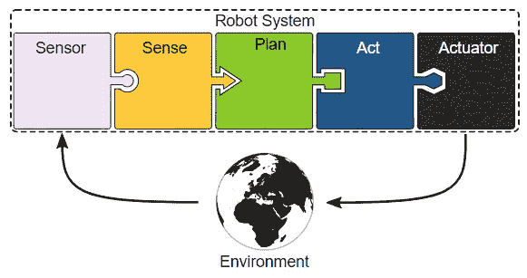
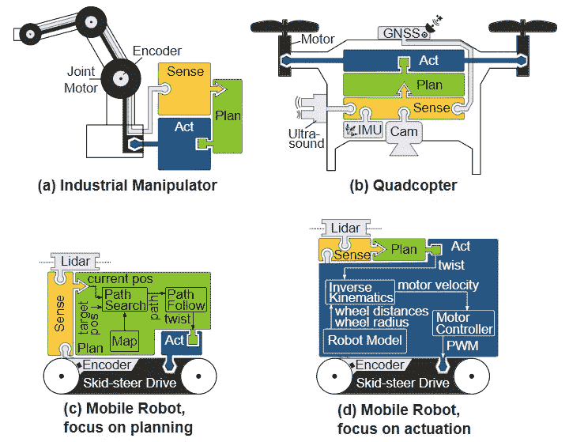

# 机器人:大图景

> 原文：<https://medium.com/geekculture/robotics-the-big-picture-82325034a10b?source=collection_archive---------6----------------------->

## 文章

## *摘自安德烈亚斯·比尔迈尔*的《软件工程师机器人学

**这篇文章探讨了什么是机器人，什么不是机器人。**

**如果你是一个对学习更多机器人技术感兴趣的软件开发人员，请阅读这篇文章。**

**在[manning.com](https://www.manning.com/books/robotics-for-software-engineers?utm_source=medium&utm_medium=referral&utm_campaign=book_bihlmaier_robotics_1_28_22)的结账处，将 **fccbihlmaier** 输入折扣代码框，即可享受软件工程师机器人*25%的折扣。***

## ****机器人和其他机器****

**在了解机器人系统的组成之前，让我们更好地理解什么是机器人，什么不是。为了避免陷入关于机器人本质的理论争论或迷失在百科全书式的定义中，我们从实用的角度，通过看一些例子来回答这个问题。**

**机器人与其他事物的第一个界限很简单:如果与现实世界没有显著的直接物理交互，就不是机器人。在屏幕上显示一些东西、闪烁发光二极管或发出声音不足以算作有意义的交互。因此，聊天“机器人”、语音助手、“机器人”过程自动化(RPA)、智能手机和普通电脑一般都*不*被认为是机器人。**

**我们要画的第二个界限是机器人和一般机器之间的界限。所有的机器都满足与现实世界有意义的直接物理交互的标准。无论你想到的是微波炉、咖啡机、(非自动驾驶)汽车还是工业设备，它们中的每一个都明显地改变了物理环境中的某些东西。然而，大多数机器缺乏的是可编程性和通用性，因此不能称之为机器人。能够使用软件来控制设备的操作是一个非常简单的标准。尽管越来越多的机器，即使是非常简单的机器，都是通过运行在某种微控制器上的软件来控制的，但固件并不意味着要被改变，除了错误修复。是的，有可能“黑”你的咖啡机，通过修改它的固件来改变它的操作细节。这是第二部分的切入点，机器人的通用性质或开放性。机器人*旨在*根据在它们身上执行的程序改变它们的行为和任务。当然，特定类型的机器人在它所能做的方面受到硬件或物理的限制。没有通用机器人，也就是说，计算机在执行计算时是通用的。不过，用一些常识来看，很明显，一个可以被编程来焊接汽车底盘、组装智能手机、画书法或端咖啡的机器人，比一个可以制作热水、浓缩咖啡和拿铁玛奇朵的设备更通用。**

**确保你对什么是机器人，什么不是机器人有一个坚实的理解的原因可以在谚语“如果你只有一把锤子，一切看起来都像钉子”中找到。这本书不仅会教你机器人编程技能，而且你也将开始从机器人的角度来看待你的环境。换句话说，你识别你周围的人造和自然系统的机器人方面。然而，作为启发(有时滑稽！)由于这个新的视角，你应该确保你把机器人软件应用到机器人上。不要把机器人软件原理强加到非机器人的东西上。**

## ****机器人技术:大局****

**每个机器人系统在概念上都可以分为六个不同的部分:环境、传感器、传感、规划、动作和执行器。图 1 说明了这些部分是如何组合在一起的，以及信息是如何从左到右在机器人系统中流动的。**

****

**Figure 1\. The conceptual structure and essential six parts of all robot systems.**

**图 1 中的元素和形状对机器人来说是必不可少的。根据我们关注的机器人的子系统和我们正在研究的机器人的类型，它们将具有不同的大小，执行不同的功能，并或多或少地显示内部结构，但它们仍然很容易识别。图 2 显示了三种不同的机器人类型和子系统的两种不同侧重点。你现在不必完全理解细节，但重要的是要认识到，可以以一种共同的方式看到和构造各种不同类型的机器人。**

****

**Figure 2\. An example of different robot systems and how they can be structured in a common way. The diagrams reflect the relative importance of each part through its size and degree of detail.**

**这是制造机器人的基本要素，也是机器人如何具有共性的基础，即使它们的外观可能千差万别。**

**本文到此为止。感谢阅读。**