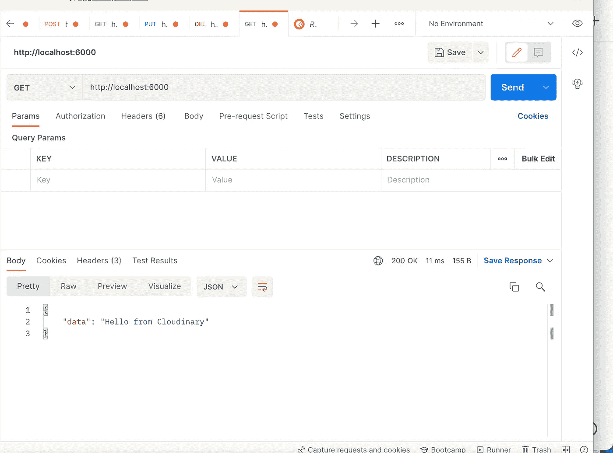
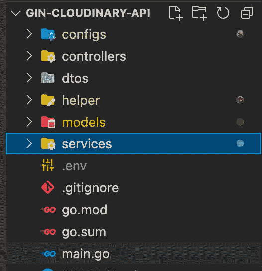
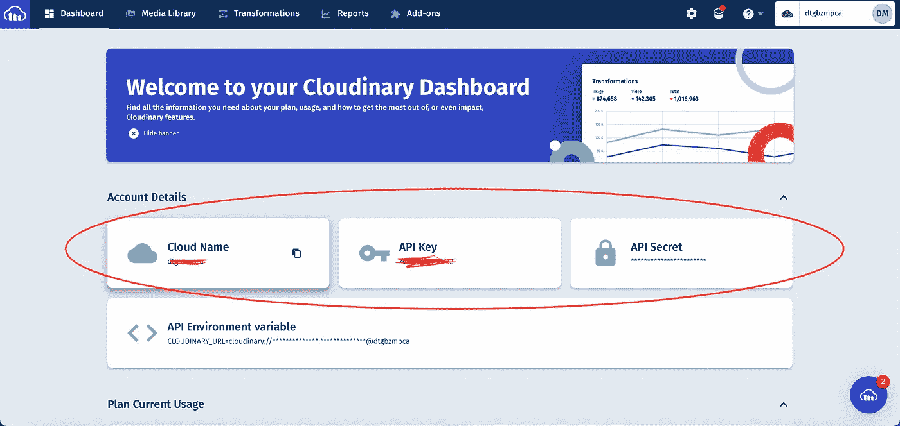
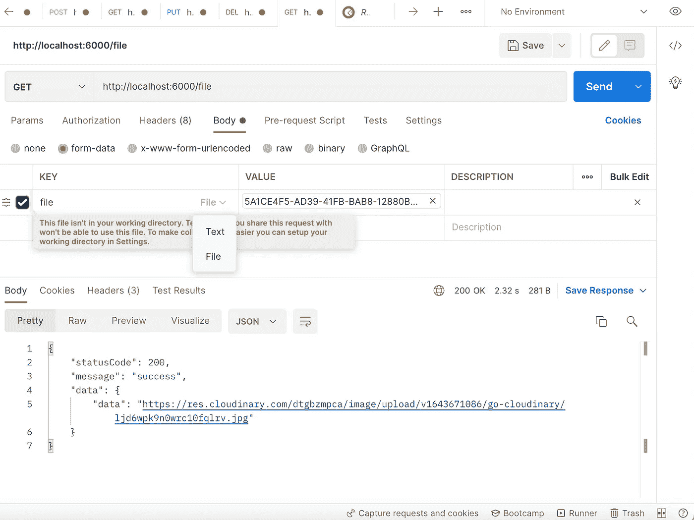
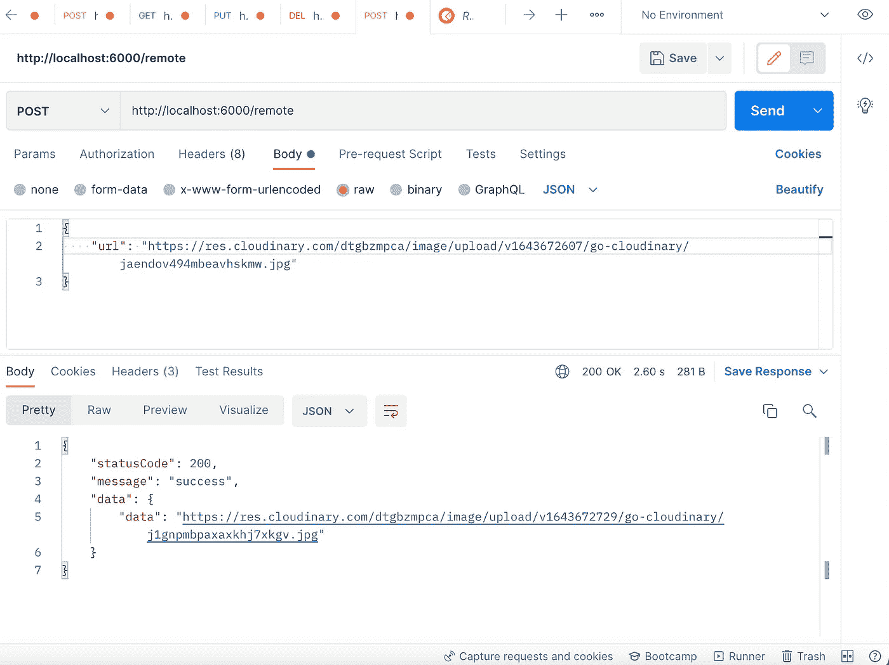
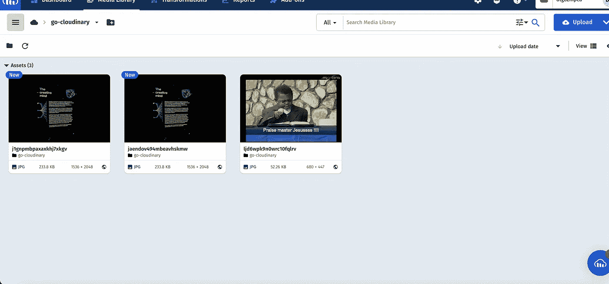

# 使用 Golang 和 Cloudinary 实现强大的媒体上传— Gin-gonic 版本

> 原文：<https://medium.com/geekculture/robust-media-upload-with-golang-and-cloudinary-gin-gonic-version-a11366bec4fb?source=collection_archive---------11----------------------->


Cover image

近年来，移动和 web 应用程序支持文件上传的需求大幅增长，从图像和视频到 excel、CSV 和 PDF 等文档。最重要的是，我们必须具备将文件上传支持集成到我们的应用程序中所需的知识。

这篇文章将讨论使用 Golang 的 [Gin-gonic](https://github.com/gin-gonic/gin) 框架和 [Cloudinary](https://cloudinary.com/) 为 REST API 添加媒体上传支持。在本教程的最后，我们将学习如何构建一个 Gin-gonic 应用程序，将 Cloudinary 与 Golang 集成，并使用远程 URL 和本地文件存储将媒体文件上传到 Cloudinary。

Gin-gonic，俗称 **Gin** ，是一个用 Golang 编写的 HTTP web 框架，具有性能和生产力支持。Gin 使用定制版本的 [HttpRouter](https://github.com/julienschmidt/httprouter) ，这是一个轻量级、高性能的 HTTP 请求路由器，它在 API 路由中的导航速度比大多数框架都要快。

Cloudinary 提供了一个强大的视觉媒体平台，用于为网站和应用程序上传、存储、管理、转换和交付图像和视频。该平台还为框架和库提供了大量的软件开发工具包(SDK)。

您可以在这个[库](https://github.com/Mr-Malomz/gin-cloudinary-api)中找到完整的源代码。

# 先决条件

这篇文章中的以下步骤需要 Golang 的经验。使用 Cloudinary 的经验不是必需的，但是拥有它是很好的。
我们还需要以下物品:

*   用于存储媒体文件的[云账户](https://cloudinary.com/)。 [**报名**](https://cloudinary.com/users/register/free) **完全免费**。
*   [Postman](https://www.postman.com/downloads/) 或者你选择的任何 API 测试应用。

# 让我们编码

## 入门指南

首先，我们需要导航到所需的目录，并在我们的终端中运行以下命令:

```
mkdir gin-cloudinary-api && cd gin-cloudinary-api
```

该命令创建一个`gin-cloudinary-api`文件夹，并导航到项目目录。

接下来，我们需要通过运行以下命令来初始化 Go 模块以管理项目依赖关系:

```
go mod init gin-cloudinary-api
```

该命令将创建一个`go.mod`文件，用于跟踪项目依赖关系。

我们继续安装所需的依赖项:

```
go get -u github.com/gin-gonic/gin github.com/cloudinary/cloudinary-go github.com/joho/godotenv github.com/go-playground/validator/v10
```

`github.com/gin-gonic/gin`是一个用于构建 web 应用程序的框架。

`github.com/cloudinary/cloudinary-go`是集成 Cloudinary 的库。

`github.com/joho/godotenv`是一个管理环境变量的库。

`github.com/go-playground/validator/v10`是一个用于验证结构和字段的库。

# 应用程序入口点

安装好项目依赖项后，我们需要在根目录下创建`main.go`文件，并添加下面的代码片段:

上面的代码片段执行了以下操作:

*   导入所需的依赖项。
*   使用`Default`配置初始化 Gin 路由器。`Default`函数用默认中间件(日志和恢复)配置 Gin 路由器。
*   使用`Get`函数路由到`/`路径和一个返回`Hello from Cloudinary`的 JSON 的处理函数。
*   使用`Run`函数将`router`附加到一个 **http。服务器**并开始监听和服务`localhost:6000`上的 HTTP 请求。

接下来，我们可以通过在终端中运行下面的命令来启动开发服务器，从而测试我们的应用程序。

```
go run main.go
```



# Golang 的模块化

对于我们的项目来说，有一个好的文件夹结构是很重要的。良好的项目结构简化了我们在应用程序中处理依赖关系的方式，并使我们和其他人更容易阅读我们的代码库。

为此，我们需要在我们的项目目录中创建`configs`、`services`、`controllers`、`helper`、`models`和`dtos`文件夹。



**PS**:*`*go.sum*`*文件包含所有依赖校验和，由 go 工具管理。我们不必为此担心。**

*`configs`用于模块化项目配置文件*

*`services`用于模块化应用逻辑。它有助于保持控制器的清洁。*

*`controllers`用于模块化应用传入请求并返回响应。*

*`helper`用于模块化用于执行另一个文件的计算的文件。*

*`models`用于模块化数据和数据库逻辑。*

*`dtos`用于模块化文件，描述我们希望 API 给出的响应。这一点以后会变得更加清楚。
[*数据传输对象(DTO)*](https://en.wikipedia.org/wiki/Data_transfer_object) *简单来说就是将数据从一点传输到另一点的对象。**

# *设置云阵列*

*完成后，我们需要登录或注册我们的 [Cloudinary](https://cloudinary.com/) 账户，以获取我们的**云名称**、 **API 密钥**和 **API 秘密**。*

**

*接下来，我们需要创建一个文件夹来存储我们的媒体上传。为此，导航到**媒体库**选项卡，点击**添加文件夹**图标，输入`go-cloudinary`作为文件夹名称，然后**保存**。*

****

***设置环境变量** 接下来，我们需要将仪表板中的参数包含到环境变量中。为此，首先，我们需要在根目录下创建一个`.env`文件，并在这个文件中添加下面的代码片段:*

```
*CLOUDINARY_CLOUD_NAME=<YOUR CLOUD NAME HERE>
CLOUDINARY_API_KEY=<YOUR API KEY HERE>
CLOUDINARY_API_SECRET=<YOUR API SECRET HERE>
CLOUDINARY_UPLOAD_FOLDER=go-cloudinary*
```

***加载环境变量** 完成后，我们需要使用我们之前安装的`github.com/joho/godotenv`库创建助手函数来加载环境变量。为此，我们需要导航到`configs`文件夹，在这个文件夹中，创建一个`env.go`文件，并添加下面的代码片段:*

*上面的代码片段执行了以下操作:*

*   *导入所需的依赖项。*
*   *创建一个`EnvCloudName`、`EnvCloudAPIKey`、`EnvCloudAPISecret`、`EnvCloudUploadFolder`函数，检查环境变量是否正确加载并返回环境变量。*

***Cloudinary helper 函数** 为了方便从我们的应用程序进行远程和本地上传，我们需要导航到`helper`文件夹，并在该文件夹中创建一个`media_helper.go`文件并添加以下代码片段:*

*上面的代码片段执行了以下操作:*

*   *导入所需的依赖项。*
*   *创建一个`ImageUploadHelper`函数，它首先将一个`interface`作为参数，并返回远程 URL 或错误(如果有的话)。`interface`通过接受**远程 URL**和**表单文件**使我们的代码可重用。该函数还执行以下操作:
    -定义了连接到 Cloudinary 时的 10 秒超时。
    -通过传入**云名称**、 **API 密钥**和 **API 秘密**作为参数，并检查是否有错误，初始化一个新的 Cloudinary 实例。
    -使用`Upload`功能上传媒体，并使用`EnvCloudUploadFolder`功能指定存储媒体的文件夹。获取上传结果和错误(如果有)。
    -当没有错误时，返回媒体安全 URL 和`nil`。*

# *设置模型和响应类型*

***模型** 接下来，我们需要一个模型来表示我们的应用数据。为此，我们需要导航到`models`文件夹，在这个文件夹中，创建一个`media_model.go`文件并添加下面的代码片段:*

*上面的代码片段执行了以下操作:*

*   *导入所需的依赖项。*
*   *创建一个具有本地文件上传和远程 URL 上传所需属性的`File`和`Url`结构。*

***响应类型** 接下来，我们需要创建一个可重用的`struct`来描述我们的 API 的响应。为此，导航到`dtos`文件夹，在该文件夹中创建一个`media_dto.go`文件，并添加以下代码片段:*

*上面的代码片段创建了一个具有`StatusCode`、`Message`和`Data`属性的`MediaDto`结构来表示 API 响应类型。*

# *最后，创建 REST API*

*完成后，我们需要创建一个**服务**来托管所有的媒体上传应用逻辑。为此，导航到`services`文件夹，在该文件夹中创建一个`media_service.go`文件，并添加以下代码片段:*

*上面的代码片段执行了以下操作:*

*   *导入所需的依赖项。*
*   *使用我们之前安装的`github.com/go-playground/validator/v10`库创建一个`validate`变量来验证模型。*
*   *创建一个`mediaUpload`接口，用方法描述我们想要做的上传类型。*
*   *创建一个将实现`mediaUpload`接口的`media`结构。*
*   *创建一个`NewMediaUpload`构造函数，将`media`结构和它实现的`mediaUpload`接口联系起来。*
*   *使用`media`指针接收器创建所需的方法`FileUpload`和`RemoteUpload`，并返回 URL 或错误(如果有)。所需的方法还验证来自用户的输入，并使用我们之前创建的`ImageUploadHelper`函数将媒体上传到 Cloudinary。*

***文件上传端点** 通过服务设置，我们现在可以创建一个从本地文件存储器上传媒体的功能。为此，我们需要导航到`controllers`文件夹，在该文件夹中，创建一个`media_controller.go`文件并添加下面的代码片段:*

*上面的代码片段执行了以下操作:*

*   *导入所需的依赖项。*
*   *创建一个返回 Gin-gonic 处理程序的`FileUpload`函数。在返回的处理程序中，我们首先使用`Request.FormFile`函数从请求体中检索`formFile`对象。我们使用之前创建的`MediaDto`结构返回了适当的消息和状态代码。其次，我们使用`NewMediaUpload`构造函数通过传递`formFile`作为参数来访问`FileUpload`服务。该服务还返回上传媒体的 URL 或错误(如果有的话)。最后，如果媒体上传成功，我们将返回正确的响应。*

***远程 URL 上传端点** 要从远程 URL 上传图片，我们需要修改`media_controller.go`如下所示:*

*`RemoteUpload`功能与`FileUpload`功能的作用相同。然而，我们创建了`url`变量，并使用 Gin-gonic 的`BindJSON`方法对其进行了验证。我们还将变量作为参数传递给`RemoteUpload`服务，并返回适当的响应。*

***完成媒体 _ 控制器. go***

***将所有这些放在一起** 完成后，我们需要为我们的端点创建一个从本地文件存储和远程 URL 上传媒体的路由。为此，我们需要用控制器修改`main.go`,并指定相对路径，如下所示:*

*完成后，我们可以通过在终端中运行下面的命令启动开发服务器来测试我们的应用程序。*

```
*go run main.go*
```

****

*上传完成后，我们可以查看 Cloudinary 上的`go-cloudinary`文件夹，查看上传的媒体文件。*

**

# *结论*

*这篇文章讨论了如何构建 Gin-gonic 应用程序，如何将 Cloudinary 与 Golang 集成，以及如何使用远程 URL 和本地文件存储将媒体文件上传到 Cloudinary。*

*您可能会发现这些资源很有帮助:*

*   *[金角](https://github.com/gin-gonic/gin)*
*   *[Cloudinary Go SDK](https://cloudinary.com/documentation/go_integration)*
*   *[Go 指针接收器](https://go.dev/tour/methods/4)。*