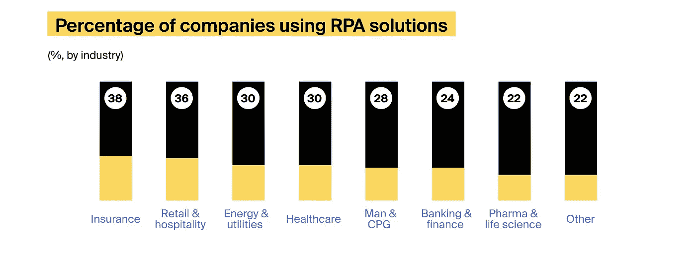
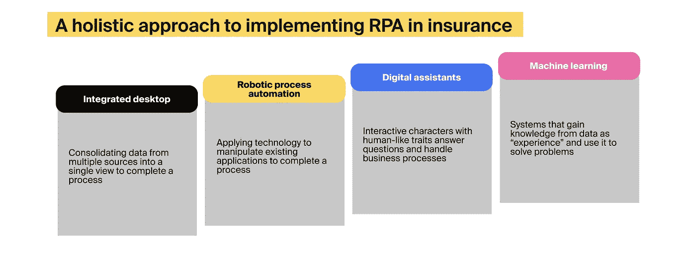

# 保险中的 RPA:您的终极指南

> 原文：<https://medium.com/geekculture/rpa-in-insurance-your-ultimate-guide-8d73e870751d?source=collection_archive---------5----------------------->

如果你雇佣了四个人并付了工资，但是只有三个人来做工作，你会满意吗？

然而，许多雇主就是这么做的。据麦肯锡称，普通员工每天花费 1.8 小时收集和汇总数据，这是一项多余的任务，对业务成功没有直接影响，而且最重要的是，可以轻松实现自动化。

您的保险公司是否正在寻找方法来减轻员工的日常负担，同时削减成本并最大限度地减少错误？如果是这样，您可以咨询[机器人流程自动化公司](https://itrexgroup.com/services/robotic-process-automation/)来构建或定制符合您需求的 RPA 解决方案。

但在此之前，保险中哪里可以使用 RPA？以及如何为其实施做准备——无论是在特定流程中还是在公司范围内？

# 什么是 RPA，它如何为保险行业服务？

**在保险行业，机器人流程自动化(RPA)是指基于规则的软件机器人，可以执行重复性的手动任务，例如提取索赔数据，从各种内部和外部来源汇总客户信息，以及执行背景调查。**

如果我们看一下 RPA 实施的统计数据，保险业和零售业是这项技术的主要受益者。

由于这种受欢迎程度，Juniper Research 预测，到 2024 年，几乎一半的保险行业[将投资 RPA。麦肯锡认为，到 2025 年，那些已经采用这项技术的人将能够实现 25%的人工流程自动化。](https://www.simplesolve.com/blog/intelligent-process-automation-in-insurance-industry)

在保险行业部署 RPA 可以带来以下好处:

*   **促进与传统系统的集成**。RPA 可以充当现代软件(如 ERP 解决方案)与对业务仍然重要的现有传统程序和设备之间的桥梁。有时，在保险业部署 RPA 可以完全取代旧式系统。例如，一家北美保险公司 Security Benefit [通过自动化遗留流程在一年内节省了 40，000 个工时](https://www.uipath.com/resources/automation-case-studies/security-benefit-company-wide-mission)。
*   **减少人工**。有许多现实生活中的例子表明，在保险业中采用 RPA 减轻了员工的负担，让他们有更多的时间来完成价值更高的任务。例如，Encova Insurance 通过自动化客户保留流程为其员工[每周节省了 25 个小时](https://www.uipath.com/resources/automation-case-studies/encova)，而澳大利亚联合保险[通过 RPA 在八个月的时间里为其员工节省了 22，493 个小时](https://www.uipath.com/resources/automation-case-studies/australian-unity)的体力劳动。
*   **降低损耗率**。当员工没有被单调乏味的日常任务压垮时，他们的工作满意度就会提高。一家总部位于香港的大型保险集团过去常常将日常文书工作委托给初级员工，这些员工会犯错误，导致员工流动率很高。公司[报告称，在自动化了 80%的流程后，员工流失率](https://www.automationanywhere.com/resources/customer-stories/asia-largest-insurance-company)降低了。
*   **削减成本**。在保险业部署 RPA 确实需要初始投资，但从长远来看，它有助于公司节省资金。例如，一家全球保险提供商[在部署了 13 个 RPA 机器人后，在 6 个月内](https://www.uipath.com/resources/automation-case-studies/global-insurance-provider)节省了 14 万英镑。

# 7 大机器人过程自动化保险用例

# 承销

承销商必须分析来自众多来源的信息，以评估风险，并为客户找到最佳利率和政策选项。例如，在人寿保险领域，这项任务可能需要长达四周的时间。承销商平均花费 40%的时间用于数据收集和录入。

机器人可以聚合和处理来自内部和外部站点的数据，并将其显示在仪表板上，以便更快、更方便地做出决策。据麦肯锡称，在保险业使用 RPA 可以[将数据处理时间减少 34%](https://www.mckinsey.com/~/media/mckinsey/industries/financial%20services/our%20insights/time%20for%20insurance%20companies%20to%20face%20digital%20reality/digital-disruption-in-insurance.ashx) 。此外，通过人工智能的增强，机器人可以执行以下任务:

*   填充内部系统中的相应字段
*   分析客户的索赔历史并建议定价
*   验证该人员是否已经有一份现有的保单
*   评估亏损运行
*   识别健康风险，例如检查此人是否吸烟
*   从第三方资源中提取客户的信用评级，如 Experian

当 RPA 接管琐碎的任务时，人工承保人可以集中精力简化更复杂的案例。

一家一级美国保险公司[求助于埃森哲，从不同的保单系统中自动提取数据](https://www.accenture.com/_acnmedia/PDF-175/Accenture-AI-Led-Insurance-PoV-ALIP-Web.pdf#zoom=50)，并为承保人提供 360 度的客户及其风险。在此合作之前，保险商浪费了大量时间来手动执行这项任务。现在他们可以利用这段时间更好地为客户服务。

# 业务过程优化

保险行业充满了纸张密集型流程，这使得评估运营效率和确定需要改进的领域变得非常困难。当自动化机器人接管时，跟踪它们的工作流程并记录每一步就成为可能。之后，在审计期间，公司可以查看日志并测量参数，如处理速度和所需的手动干预次数，以确定流程优化的候选对象。

即使只是简单地自动化流程，效率也会在速度和出错率方面有所提高。

为了实现这一点，许多组织正在将保险 RPA 整合到他们的工作流中。意大利保险公司 Cattolica Assicurazioni 求助于 UiPath 来实现流程自动化。他们调查了财务调节的过程，发现它包含很少的例外，几乎可以完全数字化。他们部署 RPA 机器人来执行乏味的任务，例如匹配 20，000 行数字。财务部分配了六个月的时间来完成这个项目。RPA 自动化了 90%的流程，公司[仅用了两个月](https://www.uipath.com/resources/automation-case-studies/cattolica-assicurazioni-improving-efficiency-through-automation)就完成了这项任务，并且零出错率。

# 索赔管理和欺诈检测

麦肯锡报告称，自动化[减少了 80%的人工工作量](https://www.mckinsey.com/~/media/mckinsey/industries/financial%20services/our%20insights/time%20for%20insurance%20companies%20to%20face%20digital%20reality/digital-disruption-in-insurance.ashx)。

正如您从统计数据中看到的，这是一个主要的机器人过程自动化保险用例。当索赔登记是手动完成时，它会导致错误、缓慢的服务和不愉快的客户体验。将 RPA 纳入保险可以简化从第一份损失通知(FNOL)到理赔的整个流程:

*   集成来自多个来源的索赔数据，例如健康保险中 RPA 的医疗记录、受损车辆的照片等。
*   通过对扫描的书面索赔进行分类并正确输入系统来处理这些索赔
*   协助索赔验证和体育欺诈索赔
*   找出任何缺失的信息，并将此问题提请负责官员注意

加拿大索赔管理提供商 SCM Insurance 为 FNOL 提供全自动数据录入服务，使索赔完成速度[提高了 80%](https://www.uipath.com/resources/automation-case-studies/scm-tames-work-with-du-rpa)。美国一家大型财产和意外伤害保险公司，[EXL 公司在保险索赔处理中部署 RPA 后的前四个月内，可以将](https://www.automationanywhere.com/resources/customer-stories/insurer-reduces-claims-processing-with-zero-errors)工人赔偿索赔处理时间减少 60%。

# 政策管理和取消

尽管当前用于策略管理的软件包为员工节省了大量劳动力，但它们仍然包括通过多个应用程序的复杂导航，导致效率低下并为错误打开了空间。

由[机器学习](https://itrexgroup.com/services/machine-learning-development/)和自然语言处理支持的保险机器人流程自动化解决方案，可以接收保单持有人的电子邮件，提取数据，进行必要的更改，如银行指令和地址变更，并发送确认。该技术可以处理保单评级、签发、认可、续保和取消等任务。

苏黎世保险集团[部署了凯捷基于 BluePrism 软件打造的自动化解决方案](https://www.zurich.com/products-and-services/protect-your-business/commercial-insurance-risk-insights/robotics-take-the-tedium-from-policy-administration-and-give-back-efficiency)。在政策处理的早期，RPA 机器人会将政策细节输入到系统中，开具发票，并起草政策文档供官员审阅。苏黎世客户和保险公司都从这种方法中受益匪浅。苏黎世商业保险公司机器人流程自动化主管 Raffaele Nutricati 表示，*“他们不仅收到了比传统方式处理的保单质量更高的保单，而且向我们的支持中心澄清信息的电子邮件和电话数量也显著减少。”*

# 法规遵循

保险行业依靠几个合规性标准(如税法和 HIPAA 隐私规则)来指导文档和流程。官员们应该监督规章制度的任何变化并采取行动。他们需要尽快将索赔类型与相应的管辖区对应起来，这有违反法规的风险。

自动化机器人可以通过监控法规、相应地验证客户数据、记录变更以及生成监管报告来接管这一职责。例如，一个流行的法规遵从性用例是针对政治公众人物制裁的姓名筛选警报审查(PEP)。筛查系统每天会生成数千个警报，手动验证任何误报都会令人疲惫不堪。保险业中的 RPA 可以预处理这些警报，从而显著限制手动验证的误报数量。

# 客户服务

如上所述，在保险业部署 RPA 加快了面向客户的服务，几乎消除了错误率，从而带来了更好的客户体验。随着保险公司越来越多，客户总是可以选择离开一家保险公司去找另一家。根据德勤的调查，41%的受访者在经历了糟糕的客户服务后离开了他们的保险公司。

此外，自动化使公司能够执行高级分析，以更好地了解客户期望并提供个性化产品。例如，一位客户在社交媒体上发布了他即将到来的旅行。RPA 助理会注意到这些信息，当客户联系保险代理人(比如说家庭保险)时，智能助理会通知代理人有关假期的信息，使代理人能够提供满足客户所有需求的定制服务。

这种方法会给你带来竞争优势，因为 [88%的客户抱怨保险产品缺乏个性化。](https://www.liferay.com/blog/customer-experience/20-must-know-stats-for-insurers-in-2022)

# 询问处理

保险部门收到大量经纪人和客户的询问，要求快速解决。对于员工来说，手动查询处理可能容易出错且令人疲惫不堪，而部署 RPA 保险机器人将保证更快、更准确的结果。

Hollard Group 通过[自动化 98%的电子邮件处理流程](https://research.aimultiple.com/rpa-insurance/)，成功促进了经纪人沟通。结果，他们将执行时间减少了 600%，每月节省了 2，000 小时的员工时间。

# 保险业成功采用机器人流程自动化的途径

以下五个步骤可以让你和你的公司为即将到来的自动化项目做好准备:

*   **确定自动化的候选流程**。选择结构良好、基于规则、没有太多例外的流程。选择经常使用的流程也是一种很好的做法，因为它们会放大收益并加快投资回报。根据 Gartner 的说法，[理想的 RPA 候选者](https://blog.vsoftconsulting.com/blog/gartners-three-step-process-for-a-successful-rpa-journey)不应包括超过 20 个步骤或涉及超过三个应用程序。
*   **自动化前优化流程**。首先分析过程，消除任何不必要的步骤。此外，即使每个员工执行任务的方式不同，也要为自动化提供一个标准化的流程版本。
*   从一开始就让你的员工参与进来。这将有助于人们了解 RPA 的好处，提出改进建议，并促使他们普遍使用新系统。
*   **选择您的 RPA 平台**。有四个成熟的 RPA 供应商，即 [UiPath](https://www.uipath.com/) 、 [Blue Prism](https://www.blueprism.com/) 、 [Automation Anywhere](https://www.automationanywhere.com/) 和 [WorkFusion](https://www.workfusion.com/) 。
*   **寻找一家供应商，帮助您将选定的 RPA 保险工具整合到您现有的系统中**。最有可能的情况是，您仍然需要自定义您的首选 RPA 解决方案，以满足您的所有需求并适应您的工作流。经验丰富的机器人过程自动化公司将确保无缝集成。

在我们最近的文章中，您可以了解更多关于采用 RPA 的挑战以及如何克服这些挑战的信息。

# RPA 在保险业的下一步是什么？

在保险行业部署机器人流程自动化可以加快运营速度、降低费用并提高客户满意度。但这只是通往智能流程自动化(IPA)之路的开始，智能流程自动化将使 RPA 机器人能够接管通常留给人类的任务。借助认知技术，如 [AI](https://itrexgroup.com/blog/ai-types-subsets-use-cases/) 、[情感识别](https://itrexgroup.com/blog/ai-sentiment-analysis-in-customer-service-use-cases-benefits-expert-tips/)、[光学字符识别](https://itrexgroup.com/blog/how-ocr-algorithms-redefine-business-processes/)，RPA 可以最大化其在整个保险价值链中的贡献。

您可以从我们最近的文章[比较 IPA 和 RPA](https://itrexgroup.com/blog/ipa-vs-rpa-vs-bpa/) 中了解更多关于智能自动化的信息。我们还编写了一份全面的指南，介绍如何从企业自动化开始以及实施 RPA 解决方案的成本。最后，您可以访问我们的博客，了解更多关于金融领域的 RPA 的信息。

> *想要通过自动化一些手动保险流程来提高效率和削减成本吗？* [*降 ITRex 一行*](https://itrexgroup.com/contact-us/) *！他们的 RPA 专家将帮助您选择正确的自动化平台，并定制解决方案以满足您的独特需求。*

*原载于 2022 年 6 月 24 日*[*https://itrexgroup.com*](https://itrexgroup.com/blog/rpa-in-insurance-ultimate-guide/)*。*