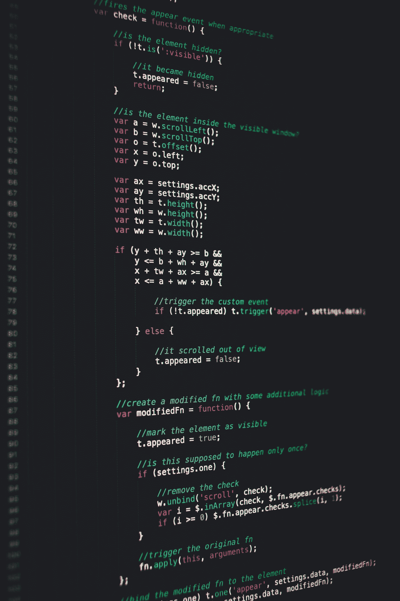

# 南原则 1:单一责任原则

> 原文：<https://medium.com/geekculture/s-o-l-i-d-principle-1-single-responsibility-principle-83af735cc62e?source=collection_archive---------17----------------------->

Photo by [Markus Spiske](https://unsplash.com/@markusspiske?utm_source=medium&utm_medium=referral) on [Unsplash](https://unsplash.com?utm_source=medium&utm_medium=referral)

每个类、模块或对象应该只负责一项任务，或者用罗伯特·c·马丁(鲍勃叔叔)的话说:“一个类应该只有一个改变的理由”。我们将通过下面的代码示例来解释这一原理:

我们可以看到一个执行三种不同任务的 TypeScript 类:

1.  在相关的 HTML 页面(orders-list-class . component . HTML)上显示订单数据。
2.  检查用户是否已经登录。
3.  处理数据库中的数据检索。

很明显，这个类没有遵循第一固体原理。我们将不得不把这个单独的班级分成三个班级。每个班级将只执行上述任务中的一项。它看起来会像这样:

遵循这条规则我们可以看到几个好处:

1.  班级更小，更容易理解。
2.  实现代码可重用性。我们也可以在其他类中使用服务类，而不需要复制代码。