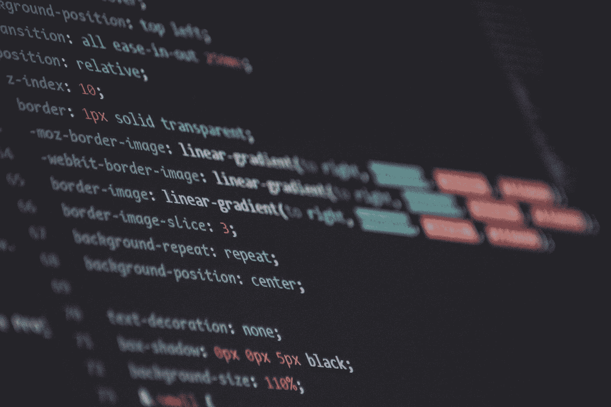

# 时髦的

> 原文：<https://medium.com/geekculture/sass-y-f95a8017f37?source=collection_archive---------22----------------------->

## 语法上很棒的样式表



Photo by [Maik Jonietz](https://unsplash.com/@der_maik_?utm_source=medium&utm_medium=referral) on [Unsplash](https://unsplash.com?utm_source=medium&utm_medium=referral)

我最近开始使用 Sass，或者语法上很棒的样式表。它们是一个很好的网站样式，超出了基本 CSS 所能做的。在这篇文章中，我将深入探讨什么是 Sass，为什么你应该使用它，以及它能做什么的一些例子。

首先，什么是 Sass 或者语法上很棒的样式表。Sass 是一种编译成 CSS 的预处理脚本语言。Sass 提供了嵌套、混合、继承和变量等特性。这使得轻松处理和设计大型作品变得更加容易。如上所述，Sass 是一个预处理器，所以你必须把它编译成 CSS。有几种方法可以做到这一点。我将向您展示的是 npm。

因此，对于 sass watch，您需要在您的计算机上安装 Node.js，这样您就可以访问 npm 或 node package manager。首先，您需要安装 sass。

```
sass-learn % sudo npm i -g sass
   // This installs sass globally on your machinesass-learn % sass --watch scss/style.scss css/style.css
   // This watches the folder that you sass is in and creates a css   
      folder with those stylings
```

每次保存 sass 文件时，所做的更改都会保存到 CSS 文件中，该文件将对您的站点进行样式设置。现在让我们来了解一下 sass 拥有而 CSS 没有的一些东西。

## 变量

像在其他语言中一样，变量允许你保存一个值在多个地方使用。这样你只需要在一个地方做出改变。Sass 变量以' $ '开头，类似于 PHP。下面我将展示 Sass 和 CSS 的区别。

半铸钢ˌ钢性铸铁(Cast Semi-Steel)

```
body {
  font: 100% Helvetica, sans-serif;
  color: #333;
}
```

SCSS

```
$font-stack:    Helvetica**,** sans-serif;
$primary-color: #333;

body {
  font: 100% $font-stack;
  color: $primary-color;
}
```

## 嵌套

嵌套非常有用，可能是我最喜欢的 Sass 特性之一。它允许您嵌套选择器，类似于 HTML divs 的嵌套方式。小心过度嵌套，这会导致过度限定的 CSS，这可能很难维护，并且通常被认为是不好的做法。这里有一些例子。

半铸钢ˌ钢性铸铁(Cast Semi-Steel)

```
nav ul {
  margin: 0;
  padding: 0;
  list-style: none;
}
nav li {
  display: inline-block;
}
nav a {
  display: block;
  padding: 6px 12px;
  text-decoration: none;
}
```

SCSS

```
nav {
  ul {
    margin: 0;
    padding: 0;
    list-style: none;
  }

  li { display: inline-block; }

  a {
    display: block;
    padding: 6px 12px;
    text-decoration: none;
  }
}
```

扩展/继承

在本例中，我将使用按钮向您展示如何使用这些功能。我们将有两个按钮，它们都是一样的，除了背景颜色会有所不同。这样，按钮看起来完全一样，你只需要写一次。

```
%btn {
   display: inline-block;
   border-radius: 5px;
   margin: 3px;
   padding: 8px 20px;
} .btn-one {
    @extend $btn;
    background-color: $primary-color;
}.btn-two {
    @extend $btn;
    background-color: $secondary-color;
}
```

## 分音

像在其他语言中一样，分部允许你分离关注点。这可以在需要的时候更容易地编辑代码。部分路径总是以下划线(_)开头。所以对于我们的按钮，它应该是这样的 _buttons.scss。然后你只需要把它们导入到主文件中。

```
style.scss@import 'buttons'$font-stack:    Helvetica**,** sans-serif;
$primary-color: #333;

body {
  font: 100% $font-stack;
  color: $primary-color;
}nav {
  ul {
    margin: 0;
    padding: 0;
    list-style: none;
  }

  li { display: inline-block; }

  a {
    display: block;
    padding: 6px 12px;
    text-decoration: none;
  }
}
```

这些只是让 Sass 如此好用的一些特性，我相信随着我对文档和用法的深入研究，我会发现更多的特性。我将链接到 sass 网站，这样您就可以开始使用 sass 了。

## 资源

 [## 证明文件

### Sass 是一种编译成 CSS 的样式表语言。它允许你使用变量，嵌套规则，混合，函数…

sass-lang.com](https://sass-lang.com/documentation)