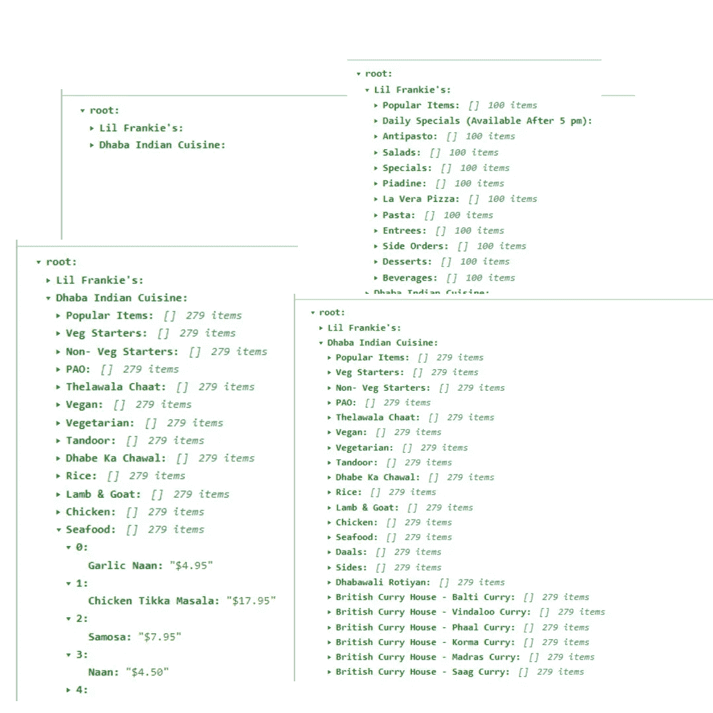

# 刮一个动态网站，硒第三部分

> 原文：<https://medium.com/geekculture/scraping-a-dynamic-website-selenium-part-iii-7138d2a3131?source=collection_archive---------30----------------------->

到目前为止，我在[第一部分](/swlh/scraping-a-dynamic-web-page-its-selenium-da161999c975)和[第二部分](/swlh/scraping-a-dynamic-web-page-its-selenium-da161999c975)中提到了两种从 doordash.com 抓取菜单的方法。这是第三部分，也是另一种抓取网页的方法。

# **第三次进场**

在这种方法中，我没有使用 BeautifulSoup 和 Pandas 库。这个脚本从任意位置的商店中抓取菜单，并将数据保存为 JSON 文件。JSON 文件包含“Menu”的主标题，一些带有“食品商店”名称的子标题，以及每个商店中“食品类别”的内部节点。然后，每个类别包含作为“键”的产品名称，以及作为“值”的价格。以下是输出:



> 现在，让我们看看代码。

```
# importing libraries
import ctypes
import json
import sys
import time
from typing import List
import selenium.webdriver
from selenium.webdriver import ActionChains
from selenium.webdriver.common.keys import Keys
from selenium.webdriver.remote.webelement import WebElement
from selenium.webdriver.support.wait import WebDriverWait
from selenium_move_cursor.MouseActions import move_to_element_chrome
```

1-导入必要的库

```
# The URL

url = **'https://www.doordash.com/en-US'** # # this will open the "doordash.com"
    # defining driver and adding the “ — headless” argument
    # opts = Options()
    # opts.add_argument('— headless')
driver = selenium.webdriver.Chrome (**'chromedriver'**)
    # open the URL
driver.maximize_window()
driver.get(url)
driver.implicitly_wait(220)

time.sleep(5)
    # to focus the current window
driver.switch_to.window(driver.window_handles[0])

time.sleep(10)
```

2-定义并打开 URL

```
# enter location and search

    # Default Search string for location
search_query: str = **"New York"** # (Manual Search String, sys.argv will interact with the terminal, 2nd argument will is
    # the search string of location
if len(sys.argv) >= 2:
    search_query = sys.argv[1]
    print(search_query)

    # send location to search element
driver.find_element_by_css_selector(**"input[class='sc-OqFzE kdYTND']"**).send_keys(search_query)
time.sleep(3)
    # click on search button
driver.find_element_by_css_selector(**"button[class='sc-cRULEh fMiRie']"**).click()
driver.implicitly_wait(120)
```

3-搜索特定位置

```
# get the total number of stores on the page
time.sleep(5)
stores=driver.find_element_by_xpath (**"//div[@class='sc-fQfKYo cUcAcc']**\
 **//div[@class='sc-cOoQYZ eQkiJd']**\
 **//span[@class='sc-bdVaJa hQDtnE']"**)
number=stores.text
strNo=[int (s) for s in number.split () if s.isdigit ()]
for i in strNo :
    i=i
print(i)
```

4-获取该位置的商店总数

```
# scroll to each store and open, one-by-one, for scraping
    #the 'for loop' starts
time.sleep (5)

    # loop through the menus of each store on a page

    #dictionay for jason file
Menus = {}
x: int
for x in range (0 , i , 1) :
    div2=driver.find_element_by_xpath (**"//div[@class='sc-jrOYZv bgfxZq']"**)
    element: List [WebElement]=div2.find_elements_by_xpath (**"//div[@class='sc-EHOje eOpoWF']**\
 **//span[@class = 'sc-bdVaJa bTYYIJ']|//div[@class='sc-EHOje eOpoWF']**\
 **//span[@class = 'sc-bdVaJa lncAvd']"**)

    time.sleep (10)
    WebDriverWait (driver , 60)
    strnm: WebElement=element [x]
    pos=strnm.location
    y=pos.get (**'y'**)-70
    driver.execute_script (**f"window.scrollTo(0,** {y}**)"**)
    store_name = str(strnm.text)
    print (**f'**{x}**- '** , store_name)
```

5-逐个滚动到每个商店，并打印名称

```
# write the "store_name" in a JSON node
    # sub-nodes of stores
    sub_node = Menus [**f'**{store_name}**'**]= {}
```

6-在每次迭代中，用商店的名称在 JSON 中创建子节点

```
# lists to store all names and check the length of results
    names = []
    # open the store
    time.sleep (4)
    move_to_element_chrome (driver , strnm , display_scaling=100)
    actions=ActionChains (driver)
    actions.send_keys_to_element (strnm , Keys.ENTER).perform ()
# create sub-node of each food category in the store under the "store_name" node
# scrape the menus of related food category
    #look for the categories of food
    categories = driver.find_element_by_xpath(**"//div[@class='sc-jrOYZv iAfIGO']"**)\
                        .find_elements_by_xpath(**"//div[@class='sc-ddcOto bPbXPf']"**)
    no_of_categories = len(categories)
```

7-打开商店，获取食物类别

```
for n in range(0,no_of_categories, 1):
#           create a list for each category
        cet = categories[n]
        category = str(cet.text)
        sub_node[**f'**{category}**'**] = []
#           scrape menus' name and prices
        actions.send_keys_to_element(cet, Keys.ENTER)
        itm = driver.find_elements_by_xpath(**"//div[@class='sc-BOulX imSnGi']//div[@class='sc-bscRGj CaBXz']"**)
        itms = itm[n]
        item = itms.find_elements_by_xpath(**"//div[@class='sc-iBfVdv dWPDtB']//span[@class='sc-bdVaJa gImhEG']"**)
        prcs = itms.find_elements_by_xpath(**"//div[@class='sc-eomEcv cVLFKN']//span[@class='sc-bdVaJa eEdxFA']"**)
        price = []
        foods = []
        for food in item:
            foods.append(food.text)
        if prcs is not None:
            for value in prcs:
                price.append(value.text)
        else:
            for food in item:
                price.append(**'NaN'**)
        for m, p in zip(foods , price) :
#           append "item" and "Price list" in food category list
            sub_node[**f"**{category}**"**].append ({m:p})
#   scrape all menu names
```

8-逐个点击每个类别，并抓取相关菜单。每个类别的名称将作为“store name”节点的子节点添加到 JSON 文件中。

```
#   scrape all menu names
    target = driver.find_elements_by_xpath(**"//div[@class='sc-iBfVdv dWPDtB']//span[@class='sc-bdVaJa gImhEG']"**)
    for nm in target:
        names.append(nm)
# check if the target is reached
```

9-将菜单存储在单独的列表中以设定目标

```
if len(names) >= 200:
# if target is reached, save the file as JSON,

               with open(**'menus.json'**, **'w'**) as outfile:
                   json.dump (Menus , outfile)
               driver.close ()
    #give a completion msg
               ctypes.windll.user32.MessageBoxW (0 ,
                                                        **f'Congratulations! We have successfully scraped** {len(names)} **menus.'** ,
                                                        **'Project Completion'** , 1)
    #and exit the script
               break
               sys.exit()
```

10-设定目标。如果达到了目标，将数据保存为 JSON 文件。它还会产生一条完成消息。因此，脚本退出。

```
if len(names) >= 200:
# if target is reached, save the file as JSON,

               with open(**'menus.json'**, **'w'**) as outfile:
                   json.dump (Menus , outfile)
               driver.close ()
    #give a completion msg
               ctypes.windll.user32.MessageBoxW (0 ,
                                                        **f'Congratulations! We have successfully scraped** {len(names)} **menus.'** ,
                                                        **'Project Completion'** , 1)
    #and exit the script
               break
               sys.exit()
```

11-否则，对每个商店重复该循环，直到达到目标。

是的，它可以变得更有效率。

快乐脚本！