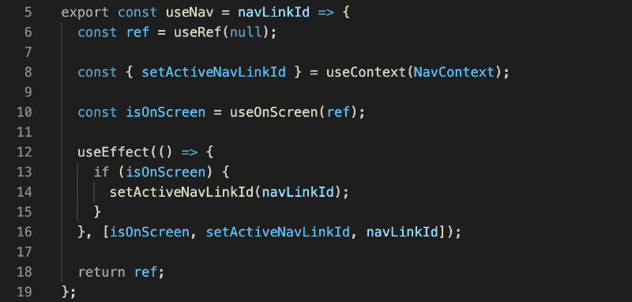

# 带有 React 自定义挂钩的可滚动单页站点导航

> 原文：<https://medium.com/geekculture/scrollable-single-page-site-navigation-with-react-custom-hooks-4e7af716f6b1?source=collection_archive---------3----------------------->

the custom hook we’ll be building!

*链接到我们将要编码的实例！*

[https://shapirodaniel.github.io/single-page-nav/](https://shapirodaniel.github.io/single-page-nav/)

*链接到 GitHub repo 和源文件*

 [## Shapiro Daniel/单页导航

### 带有自定义挂钩的单页导航模板

github.com](https://github.com/shapirodaniel/single-page-nav) 

静态单页可滚动网站呈现了一个有趣的，超级好玩的导航挑战！如果你已经用 React 构建了单页应用程序，那么你很有可能已经使用 React Router 在特定的 URIs 渲染了你的组件——如果你已经构建了一个单页可滚动站点，其中所有组件都在相同的 URI 渲染，那么你已经知道其中的诀窍了:也就是说，我们如何将用户指引到站点的一个特定的*区域*,以及我们如何在导航栏中反映用户在我们站点*中的当前位置？*

作为用户，

1.  我想单击一个导航元素，并让该元素滚动到我的视窗中
2.  我想滚动并在导航栏中看到我在网站中的当前位置。

用户故事#1 看起来很简单:我们可以在任何我们喜欢的元素上挂一个`containerRef`,并使用`Element`接口的`scrollIntoView`方法在相应的导航元素被点击时将容器移动到视口中。用户故事#2 有点棘手——我们的导航元素如何知道哪个容器当前在视口中，我们如何**将这个信息传递到食物链上**以便相应地渲染导航样式？

如果我们不需要监视用户的当前位置，我们可以简单地通过将`navLinkId`存储在`Nav`组件的本地状态中，在`scrollIntoView`调用旁边应用一个`activeClass`样式。

Link to gist: [https://tinyurl.com/nav-without-context](https://tinyurl.com/nav-without-context)

万岁！我们已经完成了用户故事# 1——进入下一阶段。

哥们，我的用户呢？

监视用户的位置应该不会太难:我们已经为每个可导航的目标准备了一个命令句柄(`containerRef`)，我们可以利用它来确定`ref`的容器是否可见。这是`IntersectionObserver` Web API 的一个很好的用例，它将允许我们创建一个*观察者*来通知我们什么时候——重要的是，它的可观察目标与我们的视野相交到什么程度。

Link to gist: [https://tinyurl.com/intersection-observer-template](https://tinyurl.com/intersection-observer-template)

一个`IntersectionObserver`实例接受一个回调函数和一个选项对象，该对象包含:

1.  一个`root`元素，允许我们将可能相交的`containerRef`的位置与一个元素进行比较，或者如果没有指定，与浏览器视窗进行比较；
2.  一个`rootMargin`(写为一个字符串化的 CSS 边距属性)，允许我们在计算交集之前扩展或收缩`root`元素的边界框；而且，
3.  一个介于 0.0-1.0 之间的`threshold`值(或值的数组)，这将帮助我们通过设置断点来校准我们的观察者的灵敏度，断点作为被观察元素的总面积的与`root`相交的*的函数。*

因为我们只需要检测一个垂直堆叠的容器是否进入了用户的可视页面区域，所以我们不指定我们的`root`，让它默认为我们的**浏览器视窗。**同样，`rootMargin`的默认 **0px** 将完成这项工作——但是我们可能最终需要校准我们的`threshold`(稍后会详细介绍)。

我们的`observer`实例接收一个回调，该回调需要两个参数——一个`entries`数组和`observer`实例本身。`entries`数组是`IntersectionObserverEntry`实例的集合，这些实例挂钩到相交元素和我们的`root`之间关系的各种属性。我们将使用布尔值`entry.isIntersecting`来跟踪每个进入和离开视口的`containerRef`。

太好了！我们离实现用户故事#2 更近了一步:当用户滚动时，我们将有办法找到他们在单页布局中的位置。让我们构建一个自定义钩子，它将允许我们提供一个`containerRef`，附加一个`observer`，并返回一个布尔值，指示元素是否在屏幕上。所有的功劳都归于 StackOverflow 用户 [Creaforge](https://stackoverflow.com/a/64892655/14116370) ，他专门为此构建了一个定制钩子！

Thanks *Creaforge*! Link to gist: [https://tinyurl.com/use-on-screen-hook](https://tinyurl.com/use-on-screen-hook)

让我们编写`useOnScreen`来创建一个自定义钩子`useNav`，这将允许我们生成并返回一个*观察到的* `containerRef`，它的`ref.current.id`将被注册到一个通过`useContext`访问的`NavProvider`上！

> 题外话:如果您对 React Context API 的基础有点不确定，请查看我的文章[在 React](/geekculture/rebuilding-an-imperatively-coded-game-from-scratch-in-react-9a082ad002c0) 中从头开始重建强制性编码的游戏，在这篇文章中，我提出了一个实现 React 的 Context API 的很好的通用策略 Redux 的轻量级替代方案，有助于划分和管理状态。

我们的`NavContext`由一个`React.createContext()`实例和一个`NavProvider`组成，它们的提供者值`activeNavLinkId`和`setActiveNavLinkId`——之前由我们的`Nav` 组件处理的本地状态——将被我们的`useNav`钩子访问并用于更新我们的 nav UI。但是为什么要重新发明轮子呢？我们已经有了本地状态管理，我们需要做的就是修改我们的`useNav`钩子来接受`setActiveNavLinkId`，把它传递给我们想要注册观察的每个组件。

在这种情况下，我选择使用`NavProvider`，因为它将让我们**将我们所有的上下文逻辑**封装在`useNav`中:一旦设置了钩子并且构建了我们的`Nav`和`NavLink`组件，将导航功能分配给可导航目标将只需要一个钩子声明和一个包含`navLinkId`和`scrollToId`的`navLink`对象数组，每个对象指向一个`NavLink`实例和`containerRef`的 id。

Link to gist: [https://tinyurl.com/nav-context-and-provider](https://tinyurl.com/nav-context-and-provider)

Link to gist: [https://tinyurl.com/use-nav-custom-hook](https://tinyurl.com/use-nav-custom-hook)

**将所有这些放在一起**

现在推出我们的定制挂钩，做一些导航！让我们首先将顶层`App`组件的内容包装在`NavProvider`中。

Link to gist: [https://tinyurl.com/app-with-nav-provider](https://tinyurl.com/app-with-nav-provider)

我们的`Nav`组件变得更小了:因为我们已经将`activeNavLinkId`的管理转移给了`NavContext`，我们可以移除本地的`useState`处理程序。让我们也将我们的`NavLink`组件重构到一个单独的文件中，以实现更好的模块化。

Link to gist: [https://tinyurl.com/nav-link-with-context](https://tinyurl.com/nav-link-with-context)

Link to gist: [https://tinyurl.com/nav-with-context](https://tinyurl.com/nav-with-context)

现在，我们想用作可导航目标的任何组件只需导入`useNav`钩子，给它一个`scrollToId`，并将返回的`containerRef`赋给组件的顶层元素，旁边还有一个等于`scrollToId`的 id。

`useNav`对它的实现视而不见——通过将它的`ref`挂在我们喜欢的任何元素上，我们能够创建一个可滚动的导航目标，它将:

1.  通过点击响应直接导航，
2.  每当用户滚动的目标出现在我们的浏览器视窗*中并且*与我们的`IntersectionObserver`实例的`threshold`值同步时，注册被动导航，并且
3.  在我们的`Nav`组件中反映用户的当前位置！

Link to gist: [https://tinyurl.com/component-with-use-nav-hook](https://tinyurl.com/component-with-use-nav-hook)

通过将我们用来通知我们的`Nav`组件的所有逻辑封装在`useNav`中，我们已经实现了一个即插即用的单页面导航解决方案，它的**界面**具有最小的表面积，允许我们在我们的导航组件层次结构中轻松地添加、删除和打乱元素。而且，我们的`NavContext`实际上只是一个更一般的`IntersectionContext`的具体实现，可以用来满足其他与交叉点相关的用户故事需求，比如延迟加载内容。

**消除错误导航提示**

还有一个更有趣的问题需要解决——当用户点击导航到一个遥控器(即不相邻)组件相对于它们当前位置的位置？

false navigation cues!

CSS 来救援了！我们将分配一个`transition-delay`来屏蔽接收`activeClass`的`NavLink`实例，因为我们的`scrollToSection`方法让用户在到达目的地的途中经过其他组件。这抵消了我们的`useNav`钩子对所有接受`activeClass`样式的链接的影响，允许我们提供一个更好的 UX——毕竟，点击一个链接并看到*其他*链接亮起是很不和谐的！

false cues hidden with transition-delay!

Link to gist: [https://tinyurl.com/nav-span-css](https://tinyurl.com/nav-span-css)

**调整观察者阈值**

如果我们发现当我们在元素中间改变方向时，nav 元素没有响应滚动提示——例如，我们已经向上滚动了一部分元素，结果又翻回来并再次穿过——我们已经找到了调整我们的`threshold`选项数组的好机会。通过在我们的`useOnScreen`钩子中包含额外的断点值，我们可以提高对*交集比率*的敏感度，或者相对于浏览器视窗来说有多少可导航目标在视图中。

Link to gist: [https://tinyurl.com/threshold-sensitivity](https://tinyurl.com/threshold-sensitivity)

**搞定！**

就是这样！我们已经有了一个可扩展的单页面导航系统，它由 React、React Context 和 React 自定义挂钩支持。记住——定制钩子只是一些函数，它们组成标准钩子来封装逻辑，并提供一个干净的、最小化的接口在我们的组件中工作。每当你发现自己在组件中编写重复的钩子序列时，看看你是否能抽象出细节，给你和你的团队一个类似`useNav`的流线型 API！

*链接到我们构建的实例！*

[https://shapirodaniel.github.io/single-page-nav/](https://shapirodaniel.github.io/single-page-nav/)

*链接到 GitHub repo 和源文件*

 [## Shapiro Daniel/单页导航

### 带有自定义挂钩的单页导航模板。

github.com](https://github.com/shapirodaniel/single-page-nav) 

Daniel Shapiro 是一名全栈软件工程师，毕业于全栈学院，目前是该学院的助教。当他不制作酷的东西时，你通常会发现他沉迷于他以前的职业生涯，在芝加哥的许多工匠面包店担任首席面包师，烘焙一批英式松饼，带着他的小猎犬百合在沙滩上跑步，或者在密歇根湖划船。联系 shapirodanieladam@gmail.com 的丹尼尔或者连接 LinkedIn 的**，并且一定要访问 socket.io 支持的*[*Note-ary*](https://github.com/shapirodaniel/note-ary)*项目管理套件，它具有看板风格的板和实时通信！**