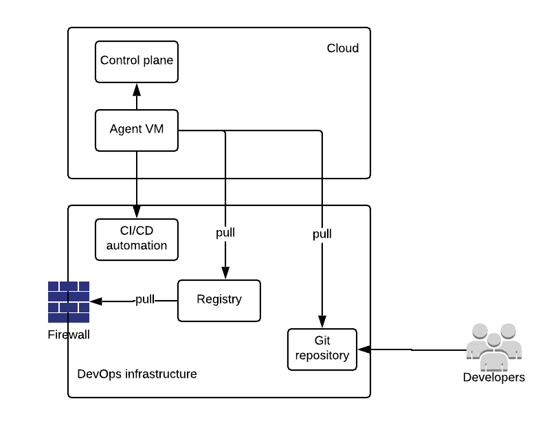

# 保护 DevOps 主力

> 原文：<https://medium.com/geekculture/securing-cloud-devops-workhorse-6b329fb72cda?source=collection_archive---------10----------------------->

Photo by [Danil Shostak](https://unsplash.com/@max010?utm_source=medium&utm_medium=referral) on [Unsplash](https://unsplash.com?utm_source=medium&utm_medium=referral)

## 部署和保护 DevOps 远程代理的注意事项

迁移到具有持续集成和交付基础架构的 DevOps 文化是组织内整体数字化转型的重要组成部分。作为此流程的一部分，为了自动化构建和部署，大多数组织最终都会开发一个新的 DevOps 平台来满足组织的各种运营和安全需求。

Sample DevOps architecture for cloud deployment

DevOps 基础架构的大多数组件，如代码存储库、注册表/工件服务，都是组织内非常容易理解的服务，通常跨内部基础架构和云进行操作和保护，如 [CNCF 安全白皮书](https://github.com/cncf/sig-security/raw/master/security-whitepaper/CNCF_cloud-native-security-whitepaper-Nov2020.pdf)和[我在 Geek Culture](/geekculture/enterprise-cloud-security-application-development-16a7efb2027f) 中的上一篇文章所述。代理是在云中运行构建和部署的主要工具，其位置提供了独特的功能，可以提高 devops 基础架构的安全性。

大多数 CI/CD 自动化平台，如 [Jenkins](https://plugins.jenkins.io/ec2/) ， [Gitlab CI](https://docs.gitlab.com/runner/security/) ， [Atlassian bamboo](https://confluence.atlassian.com/bamboo/security-289277194.html) ， [Github actions](https://docs.github.com/en/actions/learn-github-actions/security-hardening-for-github-actions) ， [Terraform Cloud](https://www.terraform.io/docs/cloud/run/run-environment.html) ， [AWS Codepipeline](https://docs.aws.amazon.com/codepipeline/latest/userguide/security.html) ， [Azure DevOps Pipeline](https://docs.microsoft.com/en-us/azure/devops/pipelines/agents/hosted?view=azure-devops&tabs=yaml#security) 都支持远程代理功能(称为不同的名称)，并提供与其在云和相关安全性中的使用相一致的不同级别的信息(可在链接中找到)。本文提供了一组应该评估的通用安全功能和特定于云的注意事项。

# 考虑

在开始保护远程代理之前，理解一些基本的考虑事项是很重要的。

## 自托管或平台代理/运营商

大多数“DevOps 即服务”平台，如 Github、AWS Codepipeline、Azure DevOps pipeline，都提供了可用于运行构建和部署流程的代理。基于以下考虑因素，组织可以选择限制将开箱即用的托管平台用于构建和部署目的

1.  **地理限制**:组织可能希望确保所有的构建过程都应该在特定的地理位置运行，以减少专有代码泄露的机会。
2.  **使用机器身份访问服务**:如果构建过程需要访问共享服务和其他依赖项，可以使用代理的机器 ID 进行认证。这消除了在构建过程中嵌入密码的需要。如果需要或喜欢这样的设置，平台代理是不可能的。
3.  **定制安全控制**:组织可能希望使用特定的安全控制，如 EDR、日志收集代理、漏洞扫描器，这些都不能部署在平台托管环境中。
4.  **访问限制**:通过减少构建过程可以用来检索依赖项(如库、容器映像等)的外部位置和存储库。

通过平台策略/配置等预防性控制或使用安全状态管理平台等检测/纠正控制，确保组织在平台级别强制执行任何此类平台代理/运行者使用限制非常重要。

## 虚拟机或容器

管道的大多数构建和部署步骤都需要一个计算环境来生成工件并部署这些工件。目前，这些选项包括虚拟机、容器和无服务器/功能平台。在大多数情况下，由于无服务器平台的特定约束(有限的运行时间、按需启动等)不是构建的可行替代方案。

虚拟机通常部署有使用非 root 帐户运行的代理。如果在多个团队和项目之间共享，确保平台具有在每次运行后清理构建工件的内置功能是很重要的。

作为一种替代方案，可以使用带有预打包脚本和工具的容器来构建流程中从存储库中提取的代码，以确保构建和部署环境的一致性。基于容器的方法允许为每个管道设置隔离的环境，不会干扰其他构建管道。除此之外，它还可以用于跨构建存储内容(例如地形状态文件)。同时，应该有足够的控制来确保图像和容器在管道的多次运行中是安全的。容器与 Google Cloud Run 或 AWS Fargate 等云中的适当技术相结合，可以减少共享责任模式中用户的安全责任，并提高构建基础架构的整体安全性。

## 共享或专用

一个重要的设计决策是确定远程代理 VM 或容器是否将在一个或多个应用程序/管道之间共享。在共享模式的情况下，建议使用应用程序/管道特定的帐户来运行 CI/CD 管道，以限制跨应用程序泄漏/共享凭据和内容的可能性。此类要求增加了管理应用程序特定账户的负担，包括创建本地账户，作为应用程序启动流程的一部分。

# 保护远程代理

应根据 [V.L.A.D.R](/jhash/enterprise-cloud-security-introduction-970a63f50914#47a9) 或等效方法，通过对平台实施适用的安全控制来保护远程代理。

## 脆弱性和漂移

在最基本的层面上，确保使用私有或众所周知的基础映像为远程代理创建 VM 映像(例如 AMI)或容器映像是很重要的。

无论使用虚拟机还是容器，重要的是将漏洞扫描(长时间运行的容器和/或虚拟机)、运行时威胁防护(EDR)等标准安全控制作为开发运维流程的一部分内置到远程代理计算中。除此之外，在虚拟机和/或容器内进行配置漂移监控也很重要，以确保可以识别和补救任何不安全的配置。如果这些容器是短暂的，并在每次新的构建执行时重新创建，那么这可能是较低的优先级。

除了远程代理，监控与 devops 平台相关的配置漂移也很重要。这将包括扫描平台配置和管道配置，以确保用户在未经授权的情况下无法使用 platform runner。或者，识别“流氓”远程代理也应该是这种扫描的重要部分，以减少代码和凭证泄露的可能性。

## 记录

确保收集和汇总远程代理日志以用于监控、运行状况检查和未来取证非常重要。这是对跨标准操作系统和关键服务日志执行的标准日志聚合的补充。

## 接近

根据远程代理的类型，它可以作为监听传入连接的服务运行(例如 Jenkins)，也可以启动到 DevOps 平台的连接(例如 Gitlabs、Bamboo、Azure DevOps 等)。根据连接的类型(即传入或传出),远程代理的安全状态会有所不同。大多数平台利用传出连接模型，从而减少网络攻击面。同时，应考虑其他问题，如 DNS 中毒、强制 SSL 连接以及与传出连接相关的类似问题，以确保远程代理和 devops 平台之间的安全连接。除此之外，还应实施适当的控制措施，如防火墙、网络分段，以确保 CI/CD 管道无法访问未经授权的外部位置和存储库。

确保每个远程代理被唯一地标识(根据具体情况，通过令牌或证书)是很重要的。如果代理被打包为虚拟机或容器映像，请确保注册令牌未存储在映像中。初始脚本应该从 vault 中检索令牌(使用机器身份进行身份验证)，然后使用它用唯一的身份注册跑步者。这种方法可以消除重复使用令牌和身份的可能性。除此之外，设置令牌/注册到期可以确保远程代理经历常规认证过程，该认证过程确保对代理的需求、安全级别、访问和其他控制的适当审查。

如果出于部署目的将远程代理部署在特定于应用程序的着陆区，请确保适当的网络和访问控制到位，以减小爆炸半径。

除此之外，将构建和部署管道的执行与非常不同的权限要求分开，以减少过度提供帐户访问的可能性，这一点很重要。

## 数据

为了来源的目的，应该充分保护在管道执行期间检索(例如代码)、生成(例如可执行)和推出(例如包)的工件。这可以通过确保流程的所有组件都经过适当的打包和签名以备将来参考来实现。

保护构建和部署过程中使用的机密是数据保护的一个重要部分。确保存在足够的控制措施，以避免在滑道上存储机密。如果是共享的、长时间运行的远程代理，请部署能够识别泄漏凭据的构建进程的凭据扫描程序。除此之外，可能还有其他类似的中间工件，如 terraform 状态文件，其中可能包含敏感数据。此类数据应在不同运行之间安全存储。

除此之外，使用特定于平台的功能，如定义 [pull_policy](https://docs.gitlab.com/runner/security/#usage-of-private-docker-images-with-if-not-present-pull-policy) 可以确保适当来源的内容被用作构建过程的一部分。

Github 很好地解释了远程代理不应该用于[公共存储库](https://docs.github.com/en/actions/security-guides/security-hardening-for-github-actions#hardening-for-self-hosted-runners)。

## 弹性

通过在 devops 平台中定义包含两个或更多可用远程运行者的远程运行者组，可以实现平台的弹性。

远程代理构成了 devops 基础设施的重要组成部分，并确保在开发过程中对这些部分进行充分的控制。保护这些代理是确保安全软件供应链的重要组成部分。