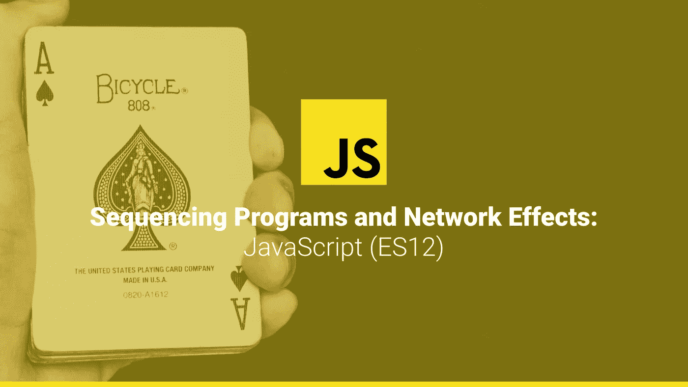

# 排序程序和网络效果:JavaScript (ES12)

> 原文：<https://medium.com/geekculture/sequencing-programs-3556ab3fbc68?source=collection_archive---------22----------------------->



***会话*** 对于访问是必不可少的，如同密码对于隐私是必不可少的一样。通常，甚至在以后，连接到存储源(如数据库)时，需要提供商启用到源的多条路径。

如果一个用户正在查找数据库，那么一个用户需要 ***一个连接*** ，一个连接需要 ***一个路径*** 。如果只有一个人在连接，数学就很简单，尽管我们运行个人数据库的频率有多高。

> 1:1 序列经常出现在基于前提的程序中，这些程序只需要局部变量来实现功能。

连接阵列和顺序连接允许许多*预测人员中的每一个连接到数据库、应用、主机、外部网络、内部网络、服务等等的工具网络。*

*机器程序通常是基于为许多软件服务的概念构建的，应用程序也是如此。事实上这就是 ***scale*** 的概念，本质上是基础产品的使用或实例化的计算。*

# *具有提要模式的上下文排序*

**

*如果您不经常大规模地创建程序，学习方法，或者拥有一个小的核心用户群，这些关注性能的度量标准可能看起来很死板，并且支持起来成本很高。*

*从数据或贡献的角度来看，凯尔是创造者的负担，但却是通向接触、进步、成就和有希望进化的途径——因为接触的人越多，可能通知你选择的人就越多。*

## *正向输送*

> *作为一种网络模式，这种方法背后的思想是获取程序的一个实例，为每个连接创建一个唯一的迭代，并为每个连接提供相同的体验。*

*为 ML(机器学习)构建类似的概念，通常用作 DL(深度学习)的过滤方法。*

*[](https://towardsdatascience.com/deep-learning-feedforward-neural-network-26a6705dbdc7) [## 深度学习:前馈神经网络

### 这是本系列的第三部分。在这篇文章中，我将解释深度前馈网络的概念。

towardsdatascience.com](https://towardsdatascience.com/deep-learning-feedforward-neural-network-26a6705dbdc7) 

# 具有可伸缩服务的池、实例和会话


当通过网络连接到可能是软件、 ***数据馈送*** 甚至 API 的任何一系列程序时，用户与计算结果的机器之间的距离通常会有差异。

## 联营

一种基本的连接协议，允许交互的系统交换以一定的速度发生和不信任，从而在发送方和接收方之间实现一致和稳定的连接。

P ooling 获取预期的源材料，并且或者 ***缓冲*** 或者 ***将那些内容流*** 到更适合网络的序列中。根据接收实体，进行连接的服务器能够在发送平台和接收平台之间提供有益的连接。

如果 ***数据*** 传输过快，连接可能会中断，如果收集过慢，体验可能会受到影响。 ***分块*** 数据部分是一种将较大结果的整个部分交换成较小部分以便通过网络传输的现代方法。

## 例子

每个连接的唯一版本的核心程序的可行表达式，在空间上为该实例的一个或多个用户提供并发操作。

实例化程序根据用户动作创建核心程序的第二个版本。一群人很少会表现完全相同，要求完全相同，并得到完全相同的总体结果。

***程序交换*** 发生在程序的第二次迭代中，这可能在任何时候，许多是符合使用规模的用法的演变，以支持超过一般原则的大量受众。

## 会议

与池化和实例相一致的思想是创建一个方法来捕获或指定唯一的迭代，并限制对该交换的连接、使用和服务。

会话分发服务，无论是作为 RAM 的硬件，作为质量的带宽，甚至作为访问的安全性。它们是发送者知道用多长时间和用什么来完成被访问的一个或多个程序的目标的方法。无论是简单的 ***测量时间*** 甚至是 ***最大使用量*** 和接收者访问信息的安全角色。

# 简化连接和模块化性能


在软件和应用中，许多大规模程序的倾向是在达到收益递减的 ***最大值*** 之前提供完成任务所需的最少资源，从而导致服务质量(QoS)下降。

这很难理解，但作为人，我们想要最好的结果和最有效的速度，因此我们建立程序来实现这些非常相似的任务。

排序是任何语言事件循环的一个指称术语，方法是一个接收和输出对请求的响应的过程，无论是顺序的还是同步的。对程序进行排序，以限制发生率、程序步骤和为适应所需行动而分配的资源成本。在规模上，这成为一种平衡行为，其中服务器通常通过设计新的资源和平衡这些资源的质量来减少交付中的这些成本。

会话、安全、池、实例、协议、服务器和网络连接通常被创建为固有地具有这些特性，以供许多人同时继续使用一个程序， ***并发*** 。通常基于第一个连接点，然后完成任务的时间要求是一个程序的评估，成为该程序的基本会话值。

可通过应用程序接口访问的服务通常设置这些基本过程，为用户决策甚至错误留有余地。一旦会话结束，访问程序需要重新建立连接。当不进行计算时，资源的负担会随之减轻，同时它对整个系统的使用也会减少，因为它正在访问整个系统以持续提供这些服务。

# 通过获得持久性将会话作为服务


当设计提供会话的协议时，提及上述网络理论和用例以理解是什么差异促成了这种逻辑是很重要的。

建立会话并平滑会话的创建以降低成本并提高用户的服务质量是持续使用该平台的最关心的问题。更长更冗长的会话通常需要更多的资源，这反过来花费连接的服务更多的金钱分配来支持用户。

如果您是应用程序的开发人员，您会希望降低成本，以满足您的预测计费使用成本。如果您是服务的提供者，甚至更多，您会想要限制对服务的未使用的访问，这需要更多启用的高性能系统来发生。

## JavaScript 会话

提升上述可以被建立为服务和使用协议之间的层，以根据建立的策略实现所请求的服务的安全性、测量和效率。

例如，程序可以基于时间导出值来限制和刷新连接，在该时间内，当该时间出现时，过期或重新启用访问。

J avaScript 提供了一个非常简单的脚本功能，可以在服务的基础上推断当前时间、评估所需时间并检查这两个变量。

**第一步(1):有(没有)会话吗？**

在该示例中，当加载页面时发生滚动会话，从浏览器的存储中检查会话的存在。

```
<body onload="checkSession()"></body>
```

**步骤二(2):如果没有会话，则创建一个**

接下来，如果浏览器中没有存储会话，则运行创建会话的函数。

```
if(!javascript_session){

  // Set New Session
  setSession();}
```

该会话基于以毫秒为单位的当前时间，并在会话五(5)分钟的设置时间的基础上增加毫秒。

**第三步(3):如果有会话，告诉我还剩多少时间**

这是一个信息过程，可以被催化或编辑，但是基于总的所需会话时间的增加而发生，并且持续检查是否有会话。

```
let checkSecondsLeft = (javascript_session - new Date().getTime());
```

事件可以改变该会话，因此知道是否有会话和剩余时间可以通知其他过程或者甚至用户延长该会话。

**步骤四(4):如果会话过期，则创建一个新的会话**

根据当前时间检查会话后，将检查该会话是否还有时间。

```
if (checkSecondsLeft > 0){} else { // Set New Session
  setSession();}
```

如果会话中没有剩余时间，则会话会在前面提到的增量的最后一点重新生成，以重新建立会话。

## 固执己见的默认

这个示例中包含了一些关于会话检查的时间、重复和并发性的默认值。从程序上来说，这可能不是特别有效，但是可以满足质量和连续性的要求，作为服务的会话，而不是安全的会话。

会话可以提供一个很好的例子，说明如何改进和利用时间成本来提高编程效率，同时还能降低服务成本。

在否定会话本身之前，应该考虑前面提到的关于如何导出这些会话的所有细节，因为限制服务可能会使解决方案成为瓶颈，或者时间间隔超时可能会很快拒绝用户。

# 感谢阅读，继续指导！

寻找更多的应用程序开发建议？在 [Twitter](https://twitter.com/collectedview) 、 [GitHub](https://github.com/collectedview) 和 [LinkedIn](https://www.linkedin.com/in/collectedview) 上关注。在线访问最新更新、新闻和信息，网址为 [collectedview.io](https://collectedview.io/) 。*