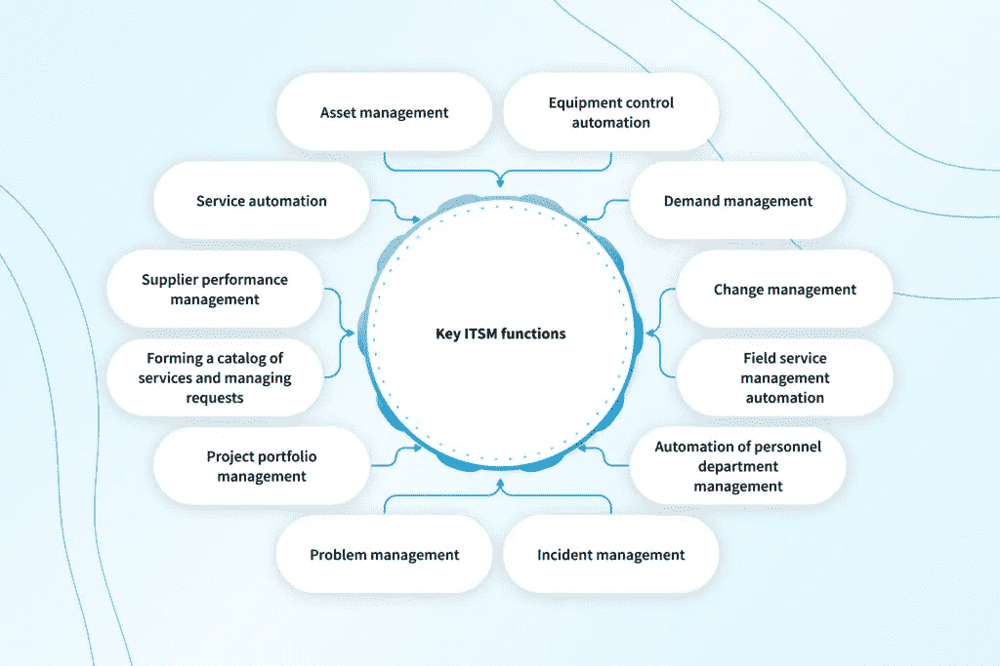
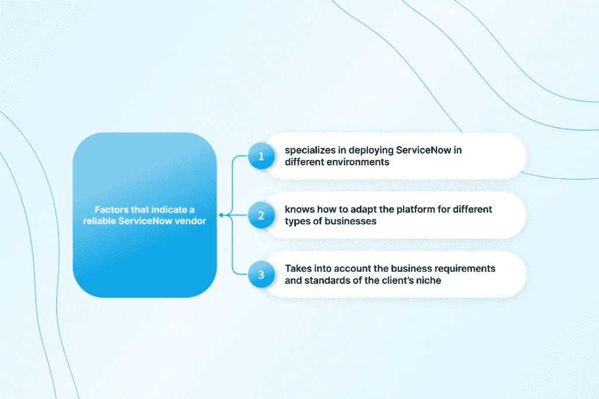

# ServiceNow 定制与配置:您应该选择哪个——NIX United

> 原文：<https://medium.com/geekculture/servicenow-customization-vs-configuration-which-should-you-choose-nix-united-c927aae107?source=collection_archive---------15----------------------->

ServiceNow 为 IT 管理提供一流的软件即服务(SaaS)和平台即服务(PaaS)解决方案。它基于 It 服务自动化、资源管理和协作流程。借助 ServiceNow，公司可以自动化大多数 ITSM (IT 服务管理)流程，包括帮助台、服务监控以及服务可用性、供应商、变更、配置、基础设施、事件和事件的管理。

然而，为了最大限度地满足业务需求，ServiceNow 客户有时不得不求助于定制，有时则求助于该解决方案的配置。这些选项中哪一个与您相关？下面你就知道了。此外，您还可以了解更多有关我们提供的 [IT 集成服务](https://nix-united.com/services/enterprise-it-integration-and-customization-services/)的信息。

# 简单介绍一下 ServiceNow

与其使用多家供应商的解决方案，在它们的相互集成上花费过多的资金和资源，不如让公司拥有一个能同时涵盖多项任务的单一平台，这样会方便得多。这就是 ITSM 服务的初衷。

根据 [Gartner 报告](https://www.servicenow.com/lpayr/gartner-mq-itsm.html)，与吉拉服务管理、网络安全管理软件产品服务台、BMC Helix ITSM 和其他一些解决方案一起，市场上最受欢迎的 ITSM 服务之一是 ServiceNow 平台。但是，与绝大多数竞争对手不同的是，在该解决方案中，所有这些流程都集中在云中的一个平台上。此外，ServiceNow 平台早已超越了标准的 ITSM 解决方案:现在它是一个多任务服务，可以涵盖许多部门的利益。

特别是最近几年，ServiceNow 改变了发展方向，超越了 IT 流程管理。现在，该服务提供了简化大多数业务领域的能力，并可用于大中型企业的 IT 基础架构管理。以下是 ServiceNow 支持的一些关键 ITSM 流程示例:

该解决方案支持 ITSM 流程和业务流程。它专注于高负载，具有高可靠性(正常运行时间约为 99.95%)，为用户提供直观的 web 界面和移动版本，与大量其他平台和服务集成，还提供基于神经网络和 AI 的解决方案。因此，所有这些功能允许企业将 ServiceNow 用于财务、人力资源、营销、分析、开发、资源管理等。如果你想了解 ServiceNow 架构和用例，请[阅读这篇文章](https://nix-united.com/blog/servicenow-overview-of-the-revolutionary-it-management-platform/)。

ServiceNow 是基于云的，这意味着你可以马上开始使用它。因此，与传统的工作流管理解决方案相比，即使您必须定制 ServiceNow，也可以节省数周时间(也就是说，您不必花费时间来设计、购买服务器和其他设备，或者安装和配置它)。

然而，尽管 ServiceNow 具有广泛的功能，但要充分利用该平台，根据您组织的工作流程对其进行定制是非常重要的。为此，您需要处理一个两难问题:ServiceNow 定制与配置。

开发人员使用 HTML、CSS、Angular 和 JS 为 ServiceNow 创建定制解决方案，并应用 ServiceNow API (JS)与平台数据进行交互。例如，他们可以添加一些 HTML 代码来更新用户界面，或者部分编辑 ServiceNow 代码库中的一些代码行(在这里他们可以更改逻辑或一些宏)。

需要定制通常是因为默认的 ServiceNow 工作流与客户公司的工作流不对应(且不兼容),必须进行一些更改。然而，这种方法不能被认为是通用的，因为它有一些明显的缺点。

事实是，与下面讨论的配置不同，大多数典型的 ServiceNow 定制示例需要开发人员做更多的工作，这意味着这种方法出现错误的风险要高得多。在最好的情况下，定制将只涉及一些类，但在实践中，它通常会涉及平台主干的程序代码，这需要开发人员花费大量时间。

因此，我们可以强调以下在定制 ServiceNow 时可能伴随您和您的团队的风险示例:

*   原始程序代码中存在难以消除的错误
*   由于主程序代码的更改，关闭对其他重要 ServiceNow 功能的访问
*   延长了更新周期，从而延缓了公司从 ServiceNow 中获益的能力

也就是说，除了实现定制的积极目标——向现有功能添加全新功能的能力——选择 ServiceNow 的公司应该小心使用它，不要通过更改太多功能来过度使用它(想想:也许在这种情况下，放弃 SaaS 格式并从头选择定制软件开发是有意义的)。

此外，ServiceNow 客户可能会被定制化弄得晕头转向，这通常会导致对现有资源失去控制。最后，像任何其他定制开发一样，从头开始开发新功能是非常昂贵的，并且需要很长时间(从几个月到一年，取决于添加功能的数量和复杂性)。也就是说，考虑到您未来的承包商需要在他们的产品组合中拥有 ServiceNow 的经验，从定制的好处和所花费的资源之间的比率来看，他们的服务成本可能会高得不合理。

此外，为了保持您的业务软件以及平台本身的安全(ServiceNow 通常一年发布两次更新)，您还必须定期更新添加的组件。也就是说，定制不是一次性的，而是维护基于 ServiceNow 的解决方案运行的定期投资。如果您正在寻找能够应用 ServiceNow 定制最佳实践的专家，[请联系我们](https://nix-united.com/)。

实际上，ServiceNow 配置是在 Now 平台的参与下进行的，这消除了在 ServiceNow 平台的主干中重写程序代码的需要。最常见的修改功能包括向表单添加字段、表单布局、通知、用户界面、插件、电子邮件配置、公司徽标等。

这种方法的主要优点是时间效率。的确，开发人员只需要改变一些设置来更新平台的当前功能，而不是铲进一堆行的程序代码，并与那些未被触及的部分进行协调，这是定制的典型做法。由于这种方法只涉及少量的配置更改，因此升级只需很少的时间。同时，随着 ServiceNow 平台的更新，定制的元素会自动更新，你不需要像定制那样再次求助于开发者的帮助。

在实践这种方法时，唯一令人头痛的是需要对适应的特性进行回归测试。因此，您可以确保它们完全按照您的预期工作，并且不会产生错误。

因此，我们可以得出结论，与定制相比，ServiceNow 配置是一个更可预测、风险更低的过程。它还能够更快地向最终用户交付解决方案，并降低开销(包括维护成本)。

另一方面，很明显，ServiceNow 配置绝不应被视为万灵药，因为它可用于非常有限的 ServiceNow 功能。

# 定制和配置哪个选项更好？

公司应该明白，要决定最佳的 ServiceNow 升级选项(ServiceNow 定制与配置)，他们可能需要一些时间和专家的帮助。为了加快这个过程，他们最好求助于拥有 ServiceNow 专业知识的软件开发人员。因此，他们将充分利用这个平台，使用最少的资源。关于选择能够帮助适应的专家，我们建议您考虑以下因素:

公司还应该考虑他们的业务目标，因为有时配置是唯一可能的适应选项，因为没有时间进行更长期和更全球化的平台升级。另一方面，该配置可能仅适用于公司的短期目标，可能无法满足与一年或更长时间的业务目标相关联的需求。因此，在这里重要的是要权衡利弊，做出一个在短期和长期都具有成本效益的决定。

# 为什么定制 ServiceNow 是最后的手段

那么，ServiceNow 定制 vs 配置，哪个选项更好呢？

我们认为，在大多数情况下，公司可以通过 ServiceNow 配置来解决问题，而不需要进行定制。只有当 ServiceNow 提供的默认功能不足以实现和维护公司的业务流程时，最后一个选项才是至关重要的。因此，对于高度专业化的企业和大公司来说，定制需求更为典型。

与此同时，您应该明白，ServiceNow 配置始终是一项巨大的财务投资，需要专业专家的参与，当然还有大量的时间成本。因此，在选择这个选项之前，你必须确保你的企业不缺乏这三个方面。

此外，您应该考虑一些决定定制 ServiceNow 的复杂性的因素。第一个是公司和用户数据的安全性。事实是，尽管最初是一个满足绝大多数普遍接受的数字数据安全标准的解决方案，但在定制后，ServiceNow 可能会失去这些标准。这通常不是由于缺乏开发经验，而是由于新的自定义元素与公司员工已经测试过的 ServiceNow 功能的其余部分不一致。这就是为什么在定制过程中不仅要有 it 专家参与，还要有客户业务领域的专家参与，这一点非常重要。

在具体谈到我们的 ServiceNow 定制最佳实践时，我们始终遵守必要的安全标准，包括通用标准和特殊标准。在将定制的平台特性实现到您当前的业务流程中之前，这同样适用于您的业务数据的安全性。特别是，在此过程之前，我们总是执行备份并对复制软件中的程序代码进行更改。这为我们提供了一个保证，在定制错误的情况下，我们总是可以返回到一个正确工作的版本。

我们的另一个最佳实践是对更改和/或添加的程序代码进行端到端测试。特别是，我们所做的任何更改都会被仔细记录，并与您所在业务领域的专家进行协调，以确保自定义功能不会被过度使用，并防止它们不符合您使用的 ServiceNow 平台的其余部分中实施的利基标准。

因此，尽管定制 ServiceNow 是最后的手段，但在某些情况下，有必要提供特定于您公司的业务流程的完整覆盖。这里有一个循序渐进的小指南来帮助你确定你是否需要定制(或者你是否可以配置):

*   对您计划包含在定制功能列表中的业务需求进行优先级排序
*   从技术角度了解这些变化的难度(在这里，评估与数据安全和保持未受影响的功能的正确运行相关的可能风险很重要)
*   根据花费在定制上的金钱和时间计算 ROI。在此之后，您将能够理解定制这个或那个 ServiceNow 特性的合理性，并基于此分析过滤掉那些非优先级的特性

要了解更多关于 ServiceNow 定制的例子和技巧，可以查看官方 ServiceNow 网站[。](https://www.servicenow.com/content/dam/servicenow-assets/public/en-us/doc-type/success/quick-answer/customization-best-practices.pdf)

# 结论

ServiceNow 的主要优势在于，该解决方案中的所有服务都位于一个云环境中。也就是说，这不是来自不同供应商的独立功能模块的集合，而是一个完整的解决方案，其中您可以添加和升级一些功能。所有这些都为平台级的升级、更新和适应提供了极好的机会。

至于在 ServiceNow 配置和定制之间的选择，这是一个相当困难的任务，需要专业的建议。如果您不确定是选择定制还是 ServiceNow 配置，请联系我们。我们将仔细分析您业务流程的细节，并应用我们的最佳实践来选择最适合您业务需求的选项。

*原载于 2022 年 10 月 26 日*[*【https://nix-united.com】*](https://nix-united.com/blog/servicenow-configuration-vs-customization-how-to-pick-the-best-option/)*。*